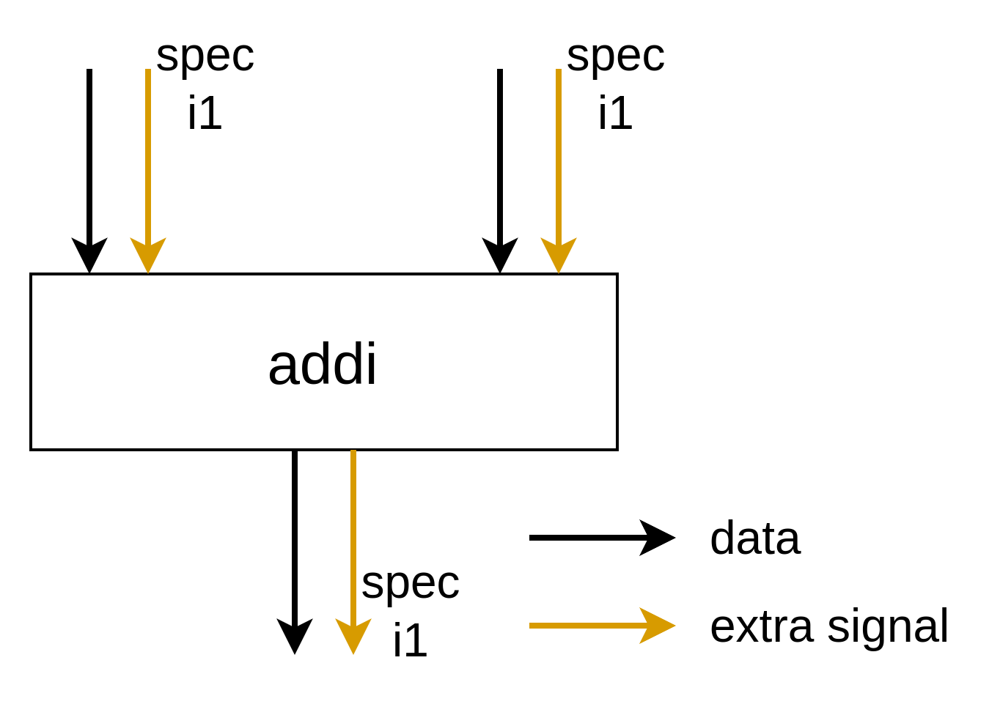
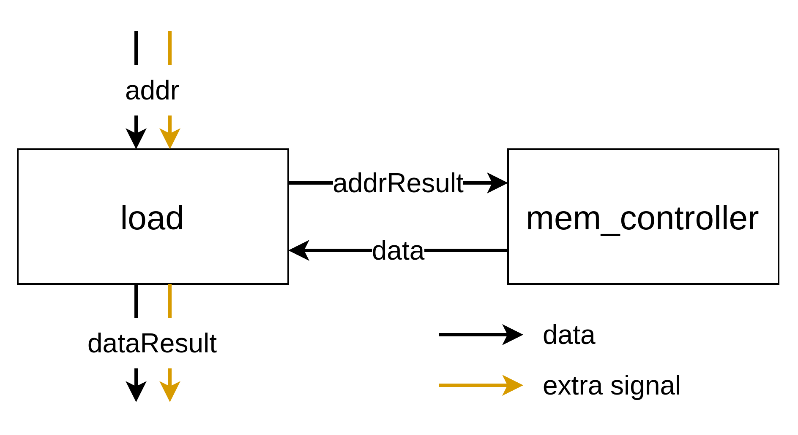
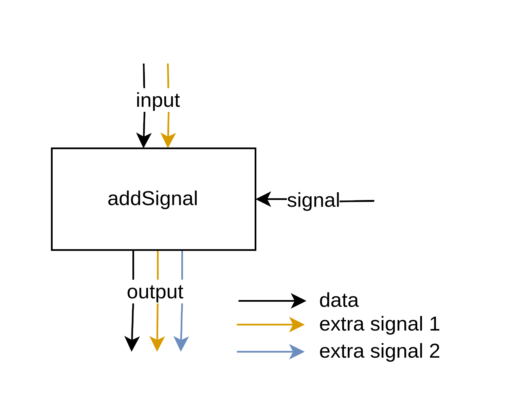
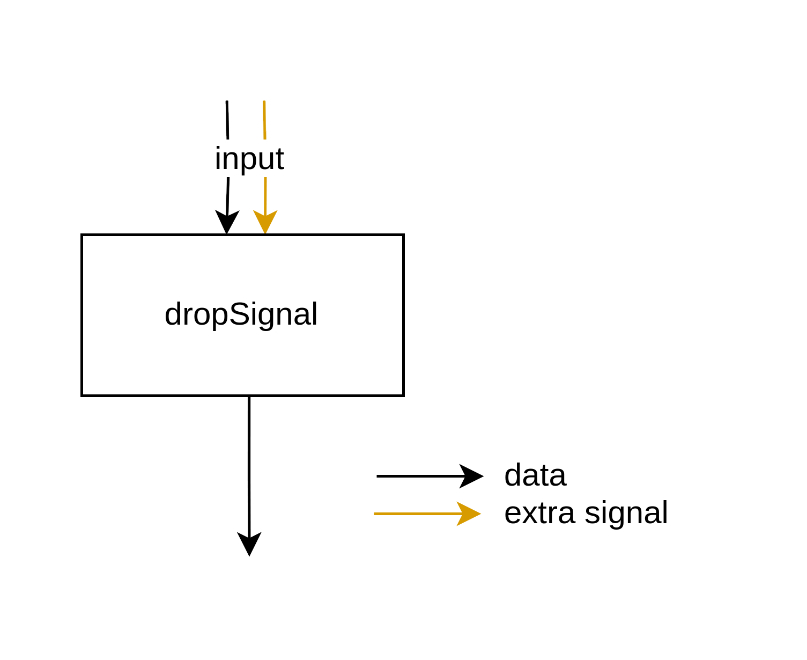
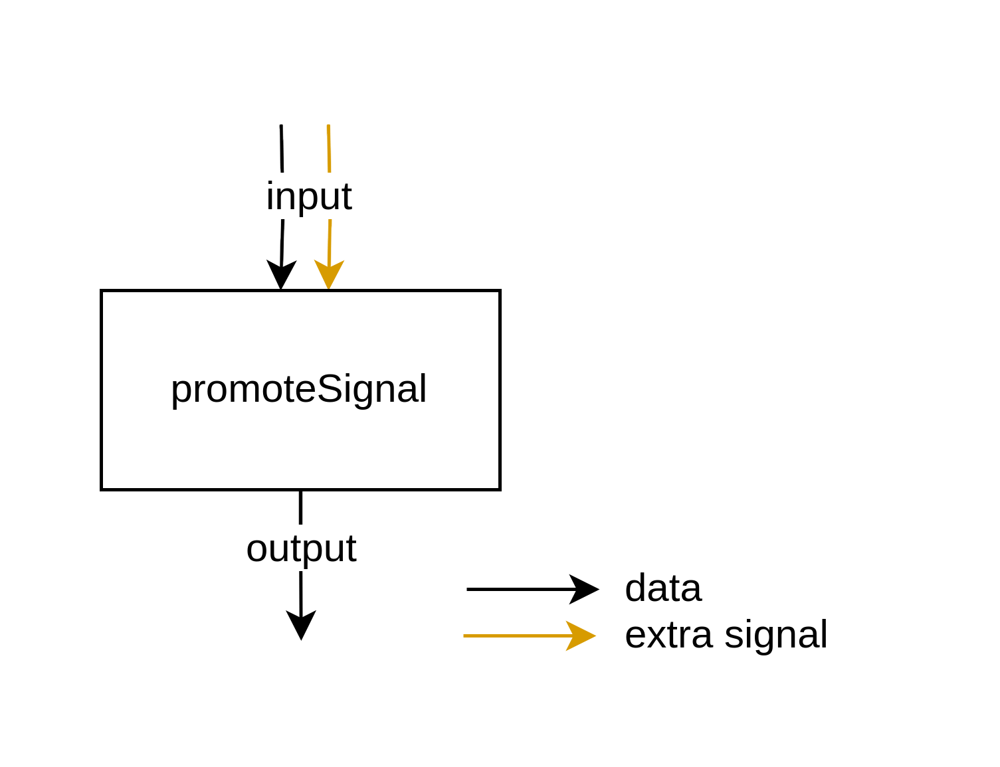
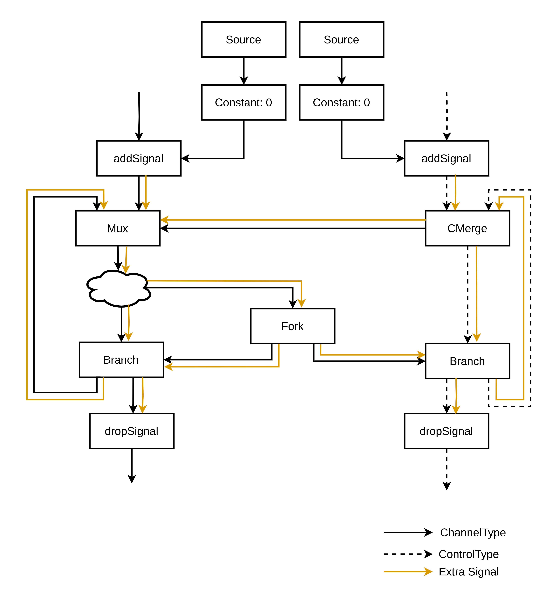
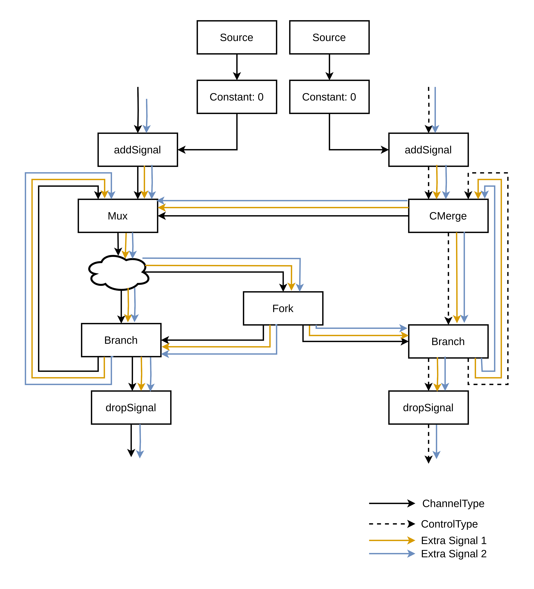
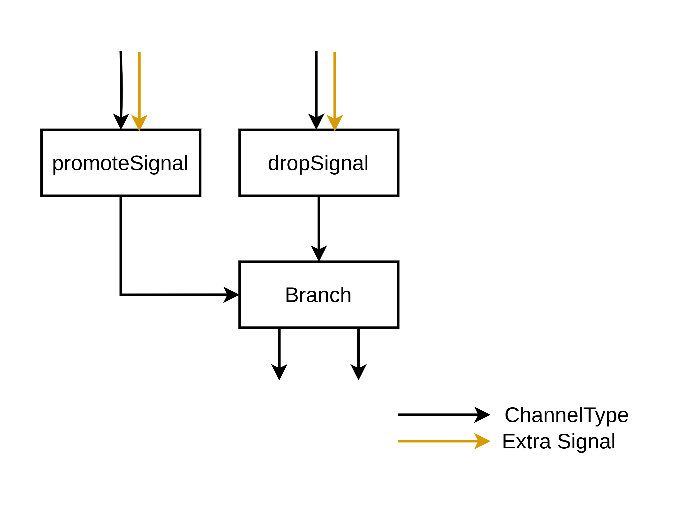
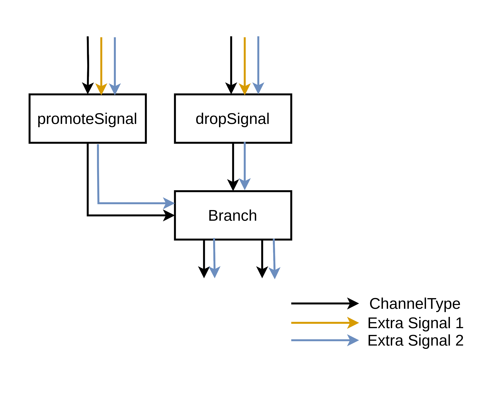
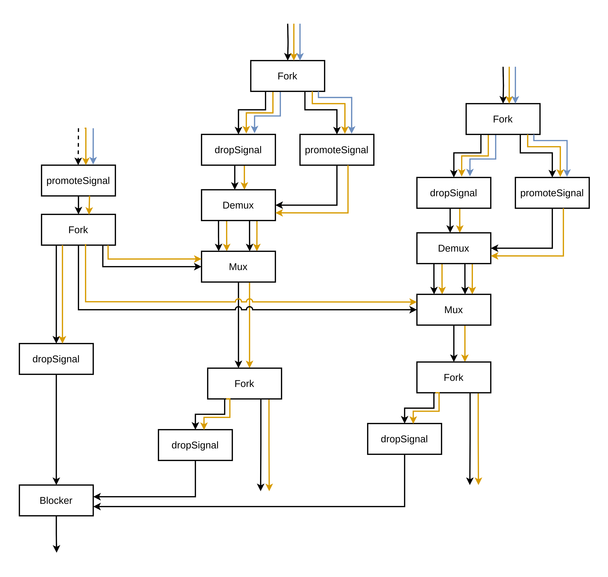

> [!NOTE]
> This is a proposal, and has not yet been implemented. 

# Operations which Add and Remove Extra Signals

As described in detail [here](https://github.com/EPFL-LAP/dynamatic/blob/main/docs/Specs/ExtraSignalsTypeVerification.md), our Handshake IR uses a custom type system: each operand between two operations represents a handshake channel, enabling data to move through the circuit.

As a brief recap, an operand can either be a `ControlType` or a `ChannelType`. A `ControlType` operand is a channel for a control token, which is inherently dataless, while a `ChannelType` operand represents tokens carrying data. 

Whether an operand is a `ControlType` or `ChannelType`, it can also carry extra signals: additional information present on tokens in this channel, separate to the normal data.

In order to enforce correct circuit semantics, all operations have strict type constraints specifying how tokens with extra signals may arrive and leave that operation (this is discussed in detail in the same link above).

### Brief Recap of Rules

With only a few (truly exceptional) exceptions, operations must have the **exact same** extra signals on all inputs.
 

Load and Store operations are connected to our memory controllers, which currently do not support extra signals, and so we (currently) do not propagate these values to them. 

As discussed in the full document on type verification, this could change in future if required, e.g. for out-of-order loads.

### Operations which Add, Remove and Promote Extra Signals

We define an operation which adds an extra signal as an operation which receives token(s) lacking a specific extra signal, and outputs token(s) carrying that specific extra signal. 

We define an operation which drops an extra signal as an operation which receives token(s) carrying a specific extra signal, and outputs token(s) lacking that specific extra signal. 

We define an operation which promotes an extra signal as an operation which receives token(s) carrying a specific extra signal, and replaces the data value of that token with the value of that specific extra signal. This means the operation also outputs token(s) lacking that specific extra signal.

Due to concerns for modularity and composibility of extra signals, operations that add and remove extra signals should be introduced as rarely as possible, and as single-focusedly as possible.

---

If possible, the generic addSignal operation should be used:

This separates how the value of the extra signal is generated from how the type of the input token is altered. 

Only a single new extra signal can be added per addSignal operation.

Two extra signals parameters affect generation: the list of extra signals present at the input, and the added extra signal present at the output. These should be extracted from the type system just before the unit is generated, using an interface function present on the operation.

---

If possible, the generic dropSignal operation should be used:

Only a single extra signal can be dropped per dropSignal operation.

Two extra signals parameters affect generation: the list of extra signals present at the output, and the dropped extra signal present at the input. These should be extracted from the type system just before the unit is generated, using an interface function present on the operation.

---

If possible, the generic promoteSignal operation should be used:

The promoteSignal operation promotes one extra signal to be the data signal, discarding the previous data signal.

Any additional extra signals, other than the promoted extra signal, are forwarded normally.

Two extra signals parameters affect generation: the list of extra signals present at the output, and the promoted extra signal present at the input. These should be extracted from the type system just before the unit is generated, using an interface function present on the operation.

---

### Some Examples

##### Speculative Region

The below is a general description of a situation present in speculation, where incoming tokens must receive a spec bit before entering the speculative region:

When tokens must receive an extra signal on arriving in a region, and lose it when exiting that region, the region should begin and end with addSignal and dropSignal:

The incoming tokens may already have extra signals present, like so: 

##### Speculating Branch

A speculating branch must branch the unit based on its spec bit, rather than the token's data.

However, this example case applies to any unit which should branch based off an extra signal value.

##### Aligning and Untagging for Out-Of-Order Execution

