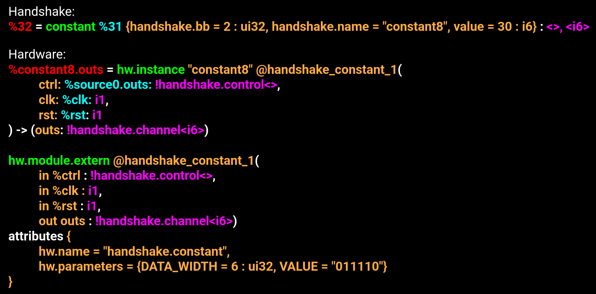
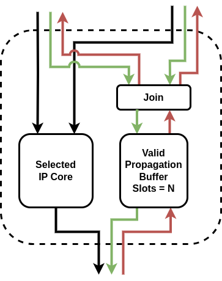

# Backend

This document provides an overview of the current system used to transform the external modules of the Hardware IR into concrete RTL units. (More information about the Hardware IR can be found in the [full backend documentation](Backend.md)).

How we emit the RTL units is far from a complete, finished product, but we here detail the reasons behind each decision, including both positive and negative consequences.

## How Dynamatic Calls the Beta Backend
### Background

To use the beta backend requires knowledge of some aspects of how Dynamatic compiles from the Handshake IR down to RTL, and so this is first discussed:

#### Handshake IR

In the Handshake IR, there are many types of operations, declared in [HandshakeOps.td](https://github.com/EPFL-LAP/dynamatic/blob/main/include/dynamatic/Dialect/Handshake/HandshakeOps.td) or [HandshakeArithOps.td](https://github.com/EPFL-LAP/dynamatic/blob/main/include/dynamatic/Dialect/Handshake/HandshakeArithOps.td). These operations become C++ classes, which provide many useful member functions and member variables. Each operation defines how it can be added to the IR (through [MLIR builders](https://mlir.llvm.org/docs/DefiningDialects/Operations/#builder-methods)), as well how it should be verified (both its own member variables, as well as verification of its input operands and output results).

Each Handshake operation is fully self-contained: all information about the operation is stored in the operation, and the operation knows nothing about other operations.


#### Hardware IR

During compilation, the Handshake IR is lowered to the Hardware IR.

RTL languages are based on a pattern of "definition" and "instances". The "definition" contains all information about an object in one place, and many "instances" can share this information by containing a reference to their corresponding definition.

The Hardware IR aims to replicate this pattern inside the MLIR eco-system. First, a definition is built for each Handshake operations. Then, if two (or more) operations have **exactly identical** definitions, their definitions are merged. 

##### ModuleExternOp

Each definition is added to the Hardware IR as a `HWModuleExternOp`(declared in [HWStructure.td](https://github.com/EPFL-LAP/dynamatic/blob/main/include/dynamatic/Dialect/HW/HWStructure.td)), an operation with no inputs or outputs. Any information needed to generate the RTL is stored in this operation, and it can be referenced by multiple instances.

##### InstanceOp

Each original Handshake operation is considered an instance, and so is converted to an `InstanceOp`, (also declared in [HWStructure.td](https://github.com/EPFL-LAP/dynamatic/blob/main/include/dynamatic/Dialect/HW/HWStructure.td)) a generic, (mostly empty) C++ class. Each `InstanceOp` has a reference to the corresponding `HWModuleExternOp`.

This means, in contrast to the Handshake IR, the Hardware IR does not use different C++ classes to represent different operations. There is very little functionality present to analyze or alter the Hardware IR once generated.

Each InstanceOp contains only 3 pieces of information: 1) its unique name, 2) a reference to a `HWExternalModuleOp`, 3) the names of its inputs and outputs.

##### Example

Below the serialized representation of a `ConstantOp` can be seen for both Handshake and Hardware. 



The output of the operation is highlighted in red. The inputs to the operation are highlighted in blue. The C++ class of the operation is highlighted in green. The information the operation contains is highlighted in orange. The type information of the inputs and outputs is highlighted in pink.

In the Handshake IR, the `ConstantOp` contains `value = 30 : i6`, which indicates the value of the constant is a 6-bit integer of value 30. 

In the Hardware IR, the `InstanceOp` representing this constant instead has a reference to `@hardware_constant_1`. While all information about the inputs and outputs is present, there is no information about the operation itself (include what type of operation it is).

The `HWModuleExternOp` first contains the value used to reference it, in this case, `@handshake_constant_1`. It then redundantly contains all the input and output name and type information (as this information is also present on all the instances). Finally, after the attributes keywrod, it contains the information shared between the instances which they are missing: in this case, their original operation type (`handshake.constant`), (redundantly) the constant bitwidth (`6`), as well as the constant value (`"011110"`)


##### Value

The usefulness of the Hardware IR is unclear: if we simply generated a unique definition for every single Handshake operation, the RTL files would be larger, but the final circuits would be the same. The Hardware IR is serialized very differently to the Handshake IR, which can make them annoying to compare. 

While important memory system details are handled in the conversion between Handshake and Hardware, the fact that the printed IR is 1) not alterable or analyzable programatically due to the conversion to `InstanceOp`, and 2) annoying to read, means that its existance as an IR will probably be removed eventually.

### Step 1: Merging Definitions

The first relevant part of compilation is the process of generating `HWModuleExternOp` from all the HandshakeOps. The relevant piece of code is:

https://github.com/EPFL-LAP/dynamatic/blob/aa984a5925706e19fe718cabc05c9874e679dd39/lib/Conversion/HandshakeToHW/HandshakeToHW.cpp#L545-L561

An if statement checks for each type of Handshake operation, and from it builds a dictionary representing the definition. This dictionary will be stored directly on the `HWModuleExternOp`, and a `HWModuleExternOp` is generated for each unique dictionary. 

Any value which affects if two Handshake operations should share a `HWModuleExternOp` should be placed in this dictionary inside this if statement.

### Step 2: Additional Information for Generation

The dictionary used to define a `HWModuleExternOp` was not designed with the beta backend in mind, and is unsuitable for directly making RTL generation decisions. This is mainly based on serialization approaches: while the C++ dictionary can contain complex C++ objects, the RTL generation decisions must be encoded as strings.

For this reason, a **second set of if statements exists**, at:

https://github.com/EPFL-LAP/dynamatic/blob/aa984a5925706e19fe718cabc05c9874e679dd39/lib/Support/RTL/RTL.cpp#L284-L291

These if statements are analysis ran on the Hardware IR, which as discussed above cannot really by analyzed. They are therefore extremely fragile. However, they were placed here to minize impact on the default backend during development.

The second set of if statements analyzes the `HWModuleExternOp` dictionary to better format the information for RTL generation. This helps with the goal of keeping the RTL generation as simple as possible: analysis is done on the IR, the beta backend is simply text manipulation.

### Step 3: JSON Files for Parameter Passing

A [json file](https://github.com/EPFL-LAP/dynamatic/blob/main/data/rtl-config-vhdl.json) controls how information passes from the C++ MLIR-based flow to the python text printing logic. 

As discussed in the [backend documentation](Backend.md), the JSON file is relatively powerful. The beta backend uses very few of its features, as it is not quite powerful enough, but this means the syntax can be complex.

An example entry is:
```
  {
    "name": "handshake.addf",
    "parameters": [
      {
        "name": "LATENCY",
        "type": "unsigned"
      },
      {
        "name": "INTERNAL_DELAY",
        "type": "string"
      },
      {
        "name": "FPU_IMPL",
        "type": "string"
      }
    ],
    "generator": "python $DYNAMATIC/experimental/tools/unit-generators/vhdl/vhdl-unit-generator.py -n $MODULE_NAME -o $OUTPUT_DIR/$MODULE_NAME.vhd -t addf -p is_double=$IS_DOUBLE fpu_impl='\"$FPU_IMPL\"' internal_delay='\"$INTERNAL_DELAY\"' latency=$LATENCY extra_signals=$EXTRA_SIGNALS",
    "dependencies": [
      "flopoco_ip_cores", "vivado_ip_wrappers"
    ]
  },
  { 
    "name": "second_dependency",
    "generic": "/path/to/second/dependency.vhd",
  }
]
```

At the moment the dependency management system is relatively barebone; only parameter-less components can appear in dependencies since there is no existing mechanism to transfer the original component's parameters to the component it depends on (therefore, any dependency with at least one parameter will fail to match due to the lack of parameters provided during dependency resolution, see [matching logic](#matching-logic)).

#### `module-name`

> [!NOTE]
> The `module-name` option supports parameter substitution.

During RTL emission, the backend associates a module name to each RTL component concretization to uniquely identify it with respect to

1. differently named RTL components, and to
2. other concretizations of the same RTL component with different RTL parameter values.

By default, the backend derives a unique module name for each concretization using the following logic.

- For generic components, the module name is set to be the filename part of the filepath, without the file extension. For the example given in the [generic section](#generic) which associates the string `$DYNAMATIC/data/vhdl/handshake/mux.vhd` to the `generic` key, the derived module name would simply be `mux`.
- For generated components, the module name is provided by the backend logic itself, and is in general derived from the specific RTL parameter values associated to the concretization.

The [`MODULE_NAME` backend parameter](#backend-parameters) stores, for each component concretization, the associated module name. This allows JSON values supporting parameter substitution to include the name of the RTL module they are expected to generate during concretization.

> [!WARNING]
> The backend uses module names to determine whether different component concretizations should be identical. When an RTL component is selected for concretization and the derived module name is identical to a previously  concretized component, then the current component will be assumed to be identical to the previous one and therefore will not be concretized anew. This makes sense when considering that each module name indicates the actual name of the RTL module (Verilog `module` keyword or VHDL `entity` keyword) that the backend expects the concretization step to bring into the "current workspace" (i.e., to implement in a file inside the output directory). Multiple modules with the same name would cause name clashes, making the resulting RTL ambiguous.

The `module-name`, when present, must map to a string which overrides the default module name for the component. In the following example, the generic `handshake.mux` component would normally get asssigned the `mux` module name by default, but if the actual RTL module inside the file was named `a_different_mux_name` we could indicate this using the option as follows (some JSON content omitted for brevity).

```json
{
  "name": "handshake.mux",
  "generic": "$DYNAMATIC/data/vhdl/handshake/mux.vhd",
  "module-name": "a_different_mux_name"
}
```

#### `arch-name`

> [!NOTE]
> The `arch-name` option supports parameter substitution.

The internal implementation of VHDL entities is contained in so-called "architectures". Because there may be multiple such architectures for a single entity, each of them maps to a unique name inside the VHDL implementation. Instantiating a VHDL entitiy requires that one specifies the chosen architecure by name in addition to the entity name itself. By default, the backend assumes that the architecture to choose when instantiating VHDL entities is called "arch".

The `arch-name` option, when present, must map to a string which overrides the default architecture name for the component. If the architecture of our usual `handshake.mux` example was named `a_different_arch_name` then we could indicate this using the option as follow (some JSON content omitted for brevity).

```json
{
  "name": "handshake.mux",
  "generic": "$DYNAMATIC/data/vhdl/handshake/mux.vhd",
  "arch-name": "a_different_arch_name"
}
```

**IMPORTANT**: To support this feature also in Veriloge where multiple architectures of the same module can coexist, we use this parameter to select the desired architecture. This parameter effectively replaces the module name, allowing each architecture variant to be treated as a distinct module. For example, when generating a floating-point adder with three pipeline stages—whose structure differs from versions with other pipeline depths—we use the architecture’s name as the module name. Consequently, this architecture name must match the module name defined in the corresponding Verilog file.

#### `use-json-config`

> [!NOTE]
> The `use-json-config` option supports parameter substitution.

When an RTL component is very complex and/or heavily parameterized (e.g., the LSQ), it may be cumbersome or impossible to specify all of its parameters using our rather simple RTL typed parameter system. Such components may provide the `use-json-config` option which, when present, must map to a string indicating the path to a file in which the backend can JSON-serialize all RTL parameters associated to the concretization. This file can then be deserialized from a component generator to get back all generation parameters easily. Consequentlt, this option does not really make sense for generic components.

Below is an example of how you would use such a parameter for generating an LSQ by first having the backend serialize all its RTL parameters to a JSON file.

```json
{
  "name": "handshake.lsq",
  "generic": "/my/lsq/generator --config \"$OUTPUT_DIR/$MODULE_NAME.json\"",
  "use-json-config": "$OUTPUT_DIR/$MODULE_NAME.json"
}
```

#### `hdl`

The `hdl` option, when present, must map to a string indicating the hardware description language (HDL) in which the concretized component is written. Possible values are `vhdl` (default), or `verilog`. If the `handshake.mux` component was written in Verilog, we would explictly specify it as follows.

```json
{
  "name": "handshake.mux",
  "generic": "$DYNAMATIC/data/vhdl/handshake/mux.vhd",
  "hdl": "verilog"
}
```

#### `io-kind`

The `io-kind` option, when present, must map to a string indicating the naming convention to use for the module's ports that logically belong to arrays of bitvectors. This matters when instantiating the associated RTL component because the backend must know how to name each of the individual bitvectors to do the port mapping.

- Generic RTL modules may have to use something akin to an array of bitvectors to represent such variable-sized ports. In this case, each individual bitvector's name will be formed from the base port name and a numeric index into the array it represents. This `io-kind` is called `hierarchical` (default).
- RTL generators, like Chisel, may flatten such arrays into separate bitvectors. In this case, each individual bitvector's name will be formed from the base port name along with a textual suffix indicating the logical port index. This `io-kind` is called `flat`.

Let's take the example of a multiplexer implementation with a configurable number of data inputs. Its VHDL implementation could follow any of the two conventions.

With `hierarchical` IO, the component's JSON description (some content omitted for brevity) and RTL implementation would look like the following.

```json
{
  "name": "handshake.mux",
  "generic": "$DYNAMATIC/data/vhdl/handshake/mux.vhd",
  "io-kind": "hierarchical"
}
```

```vhdl
entity mux is
  generic (SIZE : integer; DATA_WIDTH : integer);
  ports (
    -- all other IO omitted for brevity
    dataInputs : in array(SIZE) of std_logic_vector(DATA_WIDTH - 1 downto 0)
  );
end entity;
```

This entry matches to the `AddFOp` op based on the `name` field. 

The three parameters are values from the `HWModuleExternOp` dictionary. The JSON files allows different RTL generation methods to be "matched with" based on the values in the dictionary. Adding these 3 parameters enforces that every `AddFOp` contains these values in their dictionaries for generation, and therefore allows us to pass these values to the python script.

There are parameters in the python call that is not in the `parameters` JSON field. One example is `is_double`. This value is not in the `HWModuleExternOp` dictionary, but was added as further analysis in the second set of if statements, ran on the Hardware IR. Since it is not in the original dictionary, we do not need to "match with" it.


### Analysis of How Dynamatic Calls the Beta Backend

This system is very, very messy. Two sets of if statements, JSON matching based on the parameters in the first dictionary but not on the second, analysis on the Hardware IR: these should all be removed.

This is primarily due to Dynamatic's original backend foreseeing that it would generate a lot of the simple units internally, and only generate complex units externally. 

However, systems like speculation and taint tracking means that even simple units can have complex RTL generation. There are many many features in the original backend we no longer use, as while they are powerful, they do not give 100% of the functionality required. However, their existance makes the process more complex. The presence of the Hardware IR itself also makes this process more complex.

While pivoting from the Hardware IR is not possible in the immediate future, the goal is to remove both sets of if statements, and the JSON file, relatively soon. Instead interfaces will be used such that each Handshake operation has its own code to build its (correctly serialized) `HWModuleExternOp` dictionary.

## The Beta Backend

The majority of the Beta Backend is very simple: it prints RTL code which is only lightly parameterized.

There are three aspects worth discussing:

### Signal Managers

Speculation. taint tracking, and tagged tokens for multi-threading, require wrappers around core RTL units to deal with tokens that contain more than one payload. These are discussed in detail [here](SignalManager.md).

### Dependency Management

To avoid communication between the generators of each unit, each unit generates its own dependencies. This means there are many copies of common dependencies, such as joins and forks.


### Arithmetic Units with IP cores

For arithmetic units which have IP cores, the beta backend does not handle the IP cores themselves: these are generated offline, and imported into the synthesis or simulation library unconditonally.


However, the beta backend does generate the following wrapper, which is mostly IP agnostic:



To generate the wrapper, the beta backend needs 2 pieces of information: 1) which ip core to use, and 2) how many slots to place in the valid propagation buffer.

Our IP selection system is both relatively new and imperfect: currently the beta backend may combine several parameters to select an IP core. In future, this should be changed so the entire IP core name is simply passed to the beta backend.