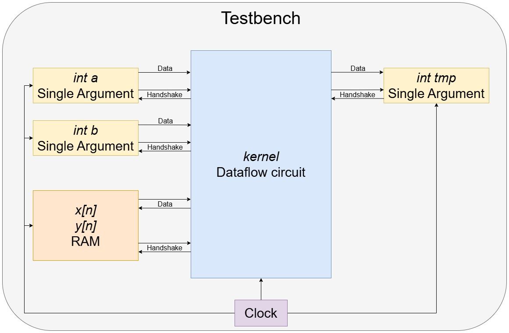

# Cosimulation

This document provides an overview of the internal workflow of the cosimulation used in Dynamatic. Cosimulation is utilized to verify the correctness of a circuit and consists of two parts. Firstly, the execution of the kernel's source code and, secondly, the simulation of the kernel's RTL implementation generated by Dynamatic. The circuit is assumed to be correct if the outputs of both steps match. We will focus on the second step in this document.

> [!Note]
> Information about using verification and cosimulation can be found [here](/docs/UserGuide/Verification.md).

Sections and overview:

1. [Testbench generation](#testbench-generation): This section explains the steps to create the testbench in `tools/hls-verifier/hls-verifier.cpp`
2. [Simulator Options](#simulator-options): This sections lists the supported simulators.

## Testbench generation

> [!Note]
> Depending on the `--hdl` flag for Dynamatic's `write-hdl` command, the testbench is either generated in VHDL or Verilog.

In Dynamatic's compilation step, the source code is translated into an equivalent dataflow circuit.
To simulate the HDL implementation of this dataflow circuit, additional helper circuitry is required, known as the testbench.
In addition to a clock signal and signals to start and finish the simulation, the testbench provides the input arguments to the kernel and collects the outputs.

We will discuss how the testbench is generated next by means of a simple kernel.
A simplified representation of the testbench is given in the figure below.

```c++
int kernel(int y[N], int x[N], int a, int b) {
    int tmp = y[0];
    for (unsigned i = 1; i < N; i++) {
        tmp = a * tmp + b * x[i];
        y[i] = tmp;
    }
    return tmp;
}
```


### Auxiliary Processes
The first step of the testbench generation is to create a VHDL file called `tb_<kernel_name>.vhd` resp. a Verilog file `tb_<kernel_name>.v` which will contain all processes and instances needed to simulate the kernel. It is the top-level module for simulation.
Standard HDL boilerplate and processes for generating a clock signal, a reset signal and signals for starting and ending a simulation are written in Verilog or VHDL in `tools/hls-verifier/include/HlsTb.h` and are copied to the testbench file.

### Constants

Constant values such as the clock period or reset latency can be defined with the function `declareConstant()`. The appropriate HDL implementation is then written to the testbench file.

### Signals

Declaring signals that hold a value and are updated in procedural blocks need to be declared differently from signals that only connect two modules.
Therefore, there are two functions to declare signals: `declareReg()` and `declareWire()`.
Verilog throws an error if the wrong type is selected. VHDL, on the other hand, does not make a distinction between the two types and both functions emit the same VHDL code.

Connections between two modules are declared using the function `declareWire()`.

### Single Argument

Single value input arguments (e.g. `int a` and `int b`) and output values (e.g. `int tmp`) are handled by the single argument module.
This module communicates by handshake signals with the dataflow circuit.
For every single valued input/output, a `single argument` module is instantiated from the template in `tools/hls-verifier/resources/`.

### RAM

To load and store values from arrays (e.g. `int x[n]` and `int y[n]`), the testbench has a RAM module.
It is connected by data and handshake signals to the dataflow circuit.
The template is located in the same directory as the single argument.

### Global Completion Signal

The simulation is finished when all output modules received their value. To collect all *valid* signals from the output instances the `join_tb` module is used.
Same as for the single argument and the RAM, the template is located in `tools/hls-verifier/resources/`.

### Writing Output File

When the simulation is finished, the contents of the RAM and single argument modules are copied to the output file.
The HDL implementation for this process is given in `hlsTb.h`.

This concludes the testbench generation, and the circuit is now ready to be simulated.

## Simulator Options

There are four different simulators currently supported by Dynamatic. ModelSim, Vivado Vitis, GHDL and Verilator.
The first two can simulate both Verilog and VHDL files, where GHDL only works with VHDL and Verilator only with Verilog files.

> [!Warning]
> To use GHDL or Verilator, the correct HDL must be specified during Dynamatic's `write-hdl` command.

### Dynamatic's `simulate`

The simulator can be selected with the flag `--simulator` during Dynamatic's `simulate` command.

- ModelSim: `--simulator vsim`
- Vitis Vivado: `--simulator xsim`
- GHDL: `--simulator ghdl`
- Verilator: `--simulator verilator`

Every simulator compiles all files in the `/HDL_SRC` directory and then starts the simulation with the testbench as top level module.
The implementation of the simulators is in `tools/hls-verifier/include/Simulators.h`. We will now briefly discuss every simulator.

### ModelSim

When using ModelSim, Dynamatic creates a `.do` file with all necessary commands to elaborate, compile and execute the ModelSim simulation.
Dynamatic then passes this `.do` file when calling ModelSim.

### Vivado Vitis

Dynamatic calls the `xelab` function of Vitis with the `-R` flag.
This elaborates and compiles the testbench and simulates the design.

### GHDL

GHDL is executed using a shell script.
All HDL source files are imported into GHDL, compiled and simulated.

### Verilator

The Verilator main function is copied from `tools/hls-verifier/resources/verilator_main.cpp` to the working directory.
A shell script is used to call Verilator and run the simulation.
