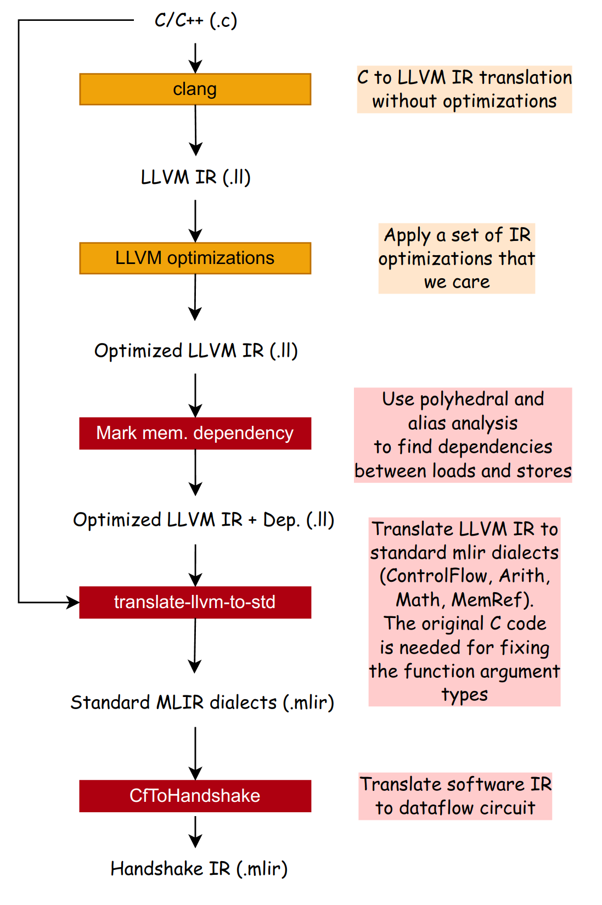

# C Frontend

This document describes Dynamatic's C frontend (under `tools/translate-llvm-to-std`).

Sections and overview:

1. [Design](#design): This section gives a high-level overview of Dynamatic's C frontend. We describe what are the input (LLVM IR) and output (MLIR standard dialects) of the C frontend and major translation steps.
2. [LLVM to MLIR translation](#llvm-to-mlir-translation): This section describes the translation algorithm between LLVM IR and MLIR standard dialects.
3. [Memory dependency analysis](#memory-dependency-analysis): This section describes the memory dependency analysis pass for minimizing LSQ usage.

## Design 

This section gives a high-level overview of Dynamatic's C frontend. 

### What Does a C Frontend Do?

Dynamatic's C frontend converts C code to the standard MLIR dialects, performs generic IR optimizations, and performs memory analysis (which load depends on which store?). Dynamatic employs the following conversion flow:
1. Convert C to LLVM IR. We use clang (with no optimization `clang -O0 ...`) for this step. We do not apply any optimization here to ensure predictability across different clang version (different clang versions perform a different set of optimizations, and some transformations are unnecessary for us).
2. Apply various IR optimizations. We use LLVM IR transformations such as mem2reg, instcombine, and so on. Here, we have control over exactly the set of passes we run to ensure predictability. See below for the set of notable optimizations that we run on the LLVM IR.
3. Annotate memory analysis to know the dependencies between the loads and stores. This step relies on the polyhedral analysis from Polly and alias analysis from LLVM. LLVM/Polly's memory dependency analysis cannot be directly imported into Dynamatic's toolchain. We implement a memory dependency analysis tool to generate them.
4. Convert LLVM IR to MLIR standard dialects. As of Oct. 2025, there is no working implementation in the LLVM project that can translate LLVM IR to MLIR. Therefore, Dynamatic utilizes a conversion tool for translating the LLVM IR directly to MLIR standard dialects.

The output of Dynamatic's C frontend is an MLIR IR written in standard MLIR dialects, namely:
- ControlFlow dialect for representing control flow operations.
- Arith dialect for representing basic math operations.
- Math dialect for advanced floating-point math operations.
- MemRef for representing arrays and memory accesses.

Notable optimizations that we need from the LLVM project:
- `mem2reg`: Suppressing allocas (allocate memory on the heap) into regs.
- `instcombine`: Performing local DAG-to-DAG rewriting. Notably, this canonicalizes a chain of `getelementptr` instructions (GEPs).
- `loop-rotate`: Transforming loops to do-while loops as much as possible.
- `simplifycfg`, `loopsimplify`: reducing the number of BBs (fewer branches).
- `consthoist`: Moving constants around.
- `licm`: Applying loop-invariant code motion to make the loops simplier.

> [!NOTE]
> **Design choice**. These LLVM IR transformations and analyses are crucial to the quality of Dynamatic-produced circuits, and porting them to MLIR requires significant effort. Therefore, we switched from Polygeist to an LLVM IR-based frontend.

> [!NOTE]
> **Design choice**. MLIR internally has a translation tool for converting LLVM IR to the LLVM dialect. So one alternative is to build an MLIR dialect translation pass to convert the LLVM dialect to the standard dialect.
> 
> We decided **not to use this approach** because the LLVM IR-to-LLVM dialect translation does not preserve custom LLVM metadata. This would drop the memory analysis annotation (marked as llvm metadata nodes).

## LLVM to MLIR Translation

This section describes the conversion mechanism between LLVM IR and MLIR standard dialects

The translation between LLVM IR and the standard dialects (especially the subset that is supported in Dynamatic) is mostly straightforward. However, there are a few important caveats:

> [!NOTE]
> Key differences between LLVM IR and MLIR:
> - LLVM uses void ptrs for array inputs (both for fixed-size arrays `int arr[10][20]` and arrays with unbounded length `int * arr`). While in standard dialect, we use MemRef types `memref<10 * 20 * i32>` for referencing an array.
> - LLVM does not represent constants as operations, while in MILR, constants must be "materialized" as explicit constant operations.
> - LLVM has explicit SSA Phi nodes. MLIR replaces the Phis by block arguments.
> - The MemRef dialect does not have a special GEP operation for the array index calculation (e.g., `a[0][1]`); instead, it has a high-level syntax like `%result = memref.load [%memrefValue] %dim0, %dim1`. Therefore, GEPs are replaced by a direct connection between indices to the loads/stores. 
> - In LLVM, global values can be referenced by GEPs, but in MLIR MemRef dialect, global values can only be referenced via `get_global` op via the `sym_name` symbol attached to the global op.

### Type Conversion for Function Arguments

Since LLVM discards the argument types of the array arguments, `translate-llvm-to-std` analyzes the AST of the original input C code to recover the dimension(s) and the types.

### LLVM to Standard MLIR Dialect Translation Algorithm

During translation, Dynamatic maintains the following mapping between the LLVM
IR and MLIR:
- **Basic blocks**: `llvm::BasicBlock *` to `mlir::Block`. We translate operations block by block. 
- **Values or block arguments**: `llvm::Value*` to `mlir::Value`. Input values are necessary to build MLIR arguments. This mapping identifies the input values of an MLIR operation. Notably, we do not need to keep track of the mapping between LLVM instructions and MLIR operations.
- **Get element pointer**: `llvm::Value *` (the gep instruction in LLVM) to `SmallVector<mlir::Value>` (the indices in MLIR). This mapping keeps track of the index operands of loads/stores in MLIR.
- **Global values**: `llvm::Value *` to `memref::GlobalOp`. This mapping is needed in addition to the normal value mappings because MLIR does not reference the global ops via `mlir::Value`.

Dynamatic performs the following translation for the LLVM module:

- Create an MLIR function for each LLVM function.

For each LLVM function, Dynamatic performs the following translation:

1. **Constant materialization**. Create a corresponding `arith::ConstantOp` for each constant input of each `llvm::Instruction *` in LLVM IR.
2. **Block conversion**. Create an MLIR block for every basic block in LLVM. Remember the BB mappings (see the list above). For every Phi output in LLVM, it creates the corresponding block argument in MLIR (for each array function argument, the original C code is used to recover the correct MemRef type). Remember the value mappings (see the list above).
3. **Global conversion**. Create a MemRef global operation for each global variable in LLVM.
4. **Instruction translation**. Create an operation in MLIR for each LLVM operation from the input values (retrieved from the value mapping). Exception: GEP are removed and the indices are directly connected to the loads and stores.

> [!NOTE]
> The syntax of the GEP instruction in LLVM is often simplified/shortened. This requires a sophisticated conversion rule for GEP. Check out the LLVM documentation on [caveats of GEP syntax](https://llvm.org/docs/GetElementPtr.html) for more details.

> [!IMPORTANT]
> The `instCombine` pass must be applied before the conversion to eliminate a
> chain of GEPs.

## Memory Dependency Analysis

TODO
