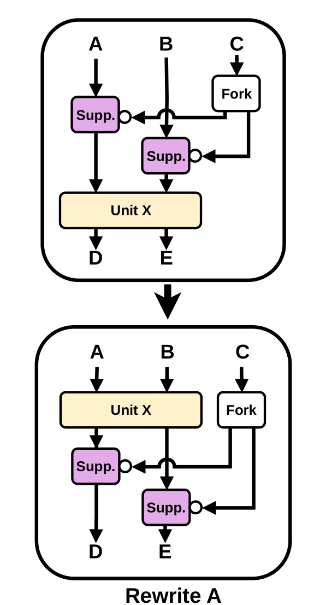
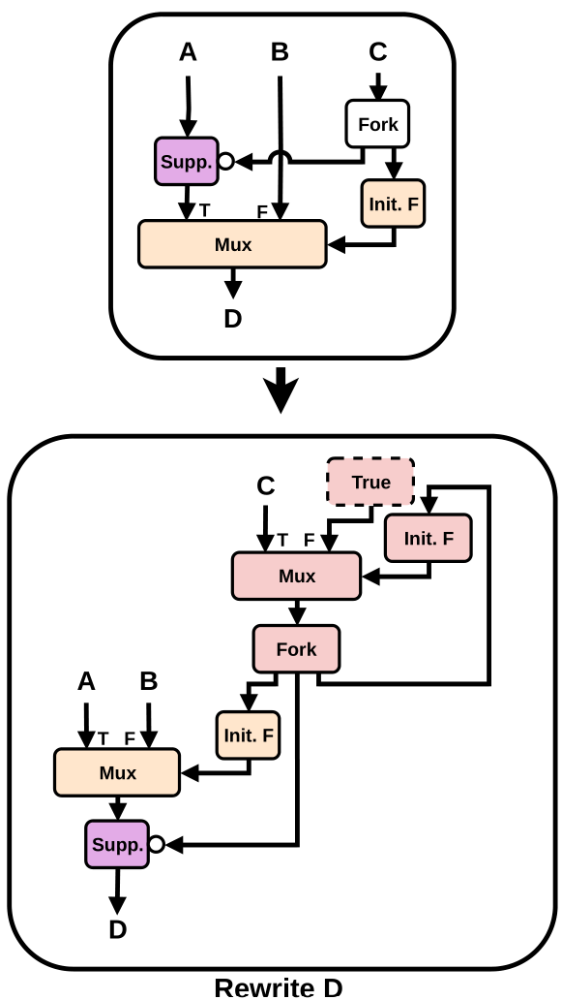

# Eagerly Elastic

The eagerly elastic pass implements eager execution through two main Rewrites, specifically Rewrite A and Rewrite D from the [EagerlyElastic Paper](https://dl.acm.org/doi/pdf/10.1145/3748173.3779196). To execute this pass during compilation, it must be paired with fast token delivery by specifying both the `--fast-token-delivery` and `--eagerlyelastic` flags.

When no buffer algorithm is specified, no speedup can be achieved. However, with the buffer algorithm `fpga20` the necessary buffers are placed and the desired speedup can be achieved.

## Code Structure

The pass begins by converting all conditional branches into suppressors. This means each branch discards tokens on its true path by routing them to a sink, while allowing tokens on the false path to proceed normally through the circuit. If a branch does not initially have a sink, it is split into two separate branches where one uses an inverted condition. Next, the pass enters its main phase by executing Rewrite A as many times as possible and then enters a loop driven by the user-defined `numRewriteD` parameter. This loop alternates between applying Rewrite D once and then running Rewrite A as often as possible to move all suppressors as far down the circuit as possible. The execution sequence follows the pattern: A, (D, A)^n. 

### Rewrite A
Rewrite A pushes suppressors past eligible downstream operations. An operation is eligible if it is pure and matched, such as arithmetic operations or a fork, and all of its other inputs either match the suppressor's condition or originate from a constant source. If an eligible operation has multiple independent consumers, the pass inserts a fork to make it possible for a suppressor to only move past some of the consumers. The functions that implement this are `advanceSuppressorMotion`, `isEligibleForSuppressorMotion`, and `performSuppressorMotion`.

### Rewrite D
Rewrite D identifies loop multiplexers and moves the suppressor past them. When a suppressor is connected to the true data path of the multiplexer, this rewrite builds an additional control structure. This structure is simplified in the code into a `RepeatingInitOp`, which implements the pink circuit seen in the picture below. This allows the suppressor to safely move past the mux. Rewrite D is implemented with the functions `checkForLoopMuxSuppressorMotion` and `applyLoopMuxSuppressorMotion`. After Rewrite D, Rewrite A is applied to move this suppressor further down the loop.

