# Fast Token Delivery

This document describes the Fast Token Delivery (FTD) algorithm and how it is implemented across `FtdSupport`, `FtdImplementation`, and `FtdSuppression`. FTD runs on a Handshake function. It inserts the circuitry that carries each produced value to the operations that consume it. On executions where a value would not be consumed, FTD suppresses its token. On executions where a value is needed more than once, FTD regenerates it.

Most of the algorithm, and most of this document, is about the **suppression** machinery in `FtdSuppression`. Suppression computes the condition under which a token must be discarded for one producer-consumer pair, and it builds that condition as a circuit that itself respects the token-matching invariants. Regeneration, GSA gate conversion, and the supporting infrastructure come after.

## Background

### Elastic circuits and the token delivery problem

Dynamatic compiles C/C++ into **elastic** (dataflow) circuits. Data travels as **tokens** over handshake channels, flowing from a **producer** to a **consumer** with no global schedule. Such a circuit is correct only when it satisfies the **token-matching invariants**. Every token that is produced must eventually be consumed, and every token that is consumed must have been produced.

Dynamatic's IR is in SSA form, and the first step of FTD converts it to **gated-SSA (GSA)** form. As in plain SSA, every use has a single reaching definition, so each data dependency is one producer-consumer pair. GSA goes further and refines the φ-functions into **gating functions**, which come in two kinds. A γ gating function sits at a conditional merge, and a μ gating function sits at a loop header. Each one records the branch condition that selects a definition. These gating functions become the circuit's MUXes, with the recorded condition as the select (see [GSA gate conversion](#gsa-gate-conversion)).

Control flow is resolved at run time, so there is no guarantee that control reaches the producer's block, the consumer's block, or both. The matching can fail in two ways. FTD inserts one control component on the producer→consumer channel for each of them:

- **Suppression.** The producer emits a token that the consumer will not consume, so the token must be discarded. This happens when the consumer's block is not reached at all. It also happens when the producer is inside a loop and the consumer is outside it. In that case every iteration produces a token but only the last one is consumed, and the rest are suppressed. The component is a BRANCH whose discard output feeds a SINK. Its select carries the *suppression condition* `f_supp`. When `f_supp` is true the token is discarded, and when it is false the token is delivered. The circuit can equally compute the *consumption condition* `f_cons = ¬f_supp` with the two outputs swapped. The two conditions are always negations of each other, and the code and figures use whichever one reads better at a given point. In the IR this component is a `handshake::ConditionalBranchOp`, with the fixed convention that the false output delivers and the true output is sunk.
- **Regeneration.** The consumer needs the value more often than the producer emits it. GSA guarantees that a use never lacks a reaching definition, so this is never a case of a missing producer. The only case is a producer outside a loop feeding a consumer inside it, where the one token has to be reproduced on each iteration. The component is a MUX at the loop header. Its select is the loop's back-edge condition (true while the loop iterates), fed through an INIT that emits one initial token ahead of the condition stream. On the first iteration the MUX selects the value from outside the loop, and on every later iteration it selects the value fed back from inside, until the loop exits. In the IR this is a `handshake::MuxOp` whose select comes from the back-edge-condition circuit through a `handshake::InitOp`. When the consumer sits inside several enclosing loops, one such mux is chained per loop, outer feeding inner.

After `f_supp` is derived as a Boolean expression over the block conditions `cN`, where `cN` denotes the condition of block `N`, the remaining issue is how to evaluate it with tokens. A condition token is produced only when the corresponding block executes. If control bypasses that block, the token is absent. For example, suppose block 0 decides whether block 1 executes, and block 1 contains condition `c1`. On a path that skips block 1, no `c1` token is produced. A naive elastic circuit for `f_supp = ¬c0 · ¬c1` would still wait for both inputs, so it could deadlock.

FTD avoids this by lowering Boolean expressions to MUX trees through Shannon expansion. A MUX consumes only the selected input, so it does not wait for an input that is not selected. This is why every Boolean condition in FTD is lowered through a BDD into a MUX tree (see [Boolean to a mux tree](#boolean-to-a-mux-tree)). The later suppression stages keep these trees correct across loops and shared condition tokens (see [Token distribution](#token-distribution) and [Token demotion](#token-demotion-across-loop-levels)).

### Block indexing and condition variables

Boolean conditions in FTD are named after basic blocks. `BlockIndexing`, defined in `FtdSupport`, gives every block an index so that a dominator always gets a smaller index than the blocks it dominates:

```cpp
// FtdSupport.cpp — BlockIndexing constructor
llvm::sort(allBlocks, [&](Block *a, Block *b) { return domInfo.dominates(a, b); });
for (auto [blockID, bb] : llvm::enumerate(allBlocks)) {
  indexToBlock.insert({blockID, bb});
  blockToIndex.insert({bb, blockID});
}
```

The interface is small and used throughout FTD:

```cpp
class BlockIndexing {
public:
  BlockIndexing(mlir::Region &region);
  std::optional<Block *> getBlockFromIndex(unsigned index) const;
  std::optional<Block *> getBlockFromCondition(StringRef condition) const; // "cN" → block
  std::optional<unsigned> getIndexFromBlock(Block *bb) const;
  bool isGreater(Block *bb1, Block *bb2) const;
  bool isLess(Block *bb1, Block *bb2) const;
  std::string getBlockCondition(Block *block) const;                      // block → "cN"
};
```

The branch condition of block `N` is the string `"cN"`, so a Boolean such as `c0 ∧ ¬c3` means that block 0 branched one way and block 3 branched the other way. `isLess(a, b)` compares indices. It is used throughout as a cheap test for whether `a` is above `b` in the dominance order, for example to detect back edges (an edge whose target has a smaller index than its source) and to pick the earliest of several candidate blocks. The polarity convention is fixed. Leaving a conditional block by its false edge contributes the negated literal `¬cN`, and leaving by its true edge contributes the plain literal `cN`.

### The shadow CFG

The conversion that produces the Handshake IR, `CfToHandshake`, flattens the multi-block CFG into a single block. Every analysis FTD needs (dominance, loop nesting, control dependence, path enumeration) requires the original block structure, which no longer exists at that point.

`ShadowCFG` solves this. It is a private `func.func` that holds a copy of the original CFG with real `cf` terminators, plus a map from each block index to the real Handshake condition `Value`:

```cpp
// FtdSupport.h
struct ShadowCFG {
  mlir::func::FuncOp shadowFunc;
  llvm::DenseMap<unsigned, mlir::Value> conditionMap;

  mlir::Region &getRegion() { return shadowFunc.getBody(); }
  mlir::Block  *getBlock(unsigned bbIdx);          // index → shadow block
  unsigned      getBlockIndex(mlir::Block *block); // shadow block → index
  /// Real handshake condition Value of the cond_br in block bbIdx.
  /// nullptr when the block ends in an unconditional branch.
  mlir::Value   getCondition(unsigned bbIdx);
  mlir::Value   getCondition(mlir::Block *block);
  void destroy();
};
```

All graph analysis runs on `getRegion()` as if the original CFG were still alive. There is one thing the shadow cannot synthesize, namely the real condition wire of a conditional block, and that is fetched from `conditionMap` through `getCondition`. The shadow is the bridge between reasoning about the CFG and wiring real signals, so every entry point carries a `ShadowCFG &`. This includes `insertDirectSuppression`, `computeLoopBackedgeCondition`, and the GSA and regeneration passes.

### The pass order

FTD runs these steps on a Handshake function, in this order:

1. `createAllCondPlaceholders` creates stand-ins for each block's condition (see [Condition placeholders](#condition-placeholders)).
2. `addGsaGates` turns φ/GSA gates into muxes (see [GSA gate conversion](#gsa-gate-conversion)).
3. `addRegen` adds regeneration muxes for cross-loop dependencies (see [Regeneration](#regeneration)).
4. `addSupp` adds the suppression circuitry (the central topic of the sections below).
5. `resolveCondPlaceholders` and `finalizeCondPlaceholders` substitute the real condition signals.

## The suppression algorithm

Given a producer value (`connection`) and a consumer operation, suppression computes the Boolean condition under which the token must be discarded and emits it as a circuit. The work is organized as a pipeline of reusable stages. Regeneration and GSA conversion call the same stages to compute their loop conditions.

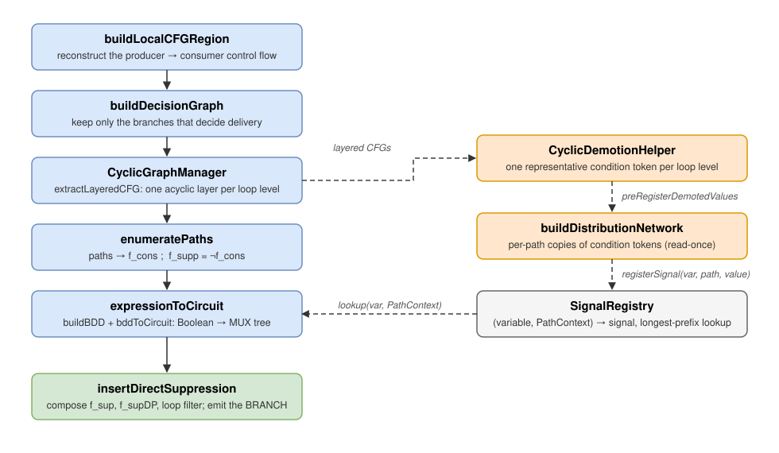

*Figure 1: The suppression pipeline. The main chain (blue, top to bottom) turns a producer-consumer pair into a Boolean and then into a mux tree. The side chain (orange/gray) prepares the condition tokens that those muxes consume. In the side chain, demotion reconciles token counts across loop levels, distribution makes per-path copies, and the `SignalRegistry` is the shared ledger that `bddToCircuit` looks up the right copy in. `insertDirectSuppression` (green) drives all of it and emits the final branch.*

### The dispatch filter

`addSupp` walks every operand of every operation and calls `addSuppOperandConsumer`. That function throws out the pairs that must never be suppressed, before any analysis runs. The skip list is spelled out in the code, and it is worth knowing when you are debugging why no branch was inserted at some point. A pair is skipped when any of the following holds:

- the consumer is itself FTD-generated (`FTD_OP_TO_SKIP`) or an init merge (`FTD_INIT_MERGE`);
- the consumer is a `ConditionalBranchOp` and the operand is *not* its condition input (suppressing a branch's data input produces incorrect circuits; only the select can be gated);
- producer and consumer share a block and the consumer is not a mux (no delivery problem exists), or the producer is itself a γ-mux in the same block;
- the producer is a `ConditionalBranchOp`, or is FTD-generated (`FTD_OP_TO_SKIP` / `FTD_INIT_MERGE`);
- either side is a memory operation (`MemoryControllerOp`, `LSQOp`, raw `memref` loads/stores, `MemRefType` operands) or a `ControlMergeOp`, or the consumer is a `cf::BranchOp`.

Everything that survives goes into [`insertDirectSuppression`](#the-driver-insertdirectsuppression).

### The local CFG

FTD does not analyze the whole function. It analyzes only the slice of the CFG that a token can traverse from the producer block to the consumer block. `buildLocalCFGRegion` reconstructs that slice as a fresh, standalone region and returns it as a `LocalCFG`:

```cpp
// FtdSuppression.h
struct LocalCFG {
  Region *region = nullptr;             // the reconstructed subgraph
  DenseMap<Block *, Block *> origMap;   // local block → original block
  Block *newProd = nullptr;             // entry (the producer)
  Block *newCons = nullptr;             // the consumer
  Block *secondVisitBB = nullptr;       // self-loop delivery (producer == consumer)
  Block *sinkBB = nullptr;              // unique exit; every discarded path ends here
  SmallVector<Block *, 8> topoOrder;
  Operation *containerOp = nullptr;     // throwaway func.func that owns the region
};
```

`origMap` is what ties a local block back to the original CFG. Every Boolean literal and every condition signal is later derived from the original block behind a local block. `containerOp` exists because the subgraph is only scaffolding. It lives in a throwaway `func.func`, is analyzed, and is erased with `containerOp->erase()` once the driver is done with it.

The same struct is reused for every derived graph in the pipeline, such as decision graphs and layered per-loop graphs. So when the text below says "a `LocalCFG`", it means any of these reconstructed subgraphs, always with the same `newProd`/`newCons`/`sinkBB` meaning.

The producer and consumer can sit in several positions relative to the loops of the CFG, and `buildLocalCFGRegion` handles all of them with one set of rules. Figure 2 shows the five shapes.

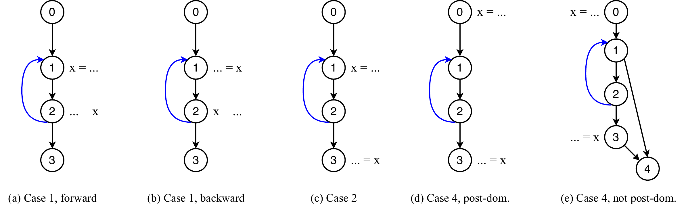

*Figure 2: The five delivery shapes (back edges in blue, producer `x = ...`, consumer `... = x`). (a) Same loop, producer before consumer. (b) Same loop, consumer before producer, where the consumer is the loop header. (c) Producer inside a loop, consumer outside it. (d, e) Producer and consumer both outside a loop that lies between them: in (d) the consumer post-dominates the loop header, in (e) it does not.*

When the producer and consumer are in the **same loop**, their relative order decides the shape. If the producer comes first (a), the value is delivered along a forward path within a single iteration. If the consumer comes first (b), the consumer is the loop header and the value is loop-carried, reaching the consumer only by going around the back edge. This is the delivery to the internal input of a μ-gate or a regeneration mux; the local CFG represents that second arrival at the header with a dedicated `secondVisitBB`.

When the **producer is inside a loop and the consumer is outside it** (c), the value is delivered only on the iteration that exits the loop. On every iteration that stays in the loop, the producer fires again and that token is suppressed.

When the **producer and consumer are both outside a loop that lies between them** (d, e), whether the loop matters depends on whether the consumer post-dominates the loop header. If it does (d), the loop cannot change whether the consumer is reached, so its internal branches never enter the suppression condition. If it does not (e), a branch inside the loop decides whether the consumer is reached, so the loop has to be analyzed rather than ignored. The construction keeps an on-path loop (d and e) as a real cycle in the reconstructed graph, but only in (e) does the loop survive into the suppression condition; in (d) it drops out once the decision graph keeps only the deciding branches.

Construction is a DFS from the producer block. The destination of each outgoing edge is decided by a fixed sequence of checks, and the order of these checks matters:

```cpp
// FtdSuppression.cpp — buildLocalCFGRegion, per successor (paraphrased control flow)
if (succOrig == origCons)            nextLocal = clone(origCons) → newCons → sink;  // deliver
else if (succOrig == origProd)       nextLocal = sinkBB;                            // looped back, discard
else if (cloned.count(succOrig))     nextLocal = cloned[succOrig];                  // reuse: keep on-path loops as cycles
else if (visited.count(succOrig))    nextLocal = sinkBB;                            // defensive
else if (bi.isLess(succOrig, curr))  nextLocal = sinkBB;                            // region-leaving back edge, discard
else                                 nextLocal = clone(succOrig); recurse;          // new forward edge
```

Two-way branches are emitted as `cf.cond_br` with a placeholder constant condition. (The symbolic variable is what matters here; real signals are attached only when circuits are built.) One-way branches are emitted as `cf.br`, and the sink is closed with `func.return`. The reuse-already-cloned-block check is placed before the back-edge check on purpose. It is what keeps a loop that lies on a producer→consumer path (Figure 2 d/e) as a real cycle in the local graph, which the loop machinery in [decomposing loops into acyclic layers](#decomposing-loops-into-acyclic-layers) depends on. When the producer and consumer are the same block, a dedicated `secondVisitBB` represents reaching the consumer on the second visit.

The resulting graph has four properties everything downstream relies on:

1. It has a unique source (`newProd`) and a unique sink (`sinkBB`); every path from the source reaches the sink.
2. Apart from on-path loops (Figure 2 d/e), it is a DAG.
3. A path that passes through `newCons` is a delivery; a path that reaches `sinkBB` without passing through `newCons` is a suppression.
4. **`f_supp` is true exactly when control flow takes a path that reaches `sinkBB` without passing through `newCons`.**

Property 4 is the key one. It reduces "should this token be discarded?" to a reachability question on this graph. If `buildLocalCFGRegion` is ever changed, this is the property to preserve.

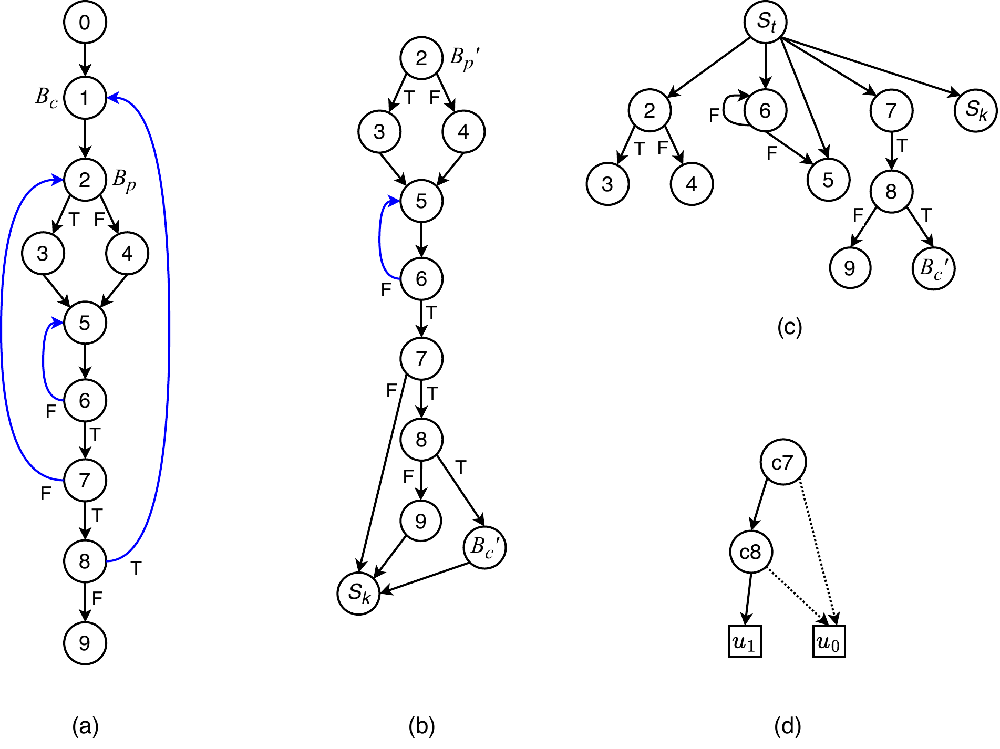

*Figure 3: From the original CFG to the decision graph. (a) The original CFG, back edges in blue; the producer B_p is block 2 and the consumer B_c is block 1, so the delivery crosses a back edge (the shape of Figure 2b). (b) The local CFG: block 2 is the entry B_p′, the consumer is reached as B_c′, every non-delivering edge is cut to the sink S_k, and the on-path loop 5↔6 survives as a real cycle. (c) The control-dependence graph of the local CFG. (d) The decision graph: of all the branches, only c7 and c8 decide whether B_c′ is reached; dashed edges are false edges.*

### The decision graph

Most blocks in the local CFG cannot affect whether `newCons` is reached. `buildDecisionGraph(lcfg, deps, muxConstraints?)` compresses them away. It keeps exactly the node set

```
{ newCons, sinkBB } ∪ deps        // deps = control dependences of newCons
```

All other blocks are rewired out of the way:

- The helper `findNearest` follows outgoing edges through removed blocks until it reaches a kept block, so a deleted chain `A → x → y → B` is collapsed into a direct edge `A → B`.
- A synthetic `dummyStart` is prepended so the entry block never carries a back edge.
- Each kept conditional block is rebuilt with a `cf.cond_br` terminator whose condition is a constant placeholder.

The optional `muxConstraints` map (`Block* → bool`) constrains consumer reachability at a kept conditional block. The selected successor is kept as the meaningful path, while the opposite successor is wired directly to the sink:

```cpp
// FtdSuppression.cpp — buildDecisionGraph, constrained rebuild
if (muxConstraints.count(oldBlock)) {
  bool requiredVal = muxConstraints.lookup(oldBlock);
  if (requiredVal)  newFalse = newL->sinkBB;   // require True  → False edge to sink
  else              newTrue  = newL->sinkBB;   // require False → True edge to sink
}
```

This is how "the γ-mux only selects the producer's input when its condition is X" is encoded into the graph itself. With the opposite branch wired to the sink, path enumeration automatically produces a condition that includes the select requirement.

Figure 3(c, d) shows the unconstrained step on the running example. The control-dependence analysis singles out `c7` and `c8`, so the decision graph keeps just those two branches plus the two terminal outcomes. In the implementation, these terminals are represented by `newCons` for the true outcome and `sinkBB` for the false outcome.

### Decomposing loops into acyclic layers

Control-dependence analysis, path enumeration, and BDD construction all assume an acyclic graph, but a decision graph may contain loops (Figure 3b would, had the loop been on the delivery path; Figure 4b does). `CyclicGraphManager` analyzes the loop structure and flattens any single nesting level into a DAG.

```cpp
// FtdSuppression.h
class CyclicGraphManager {
public:
  /// Builds the LoopScope tree immediately on construction.
  explicit CyclicGraphManager(LocalCFG &lcfg);

  void analyzeTopology();                       // (re)build the scope tree
  unsigned getNestingLevel(Block *bb) const;    // 0 = top level
  LoopScope *getTopLevelScope() const;          // root of the scope tree

  /// Extracts a normalized, acyclic LocalCFG for one LoopScope:
  /// clone the scope's blocks, redirect own back edges to Sink (False),
  /// prune deeper back edges, redirect loop exits to a True terminal.
  std::unique_ptr<LocalCFG> extractLayeredCFG(const LoopScope *scope,
                                              OpBuilder &builder);
private:
  LocalCFG &lcfg;
  mlir::DominanceInfo domInfo;
  mlir::CFGLoopInfo loopInfo;                   // loop analysis over the dom tree
  DenseMap<Block *, unsigned> blockLevelMap;    // block → nesting level
  std::unique_ptr<LoopScope> topLevelScope;
  std::unique_ptr<LoopScope> buildScopeRecursive(mlir::CFGLoop *loop, unsigned level);
};
```

The scope tree it builds is made of `LoopScope` nodes:

```cpp
struct LoopScope {
  unsigned level = 0;                  // 0 = acyclic top scope; 1 = top-level loops; ...
  Block *header = nullptr;             // loop header; the graph entry for level 0
  SmallVector<Block *> latches;        // blocks whose back edge targets the header
  DenseSet<std::pair<Block *, Block *>> allBackEdges;  // incl. nested loops' (bubbled up)
  DenseSet<Block *> allBlocksInclusive;                // all blocks in this scope
  SmallVector<std::unique_ptr<LoopScope>> subLoops;
  LoopScope *parent = nullptr;
  mlir::CFGLoop *loopInfo = nullptr;   // null for level 0
};
```

`analyzeTopology` starts every block at level 0, then walks `CFGLoopInfo`'s top-level loops with `buildScopeRecursive`, which raises the level of each loop's blocks, records latches as back edges, recurses into sub-loops at `level + 1`, and **bubbles every nested back edge up** into the parent's `allBackEdges`. This is what lets a level's extraction know which back edges belong to deeper levels and must be pruned rather than redirected.

`extractLayeredCFG(scope)` then clones `scope`'s blocks into a fresh `LocalCFG` and rewrites edges so the result is a DAG:

- a back edge to **this scope's own header** is redirected to the **false terminal** (`sinkBB`), meaning "iterate again", since the path did *not* exit this iteration;
- a back edge belonging to an **inner loop** is cut (that loop's own layer represents it);
- an edge **leaving this scope** is redirected to the **true terminal** (`newCons`), representing the loop exit;
- a **residual back edge** that `CFGLoopInfo` did not classify (an irreducible cycle) is detected from the input's topological order (`bi.isLess`) and also cut to the false terminal.

For level 0 the two terminals are the actual consumer and sink. For deeper levels they mean "exit" and "stay". Level 0 only drops dead blocks. Deeper levels are fully canonicalized so every non-terminal block ends in a conditional branch, which is exactly what the BDD builder expects. A level-`k` layer thus answers one question: on this iteration of this loop, does control flow exit or return to the header?

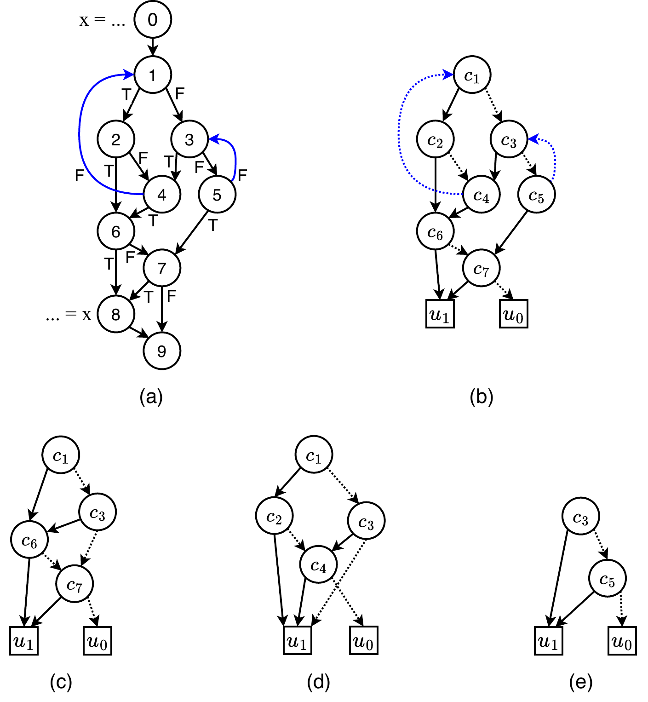

*Figure 4: Layered decomposition. (a) A CFG with two nested loops (back edges in blue): the outer loop is headed by block 1 with latch 4, the inner by block 3 with latch 5; the producer is in block 0 and the consumer in block 8. (b) The cyclic decision graph (dashed = false edges, u1/u0 = the true/false terminals). (c) The level-0 layer: both loops collapsed, leaving the acyclic decision over c1, c3, c6, c7. (d) The level-1 layer for the outer loop: its own back edge becomes the false terminal ("iterate again"), its exits the true terminal, the inner loop's back edge is pruned. (e) The level-2 layer for the inner loop.*

Stitching values *across* levels is the job of demotion (see [Token demotion across loop levels](#token-demotion-across-loop-levels)).

### Paths to a Boolean condition

On an acyclic decision graph, `enumeratePaths(lcfg, bi, deps)` walks every path from `newProd` to `newCons` (an iterative DFS that stops at the sink and refuses to revisit a block already on the current path) and converts each path to one product term with `getHybridPathExpression`:

```cpp
// FtdSuppression.cpp — getHybridPathExpression, per edge u → v on the path
if (localDeps.contains(u) && isa<cf::CondBranchOp>(u->getTerminator())) {
  bool isTrueEdge = (u->getTerminator()->getSuccessor(0) == v);
  // variable name from the ORIGINAL block; polarity from the LOCAL structure
  std::string var = bi.getBlockCondition(lcfg.origMap.lookup(u));
  literal = isTrueEdge ? var : ¬var;        // SingleCond(Variable, var, !isTrueEdge)
  term = term ∧ literal;
}
```

The function is "hybrid" because it takes the **variable name** from the original CFG block (so it names a real condition signal) and the **polarity** from the local graph's edge structure. In a constrained or layered graph the local successors may differ from the original ones, and it is the local wiring that encodes the question being asked. Only blocks in the dependence set contribute a literal, and the rest are implied. OR-ing the per-path terms and minimizing gives the consumption condition, and its negation the suppression condition:

```
f_cons = boolMinimize( OR over delivering paths of (AND of edge literals) )
f_supp = boolMinimize( ¬f_cons )
```

For a single `if` whose then-branch contains the producer and whose join contains the consumer, the only delivering path takes block 0's true edge, so `f_cons = c0` and `f_supp = ¬c0`. Two delivering paths `c0·c3` and `c0·¬c3` minimize to `f_cons = c0`, again `f_supp = ¬c0`.

### Boolean to a mux tree

`expressionToCircuit` lowers a Boolean to hardware. It minimizes the expression and orders the variables by topological rank, where `computeTopoRank(lcfg)` numbers each original block by its position in the graph's topological order. It then builds a BDD with that variable order and lowers it with `bddToCircuit`. Fixing the BDD variable order from the topology makes the mux tree mirror the dependency order of the blocks, so the root mux is selected by the earliest deciding condition.

`bddToCircuit` is a direct recursion over the BDD:

```cpp
// FtdSuppression.cpp — bddToCircuit (abridged)
if (!bdd->successors.has_value())            // leaf: constant or (negated) literal
  return boolExpressionToCircuit(...);       //   SourceOp+ConstantOp, or signal (+ NotIOp)

std::string varName = bdd->boolVariable->toString();
Value muxCond = registry.lookup(varName, currentPath);          // the right copy
if (!muxCond)
  muxCond = getOriginalValue(builder, varName, bi, ..., shadow); // fallback: real signal

PathContext falsePath = currentPath; falsePath.push_back({varName, false});
PathContext truePath  = currentPath; truePath.push_back({varName, true});
muxOperands = { bddToCircuit(bdd->successors->first,  ..., falsePath, ...),
                bddToCircuit(bdd->successors->second, ..., truePath,  ...) };
auto muxOp = builder.create<handshake::MuxOp>(loc, type, muxCond, muxOperands);
muxOp->setAttr(FTD_OP_TO_SKIP, builder.getUnitAttr());
```

Three details matter here. First, the select is fetched from the `SignalRegistry` keyed by the **current path context**. The recursion extends the path with `{var, value}` before descending, so a deeper lookup finds the copy of a signal that was split for exactly this path. Second, the fallback `getOriginalValue` is where the shadow CFG is consulted. It maps `cN` to a block and returns the real condition `Value` (or, pre-flattening, a condition placeholder from `getOrCreateCondPlaceholder`). Third, every emitted operation is tagged `FTD_OP_TO_SKIP` and given a `handshake.bb` attribute (`setBBAttrWithFallback` honors a `forcedBBAttr` when the driver wants the circuit tagged to a block other than the insertion block, e.g. a loop exit).

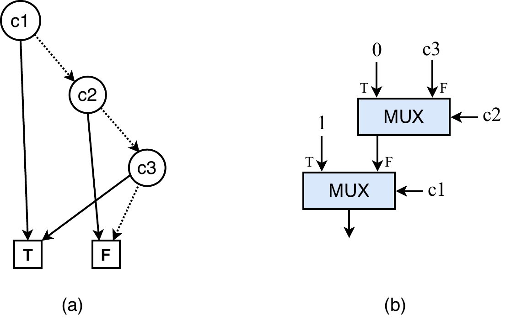

*Figure 5: What `bddToCircuit` produces. (a) A BDD over c1, c2, c3 (dashed = false edges, T/F terminals). (b) The lowered circuit. Each internal vertex becomes a Mux selected by its variable's condition token, and each terminal becomes a constant. The root variable ends up at the output mux because the variable order follows the blocks' topological order.*

### Token distribution

This stage is what makes the suppression circuit itself satisfy the token-matching invariants, and it is the reason the algorithm is more than "build a BDD."

**The problem.** A BDD-derived mux tree is generally **not read-once**. A BDD vertex can be reachable from the root along several distinct paths, so the same condition variable labels several mux inputs. A condition token, however, is produced *once* per execution of its block, and a MUX consumes a token on its selected input only. A token forked to a deselected input is left waiting and would be paired with a *later* execution's selection. The token-matching of the mux tree therefore requires the **read-once property**, meaning every variable labels at most one mux input. The Boolean is correct either way, but the token behavior is not.

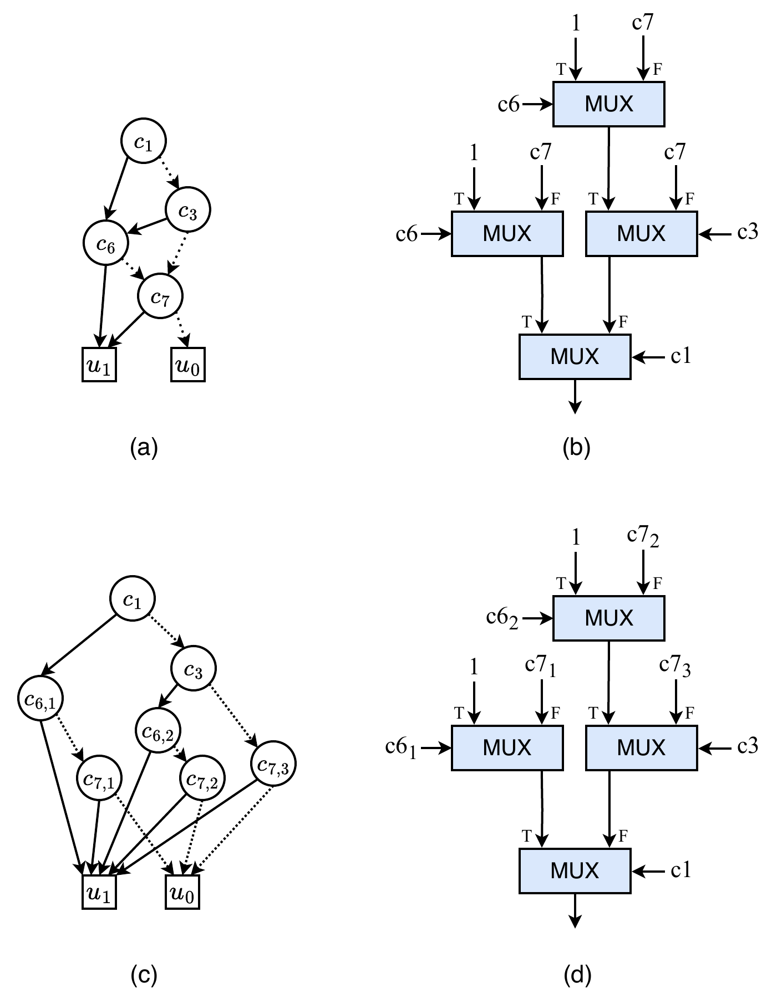

*Figure 6: The read-once problem and its fix, on the level-0 layer of Figure 4. (a) The ROBDD: vertex c6 is reachable from the root by two distinct paths and c7 by three. (b) The mux tree lowered directly from it: the single c6 token would have to drive two selects and c7 three. (c) The ROBDD after splitting: c6 becomes c6,1/c6,2 and c7 becomes c7,1 to c7,3, every vertex reachable by a unique path. (d) The resulting mux tree is read-once: each split copy drives exactly one select.*

**The fix** is to split each shared condition variable into per-path copies, produced by routing the original condition token down a branch tree that follows the control flow and dropping it on the sub-paths where no copy is needed. Three data structures carry the bookkeeping:

```cpp
// FtdSuppression.h
struct PathStep { std::string var; bool value; };   // one branch decision
using PathContext = std::vector<PathStep>;          // a path = the decisions taken

/// A request for the token of `varName` on the path `path`.
struct VariableRequirement { std::string varName; PathContext path; };

/// var → its available versions, each valid under a path context.
struct SignalRegistry {
  std::map<std::string, std::vector<std::pair<PathContext, Value>>> map;
  void  registerSignal(StringRef var, const PathContext &path, Value val);
  Value lookup(StringRef var, const PathContext &queryPath);  // longest-prefix match
};
```

`lookup` returns the registered version whose path is the **longest prefix** of the query path, which is the copy defined closest to the current control-flow context:

```cpp
// FtdSuppression.cpp — SignalRegistry::lookup (core)
for (auto &[regPath, val] : map[var]) {
  if (regPath.size() > queryPath.size()) continue;
  bool isPrefix = std::equal(regPath.begin(), regPath.end(), queryPath.begin());
  if (isPrefix && (!found || regPath.size() >= bestLen)) { bestLen = regPath.size(); best = val; }
}
```

An entry registered under the empty path `{}` is the global fallback, either the original signal or a demoted one (see [Token demotion across loop levels](#token-demotion-across-loop-levels)). A copy registered under `{c1:T}` beats it for any query starting with `{c1:T}`.

**`buildDistributionNetwork(builder, lcfg, bi, registry, ...)`** drives the stage in three phases:

1. **Collect requirements.** A DFS from `newProd` (with an on-stack set for cycle detection, stopping at `newCons`/`sinkBB`) accumulates, for every condition variable, the list of path contexts under which its token is consumed, one `VariableRequirement` per (variable, path). The path grows by `{var, true/false}` as the DFS takes a conditional edge.
2. **Topologically sort the variables** by their blocks' order (`bi.isLess`), so producers of earlier decisions are distributed before the variables whose routing depends on them.
3. **Register and split.** For each variable, look up a pre-registered version under `{}` (a demoted value may already be there). Otherwise fetch the original signal, channelify its type, and register it under `{}`. If the variable has **more than one** requirement, call `buildBranchTreeRecursive`. A variable needed on a single path needs no copies at all.

**`buildBranchTreeRecursive(currentVar, requirements, currentPath, registry, ...)`** builds the routing tree for one variable:

1. **Source.** `registry.lookup(currentVar, currentPath)` gives the signal version valid at this point of the tree.
2. **Split point.** Scan the requirement paths forward from `currentPath.size()` to the first depth where they disagree on a step's value; that step's variable is `splitVar`. If no divergence exists the requirements are compatible and nothing is built.
3. **Select signal.** `registry.lookup(splitVar, currentPath)`, falling back to the original signal. This is where the topological sort of phase 2 pays off, because `splitVar` was distributed before `currentVar`, so the correct copy is already registered.
4. **Context backfilling.** The scan may have skipped several common-prefix steps; they are appended to `currentPath` (taking any requirement as the template) so the recursion's path indices stay aligned with the requirement paths.
5. **Filter.** `generateReachabilityLogic` builds the condition under which the *remaining* sub-paths are invalid. For each requirement it ANDs the path-suffix literals from the split index on, ORs them into `f_valid`, and lowers `f_supp = ¬f_valid` through the same BDD machinery (its mux selects are themselves looked up through the registry, so previously split copies are reused). A suppression branch on this condition drops the select token where no copy is needed. In the IR **the false output carries on** (`suppBranch.getFalseResult()` is the filtered select).
6. **Split, register, recurse.** A `ConditionalBranchOp` splits the source token on the filtered select. The true result is registered under `currentPath + {splitVar, true}` and the false result under `currentPath + {splitVar, false}`, and the procedure recurses into each non-empty group.

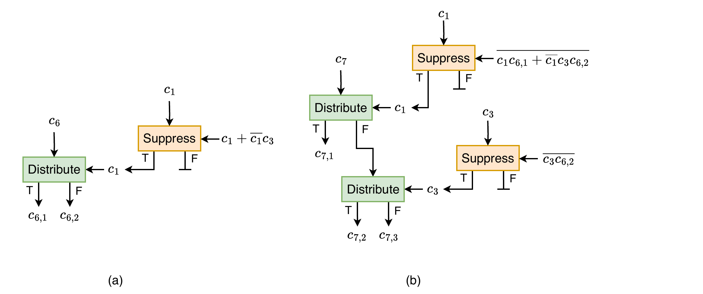

*Figure 7: The distribution circuits that produce the split copies of Figure 6 (Distribute and Suppress are both ConditionalBranchOps; Suppress sinks one output). (a) The two copies of c6: the c1 select token is first passed through a filter branch whose condition encodes whether the remaining sub-paths are valid, then splits the c6 stream into c6,1 and c6,2. (b) The three copies of c7: the filtered c1 token splits the c7 stream once, and the false side is split again by the filtered c3 token, yielding c7,1 to c7,3. Every select that feeds a Distribute is filtered first, which is exactly steps 5 and 6 of the recursion. (The figure draws the filter in consumption form; in the emitted IR the equivalent negated form is used and the false output continues.)*

When `bddToCircuit` later asks for a variable along some path, the longest-prefix lookup returns the copy produced for exactly that path, and the mux tree of Figure 6(d) is read-once by construction.

### Token demotion across loop levels

A condition variable defined inside a loop produces one token *per iteration*. A mux at an outer level needs a single representative token per loop *execution*. Before such a variable can be distributed at the outer level, the token counts must be reconciled, and that is demotion.

`CyclicDemotionHelper` packages the machinery so it can be reused by both the suppression driver and the loop-condition computation:

```cpp
// FtdSuppression.h
struct CyclicDemotionHelper {
  mlir::OpBuilder &builder;
  MLIRContext *ctx;
  const BlockIndexing &bi;
  CyclicGraphManager &cyclicMgr;             // source of loop scopes and layered CFGs
  DenseMap<Block *, Block *> &origToFullDG;  // original block → decision-graph block
  Location loc;
  Block *insertBlock;                        // block the emitted ops are tagged to
  DenseMap<Value, SmallVector<Backedge, 2>> *pendingMuxOperands;
  ShadowCFG *shadow;
  // One demoted value per (variable, target level): the same circuit is never built twice.
  std::map<std::pair<std::string, unsigned>, Value> demotionCache;

  unsigned getVarNativeLevel(const std::string &var);
  LoopScope *findScopeForBlock(Block *origIRBlock, unsigned level);
  Value demoteOneLevel(Value currentValue, Block *origBlock, unsigned fromLevel);
  Value getValueAtLevel(const std::string &var, unsigned targetLevel);
  void preRegisterDemotedValues(/* decision graph */, SignalRegistry &registry);
};
```

`getVarNativeLevel` maps a variable to its block (via `bi.getBlockFromCondition`), that block to its decision-graph clone (via `origToFullDG`), and reads the clone's nesting level from `cyclicMgr`. This is why the helper is constructed against the *full* decision graph, since nesting levels are a property of that graph, not of the original CFG slice. `findScopeForBlock` walks the scope tree for the scope at a given level that contains the block.

**`demoteOneLevel(value, block, fromLevel)`** lowers one value one level:

1. `findScopeForBlock(block, fromLevel)`, then `extractLayeredCFG(scope)`, which is the per-iteration question from [decomposing loops into acyclic layers](#decomposing-loops-into-acyclic-layers) for this loop.
2. Find the control dependence of the layer's `newCons` (the loop exit), the branches that decide whether control flows from *header → exit*.
3. Build a **level-local registry** for those dependence variables. Each one is resolved at the right level first. A variable native to `fromLevel` or shallower uses its original signal, while a variable from a *deeper* loop is itself demoted to `fromLevel` recursively (`getValueAtLevel`). Every resolved value is registered under the empty path.
4. Run `buildDistributionNetwork` on the layered CFG with that registry, evaluate the header→exit suppression condition, and gate `value` with a branch on it. **Only the token of the iteration that reaches the exit survives.**
5. When the value's anchor block is not the loop header itself, a header→anchor-block suppression condition is also computed and cascaded as an upstream filter on the gate's select (the same idea as `f_supDP` in [the driver `insertDirectSuppression`](#the-driver-insertdirectsuppression)), so the select pairs one-to-one with the value tokens. The surviving token is valid one level out.

```
getValueAtLevel(var, target):
    if cached (var, target): return it
    native ← getVarNativeLevel(var)
    if native ≤ target: return original signal of var
    v ← getValueAtLevel(var, native)              # = original at the native level
    for L = native down to target+1:
        v ← demoteOneLevel(v, block(var), L)
    cache and return v
```

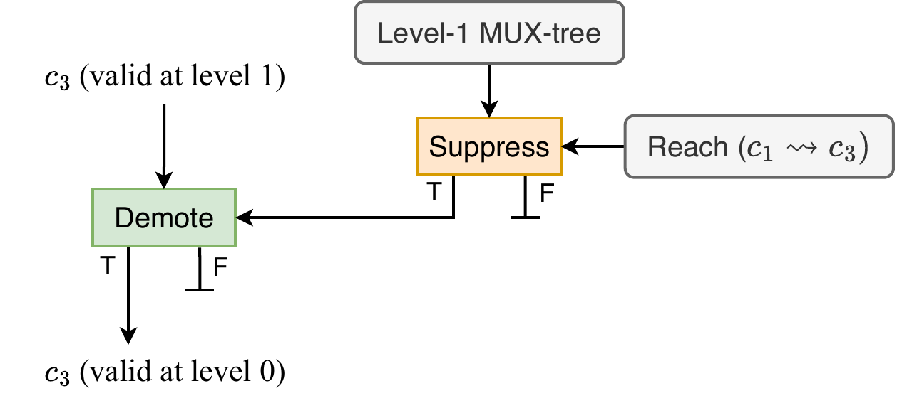

*Figure 8: One demotion step, drawn for c3 native to level 1. The header→exit reachability condition (Reach(c1 ⇝ c3)) is evaluated by the level-1 mux tree and gates a Suppress branch. Its surviving token drives the Demote branch, which lets through exactly one c3 token per loop execution, the one belonging to the exiting iteration. A per-iteration stream (valid at level 1) emerges as a per-execution stream (valid at level 0).*

`preRegisterDemotedValues(dg, registry)` runs before distribution at level 0. Every variable in the decision graph whose native level is deeper than 0 is demoted down to level 0 and the result is registered under the empty path, so the distribution phase finds it as the "original" to split.

Demotion and distribution are deliberately independent. Each level's ROBDD has its own root and path structure, so a copy split for one level's mux tree corresponds to no input of any other level's tree. Demotion must operate on the original per-block token, never on a split copy. At each level the block's token is conceptually forked. One copy enters that level's distribution, and the other is demoted and repeats the pattern one level down.

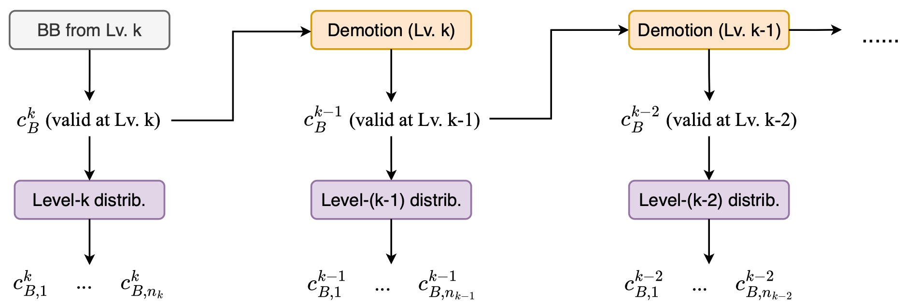

*Figure 9: The separation, for a condition variable c_B native to nesting level k. At each level the token is forked. One copy enters that level's distribution circuit, producing the split copies c_B,1…c_B,n for that level's mux tree, and the other copy is demoted and repeats one level down. Distribution never feeds demotion and vice versa.*

### The driver `insertDirectSuppression`

This function assembles every stage above for one producer value (`connection`) consumed by one operation (`consumer`), and emits the final circuit. Its overall shape:

```
insertDirectSuppression(consumer, connection):
    producerBlock, consumerBlock ← shadow blocks via handshake.bb
    targetBB ← producer's block
    if consumer is the header of a loop that contains the producer:
        targetBB ← the loop's first exit block            # getFirstLoopExitBBAttrIfHeaderConsumer
    if producer unreachable from entry: return

    deliverToGamma ← consumer is a MuxOp tagged FTD_EXPLICIT_GAMMA
                     and (producerBlock ≠ consumerBlock or producer is an explicit MU)

    # ---- choose the analysis start block ----
    dominatorBlock ← producerBlock
    if deliverToGamma:
        walk down the γ-mux chain (same-block FTD_EXPLICIT_GAMMA users):
            for each mux whose condition block reaches the producer on BOTH branches:
                keep the earliest such block (bi.isLess) — it dominates the rest
        dominatorBlock ← nearest common dominator of that block, the producer,
                         and every condition block in the producer→consumer
                         suppression expression                # collectSuppressionConditionBlocks

    # ---- build the graphs ----
    locGraph ← buildLocalCFGRegion(dominatorBlock, consumerBlock)
    deps ← control dependences of locGraph.newCons
    if deliverToGamma:
        walk the γ-mux chain again, over locGraph:
            condBlock ← original block of each mux's select   # returnMuxConditionBlock
            skip it if it lies above dominatorBlock
            deps += condBlock and its own control dependences
            muxConstraints[condBlock] ← select value that passes the producer's input
                                        # operand 1 = False input, operand 2 = True input
    if deps is empty or locGraph.newCons == locGraph.sinkBB:
        suppress unconditionally (always-true select); return

    fullDG ← buildDecisionGraph(locGraph, deps)               # unconstrained
    consDG ← buildDecisionGraph(locGraph, deps, muxConstraints)
    level-0 layers of both via CyclicGraphManager(fullDG)

    # ---- condition tokens, then the Boolean ----
    registry ← SignalRegistry
    CyclicDemotionHelper(...).preRegisterDemotedValues(level0Full, registry)
    buildDistributionNetwork(level0Full, registry)            # unconstrained: covers ALL paths
    f_cons ← enumeratePaths(level0Constrained); f_sup ← ¬f_cons
    if dominatorBlock ≠ producerBlock:
        f_supDP ← suppression condition of (dominatorBlock → producerBlock)   # own mini-pipeline

    # ---- loop filter: reconcile token counts when the producer is in a deeper loop ----
    supData ← connection
    if loopDepth(producerBlock) > loopDepth(dominatorBlock):
        if producerBlock is a decision-graph node:
            demoteBlock ← producerBlock
        else:
            pdNode ← nearest decision-graph node post-dominating producerBlock
            lfSup  ← suppression condition of (producerBlock → pdNode)   # filters deeper simple loops
            supData ← Branch(select = circuit(lfSup), data = supData).falseResult
            demoteBlock ← pdNode
        for lvl from demoteBlock's nesting level down to 1:
            supData ← demoteOneLevel(supData, demoteBlock, lvl)

    # ---- emit ----
    if f_sup ≠ 0:
        branchCond ← expressionToCircuit(f_sup, registry, ...)
        if f_supDP ≠ 0:
            branchCond ← Branch(select = circuit(f_supDP), data = branchCond).falseResult
        supData ← Branch(select = branchCond, data = supData).falseResult
    rewire the consumer's use of connection to supData
```

The pieces that deserve explanation:

**Placement** (`getFirstLoopExitBBAttrIfHeaderConsumer`). Suppression ops are tagged `handshake.bb = producer's block` by default. When the consumer is the *header of a loop that contains the producer*, which is the back-edge delivery of Figure 2(b), the circuitry conceptually belongs to the moment the loop decides to iterate, so it is tagged to the loop's first exit block instead (exits sorted by block order, the earliest taken).

**Conditional consumption.** Everything from [the local CFG](#the-local-cfg) through [token demotion](#token-demotion-across-loop-levels) silently relies on one fact. The producer dominates every block whose condition appears in the suppression expression, so a condition token is available whenever a producer token is. That fact follows from GSA *as long as the consumer consumes a token whenever its block is reached*. When the consumer is an input of a **γ-tree**, that assumption breaks. The consumer block can be reached and the mux still select a *different* input, so the producer no longer needs to dominate the consumer, and the suppression expression can involve condition blocks the producer does not dominate. A condition token could then arrive at the expression circuit with no matching producer token at the branch, which is a token-matching violation inside the suppression circuit itself.

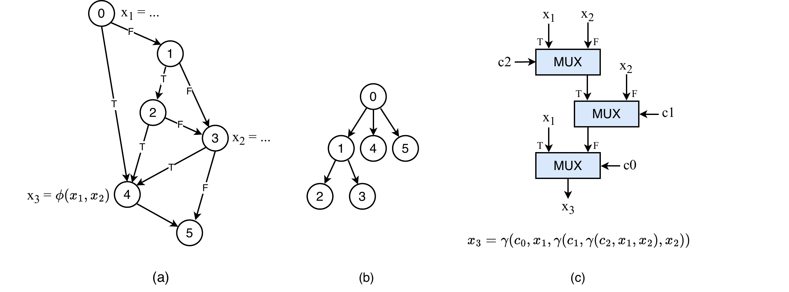

*Figure 10: The configuration that breaks the dominance assumption. (a) The CFG: x1 defined in block 0, x2 in block 3, x3 = φ(x1, x2) at block 4. (b) The dominator tree. (c) The γ-tree x3 = γ(c0, x1, γ(c1, γ(c2, x1, x2), x2)). Every input of the tree, including the selects, is a delivery. Consider delivering the select c2 from block 2 to block 4. Block 2 does not dominate block 4 (the path 0→4 bypasses it), and the suppression condition ¬c2·¬c3 involves c3 from block 3, which block 2 does not dominate either. The analysis therefore cannot start at the producer.*

The fix has two parts, both keyed on `deliverToGamma`:

- *Move the start of the analysis up.* The first chain walk descends the γ-muxes (following same-block `FTD_EXPLICIT_GAMMA` users of each mux's result; a user with *both* data inputs fed by the current mux is a temporary placeholder and is skipped). For each mux where the connection enters as a **data** input, the block defining the select is recovered with `returnMuxConditionBlock` (which traces the value backward through FTD-generated suppression branches to the `FTD_COND_VAR` placeholder and reads its `handshake.bb`), and it qualifies if both of its successors reach the producer along forward edges only (`isReachableAcyclic`, which skips edges going backward in block order). The earliest qualifying block dominates the rest. The nearest common dominator with the producer and with every condition block appearing in the plain producer→consumer suppression expression (computed by `collectSuppressionConditionBlocks`, a self-contained mini-pipeline that runs LocalCFG → decision graph → `enumeratePaths` → `f_sup` and returns the blocks behind `f_sup`'s variables) becomes `dominatorBlock`. By construction it dominates everything the expression will mention.
- *Encode the selects into the condition.* The second chain walk, over the freshly built `locGraph`, records for each mux which select value passes the producer's input (operand 1 is the **false** input, operand 2 the **true** input) into `muxConstraints`, and injects each select's block (plus that block's own control dependences) into the dependence set so path enumeration observes them. A select block lying *above* `dominatorBlock` is skipped, since it is outside the analyzed region. The constrained decision graph then wires the non-selecting branch of each such block to the sink (see [The decision graph](#the-decision-graph)), so `f_cons` automatically means "the consumer block is reached *and* every mux on the chain selects this input."

**Why two decision graphs.** Distribution must cover *all* paths, because every copy of every condition token must exist regardless of which paths end up delivering, so the network is built on the **unconstrained** level-0 graph. The Boolean, by contrast, must respect the constraints, so `enumeratePaths` runs on the **constrained** level-0 graph. The two graphs share variables, and the registry built on the former serves the circuit of the latter.

**The upstream filter `f_supDP`.** When `dominatorBlock` sits above the producer, the producer does not fire on every path that reaches the start block, so the main condition alone would emit suppression-select tokens for executions in which there is no producer token to suppress. `f_supDP` is the suppression condition of the `dominatorBlock → producerBlock` stretch, computed by its own LocalCFG → decision graph → `enumeratePaths` run. Crucially it filters the **suppression signal**, not the data. An intermediate branch takes `branchCond` as data and the `f_supDP` circuit as select, and its false result becomes the final select. It is identically zero when the start block *is* the producer.

**The loop filter and producer demotion.** When the producer is nested in a deeper loop than `dominatorBlock`, it fires several times per delivery and the main branch would see more data tokens than select tokens. The driver compares the producer's and the dominator's loop depths from `CFGLoopInfo` over the shadow region, and if the producer is deeper it reconciles the counts by demoting the producer's value to the dominator's level with the same `demoteOneLevel` machinery as [token demotion across loop levels](#token-demotion-across-loop-levels). Two cases arise. When the producer block is itself a node of the decision graph, its value is demoted level by level, anchored on the producer block. When it is not, the driver walks up the **post-dominator tree** from the producer to the nearest decision-graph node, runs a plain producer-to-that-node suppression to filter out the deeper simple loops in between (that filter branch is tagged to the producer's block, and its false output carries the surviving token), and then demotes the filtered value from that node. After the cascade the producer token is valid at the dominator-to-consumer level and pairs one-to-one with the main suppression branch.

**Emission.** All three conditions are realized with `expressionToCircuit` against the shared registry and composed with `ConditionalBranchOp`s, every op tagged `FTD_OP_TO_SKIP` and `handshake.bb = targetBB`:

```cpp
// FtdSuppression.cpp — emission (abridged)
Value branchCond = expressionToCircuit(builder, fSup, rank, producerIRBlock,
                                       registry, bi, nullptr, &shadow, targetBBAttr);
if (fSupDP->type != ExpressionType::Zero) {
  Value dpCond = expressionToCircuit(builder, fSupDP, rankDP, ...);
  auto dpBranchOp = builder.create<handshake::ConditionalBranchOp>(..., dpCond, branchCond);
  branchCond = dpBranchOp.getFalseResult();          // f_supDP filters the SUPPRESSION SIGNAL
}
auto branchOp = builder.create<handshake::ConditionalBranchOp>(..., branchCond, supData);
supData = branchOp.getFalseResult();                 // delivery happens on the FALSE output
```

A final micro-optimization applies when a mux consumes its *own select* as a data input. That input is only ever selected when the select has a known value, so the data input can be replaced by a constant. The degenerate cases short-circuit much earlier. An unreachable producer needs no suppression at all, and an empty dependence set or `newCons == sinkBB` (the consumer unreachable on every kept path) yields an unconditional, always-true suppression.

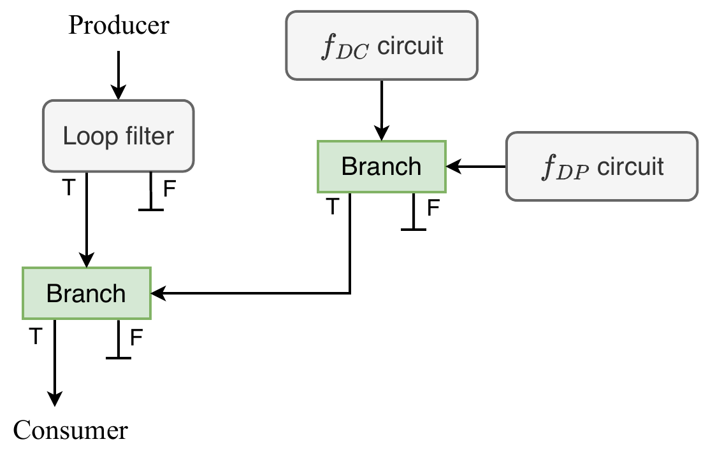

*Figure 11: The assembled circuit, drawn in consumption form. The dominator→consumer expression (f_DC = ¬f_sup) is filtered by the dominator→producer branch (f_DP) to discard activations where the producer never fired. The producer's token is filtered by the loop filter to keep only the final-iteration token, and the main branch joins the two filtered streams. In the emitted IR the equivalent negated form is used, where the select is the suppression condition and `getFalseResult()` is wired to the consumer, but the structure is identical.*

### Reuse for `computeLoopBackedgeCondition`

The select of a μ-gate and the select of a regeneration mux are both the loop's **back-edge condition**, the condition under which control re-enters the header through the back edge. It is the consumption condition of the self-loop from the header to its own second visit, with producer = consumer = the header. `computeLoopBackedgeCondition(builder, loopHeader, insertBlock, bi, pendingMuxOperands, shadow)` therefore runs the same pipeline with producer = consumer = the header, returning the condition `Value` directly (no final branch). Its steps are a compact summary of the whole machinery and are worth listing as they appear in the code:

1. `buildLocalCFGRegion(header, header)`, the self-loop graph, where `secondVisitBB` plays the consumer.
2. Control dependences of `newCons` on the raw graph.
3. A full decision graph for the `CyclicGraphManager`.
4. The `origToFullDG` map (original block → decision-graph block).
5. A `CyclicDemotionHelper` over it.
6. The acyclic decision graph.
7. `preRegisterDemotedValues` into a fresh `SignalRegistry`.
8. `buildDistributionNetwork` on the acyclic graph.
9. Control dependences on the acyclic graph.
10. `enumeratePaths` → expression → `expressionToCircuit` → the condition `Value`.
11. Erase all three temporary graphs.

## Regeneration

Regeneration handles the one delivery shape suppression does not, a producer outside a loop feeding a consumer inside it. After GSA conversion every use has a single reaching definition, so this is never a *missing* producer. It is a single token that must be available once per iteration.

`addRegen` walks producer-consumer pairs, and `addRegenOperandConsumer` handles one pair. It skips the same classes of operations as the suppression dispatch (memory ops, control merges, conditional-branch consumers, FTD-generated producers). The core:

```cpp
// FtdImplementation.cpp — one regeneration mux (abridged)
Value cond = computeLoopBackedgeCondition(builder, loop->getHeader(), ..., &shadow);
auto initOp = builder.create<handshake::InitOp>(loc, cond);     // first iter vs. later iters
auto muxOp  = builder.create<handshake::MuxOp>(loc, type, initOp.getResult(),
                                               {regeneratedValue, regeneratedValue});
muxOp->setOperand(2, muxOp->getResult(0));                      // feedback on the TRUE input
muxOp->setAttr(FTD_REGEN, builder.getUnitAttr());
muxOp->setAttr("handshake.bb", headerBBAttr);
```

`getLoopsConsNotInProd` returns the loops that contain the consumer but not the producer, **outermost first**. Each gets a regeneration mux. The select is the loop's back-edge condition wrapped in an `InitOp` (which emits the initial value once, then forwards the condition), the false input takes the incoming value, and the true input is rewired to the mux's own output, the feedback that replays the token each iteration until the loop exits. Multiple enclosing loops chain, outer feeding inner, and the consumer's operand is finally replaced with the innermost mux's result. One special case is when the innermost consumer is itself a loop merge (`NEW_PHI`), where the innermost level is skipped because the merge already replays the value.

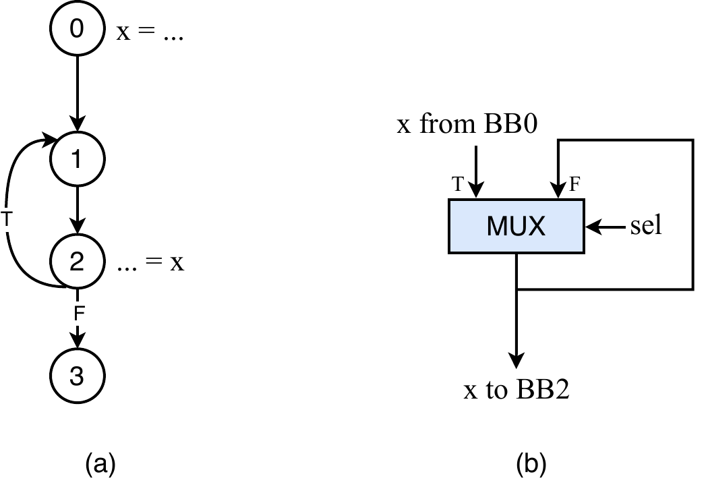

*Figure 12: Regeneration. (a) x is produced in block 0, outside the loop {1, 2}, and consumed in block 2 on every iteration. (b) The regeneration mux at the loop header: the external x token is selected on the first iteration, the feedback edge replays the mux's own output on later iterations, and the select is the loop's back-edge condition through an InitOp, which stops the replay when the loop exits.*

## GSA gate conversion

`addGsaGates` instantiates the gates of a Gated-SSA analysis as hardware. Two gate kinds exist:

- A **γ-gate** (a conditional choice, e.g. the join after an `if`/`else`) becomes a `MuxOp` tagged `FTD_EXPLICIT_GAMMA`. For a single condition the select is the condition placeholder. For a nested condition with several cofactors the select is a small mux tree built with `buildBDD` + `bddToCircuit`.
- A **μ-gate** (a loop-header merge) becomes an `InitOp` + `MuxOp` tagged `FTD_EXPLICIT_MU`. The select is `computeLoopBackedgeCondition` for the header, through the `InitOp` so the mux takes the initial value once and the loop value afterward.

```cpp
// FtdImplementation.cpp — gate select (abridged)
if (gate->gsaGateFunction == MuGate)
  conditionValue = computeLoopBackedgeCondition(rewriter, gate->getBlock(), ...);
else if (gate->cofactorList.size() > 1)
  conditionValue = bddToCircuit(rewriter, buildBDD(gate->condition, gate->cofactorList), ...);
else
  conditionValue = /* condition placeholder */;
```

Gate inputs that are themselves not-yet-built gates are filled with backedge placeholders and reconnected afterward (`missingGsaList`). Single-input γ-gates are built through a throwaway placeholder mux removed at the end. A final cleanup pass eliminates duplicate and degenerate muxes. The SSA helper feeding this conversion (`createPhiNetwork`, a standard dominance-frontier merge placement) leaves merges tagged `NEW_PHI`, which `replaceMergeToGSA` converts into gates through the same machinery.

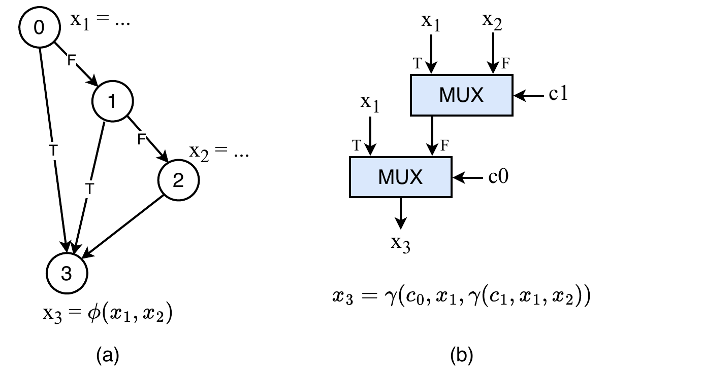

*Figure 13: A γ-gate. (a) x1 defined in block 0, x2 in block 2, x3 = φ(x1, x2) at block 3. Which definition reaches the merge depends on the branches of blocks 0 and 1. (b) The instantiated γ-tree x3 = γ(c0, x1, γ(c1, x1, x2)): one mux per deciding condition, each select a condition token.*

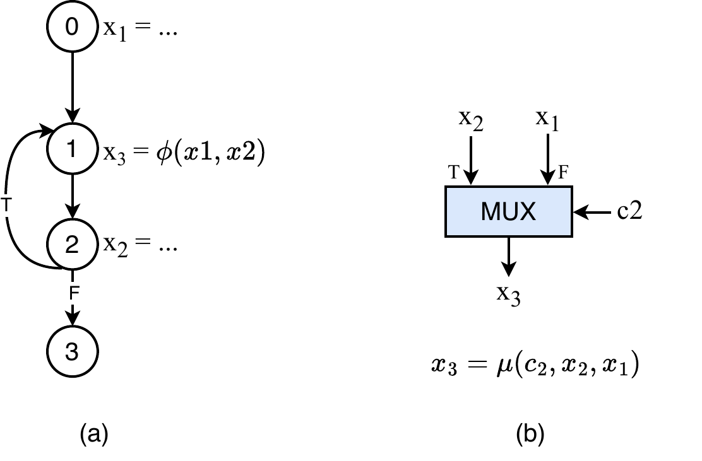

*Figure 14: A μ-gate. (a) x3 = φ(x1, x2) at the loop header merges the external definition x1 (block 0) with the loop-carried x2 (block 2). (b) The instantiated mux x3 = μ(c2, x2, x1): the select is the loop's back-edge condition c2, through an InitOp in the implementation, so the first token selects x1 and each later iteration selects x2.*

## Condition placeholders

The real condition wire of a block may not exist when the algorithm first needs it, and connecting it too early creates dangling backedges. FTD therefore works against stable stand-ins and substitutes the real signals once, at the end:

1. `createAllCondPlaceholders` puts a `SourceOp → ConstantOp` tagged `FTD_COND_VAR` (with the block's `handshake.bb`) in each conditional block. Anything needing "the condition of block N" connects here, including `returnMuxConditionBlock`, which identifies a select's block by finding this placeholder.
2. `resolveCondPlaceholders` replaces each placeholder with a tagged forwarding node fed by the real condition value from the shadow CFG's `conditionMap`.
3. `finalizeCondPlaceholders` short-circuits the forwarding nodes and erases them.

The net effect is that the whole algorithm runs against placeholders, decoupling the construction order from the order in which real condition values become available.

## Annotation attributes

FTD tags the IR to recognize its own operations and to drive block-level decisions.

| Constant | String | Meaning |
|---|---|---|
| `FTD_OP_TO_SKIP` | `ftd.skip` | operation generated by FTD; the dispatch filters and chain walks skip or trace through it |
| `FTD_EXPLICIT_GAMMA` | `ftd.GAMMA` | mux from a γ-gate; triggers conditional-consumption handling when it is a consumer |
| `FTD_EXPLICIT_MU` | `ftd.MU` | mux from a μ-gate |
| `FTD_REGEN` | `ftd.regen` | regeneration mux |
| `FTD_INIT_MERGE` | `ftd.imerge` | init merges and their initial constants |
| `FTD_COND_VAR` | `ftd.cvar` | condition-variable placeholder; the anchor `returnMuxConditionBlock` traces to |
| `NEW_PHI` | `nphi` | temporary merge from the SSA helper; later converted to a gate |
| `handshake.bb` | — | the block index an operation belongs to; placement, loop classification, and condition lookup all key off it |

## Maintenance notes

- **Temporary regions are scaffolding.** Local CFGs, decision graphs, and layered CFGs live in throwaway `func.func` regions, are built with a *separate* `OpBuilder` so the main builder never tracks them, and are erased with `containerOp->erase()` once consumed. Keep every allocation paired with its erase.
- **`handshake.bb` must be correct on every FTD-created op.** `setBBAttr` / `setBBAttrWithFallback` / `getBBIndexAttr` exist to keep it consistent. A wrong index silently corrupts placement and loop-depth decisions.
- **Preserve the local-CFG property** (see [The local CFG](#the-local-cfg), property 4). Reaching `newCons` means deliver, reaching `sinkBB` means discard. Most subtle suppression bugs trace back to violating it.
- **The branch convention is fixed.** Suppression and filter branches deliver on their false output and discard on their true output. Expect `getFalseResult()` wherever a surviving token is rewired. Figures drawn in consumption form are the same circuit with the select negated.
- **Read-once is the correctness criterion for the expression circuit.** If a change lets one condition variable drive two mux inputs on the same path, distribution has been bypassed and the token-matching invariants are violated at run time even though the Boolean is correct.
- **Distribution before constraints.** The network is always built on the unconstrained graph and the Boolean on the constrained one. Building the network on the constrained graph drops copies that other paths still need.
- **Irreducible loops** are handled by the residual-back-edge check in `extractLayeredCFG` (topological-order test), not by `CFGLoopInfo` alone.
