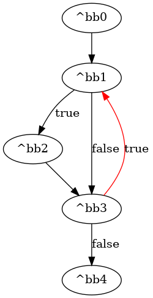
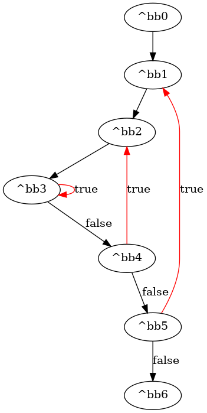

# GSA Analysis
## Introduction
In Static Single Assignment (SSA) form, every variable is assigned exactly once, and ϕ (phi) functions are introduced to merge values coming from different control flow paths. While SSA is powerful, it does not explicitly encode the control-flow decisions that determine which value is actually chosen at runtime.

**Gated Single Assignment (GSA)** was introduced as an extension of SSA to make these control-flow decisions explicit. Instead of a single generic ϕ merge, GSA introduces specialized gates:
- The **μ (mu) gate** appears at loop headers. It chooses between an initial value coming from outside the loop and a value produced inside the loop. The decision is driven by the loop’s condition: if the loop is starting, the initial value is used; if the loop is iterating, the loop value is used.
- The **γ (gamma) gate** replaces a ϕ at control-flow merges. It selects between a true value and a false value depending on a condition signal (like at the end of an if–else). In hardware, this becomes a multiplexer.

For Dynamatic’s **Fast Token Delivery (FTD)** algorithm, having the program represented in GSA form is required. The MLIR cf dialect already provides ϕ-gates in SSA form, but these must be translated into their GSA equivalents. During this translation, every block argument(pottential ϕ) in the control-flow is rewritten as either a μ or a γ gate.

### Example
Consider the following control-flow graph and its corresponding `cf_dyn_transformed.mlir` code.
- bb1 and bb3 both receive arguments from multiple predecessors. Implicit ϕ-gates are therefore placed in these blocks.

- The first argument of bb1 (%0) chooses between the initial value %c0 from bb0 and the loop-carried value %8 from bb3. This corresponds to a μ function.

- The second argument of bb1 (%1) is also updated inside the loop, so it too becomes a μ function.

- The argument of bb3 (%7) comes from two mutually exclusive control-flow paths (bb1 or bb2). This corresponds to a γ function.



```
module {
  func.func @if_loop_add(%arg0: memref<1000xf32> {handshake.arg_name = "a"}, %arg1: memref<1000xf32> {handshake.arg_name = "b"}) -> f32 {
    %c0 = arith.constant {handshake.name = "constant2"} 0 : index
    %cst = arith.constant {handshake.name = "constant3"} 0.000000e+00 : f32
    cf.br ^bb1(%c0, %cst : index, f32) {handshake.name = "br0"}
  ^bb1(%0: index, %1: f32):  // 2 preds: ^bb0, ^bb3
    %cst_0 = arith.constant {handshake.name = "constant4"} 0.000000e+00 : f32
    %2 = memref.load %arg0[%0] {handshake.mem_interface = #handshake.mem_interface<MC>, handshake.name = "load2"} : memref<1000xf32>
    %3 = memref.load %arg1[%0] {handshake.mem_interface = #handshake.mem_interface<MC>, handshake.name = "load3"} : memref<1000xf32>
    %4 = arith.subf %2, %3 {handshake.name = "subf0"} : f32
    %5 = arith.cmpf oge, %4, %cst_0 {handshake.name = "cmpf0"} : f32
    cf.cond_br %5, ^bb2, ^bb3(%1 : f32) {handshake.name = "cond_br0"}
  ^bb2:  // pred: ^bb1
    %6 = arith.addf %1, %4 {handshake.name = "addf0"} : f32
    cf.br ^bb3(%6 : f32) {handshake.name = "br1"}
  ^bb3(%7: f32):  // 2 preds: ^bb1, ^bb2
    %c1000 = arith.constant {handshake.name = "constant5"} 1000 : index
    %c1 = arith.constant {handshake.name = "constant6"} 1 : index
    %8 = arith.addi %0, %c1 {handshake.name = "addi0"} : index
    %9 = arith.cmpi ult, %8, %c1000 {handshake.name = "cmpi0"} : index
    cf.cond_br %9, ^bb1(%8, %7 : index, f32), ^bb4 {handshake.name = "cond_br1"}
  ^bb4:  // pred: ^bb3
    return {handshake.name = "return0"} %7 : f32
  }
}
```
### Translation Process
The conversion from SSA to GSA is done in three main steps:

1. Identify implicit ϕ gates introduced by SSA form.

2. Convert ϕ gates into μ gates

3. Convert remaining ϕ gates into γ gates.

## Identify Implicit ϕ Gates
In the `convertSSAToGSA` function, the first step is to convert all block arguments in the IR into ϕ gates, carefully extracting information about their producers and senders. Later, these ϕ gates are transformed into either γ or μ gates. In this section, we focus on the details of this first step.

Note: If there is only one block in the region being checked, nothing needs to be done since there is no possibility of multiple assignments.

In pseudo-code, the process looks like this:
```
For each block in the region:
  For each argument of the block:
    → treat this argument as a potential ϕ.

    For each predecessor of the block:
      Identify the branch terminator that jumps into the block.
      Extract the value passed to the argument.

      If the value is a block argument and its parent block has predecessors(so its parent is not bb0):
        → this value is itself the output of another ϕ.
        Record it as a “missing phi” to be connected later.
      Else:
        → the value is a plain input and can be added directly.

      In both cases, check if the value is already recorded:
        - `isBlockArgAlreadyPresent` checks block arguments.
        - `isValueAlreadyPresent` checks plain SSA values.

      If the value is new:
        - Wrap it in a `gateInput` structure.
        - If it is a missing phi:
            * Add it to `phisToConnect` (records phis that need reconnection later).
            * Add it to `operandsMissPhi` (helps `isBlockArgAlreadyPresent` detect duplicates).
        - Add the predecessor block to the `senders` list of this gate input.
        - Add the gate input to `gateInputList` (the global list of all gate inputs).
        - Add the gate input to `operands` (the inputs of the current ϕ).
    
    After all predecessors are processed:
      If `operands` is not empty (the ϕ has at least one input):
        → create the ϕ gate and associate it with the block.
```
After all ϕ gates are created, the final step is to connect the missing inputs recorded in phisToConnect. 

### What is a “missing phi”?
The input of a ϕ gate can itself be another ϕ. This happens when the input comes from a block argument of another block (excluding bb0). In this case, the ϕ input cannot be connected immediately. Instead, it is marked as missing and the necessary information is stored. After all ϕ gates are extracted, these missing inputs are revisited and the connections are reconstructed.

### `isBlockArgAlreadyPresent` and `isValueAlreadyPresent`
These helper functions prevent duplicate inputs from being recorded.

// TODO: explain their implementation details later.

### Why can a value appear multiple times?
// TODo

## Convert ϕ Gates into μ Gates

### Checks
A ϕ gate is classified as a μ gate if the following conditions hold:

1. It is inside a loop.

2. It has at least two operands.

3. It is located in the loop header.

### Input Grouping

Once a candidate μ is identified, its operands (inputs) are divided into two groups:

- **Loop inputs:** values produced inside the same loop as the ϕ.

- **Initial inputs:** values originating from outside the loop.

#### Notice: Inputs from Nested Loops
Blocks only report their innermost loop as the one they belong to. Because of this, inputs from nested loops might be mistakenly recognized as “initial inputs” instead of loop inputs.

*Example:* in the CFG below, an input value from block `bb3` may appear to belong to a different loop than the one containing `bb1` (the ϕ’s loop). To prevent this, the `IsBlockInLoop` function checks whether any parent loop of the input matches the ϕ’s loop.



### Creating μ Gates

A valid μ gate must have exactly two inputs: one from outside the loop and one from inside the loop. The grouping step above ensures we can identify these two roles.

- If either group is empty → the ϕ cannot be a μ.

- If a group has exactly one member → that value becomes the corresponding μ input (loop or initial).

- If a group has multiple members → an intermediate ϕ is created in the block to merge them. This extra ϕ will later be replaced by a γ (or tree of γs) during the ϕ to γ conversion phase.

### Condition of the μ Gate

The μ gate outputs its initial value during the first iteration of the loop. On subsequent iterations, if the loop continues (i.e., the exit condition is false), it selects the loop-generated value. When the loop finally exits, the initial input will be used again if the loop is re-entered.

Therefore, the condition of a μ gate is defined as the **negation of the loop exit condition**.

#### Note:
The `getLoopExitCondition` function computes the overall exit condition by OR-ing the conditions of all loop exiting blocks. This function relies on `getBlockLoopExitCondition`, which computes the exit condition for a single block.

## Convert ϕ Gates into γ Gates

All remaining ϕ gates (i.e., those not turned into μ gates) must be converted into γ gates.
However, a single γ gate is only a **two-input multiplexer**, while a ϕ can have multiple inputs.
To handle this, we build a tree of γ gates, each driven by a simple condition.
The following steps describe the process.

### Input Ordering
The inputs of a ϕ are sorted based on the dominance relationship between their originating basic blocks.

- If block Bi dominates block Bj, then the input from Bi is placed before Bj.

- This ordering does not affect the semantics of the ϕ (ϕ is order-less), but it simplifies later analysis.

### Step 2. Find Common Dominator

Find **the nearest common dominator** among all input blocks of the ϕ.
This block acts as the root for path exploration.

### Step 3. Path Identification

For each input operand:

- Find all paths from the common dominator to the ϕ’s block that **pass through the operand’s block** but **avoid later operand blocks**.

- Paths are explored using a modified DFS that:

  - finds all possible paths between two blocks,

  - avoids certain “blocked” nodes,

  - and allows a block to be revisited only if it is both the start and end (for loop cases).

**Operands from the same block:** 

If one block produces multiple values (operands) for the same ϕ, the DFS initially gives them identical paths.

To disambiguate, we filter the paths by the sender block (the block immediately before the ϕ in the path).
Only paths whose sender matches the operand’s recorded sender are kept.

### Step 4. Boolean Conditions

For each operand, compute a Boolean expression representing when that operand is chosen:

- The condition of a path = AND of all branch conditions along that path.

- The condition of an operand = OR of the conditions of all valid paths.

- The resulting Boolean expressions are minimized.

All Boolean conditions (cofactors) are collected and sorted by the index of their originating block.

### Step 5. Build the γ Tree

The `expandGammaTree` function takes a ϕ gate (with its inputs and Boolean conditions) and recursively builds a binary tree of γ gates.
Each γ is a two-input MUX driven by one simple Boolean condition.

The process works as follows:

**1. Pick a cofactor (condition):**

The function starts from the queue of cofactors (Boolean conditions associated with blocks). Since they are ordered by block index, the first cofactor we take is guaranteed to be common to all input expressions (because the blocks associated with it dominate the others). This ensures that splitting on this cofactor applies consistently across all inputs.

**2. Split expressions by condition:**

For each input expression (operand + condition):

- Restrict the Boolean expression once assuming the cofactor = `true`.

- Restrict it again assuming the cofactor = `false`.

- Add the non-zero result(s) to either `conditionsTrueExpressions` or `conditionsFalseExpressions`.

**3. Build γ inputs:**

Now we decide what should feed the true and false inputs of the γ gate being built:

- If a side has **more than one expression**, this means multiple operands could be selected under that branch of the condition. To resolve this, we recursively call `expandGammaTree` on that subset. The resulting γ gate from the recursion becomes the input of the current γ.

- If a side has `exactly one expression`, its operand is directly assigned as the input of the current γ.

- If a side has `no expressions`, it means this branch of the condition is never taken. In that case, an empty (null) input is created.

**4. Create the γ gate:**

A new γ is generated:

- Its inputs are the “true” and “false” operands from the step above.

- Its condition is the cofactor currently being expanded.

- Internally, its output is temporarily set to the original ϕ’s result (only the root γ of the tree will preserve this).

**5. Placement rule:**

Normally, new γ gates are placed in the **same block as the original ϕ**.

However, there is one special case: when the ϕ was introduced during `convertPhiToMu` to resolve multiple loop-carried inputs. These temporary ϕs (marked with muGenerated) cannot have their γ replacements placed in the loop header.

**Why is this a problem?**

When we later run direct path analysis for control dependencies, the control signal that drives such a γ is generated inside the loop body.
If we place the γ in the loop header:

- The γ would appear before its control signal producer.

- In the direct path search from the function entry (bb0) to the γ, we would never encounter the block that generates the control signal.


**The fix:**

For γs created from these muGenerated phis, we instead place them **in the same block as their condition producer**. 

### Step 6. Reconnect Uses

Once a ϕ is replaced by its γ tree:

- All gates that previously used the ϕ’s output are updated to use the root γ gate instead.


