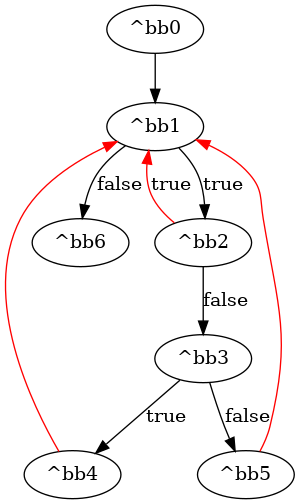
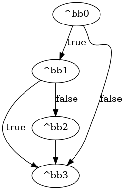

# GSA Analysis
## Introduction
In Static Single Assignment (SSA) form, every variable is assigned exactly once, and ϕ (phi) functions are introduced to merge values coming from different control flow paths. While SSA is powerful, it does not explicitly encode the control flow decisions that determine which value is actually chosen at runtime.

**Gated Single Assignment (GSA)** was introduced as an extension of SSA to make these control flow decisions explicit. Instead of a single generic ϕ merge, GSA introduces specialized gates:
- The **μ (mu) gate** appears at loop headers. It chooses between an initial value coming from outside the loop and a value produced inside the loop. The decision is driven by the loop’s condition: if the loop is starting, the initial value is used; if the loop is iterating, the loop value is used. In hardware, it is translated into a multiplexer, and its condition is driven through an INIT.
- The **γ (gamma) gate** appears at the confluence point of an if–else structure. It selects between a true value and a false value depending on a condition signal. In hardware, this maps to a multiplexer controlled by the block’s branching condition.

For Dynamatic’s **Fast Token Delivery (FTD)** algorithm, having the program represented in GSA form is required. The MLIR cf dialect already provides ϕ-gates in SSA form, but these must be translated into their GSA equivalents. During this translation, every block argument (i.e., potential ϕ) in the control flow is rewritten as either a μ or a γ gate.

### Example
Consider the following control flow graph and its corresponding `cf_dyn_transformed.mlir` code.
- bb1 and bb3 both receive arguments from multiple predecessors. Implicit ϕ-gates are therefore placed in these blocks.

- The first argument of bb1 (%0) chooses between the initial value %c0 from bb0 and the loop-carried value %8 from bb3. This corresponds to a μ function.

- The second argument of bb1 (%1) is also updated inside the loop, so it too becomes a μ function.

- The argument of bb3 (%7) comes from two mutually exclusive control flow paths (bb1 or bb2). This corresponds to a γ function.


```
module {
  func.func @if_loop_add(%arg0: memref<1000xf32> {handshake.arg_name = "a"}, %arg1: memref<1000xf32> {handshake.arg_name = "b"}) -> f32 {
    %c0 = arith.constant {handshake.name = "constant2"} 0 : index
    %cst = arith.constant {handshake.name = "constant3"} 0.000000e+00 : f32
    cf.br ^bb1(%c0, %cst : index, f32) {handshake.name = "br0"}
  ^bb1(%0: index, %1: f32):  // 2 preds: ^bb0, ^bb3
    %cst_0 = arith.constant {handshake.name = "constant4"} 0.000000e+00 : f32
    %2 = memref.load %arg0[%0] {handshake.mem_interface = #handshake.mem_interface<MC>, handshake.name = "load2"} : memref<1000xf32>
    %3 = memref.load %arg1[%0] {handshake.mem_interface = #handshake.mem_interface<MC>, handshake.name = "load3"} : memref<1000xf32>
    %4 = arith.subf %2, %3 {handshake.name = "subf0"} : f32
    %5 = arith.cmpf oge, %4, %cst_0 {handshake.name = "cmpf0"} : f32
    cf.cond_br %5, ^bb2, ^bb3(%1 : f32) {handshake.name = "cond_br0"}
  ^bb2:  // pred: ^bb1
    %6 = arith.addf %1, %4 {handshake.name = "addf0"} : f32
    cf.br ^bb3(%6 : f32) {handshake.name = "br1"}
  ^bb3(%7: f32):  // 2 preds: ^bb1, ^bb2
    %c1000 = arith.constant {handshake.name = "constant5"} 1000 : index
    %c1 = arith.constant {handshake.name = "constant6"} 1 : index
    %8 = arith.addi %0, %c1 {handshake.name = "addi0"} : index
    %9 = arith.cmpi ult, %8, %c1000 {handshake.name = "cmpi0"} : index
    cf.cond_br %9, ^bb1(%8, %7 : index, f32), ^bb4 {handshake.name = "cond_br1"}
  ^bb4:  // pred: ^bb3
    return {handshake.name = "return0"} %7 : f32
  }
}
```
### Translation Process
The conversion from SSA to GSA is done in three main steps:

1. Identify implicit ϕ gates introduced by SSA form.

2. Convert ϕ gates into μ gates

3. Convert remaining ϕ gates into γ gates.

## Identify Implicit ϕ Gates
In the `convertSSAToGSA` function, the first step is to convert all block arguments in the IR into ϕ gates, carefully extracting information about their producers and senders. Later, these ϕ gates are transformed into either γ or μ gates.

Before describing the conversion process, it is important to understand the data structures used to represent gates and their inputs.

### Gate and GateInput Structures

#### Gate Structure

A **Gate** represents a logical or control flow construct in the GSA form. Each gate encapsulates:

- The value it produces,

- The inputs it depends on,

- Its gate type (ϕ, γ, or μ),

- Control flow and predicate information,

- And a unique identity within the region.

Below is a simplified version of the Gate structure used in the implementation:
```
struct Gate {
  Value result;                          // Value produced by this gate
  SmallVector<GateInput *> operands;     // Inputs of this gate
  GateType gsaGateFunction;              // Type: PhiGate, GammaGate, or MuGate
  Block *conditionBlock;                 // Block driving the gate’s condition
  boolean::BoolExpression *condition;    // Boolean condition of the gate
  std::vector<std::string> cofactorList; // Condition cofactors
  Block *gateBlock;                      // Block where the gate is located
  bool muGenerated;                      // True if generated from MU expansion
  unsigned index;                        // Unique gate index
  bool isRoot;                           // True if it’s a root gate
};
```
##### Additional Details on Fields:
`conditionBlock`

This field identifies the block whose terminator provides the control predicate for the gate.

- For γ gates, it is the producer block of the condition that determines which input the γ selects.

- For μ gates, it refers to the producer of the unique loop exit condition (the condition that decides when the loop terminates).

- For ϕ gates and μ gates with multiple exits, this field is nullptr, as no single condition block drives their creation.


`condition`

A Boolean expression representing the logical condition associated with the gate.

- For γ gates, it corresponds directly to the predicate that decides which branch or input is selected.

- For μ gates, it is the negation of the loop exit condition, expressing the continuation of the loop.

- For ϕ gates, it is initialized to a constant `BoolZero()` (a neutral condition), since ϕ gates only merge data and are not controlled by predicates.

`cofactorList`

A list of string identifiers corresponding to condition cofactors.

These are useful when decomposing complex Boolean expressions into simpler components.

`gateBlock`

The block where this gate is logically placed.

In most cases, `gateBlock` coincides with the block containing the gate’s output value (`result`).

However, for γ gates generated during μ expansion, the gate is placed in the same block as its `conditionBlock`, following the placement rules described in [this section](#5-placement-rule).
This ensures that the γ is evaluated under the same control context as its condition.

`muGenerated`

A flag that indicates whether this gate was created during the `convertPhiToMu` phase, specifically to resolve multiple loop-input cases.

This flag later determines where the corresponding γ gates should be placed, as their `gateBlock` is adjusted according to the μ placement logic (see [Placement Rule section](#5-placement-rule) for details).

`isRoot`

Specifies whether the gate is the root of its gate tree.

- All μ gates are considered roots.

- Only the base γ in a γ-tree is marked as root.

- ϕ gates do not require root tracking; the field is 
initialized as false for them.

#### GateInput Structure

A `GateInput` represents a single input to a gate.
Each input can be:

- a `Value` which is result of an operation,

- output of another `Gate`, or

- empty (if not yet connected, e.g., a missing ϕ).

It also keeps track of all the **sender blocks** (i.e., CFG predecessors that forward this input to the gate).

This distinction between producers and senders is crucial:

- The producer is where the value (or gate result) is originally defined.

- The sender is the block whose terminator forwards that value to the gate. For control dependent analysis (like γ construction), predicates must be computed with respect to the sender blocks (check "[Operands from the same block](#operands-from-the-same-block)" for more information).

Structure Summary:
```
struct GateInput {
  std::variant<Value, Gate *> input;        // The actual input: IR value, gate, or empty.
  std::unordered_set<Block *> senders;      // CFG blocks forwarding this input.
};
```

---

With the `Gate` and `GateInput` structures defined, we can now outline how implicit ϕ gates are identified.

This process scans each block in the region, examines its block arguments, and creates corresponding ϕ gates by linking them to their incoming values and sender blocks.

Note: If there is only one block in the region being checked, nothing needs to be done since there is no possibility of multiple assignments.

In pseudo-code, the process looks like this:
```
For each block in the region:
  For each argument of the block:
    → treat this argument as a potential ϕ.

    For each predecessor of the block:
      Identify the branch terminator that jumps into the block.
      Extract the value passed to the argument.

      If the value is a block argument and its parent block has predecessors(so its parent is not bb0):
        → this value is itself the output of another ϕ.
        Record it as a “missing phi” to be connected later.
      Else:
        → the value is a plain input and can be added directly.

      In both cases, check if the value is already recorded:
        - `isBlockArgAlreadyPresent` checks block arguments.
        - `isValueAlreadyPresent` checks plain SSA values.

      If the value is new (i.e., the corresponding isAlreadyPresent check returns false):
        - Wrap it in a `gateInput` structure.
        - If it is a missing phi:
            * Add it to `phisToConnect` (records phis that need reconnection later).
            * Add it to `operandsMissPhi` (helps `isBlockArgAlreadyPresent` detect duplicates).
        - Add the predecessor block to the `senders` list of this gate input.
        - Add the gate input to `gateInputList` (the global list of all gate inputs).
        - Add the gate input to `operands` (the inputs of the current ϕ).
    
    After all predecessors are processed:
      If `operands` is not empty (the ϕ has at least one input):
        → create the ϕ gate and associate it with the block.
```
After all ϕ gates are created (i.e., all block arguments have been explored), we are guaranteed that every ϕ producing inputs for a missing ϕ has now been generated.

At this stage, all missing ϕs have been recorded, and their corresponding source ϕs exist.Therefore, the final step is to reconnect these missing ϕs to their proper sources.

The definition of a “missing ϕ” is explained next.

### What is a “missing phi”?
The input of a ϕ gate can itself be another ϕ. This happens when the input comes from a block argument of another block (excluding bb0). In this case, the ϕ input cannot be connected immediately. Instead, it is marked as missing and the necessary information is stored. After all ϕ gates are extracted, these missing inputs are revisited and the connections are reconstructed.

### `isBlockArgAlreadyPresent` and `isValueAlreadyPresent`

These two helper functions avoid recording duplicate inputs for a ϕ.

- `isValueAlreadyPresent`

  This one is straightforward: it directly checks if the same SSA value is already in the operand list (`operands`).

  If found, we don’t add it again; instead, we just update its sender list to record that this value can also arrive from the current predecessor (`pred`).

- `isBlockArgAlreadyPresent`

  Block arguments are trickier, because at this stage we may not have the actual value to compare.

  Instead, two block arguments are considered duplicates if:

  - they originate from the same argument position of the same block, and

  - they target the same argument position of the same block.

  If these conditions hold, we treat them as the same missing ϕ input. As with values, we don’t add a new entry; instead, we **update the sender list** of the existing one to include the current predecessor.

In both cases, the key idea is: a duplicate input means the same logical operand is reachable through multiple control flow edges, so we reuse the operand and just record the extra senders.

## Convert ϕ Gates into μ Gates

### Checks
A ϕ gate is classified as a μ gate if the following conditions hold:

1. It is inside a loop.

2. It has at least two operands.

3. It is located in the loop header.

### Input Grouping

Once a candidate μ is identified, its operands (inputs) are divided into two groups:

- **Loop inputs:** values produced inside the same loop as the ϕ.

- **Initial inputs:** values originating from outside the loop.

#### Notice: Inputs from Nested Loops
Blocks only report their innermost loop as the one they belong to. Because of this, inputs from nested loops might be mistakenly recognized as “initial inputs” instead of loop inputs.

*Example:* in the CFG below, an input value from block `bb3` may appear to belong to a different loop than the one containing `bb1` (the ϕ’s loop). To prevent this, the `IsBlockInLoop` function checks whether any parent loop of the input matches the ϕ’s loop.


### Creating μ Gates

A valid μ gate must have exactly two inputs: one from outside the loop and one from inside the loop. The grouping step above ensures we can identify these two roles.

- If either group is empty → the ϕ cannot be a μ.

- If a group has exactly one member → that value becomes the corresponding μ input (loop or initial).

- If a group has multiple members → an intermediate ϕ is created in the block to merge them. This extra ϕ will later be replaced by a γ (or tree of γs) during the ϕ to γ conversion phase.

### Condition of the μ Gate

The μ gate outputs its initial value during the first iteration of the loop. On subsequent iterations, if the loop continues (i.e., the exit condition is false), it selects the loop-generated value. When the loop finally exits, the initial input will be used again if the loop is re-entered.

Therefore, the condition of a μ gate is defined as the **negation of the loop exit condition**.

In the later stages in FTD implementation, the μ gate is replaced by a MUX.
Its condition comes from an INIT, implemented as a merge between a constant and the loop’s iterating condition (i.e., the negation of the loop exit condition mentioned above).

This design ensures that:

- During the first iteration of the first execution, the constant drives the selection, causing the initial value to be used.

- In subsequent loop iterations, the iterating condition (the negated loop exit) selects the loop-carried value.

- When the loop terminates and is later re-entered, the loop exit condition itself guarantees that the initial input is selected again (no constant is needed in later executions).

#### Note:
The `getLoopExitCondition` function computes the overall exit condition by OR-ing the conditions of all loop exiting blocks. This function relies on `getBlockLoopExitCondition`, which computes the exit condition for a single block.

This OR-ing occurs between operations that produce different token counts; therefore, it is implemented in the **FTDConversion** pass using **Shannon’s expansion**.

## Convert ϕ Gates into γ Gates

All remaining ϕ gates (i.e., those not turned into μ gates) must be converted into γ gates.
However, a single γ gate is only a **two-input multiplexer**, while a ϕ can have multiple inputs.
To handle this, we build a tree of γ gates, each driven by a simple condition.
The following steps describe the process.

### Step 1. Input Ordering
The inputs of a ϕ are sorted based on the dominance relationship between their originating basic blocks.

- If block Bi dominates block Bj, then the input from Bi is placed before Bj.

- This ordering does not affect the semantics of the ϕ (ϕ is order-less), but it simplifies later analysis.

### Step 2. Find Common Dominator

Find **the nearest common dominator** among all input blocks of the ϕ.

This block will be used as the root for path exploration in the next step.

### Step 3. Path Identification

For each input operand:

- Find all paths from the common dominator to the ϕ’s block that **pass through the operand’s block** but **avoid later operand blocks** that come later in the dominance order.

- Paths are explored through the `findAllPaths` function, which calls `dfsAllPaths` to:

  - finds all possible paths between two blocks,

  - avoids certain blocks,

  - and allows a block to be revisited only if it is both the start and end (for loop cases).

#### Operands from the same block: 

If one block produces multiple values (operands) for the same ϕ, the DFS initially gives them identical paths.

For example, in the cf_dyn_transformed.mlir snippet below, which corresponds to the shown CFG:

```
module {
  func.func @iterative_sqrt(%arg0: i32 {handshake.arg_name = "n"}) -> i32 {
    ...
    cf.br ^bb1(%arg0, %c0_i32, %true : i32, i32, i1) {handshake.name = "br0"}
  ^bb1(%0: i32, %1: i32, %2: i1):  // 4 preds: ^bb0, ^bb2, ^bb4, ^bb5
    ...
    cf.cond_br %4, ^bb2(%0, %1 : i32, i32), ^bb6 {handshake.name = "cond_br0"}
  ^bb2(%5: i32, %6: i32):  // pred: ^bb1
    ...
    %8 = arith.shrsi %7, %c1_i32 {handshake.name = "shrsi0"} : i32
    ...
    cf.cond_br %14, ^bb1(%8, %6, %15 : i32, i32, i1), ^bb3 {handshake.name = "cond_br1"}
  ^bb3:  // pred: ^bb2
    ...
    cf.cond_br %16, ^bb4, ^bb5 {handshake.name = "cond_br2"}
  ^bb4:  // pred: ^bb3
    ...
    cf.br ^bb1(%5, %17, %15 : i32, i32, i1) {handshake.name = "br1"}
  ^bb5:  // pred: ^bb3
    ...
    %18 = arith.addi %8, %c-1_i32 {handshake.name = "addi2"} : i32
    cf.br ^bb1(%18, %6, %15 : i32, i32, i1) {handshake.name = "br7"}
  ^bb6:  // pred: ^bb1
    return {handshake.name = "return0"} %0 : i32
  }
}

```


Blocks `bb0`, `bb2`, `bb4`, and `bb5` send values to argument 0 of bb1.
Notice that both `bb4` and `bb2` send values produced in `bb2` (`%5` and `%8` respectively).

When exploring paths, the DFS detects two possible routes from the producer `bb2` to the consumer `bb1`:
`{bb2, bb1}` and `{bb2, bb3, bb4, bb1}`.

However:

The sender of `%8` is `bb2`, so only `{bb2, bb1}` is a valid path.

The sender of `%5` is `bb4`, so only `{bb2, bb3, bb4, bb1}` is valid.

To disambiguate, we filter the paths by the sender block (the block immediately before the ϕ in the path).
Only paths whose sender matches the operand’s recorded sender are kept.

### Step 4. Boolean Conditions

For each operand, compute a Boolean expression representing when that operand is chosen:

- The condition of a path = AND of all branch conditions along that path.

- The condition of an operand = OR of the conditions of all valid paths.

- The resulting Boolean expressions are minimized.

All Boolean conditions (cofactors) are collected and sorted by the index of their originating block.

### Step 5. Build the γ Tree

The `expandGammaTree` function takes a ϕ gate (with its inputs and Boolean conditions) and recursively builds a binary tree of γ gates.
Each γ is a two-input MUX driven by one simple Boolean condition.

The process works as follows:

#### 1. Pick a cofactor (condition):

The function starts from the queue of cofactors (i.e., the Boolean conditions collected and sorted in the previous step). Since they are ordered by block index, the first cofactor we take is guaranteed to be common to all input expressions (because the blocks associated with it dominate the others). This ensures that splitting on this cofactor applies consistently across all inputs.

#### 2. Split expressions by condition:

For each input expression (operand + condition):

- Restrict the Boolean expression once assuming the cofactor = `true`.

- Restrict it again assuming the cofactor = `false`.

- Add the non-zero result(s) to either `conditionsTrueExpressions` or `conditionsFalseExpressions`.

#### 3. Build γ inputs:

Now we decide what should feed the true and false inputs of the γ gate being built:

- For each condition outcome (`conditionsTrueExpressions` or `conditionsFalseExpressions`), check how many expressions it contains.

- If it contains **more than one expression**, this means multiple operands could be selected under that branch of the condition. To resolve this, we recursively call `expandGammaTree` on that subset. The resulting γ gate from the recursion becomes the input of the current γ.

- If it contains `exactly one expression`, its operand is directly assigned as the input of the current γ.

- If it contains `no expressions`, that outcome of the condition is never taken, and an empty input is created.

#### 4. Create the γ gate:

A new γ is generated:

- Its inputs are the “true” and “false” operands from the step above.

- Its condition is the cofactor currently being expanded.

- Internally, its output is temporarily set to the original ϕ’s result. If the γ is not the root, this output will later become a “true” or “false” input of another γ, and the connection is updated when that parent γ is created.

#### 5. Placement rule:

Normally, new γ gates are placed in the **same block as the original ϕ**.

However, there is one special case: when the ϕ was introduced during `convertPhiToMu` to resolve multiple loop-carried inputs. These temporary ϕs (marked with muGenerated) cannot have their γ replacements placed in the loop header.

**Why is this a problem?**

When we later run direct path analysis for control dependencies, the control signal that drives such a γ is generated inside the loop body.
If we place the γ in the loop header:

- The γ would appear before its control signal producer.

- In the direct path search from the function entry (bb0) to the γ, we would never encounter the block that generates the control signal.


**The fix:**

For γs created from these muGenerated phis, we instead place them **in the same block as their condition producer**. 

### Step 6. Reconnect Uses

Once a ϕ is replaced by its γ tree:

- All gates that previously used the ϕ’s output are updated to use the root γ gate instead.

---
### Example:

To illustrate the conversion of a ϕ gate into a tree of γ gates, consider the following reduced MLIR function:
```
module {
  func.func @example(%arg0: memref<8xi32> {handshake.arg_name = "a"}) -> i32 {
    ...
    %c0_i32 = arith.constant {handshake.name = "constant2"} 0 : i32
    cf.cond_br %2, ^bb1, ^bb3(%c0_i32, %c2_i32 : i32, i32) {handshake.name = "cond_br0"}

  ^bb1:  // pred: ^bb0
    ...
    %c0_i32_0 = arith.constant {handshake.name = "constant10"} 0 : i32
    cf.cond_br %4, ^bb3(%c0_i32_0, %5 : i32, i32), ^bb2 {handshake.name = "cond_br1"}

  ^bb2:  // pred: ^bb1
    ...
    %9 = arith.select %8, %c5_i32_2, %c0_i32_3 {handshake.name = "select1"} : i32
    cf.br ^bb3(%9, %5 : i32, i32) {handshake.name = "br3"}

  ^bb3(%10: i32, %11: i32):  // 3 preds: ^bb0, ^bb1, ^bb2
    %12 = arith.addi %11, %10 {handshake.name = "addi0"} : i32
    return {handshake.name = "return0"} %12 : i32
  }
}
```
The corresponding control flow graph is shown below:



We will convert the ϕ in block bb3 (which merges values coming from bb0, bb1, and bb2) into an equivalent γ tree.

### Step 1. Input Ordering

The inputs from `bb0`, `bb1`, and `bb2` (namely `%c0_i32`, `%c0_i32_0`, and `%9`) are referred to as **x₀**, **x₁**, and **x₂**, respectively.  
After dominance-based ordering, we have:  
`x₀ (bb0)`, `x₁ (bb1)`, `x₂ (bb2)`.


### Step 2. Find Common Dominator

The nearest common dominator of all three input blocks is **bb0**.


### Step 3. Path Identification

For each input, all valid paths from the common dominator (`bb0`) to the ϕ’s block (`bb3`) are identified, while avoiding blocks corresponding to **later operand producers**:

- **x₀:** `{bb0, bb3}`  *(must not pass through `bb1` or `bb2`, which produce later operands)*  
- **x₁:** `{bb0, bb1, bb3}`  *(must not pass through `bb2`, the later operand producer)*  
- **x₂:** `{bb0, bb1, bb2, bb3}`  

Next, we filter paths by the **sender block** (the block immediately before the ϕ) to ensure correct operand assignment:

- `%c0_i32` (x₀) sender: `bb0` → path `{bb0, bb3}`  
- `%c0_i32_0` (x₁) sender: `bb1` → path `{bb0, bb1, bb3}`  
- `%9` (x₂) sender: `bb2` → path `{bb0, bb1, bb2, bb3}`


### Step 4. Boolean Conditions

Compute a Boolean expression for each operand:

- **x₀:** `!c0`  
- **x₁:** `c0 & c1`  
- **x₂:** `c0 & !c1`  

These expressions indicate under which conditions each input is selected.


### Step 5. Build the γ Tree

1. **Pick the first cofactor (c0):**  
   - Both x₁ and x₂ remain non-zero when `c0 = true` → more than one expression → recursive `expandGammaTree` call needed.  

2. **Second cofactor (c1) inside recursion:**  
   - x₁: non-zero for `c1 = true` → true input  
   - x₂: non-zero for `c1 = false` → false input  

   Resulting γ gate: `γ(c1, x2, x1)`  
   - Condition: c1  
   - True input: x1  
   - False input: x2  

3. **Top-level γ gate:**  `γ(c0, x0, γ(c1, x2, x1))`
   - Condition: c0  
   - True input: γ(c1, x2, x1) (from recursion)  
   - False input: x0  

This γ gate becomes the **root** of the tree.


### Step 6. Connect Uses

All uses of the original ϕ are updated to use the root γ gate instead.

