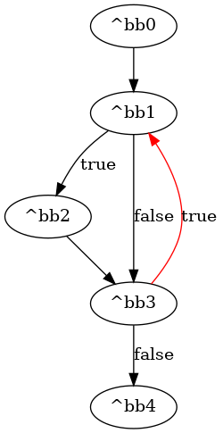
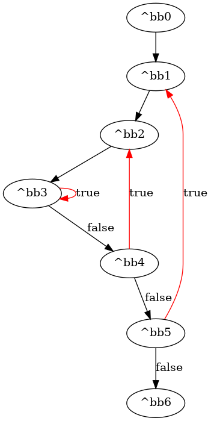
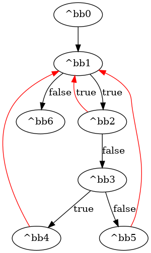
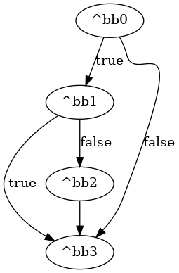

# GSA Analysis
## Introduction
In Static Single Assignment (SSA) form, every variable is assigned exactly once, and ϕ (phi) functions are introduced to merge values coming from different control flow paths. While SSA is powerful, it does not explicitly encode the control flow decisions that determine which value is actually chosen at runtime.

**Gated Single Assignment (GSA)** was introduced as an extension of SSA to make these control flow decisions explicit. Instead of a single generic ϕ merge, GSA introduces specialized gates:
- The **μ (mu) gate** appears at loop headers. It chooses between an initial value coming from outside the loop and a value produced inside the loop. The decision is driven by the loop’s condition: if the loop is starting, the initial value is used; if the loop is iterating, the loop value is used. In hardware, it is translated into a multiplexer whose select signal is driven through an INIT component. The INIT first emits an initial token, forcing the mux to select the outside-loop value for the first iteration, and then forwards the loop condition tokens for subsequent iterations.
- The **γ (gamma) gate** appears at the confluence point of an if–else structure. It selects between a true value and a false value depending on a condition signal. In hardware, this maps to a multiplexer controlled by the block’s branching condition.

This document focuses on the μ and γ gates implemented by Dynamatic’s GSA analysis.

For Dynamatic’s **Fast Token Delivery (FTD)** algorithm, having the program represented in GSA form is required. The MLIR `cf` dialect already encodes SSA behavior implicitly through block arguments: each predecessor branch passes values to the successor block arguments. These implicit ϕ gates must be translated into their GSA equivalents. During this translation, block arguments are first modeled as ϕ gates and then converted into μ or γ gates.

### Example
Consider the following control flow graph and its corresponding `cf_dyn_transformed.mlir` code.
- bb1 and bb3 both receive arguments from multiple predecessors. Implicit ϕ-gates are therefore placed in these blocks.

- The first argument of bb1 (%0) chooses between the initial value %c0 from bb0 and the loop-carried value %8 from bb3. This corresponds to a μ function.

- The second argument of bb1 (%1) is also updated inside the loop, so it too becomes a μ function.

- The argument of bb3 (%7) comes from two mutually exclusive control flow paths (bb1 or bb2). This corresponds to a γ function.



```
module {
  func.func @if_loop_add(%arg0: memref<1000xf32> {handshake.arg_name = "a"}, %arg1: memref<1000xf32> {handshake.arg_name = "b"}) -> f32 {
    %c0 = arith.constant {handshake.name = "constant2"} 0 : index
    %cst = arith.constant {handshake.name = "constant3"} 0.000000e+00 : f32
    cf.br ^bb1(%c0, %cst : index, f32) {handshake.name = "br0"}
  ^bb1(%0: index, %1: f32):  // 2 preds: ^bb0, ^bb3
    %cst_0 = arith.constant {handshake.name = "constant4"} 0.000000e+00 : f32
    %2 = memref.load %arg0[%0] {handshake.mem_interface = #handshake.mem_interface<MC>, handshake.name = "load2"} : memref<1000xf32>
    %3 = memref.load %arg1[%0] {handshake.mem_interface = #handshake.mem_interface<MC>, handshake.name = "load3"} : memref<1000xf32>
    %4 = arith.subf %2, %3 {handshake.name = "subf0"} : f32
    %5 = arith.cmpf oge, %4, %cst_0 {handshake.name = "cmpf0"} : f32
    cf.cond_br %5, ^bb2, ^bb3(%1 : f32) {handshake.name = "cond_br0"}
  ^bb2:  // pred: ^bb1
    %6 = arith.addf %1, %4 {handshake.name = "addf0"} : f32
    cf.br ^bb3(%6 : f32) {handshake.name = "br1"}
  ^bb3(%7: f32):  // 2 preds: ^bb1, ^bb2
    %c1000 = arith.constant {handshake.name = "constant5"} 1000 : index
    %c1 = arith.constant {handshake.name = "constant6"} 1 : index
    %8 = arith.addi %0, %c1 {handshake.name = "addi0"} : index
    %9 = arith.cmpi ult, %8, %c1000 {handshake.name = "cmpi0"} : index
    cf.cond_br %9, ^bb1(%8, %7 : index, f32), ^bb4 {handshake.name = "cond_br1"}
  ^bb4:  // pred: ^bb3
    return {handshake.name = "return0"} %7 : f32
  }
}
```
### Translation Process
The conversion from SSA to GSA is done in four main steps:

1. Identify implicit ϕ gates introduced by SSA form.

2. Convert eligible loop-header ϕ gates into μ gates.

3. Convert remaining ϕ gates into γ gates.

4. Remove remaining ϕ gates.

The following sections explain these steps in order.

## Identify Implicit ϕ Gates
In the `convertSSAToGSA` function, the first step is to convert all block arguments in the IR into ϕ gates, carefully extracting information about their producers and senders. Later, these ϕ gates are transformed into either γ or μ gates.

Before describing the conversion process, it is important to understand the data structures used to represent gates and their inputs.

### Gate and GateInput Structures

#### Gate Structure

A **Gate** represents a logical or control flow construct in the GSA form. Each gate encapsulates:

- The value it produces,

- The inputs it depends on,

- Its gate type (ϕ, γ, or μ),

- Control flow and predicate information,

- And a unique identity within the region.

Below is a simplified version of the Gate structure used in the implementation:
```
struct Gate {
  Value result;                          // Value produced by this gate
  SmallVector<GateInput *> operands;     // Inputs of this gate
  GateType gsaGateFunction;              // Type: PhiGate, GammaGate, or MuGate
  Block *conditionBlock;                 // Block driving the gate’s condition
  boolean::BoolExpression *condition;    // Boolean condition of the gate
  std::vector<std::string> cofactorList; // Condition cofactors
  Block *gateBlock;                      // Block where the gate is located
  unsigned index;                        // Unique gate index
  bool isRoot;                           // True if it’s a root gate
};
```
##### Additional Details on Fields:
`conditionBlock`

This field identifies the block whose terminator provides the control predicate for the gate.

- For γ gates, it is the producer block of the condition that determines which input the γ selects.

- For μ gates, it refers to the producer of the unique loop exit condition (the condition that decides when the loop terminates).

- For ϕ gates and μ gates with multiple exits, this field is nullptr, as no single condition block drives their creation.


`condition`

A Boolean expression representing the logical condition associated with the gate.

- For γ gates, it corresponds directly to the predicate that decides which branch or input is selected.

- For μ gates, it is the negation of the loop exit condition, expressing the continuation of the loop.

- For ϕ gates, it is initialized to a constant `BoolZero()` (a neutral condition), since ϕ gates only merge data and are not controlled by predicates.

`cofactorList`

A list of string identifiers corresponding to condition cofactors.

These are useful when decomposing complex Boolean expressions into simpler components.

`gateBlock`

The block where this gate is logically placed. In the current implementation, this is the block containing the gate’s output value (`result`).

`isRoot`

Specifies whether the gate is the root of its gate tree.

- All μ gates are considered roots.

- Only the base γ in a γ-tree is marked as root.

- ϕ gates do not require root tracking; the field is 
initialized as false for them.

#### GateInput Structure

A `GateInput` represents a single input to a gate.
Each input can be:

- a `Value` which is result of an operation,

- output of another `Gate`, or

- empty (if not yet connected, e.g., a missing ϕ).

It also keeps track of all the **sender blocks** (i.e., CFG predecessors that forward this input to the gate).

This distinction between producers and senders is crucial:

- The producer is where the value (or gate result) is originally defined.

- The sender is the block whose terminator forwards that value to the gate. For control dependent analysis (like γ construction), predicates must be computed with respect to the sender blocks (check "[Sender filtering for operands from the same block](#sender-filtering-for-operands-from-the-same-block)" for more information).


Structure Summary:
```
struct GateInput {
  std::variant<Value, Gate *> input;        // The actual input: IR value, gate, or empty.
  std::unordered_set<Block *> senders;      // CFG blocks forwarding this input.
};
```

---

With the `Gate` and `GateInput` structures defined, we can now outline how implicit ϕ gates are identified. This process scans each block in the region, examines its block arguments, and creates corresponding ϕ gates by linking them to their incoming values and sender blocks.

Note: If there is only one block in the region being checked, nothing needs to be done since there is no possibility of multiple assignments.

For each block argument, the analysis builds the operand list of one potential ϕ gate. During this scan:

- `gatesPerBlock` keeps the gates discovered for each block. Each new ϕ gate is inserted into the entry of the block that owns the block argument.

- `operands` contains the inputs collected for the ϕ currently being built.

- `coveredPredecessors` prevents the same predecessor block from being processed more than once for the same block argument.

- `gateInputList` stores every allocated `GateInput` so the analysis can deallocate them later.

### Missing ϕ Inputs

The input of a ϕ gate can itself be another ϕ. This happens when the input comes from a block argument of another block, excluding the entry block. In this case, the ϕ input cannot be connected immediately. Instead, it is marked as missing and the necessary information is stored. After all ϕ gates are extracted, these missing inputs are revisited and the connections are reconstructed.

Each missing ϕ input stores:

- `pi`: the temporary `GateInput` that must later point to the source ϕ.

- `blockArg`: the block argument whose corresponding ϕ should feed that input.

The missing input is recorded in two places:

- `phisToConnect`: the global list of missing ϕ inputs to reconnect after all block arguments have been scanned.

- `operandsMissPhi`: the missing ϕ inputs of the current ϕ, used to detect duplicate missing inputs while processing the same block argument.

In pseudo-code, the process is:
```
For each block in the region:
  Initialize an empty gate list in `gatesPerBlock`.

  For each argument of the block:
    Treat this argument as the result of a potential ϕ.
    Initialize empty `operands`, `operandsMissPhi`, and `coveredPredecessors`.

    For each predecessor of the block:
      Skip the predecessor if it was already processed.
      Identify the branch terminator that jumps into the block.
      Extract the value passed to the argument.

      If the value is a block argument and its parent block has predecessors (i.e., it is not the entry block):
        This value is the output of another ϕ.
        If this missing input is new:
          Create a temporary `GateInput`.
          Record it in `phisToConnect` and `operandsMissPhi`.
        Otherwise:
          Reuse the existing missing input.
      Else:
        This value is a direct SSA input.
        If this value input is new:
          Create a `GateInput` for the value.
        Otherwise:
          Reuse the existing value input.

      For the new or reused input:
        Add the predecessor block to its `senders` set.
      For a newly created input:
        Add the input to `gateInputList`.
        Add the input to `operands`.
    
    After all predecessors are processed:
      If `operands` is not empty (the ϕ has at least one input):
        Create the ϕ gate and insert it into `gatesPerBlock`.
```
After all ϕ gates are extracted, the analysis revisits the missing inputs recorded in `phisToConnect`. For each missing input, it looks up the ϕ gate associated with the recorded block argument and updates the temporary `GateInput` to point to that gate.

### `isBlockArgAlreadyPresent` and `isValueAlreadyPresent`

These two helper functions avoid recording the same ϕ input more than once.

- `isValueAlreadyPresent`

  This helper is used for direct SSA values. It checks whether the same value is already present in the current `operands` list.

  If the value is already present, the analysis reuses the existing `GateInput` and adds the current predecessor (`pred`) to its `senders` set.

- `isBlockArgAlreadyPresent`

  This helper is used for missing ϕ inputs. Since the input has not yet been connected to its source ϕ gate, the analysis compares the recorded block argument instead.

  Two missing ϕ inputs are considered the same if they refer to the same block argument: same parent block and same argument number.

  If the block argument is already present, the analysis reuses the existing temporary `GateInput` and adds the current predecessor (`pred`) to its `senders` set.

In both cases, the purpose is the same: if the same logical input reaches the ϕ through multiple CFG predecessors, the analysis keeps one `GateInput` and records all of those predecessors as senders.

## Convert ϕ Gates into μ Gates

### Identifying μ Candidates
A ϕ gate is classified as a μ gate if the following conditions hold:

1. It is inside a loop.

2. It has at least two operands.

3. It is located in the loop header.

### Grouping Initial and Loop Inputs

Once a candidate μ is identified, its operands (inputs) are divided into two groups:

- **Loop inputs:** values produced inside the same loop as the ϕ.

- **Initial inputs:** values originating from outside the loop.

#### Notice: Inputs from Nested Loops
`CFGLoopInfo::getLoopFor(block)` returns the innermost loop containing a block. Because of this, inputs from nested loops might be mistakenly recognized as “initial inputs” instead of loop inputs if only the innermost loop is checked.

*Example:* in the CFG below, an input value from block `bb3` may appear to belong to a different loop than the one containing `bb1` (the ϕ’s loop). To prevent this, the `IsBlockInLoop` function checks whether any parent loop of the input matches the ϕ’s loop.



### Updating the ϕ into a μ

A valid μ gate must have exactly two inputs: one from outside the loop and one from inside the loop. The grouping step above ensures we can identify these two roles.

- If either group is empty → the ϕ cannot be a μ.

- If a group has exactly one member → that value becomes the corresponding μ input (loop or initial).

- If a group has multiple members → an intermediate ϕ is created in the block to merge them, and the output of this generated ϕ becomes the corresponding μ input. This extra ϕ will later be replaced by a γ (or tree of γs) during the ϕ to γ conversion phase.

The implementation does not create a new μ gate. Instead, it updates the original ϕ gate in place by changing its type to μ and replacing its operands with exactly two inputs: the initial input first, then the loop-carried input.

### Condition of the μ Gate

The μ gate outputs its initial value during the first iteration of the loop. On subsequent iterations, if the loop continues (i.e., the exit condition is false), it selects the loop-generated value. When the loop finally exits, the initial input will be used again if the loop is re-entered.

Therefore, the condition of a μ gate is defined as the **negation of the loop exit condition**.

Later, during FTD implementation, the μ gate is lowered to a MUX whose select signal is produced by an INIT. The INIT first emits an initial token, forcing the MUX to select the initial input. After this first token, it forwards the loop condition, so the MUX selects either the initial input or the loop-carried input depending on whether the loop exits or continues.

This INIT behavior used to be implemented with a merge between a constant and the loop’s iterating condition. This has now been replaced by a dedicated handshake.init, which behaves as a one-entry buffer preloaded with an initial token.
<!--TODO: check with aya INIT implemntation -->

#### Note:
The `getLoopExitCondition` function computes the overall exit condition by OR-ing the conditions of all loop exiting blocks. This function relies on `getBlockLoopExitCondition`, which computes the exit condition for a single block.

Eventually, this OR-ing is between operations that produce different token counts; therefore, it gets implemented in the **FTDConversion** pass using **Shannon's expansion**.
<!--TODO: check with aya if it is still the case-->

## Convert ϕ Gates into γ Gates

All remaining ϕ gates (i.e., those not turned into μ gates) must be converted into γ gates.
However, a single γ gate is only a **two-input multiplexer**, while a ϕ can have multiple inputs.
To handle this, we build a tree of γ gates, each driven by a simple condition.
The following steps describe the process.

### Step 1. Input Ordering
The inputs of a ϕ are sorted based on the dominance relationship between their originating basic blocks.

- If block Bi dominates block Bj, then the input from Bi is placed before Bj.

- This ordering does not affect the semantics of the ϕ (ϕ is order-less), but it simplifies later analysis.

### Step 2. Find Common Dominator

Find **the nearest common dominator** among all input blocks of the ϕ.

This block will be used as the root for path exploration in the next step.

### Step 3. Path Identification

For each input operand:

- Find all paths from the common dominator (`start`) to the ϕ’s block (`end`) that pass through the operand’s producer block (`blockToTraverse`). While doing this, avoid the producer blocks of operands that appear later in the dominance-based ordering.


- Paths are explored through `findAllPaths`, which calls `dfsAllPaths` to:

  - find all possible paths between `start` and `end`,
  - keep only paths that pass through `blockToTraverse`,
  - avoid later operand producer blocks,
  - allow a block to be revisited only if it is both the `start` and `end` (for loop cases).


#### Sender filtering for operands from the same block

If multiple operands of the same ϕ are produced in the same block, path search initially gives them the same candidate paths.

This is the case where producer and sender must be distinguished. The producer block tells us where the value was defined, but the sender block tells us which CFG predecessor actually passed that value to the ϕ. During path search, `operand->getBlock()` returns the producer block, so two operands produced in the same block can initially receive the same candidate paths. The `senders` set then filters these paths by requiring the block immediately before the ϕ block to be one of the recorded senders for that operand.

For example, in the cf_dyn_transformed.mlir snippet below, which corresponds to the shown CFG:

```
module {
  func.func @iterative_sqrt(%arg0: i32 {handshake.arg_name = "n"}) -> i32 {
    ...
    cf.br ^bb1(%arg0, %c0_i32, %true : i32, i32, i1) {handshake.name = "br0"}
  ^bb1(%0: i32, %1: i32, %2: i1):  // 4 preds: ^bb0, ^bb2, ^bb4, ^bb5
    ...
    cf.cond_br %4, ^bb2(%0, %1 : i32, i32), ^bb6 {handshake.name = "cond_br0"}
  ^bb2(%5: i32, %6: i32):  // pred: ^bb1
    ...
    %8 = arith.shrsi %7, %c1_i32 {handshake.name = "shrsi0"} : i32
    ...
    cf.cond_br %14, ^bb1(%8, %6, %15 : i32, i32, i1), ^bb3 {handshake.name = "cond_br1"}
  ^bb3:  // pred: ^bb2
    ...
    cf.cond_br %16, ^bb4, ^bb5 {handshake.name = "cond_br2"}
  ^bb4:  // pred: ^bb3
    ...
    cf.br ^bb1(%5, %17, %15 : i32, i32, i1) {handshake.name = "br1"}
  ^bb5:  // pred: ^bb3
    ...
    %18 = arith.addi %8, %c-1_i32 {handshake.name = "addi2"} : i32
    cf.br ^bb1(%18, %6, %15 : i32, i32, i1) {handshake.name = "br7"}
  ^bb6:  // pred: ^bb1
    return {handshake.name = "return0"} %0 : i32
  }
}

```


Blocks `bb0`, `bb2`, `bb4`, and `bb5` send values to argument 0 of `bb1`.
Notice that `%5` and `%8` are both produced in `bb2`, but they are forwarded to `bb1` by different senders: `%8` is sent by `bb2`, while `%5` is sent by `bb4`.

When exploring paths, the DFS detects two possible routes from the producer `bb2` to the consumer `bb1`:
`{bb2, bb1}` and `{bb2, bb3, bb4, bb1}`.

Without sender filtering, both `%5` and `%8` would be associated with both paths, because both operands have producer block `bb2`.

The sender information disambiguates the two operands:

- The sender of `%8` is `bb2`, so only `{bb2, bb1}` is a valid path.

- The sender of `%5` is `bb4`, so only `{bb2, bb3, bb4, bb1}` is valid.

The implementation therefore filters paths by the sender block (the block immediately before the ϕ in the path).
Only paths whose sender matches the operand’s recorded sender are kept.

### Step 4. Boolean Conditions

For each ϕ operand, the analysis computes a Boolean expression that describes when that operand is selected.

The computation uses three related concepts:

- **Path condition:** the Boolean condition for one CFG path. It is the AND of the branch decisions along that path. For example, taking the true branch of `c0` and the false branch of `c1` gives `c0 & !c1`.

- **Operand expression:** the Boolean expression for one ϕ operand. It is the OR of the path conditions of all valid paths leading to that operand.

- **Cofactor:** a single condition variable, such as `c0` or `c1`, associated with a conditional block. Cofactors are later used by `expandGammaTree` to split the operand expressions and build γ gates.

For each operand:

1. Compute the path condition of each valid path using `getPathExpression`.

2. OR all path conditions together to obtain the operand expression.

3. Minimize the resulting expression.

While computing path expressions, the analysis also records which conditional blocks appear on the valid paths. It stores their block indices in `blocksWithConditionInPath`. These indices are then sorted and converted into the cofactor order used by `expandGammaTree`.

### Step 5. Build the γ Tree

The `expandGammaTree` function takes the operand expressions computed in the previous step and recursively builds a binary tree of γ gates.
Each γ is a two-input MUX driven by one cofactor, such as `c0` or `c1`.

The process works as follows:

#### 1. Pick a cofactor

The function starts from the queue of cofactors, which were collected from the paths and sorted by block index in the previous step. Because of this ordering, the first cofactor selected for expansion is guaranteed to be common to all current operand expressions. This ensures that splitting on the selected cofactor applies consistently across all current inputs.

#### 2. Split operand expressions by the selected cofactor

For each operand expression:

- Restrict the expression assuming the cofactor is `true`.

- Restrict the expression again assuming the cofactor is `false`.

- Add each non-zero restricted expression to either `conditionsTrueExpressions` or `conditionsFalseExpressions`.

#### 3. Build γ inputs:

Now we decide what should feed the true and false inputs of the γ gate being built. In the implementation, the false side feeds input `0` of the corresponding γ gate, and the true side feeds input `1`.

- For each condition outcome (`conditionsTrueExpressions` or `conditionsFalseExpressions`), check how many operand expressions it contains.

- If it contains **more than one operand expression**, multiple operands can still be selected under that branch of the condition. To resolve this, recursively call `expandGammaTree` on that subset. The resulting γ gate becomes the input of the current γ.

- If it contains **exactly one operand expression**, its operand is directly assigned as the input of the current γ.

- If it contains **no operand expressions**, that outcome of the condition is never taken, and an empty input is created.

#### 4. Create the γ gate:

A new γ gate is generated:

- Its input `0` is the false-side input, and its input `1` is the true-side input.

- Its condition is the cofactor currently being expanded.

- The γ gate is inserted in the same block as the original ϕ.

- Internally, its output is temporarily set to the original ϕ’s result. If the γ is not the root, this output will later become a “true” or “false” input of another γ, and the connection is updated when that parent γ is created.

### Step 6. Reconnect Uses

Once a ϕ is replaced by its γ tree, all GSA gates that previously used the ϕ’s output are updated to use the root γ gate instead.

---
### Example:

To illustrate the conversion of a ϕ gate into a tree of γ gates, consider the following reduced MLIR function:
```
module {
  func.func @example(%arg0: memref<8xi32> {handshake.arg_name = "a"}) -> i32 {
    ...
    %c0_i32 = arith.constant {handshake.name = "constant2"} 0 : i32
    cf.cond_br %2, ^bb1, ^bb3(%c0_i32, %c2_i32 : i32, i32) {handshake.name = "cond_br0"}

  ^bb1:  // pred: ^bb0
    ...
    %c0_i32_0 = arith.constant {handshake.name = "constant10"} 0 : i32
    cf.cond_br %4, ^bb3(%c0_i32_0, %5 : i32, i32), ^bb2 {handshake.name = "cond_br1"}

  ^bb2:  // pred: ^bb1
    ...
    %9 = arith.select %8, %c5_i32_2, %c0_i32_3 {handshake.name = "select1"} : i32
    cf.br ^bb3(%9, %5 : i32, i32) {handshake.name = "br3"}

  ^bb3(%10: i32, %11: i32):  // 3 preds: ^bb0, ^bb1, ^bb2
    %12 = arith.addi %11, %10 {handshake.name = "addi0"} : i32
    return {handshake.name = "return0"} %12 : i32
  }
}
```
The corresponding control flow graph is shown below:



We will convert the ϕ in block bb3 (which merges values coming from bb0, bb1, and bb2) into an equivalent γ tree.

### Step 1. Input Ordering

For the first argument of `bb3`, the incoming values from `bb0`, `bb1`, and `bb2` are `%c0_i32`, `%c0_i32_0`, and `%9`. We refer to them as **x₀**, **x₁**, and **x₂**, respectively.

After dominance-based ordering, the operands are:
`x₀ (bb0)`, `x₁ (bb1)`, `x₂ (bb2)`.


### Step 2. Find Common Dominator

The nearest common dominator of all three input blocks is **bb0**. Therefore, path exploration starts from `bb0`.


### Step 3. Path Identification

For each input, all valid paths from the common dominator (`bb0`) to the ϕ’s block (`bb3`) are identified, while avoiding blocks corresponding to **later operand producers**:

- **x₀:** search from `bb0` to `bb3`, passing through `bb0`, while avoiding `bb1` and `bb2`.
  The only valid path is `{bb0, bb3}`. Other paths such as `{bb0, bb1, bb3}` and `{bb0, bb1, bb2, bb3}` are rejected because they pass through later operand producer blocks.

- **x₁:** search from `bb0` to `bb3`, passing through `bb1`, while avoiding `bb2`.
  The only valid path is `{bb0, bb1, bb3}`.

- **x₂:** search from `bb0` to `bb3`, passing through `bb2`, with no later operand producer blocks to avoid.
  The valid path is `{bb0, bb1, bb2, bb3}`.

In this example, sender filtering keeps the same paths because each operand has a different producer block and sender block. The recorded sender of each input matches the block immediately before `bb3` in its selected path:

| Operand | Sender | Selected path |
| --- | --- | --- |
| `%c0_i32` (**x₀**) | `bb0` | `{bb0, bb3}` |
| `%c0_i32_0` (**x₁**) | `bb1` | `{bb0, bb1, bb3}` |
| `%9` (**x₂**) | `bb2` | `{bb0, bb1, bb2, bb3}` |


### Step 4. Boolean Conditions

Compute a Boolean expression for each operand:

- **x₀:** `!c0`  
- **x₁:** `c0 & c1`  
- **x₂:** `c0 & !c1`  

These expressions indicate under which conditions each input is selected.


### Step 5. Build the γ Tree

1. **Pick the first cofactor (c0):**  
   - Both x₁ and x₂ remain non-zero when `c0 = true` → more than one expression → recursive `expandGammaTree` call needed.  

2. **Second cofactor (c1) inside recursion:**  
   - x₁: non-zero for `c1 = true` → true input  
   - x₂: non-zero for `c1 = false` → false input  

   Resulting γ gate: `γ(c1, x2, x1)`  
   - Condition: c1  
   - True input: x1  
   - False input: x2  

3. **Top-level γ gate:**  `γ(c0, x0, γ(c1, x2, x1))`
   - Condition: c0  
   - True input: γ(c1, x2, x1) (from recursion)  
   - False input: x0  

This γ gate becomes the **root** of the tree.


### Step 6. Reconnect Uses

In this example, no other GSA gate uses the original ϕ, so no reconnection is needed. In general, any GSA gate that used the original ϕ is updated to use the root γ gate instead.

## Remove Remaining ϕ Gates

After all μ and γ gates are generated, the remaining ϕ gates are no longer needed. At this point, every remaining ϕ has already been represented by a γ tree, and any GSA gate that used the original ϕ has been reconnected to the corresponding γ root. The analysis then calls `removePhiGates()` to remove the leftover ϕ gates from `gatesPerBlock`.
