# Group Allocator

This document explains how groups are allocated to the Load-Store Queue (LSQ) in a dataflow circuit.


## 1. Overview and Purpose  

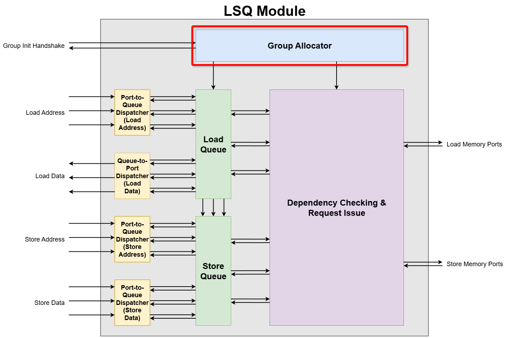

Dataflow circuits have no inherent notion of sequential instructions, and therefore no Fetch or Decode stages. This is a critical problem, because a traditional LSQ relies on this intrinsic program order to resolve potential memory dependencies. Without it, the LSQ is blind.

The solution to this problem is a concept called group allocation. A group is defined as a sequence of memory accesses that are known to execute together, without interruption from control flow. By allocating this entire group into the LSQ at once, we provide the LSQ with the necessary ordering information that was missing.

The Group Allocator is a module that manages entry allocation for the Load-Store Queue (LSQ).


## 2. Group Allocator Internal Blocks

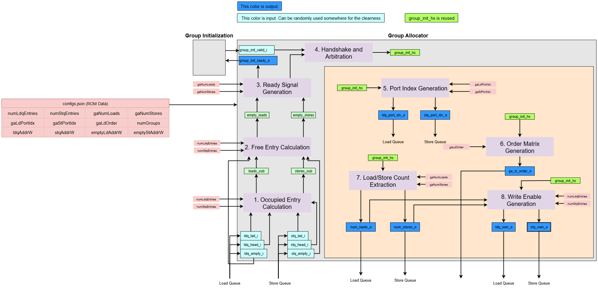


Let's assume the following generic parameters for dimensionality:

* `N_GROUPS`: The total number of groups.
* `N_LDQ_ENTRIES`: The total number of entries in the Load Queue.
* `N_STQ_ENTRIES`: The total number of entries in the Store Queue.
* `LDQ_ADDR_WIDTH`: The bit-width required to index an entry in the Load Queue (i.e., `ceil(log2(N_LDQ_ENTRIES))`).
* `STQ_ADDR_WIDTH`: The bit-width required to index an entry in the Store Queue (i.e., `ceil(log2(N_STQ_ENTRIES))`).
* `LDP_ADDR_WIDTH`: The bit-width required to index the port for a load.
* `STP_ADDR_WIDTH`: The bit-width required to index the port for a store.

**Signal Naming and Dimensionality**:  
This module is generated from a higher-level description (e.g., in Python), which results in a specific convention for signal naming in the final VHDL code. It's important to understand this convention when interpreting diagrams and signal tables.

- Generation Pattern: A signal that is conceptually an array in the source code (e.g., `group_init_valid_i`) is "unrolled" into multiple, distinct signals in the VHDL entity. The generated VHDL signals are indexed with a suffix, such as `group_init_valid_{g}_i`, where `{g}` is the group index.

- Interpreting Diagrams: If a diagram or conceptual description uses a base name without an index (e.g., `group_init_valid_i`), it represents a collection of signals. The actual dimension is expanded based on the context:

    - Group-related signals (like `group_init_valid_i`) are expanded by the number of groups (`N_GROUPS`).
    - Load queue-related signals (like `ldq_wen_o`) are expanded by the number of load queue entries (`N_LDQ_ENTRIES`).
    - Store queue-related signals (like `stq_wen_o`) are expanded by the number of store queue entries (`N_STQ_ENTRIES`).

### Interface Signals

In the VHDL Signal Name column, the following placeholders are used: `{g}` for the group index, `{le}` for the Load Queue entry index, and `{se}` for the Store Queue entry index.

| Python Variable Name | VHDL Signal Name | Direction | Dimensionality | Description |
| :--- | :--- | :--- | :--- | :--- |
| **Inputs** | | | | |
| `group_init_valid_i` | `group_init_valid_{g}_i` | Input | `std_logic` | Valid signal indicating a request to allocate group `g`. |
| `ldq_tail_i` | `ldq_tail_i` | Input | `std_logic_vector(LDQ_ADDR_WIDTH-1:0)` | Current tail pointer of the Load Queue. |
| `ldq_head_i` | `ldq_head_i` | Input | `std_logic_vector(LDQ_ADDR_WIDTH-1:0)` | Current head pointer of the Load Queue. |
| `ldq_empty_i` | `ldq_empty_i` | Input | `std_logic` | A flag indicating if the Load Queue is empty. |
| `stq_tail_i` | `stq_tail_i` | Input | `std_logic_vector(STQ_ADDR_WIDTH-1:0)` | Current tail pointer of the Store Queue. |
| `stq_head_i` | `stq_head_i` | Input | `std_logic_vector(STQ_ADDR_WIDTH-1:0)` | Current head pointer of the Store Queue. |
| `stq_empty_i` | `stq_empty_i` | Input | `std_logic` | A flag indicating if the Store Queue is empty. |
| **Outputs** | | | | |
| `group_init_ready_o` | `group_init_ready_{g}_o` | Output | `std_logic` | Ready signal indicating the allocator can accept a request for group `g`. |
| `ldq_wen_o` | `ldq_wen_{le}_o` | Output | `std_logic` | Write enable signal for Load Queue entry `{le}`. |
| `num_loads_o` | `num_loads_o` | Output | `std_logic_vector(LDQ_ADDR_WIDTH-1:0)` | The number of loads in the newly allocated group. |
| `ldq_port_idx_o` | `ldq_port_idx_{le}_o` | Output | `std_logic_vector(LDP_ADDR_WIDTH-1:0)` | The source port index for the operation to be written into Load Queue entry `{le}`. |
| `stq_wen_o` | `stq_wen_{se}_o` | Output | `std_logic` | Write enable signal for Store Queue entry `{se}`. |
| `num_stores_o` | `num_stores_o` | Output | `std_logic_vector(STQ_ADDR_WIDTH-1:0)` | The number of stores in the newly allocated group. |
| `stq_port_idx_o` | `stq_port_idx_{se}_o` | Output | `std_logic_vector(STP_ADDR_WIDTH-1:0)` | The source port index for the operation to be written into Store Queue entry `{se}`. |
| `ga_ls_order_o` | `ga_ls_order_{le}_o` | Output | `std_logic_vector(N_STQ_ENTRIES-1:0)` | For the load in a load queue entry `{le}`, this vector indicates its order dependency relative to all store queue entries. |


The Group Allocator has the following responsibilities:

1. **Preliminary Free Entry Calculator**  
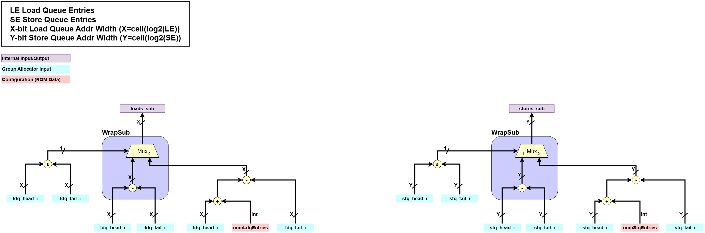  
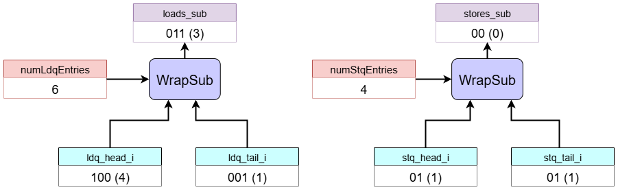  
    This block performs an initial calculation of the number of free entries in each queue.  
    - **Input**:  
        - `ldq_head_i`, `ldq_tail_i`: Head and tail pointers for the Load Queue.
        - `stq_head_i`, `stq_tail_i`: Head and tail pointers for the Store Queue.  
    - **Processing**:  
        - It performs a cyclic subtraction (`WrapSub`) of the pointers for each queue. This calculation gives the number of empty slots but is ambiguous when the two pointers are the same (`head == tail`) since it can either mean empty or full.  
            ```
                if head >= tail:
                    out = head - tail
                else:
                    out = (head + numEntries) - tail
            ```
    - **Output**:  
        - `loads_sub`, `stores_sub`: Intermediate signals holding the result of the cyclic subtraction for each queue.


2. **Free Entry Calculation**  
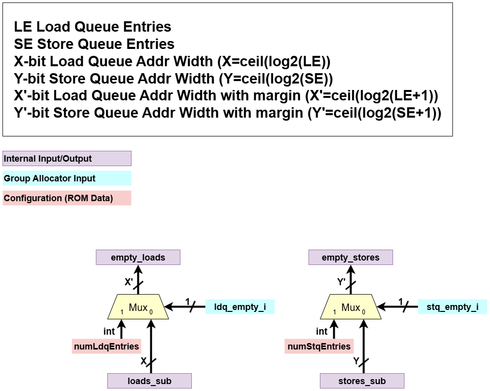  
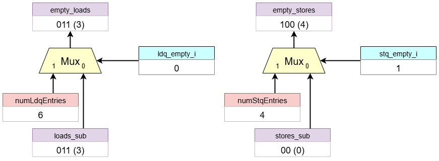  
    This block determines the final number of free entries available in each queue.
    - **Input**:
        - `loads_sub`, `stores_sub`: The tentative free entry counts from the previous block.
        - `ldq_empty_i`, `stq_empty_i`: Flags indicating if each queue is empty.
    - **Processing**:
        - It uses multiplexer logic to resolve the ambiguity of the previous step.
        - If a queue's `empty` flag is asserted, it outputs the maximum queue size (`numLdqEntries` or `numStqEntries`).
        - Otherwise, it outputs the result from the `WrapSub` calculation.
    - **Output**:
        - `empty_loads`, `empty_stores`: The definitive number of free entries in the load and store queues.

3. **Ready Signal Generation**  
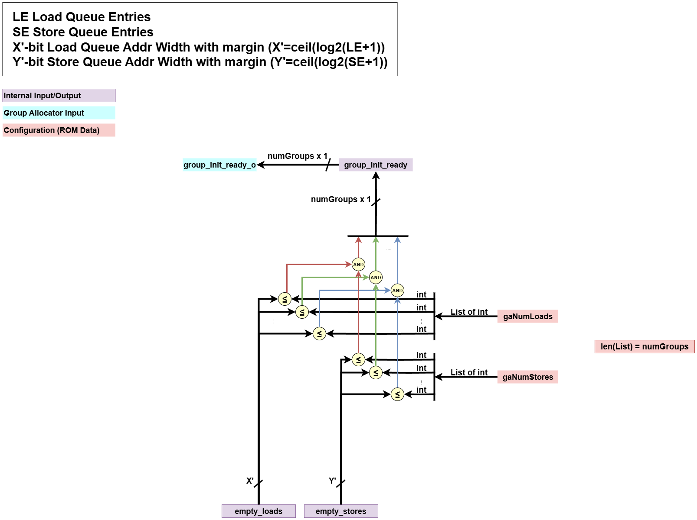  
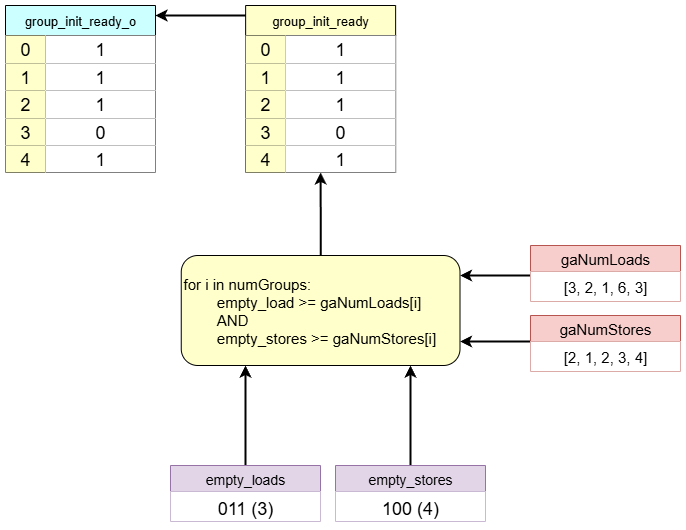  
    This block checks if there is sufficient space in the queues for each potential group.
    - **Input**:
        - `empty_loads`, `empty_stores`: The number of free entries available in each queue.
        - `gaNumLoads`, `gaNumStores`: Configuration arrays specifying the number of loads and stores required by each group.
    - **Processing**:
        - For each group, it compares the available space (`empty_loads`, `empty_stores`) with the required space (`gaNumLoads[g]`, `gaNumStores[g]`).
        - A group is considered "ready" only if there is enough space for *both* its loads and its stores.
    - **Output**:
        - `group_init_ready`: An array of ready signals, one for each group, indicating whether it could be allocated.
        - `group_init_ready_o`: The final ready signals sent to the external logic.


4. **Handshake and Arbitration**  
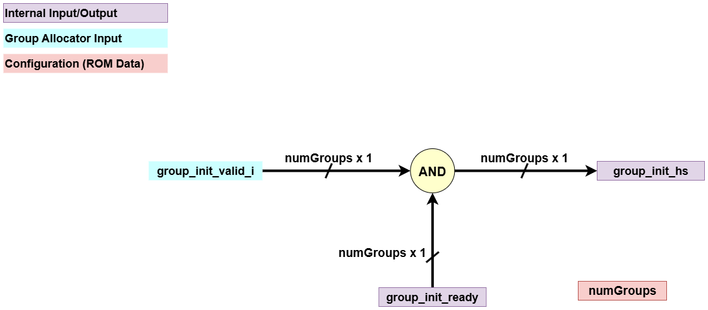  
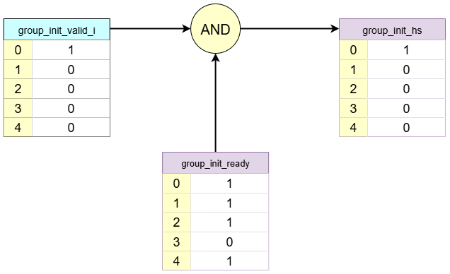  
    This block performs the final handshake to select a single allocated group for the current cycle. However, the arbitration happens when one of the configuration signal `gaMulti` is on, and this diagram depicts when `gaMulti` is off.  
    - **Input**:
        - `group_init_ready`: The readiness status for each group from the previous block.
        - `group_init_valid_i`: The external valid signals for each group.
        - (Optional) `ga_rr_mask`: A round-robin mask used for arbitration if multiple groups can be allocated (`gaMulti` is true).
    - **Processing**:
        - It combines the `ready` and `valid` signals. A group must be both ready and valid to be a candidate for allocation.
        - If multiple groups are candidates, an arbitrator (e.g., `CyclicPriorityMasking`) selects a single group. If `gaMulti` is false, it assumes only one valid allocation request can occur at a time as depicted.
    - **Output**:
        - `group_init_hs`: A one-hot signal indicating the single group that will be allocated at the current cycle.


5. **Port Index Generation**  
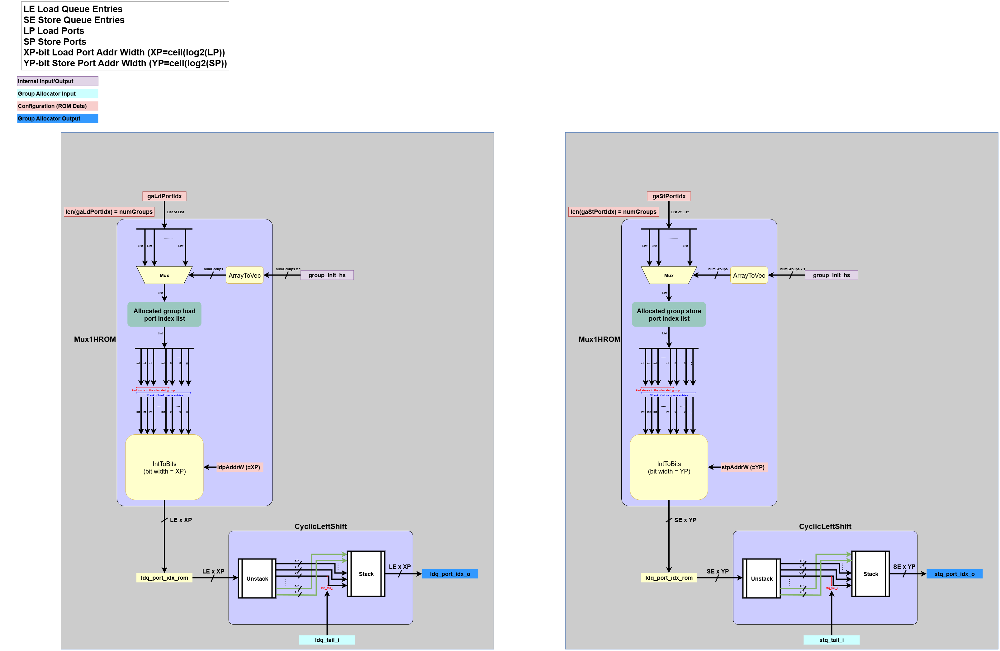  
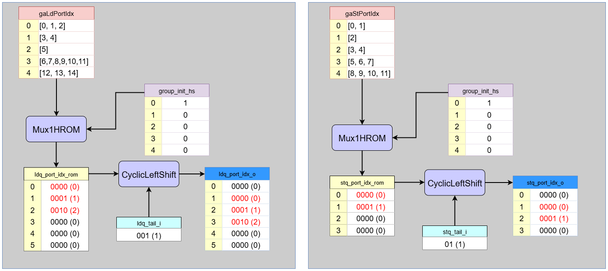  
    This block generates the correctly aligned port indices for the entries being allocated.
    - **Input**:
        - `group_init_hs`: A one-hot signal indicating the single group that will be allocated at the current cycle.
        - `ldq_tail_i`, `stq_tail_i`: The current tail pointers of the queues.
        - `gaLdPortIdx`, `gaStPortIdx`: Pre-compiled ROMs containing the port indices for each group.
    - **Processing**:
        - Uses the `group_init_hs` signal to perform a ROM lookup (`Mux1HROM`), selecting the list of port indices for the allocated group.
        - Performs `CyclicLeftShift` on the selected list, using the corresponding queue's `tail` pointer as the shift amount. This aligns the indices to the correct physical queue entry slots.
    - **Output**:
        - `ldq_port_idx_o`, `stq_port_idx_o`: The final, shifted port indices to be written into the newly allocated queue entries.


6. **Order Matrix Generation**  
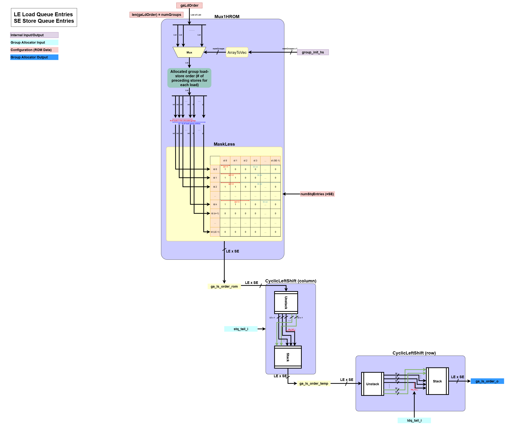  
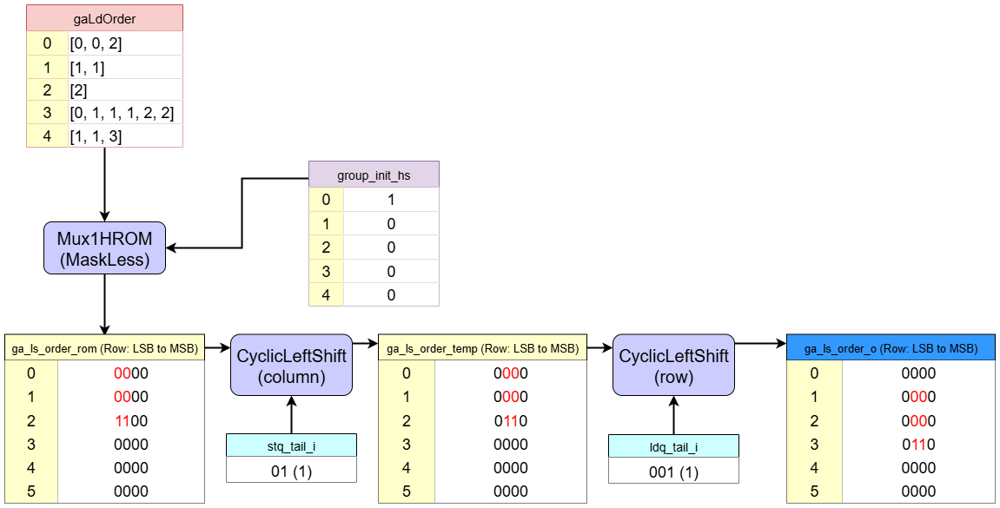  
    This block generates the load-store order matrix between the new loads and stores in the allocated group.
    - **Input**:
        - `group_init_hs`: A one-hot signal indicating the single group that will be allocated at the current cycle.
        - `ldq_tail_i`, `stq_tail_i`: The current tail pointers of the queues.
        - `gaLdOrder`: A pre-compiled ROM containing the load-store order information for each group. For each group, the corresponding list indicates, from the perspective of a load, the number of stores that come before it within the same group.
    - **Processing**:
        - Uses `group_init_hs` to perform a ROM lookup, selecting the order information for the allocated group. This information is used to build an un-aligned load-store order matrix.
        - A `1` in `(le, se)` indicates that `store_{se}` comes before `load_{le}`. This is built by the function `MaskLess`.
        - Performs `CyclicLeftShift` on this matrix two times, shifting it horizontally by `stq_tail_i` and vertically by `ldq_tail_i`. This correctly places the sub-matrix within the LSQ's main order matrix.
    - **Output**:
        - `ga_ls_order_o`: The final, shifted load-store order matrix defining the order of the new loads and stores.

7. **Load/Store Count Extraction**  
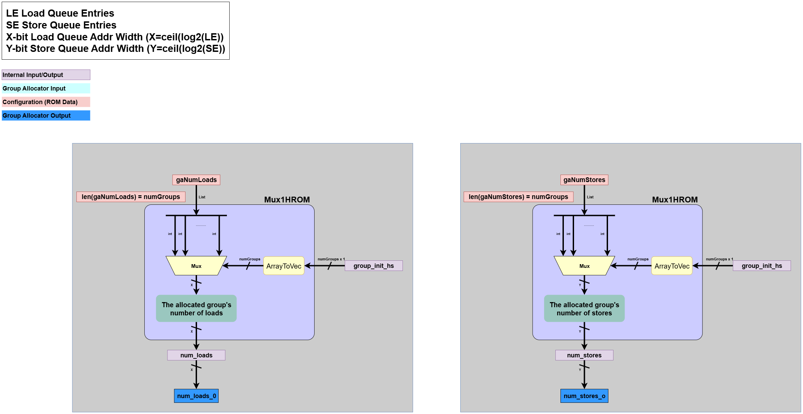  
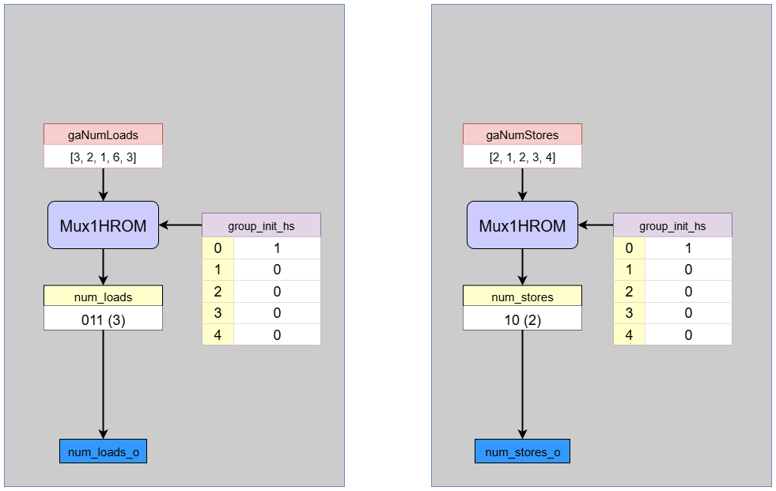  
    This block extracts the number of loads and stores for the allocated group.
    - **Input**:
        - `group_init_hs`: A one-hot signal indicating the single group that will be allocated at the current cycle.
        - `gaNumLoads`, `gaNumStores`: Pre-compiled ROMs containing the load/store counts for each group.
    - **Processing**:
        - Performs a simple ROM lookup (`Mux1HROM`) using `group_init_hs` to select the number of loads and stores corresponding to the allocated group.
    - **Output**:
        - `num_loads_o`, `num_stores_o`: The number of loads and stores in the newly allocated group.


8. **Write Enable Generation**  
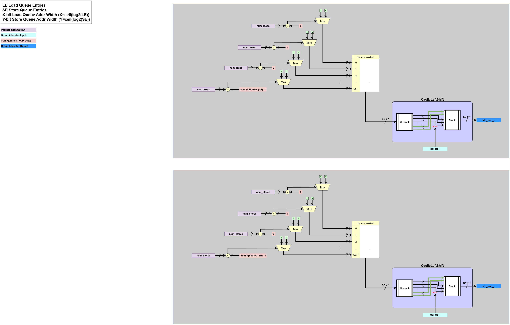  
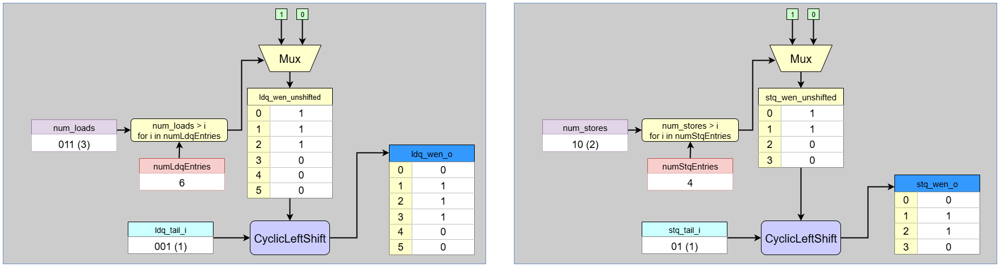  
    This final block generates the write-enable signals to allocate the new queue entries.
    - **Input**:
        - `num_loads`, `num_stores`: The load/store counts from the previous block.
        - `ldq_tail_i`, `stq_tail_i`: The current tail pointers of the queues.
    - **Processing**:
        - First, it creates an unshifted bitmask. For example, if `num_loads` is 3, the mask is `...00111`.
        - It then applies `CyclicLeftShift` to this mask, using the queue's `tail` pointer as the shift amount. This rotates the block of `1`s to start at the `tail` position.
    - **Output**:
        - `ldq_wen_o`, `stq_wen_o`: The final write-enable vectors, which assert a '1' for the precise entries in each queue that are being allocated.


## 3. Dataflow Walkthrough


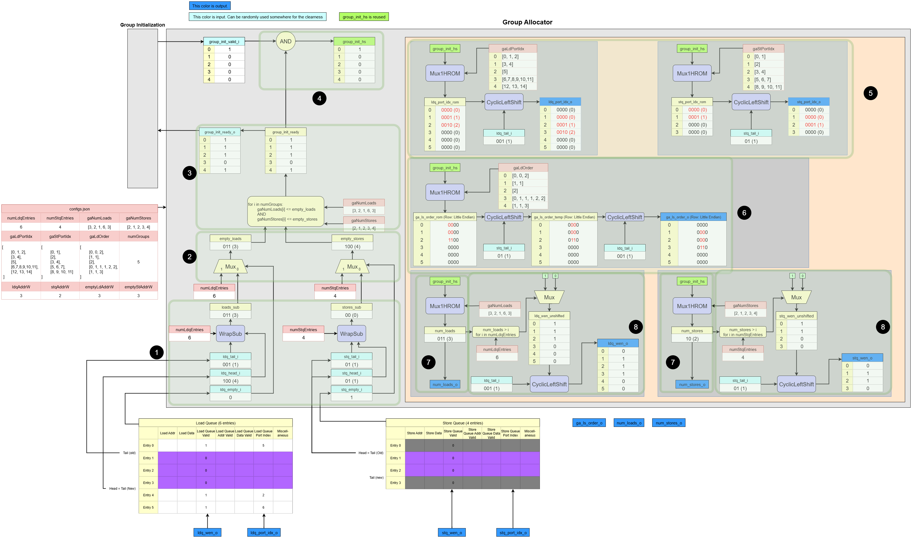

### Example of Group Allocator
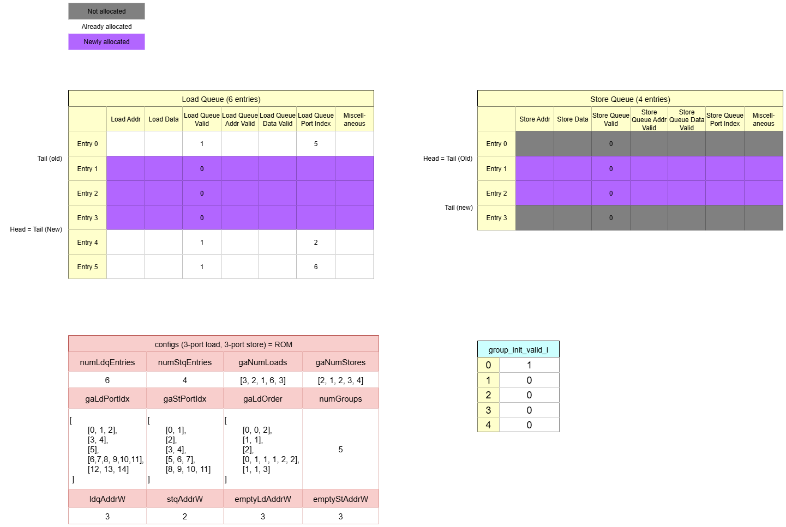  

This walkthrough explains the step-by-step operation of the `Group Allocator` based on the following precise initial state:
* **Queue State**:
    * Load Queue: `ldq_tail`=1, `ldq_head`=4, `ldq_empty_i`=0 (Not Empty)
    * Store Queue: `stq_tail`=1, `stq_head`=1, `stq_empty_i`=1 (Empty)
* **Queue Sizes**: `numLdqEntries`=6, `numStqEntries`=4
* **Group Allocation Request**: `group_init_valid_i`=`[1,0,0,0,0]` (Only Group 0 is requesting the allocation)
* **Group Configurations**:
    * `gaNumLoads` = `[3, 2, 1, 6, 3]`
    * `gaNumStores` = `[2, 1, 2, 3, 4]`

---

#### 1. Preliminary Free Entry Calculation
  
This block calculates the tentative number of currently free entries in each queue.

* **Load Queue**: It performs a cyclic subtraction `ldq_head`(4) - `ldq_tail`(1) = `3`. There are **3** free entries.
* **Store Queue**: It performs a cyclic subtraction `stq_head`(1) - `stq_tail`(1) = `0`. However, there are actually `4` free entries instead of `0`. This result is ambiguous and will be resolved in the next step. 

#### 2. Free Entry Calculation
  
This block calculates the number of available empty entries.

* **Load Queue**: Since `ldq_empty_i` is `0` (false), there are **3** free entries in the load queue.
* **Store Queue**: Since `stq_empty_i` is `1` (true), it outputs the total queue size. There are **4** free entries in the Store Queue.

#### 3. Ready Signal Generation
  
This block checks if the load queue and store queue are ready to be allocated.

* **Required Space for Group 0**: `gaNumLoads[0]`=3, `gaNumStores[0]`=2.
  * **Comparison**:
      * Loads: Is free space (3) >= required space (3)? **Yes**.
      * Stores: Is free space (4) >= required space (2)? **Yes**.
      * `group_init_ready[0] = 1`
* **Required Space for Group 1**: `gaNumLoads[1]`=2, `gaNumStores[1]`=1.
  * **Comparison**:
      * Loads: Is free space (3) >= required space (2)? **Yes**.
      * Stores: Is free space (4) >= required space (1)? **Yes**.
      * `group_init_ready[1] = 1`
* **Required Space for Group 2**: `gaNumLoads[2]`=1, `gaNumStores[2]`=2.
  * **Comparison**:
      * Loads: Is free space (3) >= required space (1)? **Yes**.
      * Stores: Is free space (4) >= required space (2)? **Yes**.
      * `group_init_ready[2] = 1`
* **Required Space for Group 3**: `gaNumLoads[3]`=6, `gaNumStores[3]`=3.
  * **Comparison**:
      * Loads: Is free space (3) >= required space (6)? **No**.
      * Stores: Is free space (4) >= required space (3)? **Yes**.
      * `group_init_ready[3] = 0`
* **Required Space for Group 4**: `gaNumLoads[4]`=3, `gaNumStores[4]`=4.
  * **Comparison**:
      * Loads: Is free space (3) >= required space (3)? **Yes**.
      * Stores: Is free space (4) >= required space (4)? **Yes**.
      * `group_init_ready[4] = 1`


#### 4. Handshake and Arbitration
  
This block performs the handshake to select an allocated group.

* The incoming request `group_init_valid_i` is `[1,0,0,0,0]`.
* The `ready` signal for Group 0 is `1`.
* The AND result is `[1,0,0,0,0]`, and since only one request is active, **Group 0** is allocated.

#### 5. Port Index Generation
  
This block generates the correctly aligned port indices for the newly allocated entries. It first looks up the data for the allocated group (Group 0), pads it to the full queue length, and then performs the specified shift operation to align it with the `tail` pointer.

* **Load Port Index (`ldq_port_idx_o`):**
    1.  **ROM Lookup:** It fetches `gaLdPortIdx[0]`, which is `[0, 1, 2]`. This means that `load0_0` (Group0's 0th load), `load0_1` (Group0's 1st load), and `load0_2` (Group0's 2nd load) use `Port 0`, `Port 1`, and `Port 2` respectively. Since the load queue has 6 entries, this is padded to create the intermediate vector `ldq_port_idx_rom = [0, 1, 2, 0, 0, 0]`.
    2.  **Alignment**: These indices must be placed into the physical queue entries starting at `ldq_tail=1`.
        * Physical `Entry 1` gets Port Index `0`.
        * Physical `Entry 2` gets Port Index `1`.
        * Physical `Entry 3` gets Port Index `2`.
    3. **Final Vector**: The resulting vector of port indices is `[0, 0, 1, 2, 0, 0]`. *(Note: This vector represents the indices `[?, 0, 1, 2, ?, ?]` aligned to the 6 queue entries, with unused entries being 0)*.

* **Store Port Index (`stq_port_idx_o`):**
    1.  **ROM Lookup:** It fetches `gaStPortIdx[0]`, which is `[0, 1]`. This is padded to the 4-entry store queue length to become `[0, 1, 0, 0]`.
    2.  **Alignment**: These are placed starting at `stq_tail=1`.
        * Physical `Entry 1` gets Port Index `0`.
        * Physical `Entry 2` gets Port Index `1`.
    3.  **Final Vector**: The resulting vector is `[0, 0, 1, 0]`. *(Note: This represents `[?, 0, 1, ?]` aligned to the 4 queue entries)*.

#### 6. Order Matrix Generation
  
This block fetches the intra-group order matrix for Group 0 and aligns it.


* **ROM Lookup**: It retrieves `gaLdOrder[0]`, which is `[0, 0, 2]`. This defines the intra-group dependencies for the group `0`:
    * `Load 0`: There are 0 stores before it.
    * `Load 1`: There are 0 stores before it.
    * `Load 2`: There are 2 stores before it (`Store 0` and `Store 1`).
    * This creates a `3x2` dependency sub-matrix:
        ```
           s0 s1
        l0 [0, 0]
        l1 [0, 0]
        l2 [1, 1]
        ```

  For this, the order matrix becomes 

            ga_ls_order_rom
                            SQ0 SQ1 SQ2 SQ3
            LQ Entry 0:    [ 0,  0,  0,  0 ]
            LQ Entry 1:    [ 0,  0,  0,  0 ]
            LQ Entry 2:    [ 1,  1,  0,  0 ]
            LQ Entry 3:    [ 0,  0,  0,  0 ]
            LQ Entry 4:    [ 0,  0,  0,  0 ]
            LQ Entry 5:    [ 0,  0,  0,  0 ]
            

* **Matrix Alignment**: This `3x2` sub-matrix is placed into the final `6x4` `ga_ls_order_o` matrix, with its top-left corner aligned to `(ldq_tail, stq_tail)` which is `(1, 1)`. The new loads occupy physical entries {1, 2, 3} and new stores occupy {1, 2}. The dependency of Load 2 (physical entry 3) on Store 0 (physical entry 1) and Store 1 (physical entry 2) is mapped accordingly.

* **Final Matrix (`ga_ls_order_o`)**: The final matrix will have `1`s at `ga_ls_order_o[3][1]` and `ga_ls_order_o[3][2]`. All other entries related to this group are `0`.
    ```
                   SQ0 SQ1 SQ2 SQ3
    LQ Entry 0:   [ 0,  0,  0,  0 ]
    LQ Entry 1:   [ 0,  0,  0,  0 ] // New Load 0
    LQ Entry 2:   [ 0,  0,  0,  0 ] // New Load 1
    LQ Entry 3:   [ 0,  1,  1,  0 ] // New Load 2 depends on new Store 0 & 1
    LQ Entry 4:   [ 0,  0,  0,  0 ]
    LQ Entry 5:   [ 0,  0,  0,  0 ]
    ```

#### 7. Load/Store Count Extraction
  
This block extracts the number of loads and stores for the allocated group (Group 0).

* **ROM Lookup**: It retrieves `gaNumLoads[0]` (`3`) and `gaNumStores[0]` (`2`).
* The outputs `num_loads_o` and `num_stores_o` become `3` and `2`, respectively.

#### 8. Write Enable Generation
  
This final block generates the write-enable signals that allocate the newly allocated queue entries.

* **Unshifted Mask Creation**:
    * Loads: `num_loads` (`3`) creates a 6-bit unshifted mask `000111`.
    * Stores: `num_stores` (`2`) creates a 4-bit unshifted mask `0011`.
* **Cyclic Left Shift**:
    * `ldq_wen_o`: The mask `000111` is shifted by `ldq_tail` (`1`), resulting in `001110`.
    * `stq_wen_o`: The mask `0011` is shifted by `stq_tail` (`1`), resulting in `0110`.
* These final vectors assert '1' for entries 1, 2, 3 in the Load Queue and entries 1, 2 in the Store Queue, activating them for the new group.
