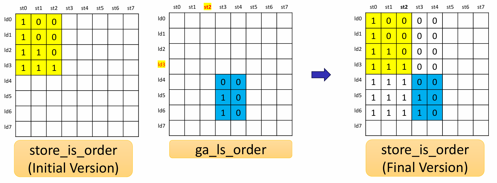

# LSQ

This document describes how the `lsq.py` script instantiates and connects sub-modules to generate the VHDL for the complete Load-Store Queue (LSQ).

Detailed documentation for the `LSQ` generator, which emits a VHDL entity and architecture to assemble a complete Load-Store Queue. It instantiates and connects all dispatchers (Port-to-Queue and Queue-to-Port dispatchers), the group allocator, and optional pipeline logics into one cohesive RTL block.

## 1. Overview and Purpose  

The LSQ is the system for managing all memory operations within the dataflow circuit. Its primary role is to accept out-of-order memory requests, track their dependencies, issue them to memory when safe, and return results in the correct order to the appropriate access ports.

The LSQ module acts as the master architect, instantiating the previously generated modules such as `Port-to-Queue Dispatcher`, `Queue-to-Port Dispatcher`, and `Group Allocator` modules. It wires them together with the load queue, the store queue, the dependency checking logic, and the requesting issue logic.

## 2. LSQ Internal Blocks

Let's assume the following generic parameters for dimensionality:

* `N_GROUPS`: The total number of groups.
* `N_LDQ_ENTRIES`: The total number of entries in the Load Queue.
* `N_STQ_ENTRIES`: The total number of entries in the Store Queue.
* `LDQ_ADDR_WIDTH`: The bit-width required to index an entry in the Load Queue (i.e., `ceil(log2(N_LDQ_ENTRIES))`).
* `STQ_ADDR_WIDTH`: The bit-width required to index an entry in the Store Queue (i.e., `ceil(log2(N_STQ_ENTRIES))`).
* `LDP_ADDR_WIDTH`: The bit-width required to index the port for a load.
* `STP_ADDR_WIDTH`: The bit-width required to index the port for a store.

**Signal Naming and Dimensionality**:
This module is generated from a higher-level description (e.g., in Python), which results in a specific convention for signal naming in the final VHDL code. It's important to understand this convention when interpreting the signal tables.

- Generation Pattern: A signal that is conceptually an array in the source code is "unrolled" into multiple, distinct signals in the VHDL entity. The generated VHDL signals are indexed with a suffix, such as `ldp_addr_{p}_i`, where `{p}` represents the port index.

- Placeholders: In the VHDL Signal Name column, the following placeholders are used:
    - `{g}`: Group index
    - `{lp}`: Load port index
    - `{sp}`: Store port index
    - `{lm}`: Load memory channel index
    - `{sm}`: Store memory channel index

- Interpreting Diagrams: If a diagram or conceptual description uses a base name without an index (e.g., `group_init_valid_i`), it represents a collection of signals. The actual dimension is expanded based on the context:

    - Group-related signals (like `group_init_valid_i`) are expanded by the number of groups (`N_GROUPS`).
    - Load queue-related signals (like `ldq_wen_o`) are expanded by the number of load queue entries (`N_LDQ_ENTRIES`).
    - Store queue-related signals (like `stq_wen_o`) are expanded by the number of store queue entries (`N_STQ_ENTRIES`).

### 2.1. Group Allocation Interface

These signals manage the handshake protocol for allocating groups of memory operations into the LSQ.

| Python Variable Name | VHDL Signal Name | Direction | Dimensionality | Description |
| :--- | :--- | :--- | :--- | :--- |
| `group_init_valid_i` | `group_init_valid_{g}_i` | Input | `std_logic` | Valid signal from the kernel, indicating a request to allocate group `{g}`. |
| `group_init_ready_o` | `group_init_ready_{g}_o` | Output | `std_logic` | Ready signal to the kernel, indicating the LSQ can accept a request for group `{g}`. |

### 2.2. Access Port Interface

This interface handles the flow of memory operation payloads (addresses and data) between the dataflow circuit's access ports and the LSQ.

#### 2.2.1. Load Address Dispatcher
Dispatches load addresses from the kernel to the load queue.

| Python Variable Name | VHDL Signal Name | Direction | Dimensionality | Description |
| :--- | :--- | :--- | :--- | :--- |
| `ldp_addr_i` | `ldp_addr_{lp}_i` | Input | `std_logic_vector(addrW-1:0)` | The memory address for a load operation from load port `{lp}`. |
| `ldp_addr_valid_i` | `ldp_addr_valid_{lp}_i` | Input | `std_logic` | Asserts that the payload on `ldp_addr_{lp}_i` is valid. |
| `ldp_addr_ready_o` | `ldp_addr_ready_{lp}_o` | Output | `std_logic` | Asserts that the load queue is ready to accept an address from load port `{lp}`. |

#### 2.2.1. Load Data Dispatcher
Returns data retrieved from memory back to the correct load port.

| Python Variable Name | VHDL Signal Name | Direction | Dimensionality | Description |
| :--- | :--- | :--- | :--- | :--- |
| `ldp_data_o` | `ldp_data_{lp}_o` | Output | `std_logic_vector(dataW-1:0)` | The data payload being sent to load port `{lp}`. |
| `ldp_data_valid_o` | `ldp_data_valid_{lp}_o` | Output | `std_logic` | Asserts that the payload on `ldp_data_{lp}_o` is valid. |
| `ldp_data_ready_i` | `ldp_data_ready_{lp}_i` | Input | `std_logic` | Asserts that the kernel is ready to receive data on load port `{lp}`. |

#### 2.2.3. Store Address Dispatcher
Dispatches store addresses from the kernel to the LSQ.

| Python Variable Name | VHDL Signal Name | Direction | Dimensionality | Description |
| :--- | :--- | :--- | :--- | :--- |
| `stp_addr_i` | `stp_addr_{sp}_i` | Input | `std_logic_vector(addrW-1:0)` | The memory address for a store operation from store port `{sp}`. |
| `stp_addr_valid_i` | `stp_addr_valid_{sp}_i` | Input | `std_logic` | Asserts that the payload on `stp_addr_{sp}_i` is valid. |
| `stp_addr_ready_o` | `stp_addr_ready_{sp}_o` | Output | `std_logic` | Asserts that the store queue is ready to accept an address from store port `{sp}`. |

#### 2.2.4. Store Data Dispatcher
Dispatches data to be stored from the kernel to the LSQ.

| Python Variable Name | VHDL Signal Name | Direction | Dimensionality | Description |
| :--- | :--- | :--- | :--- | :--- |
| `stp_data_i` | `stp_data_{sp}_i` | Input | `std_logic_vector(dataW-1:0)` | The data payload to be stored from store port `{sp}`. |
| `stp_data_valid_i` | `stp_data_valid_{sp}_i` | Input | `std_logic` | Asserts that the payload on `stp_data_{sp}_i` is valid. |
| `stp_data_ready_o` | `stp_data_ready_{sp}_o` | Output | `std_logic` | Asserts that the store queue is ready to accept data from store port `{sp}`. |

---
### 2.3. Memory Interface
These signals form the connection between the LSQ and the main memory system.

### Read Channel

#### 2.3.1. Read Request (LSQ to Memory)
Used by the LSQ to issue load operations to memory.

| Python Variable Name | VHDL Signal Name | Direction | Dimensionality | Description |
| :--- | :--- | :--- | :--- | :--- |
| `rreq_valid_o` | `rreq_valid_{lm}_o` | Output | `std_logic` | Valid signal indicating the LSQ is issuing a read request on channel `{lm}`. |
| `rreq_ready_i` | `rreq_ready_{lm}_i` | Input | `std_logic` | Ready signal from memory, indicating it can accept a read request on channel `{lm}`. |
| `rreq_id_o` | `rreq_id_{lm}_o` | Output | `std_logic_vector(idW-1:0)` | An ID for the read request, used to match the response. |
| `rreq_addr_o` | `rreq_addr_{lm}_o` | Output | `std_logic_vector(addrW-1:0)` | The memory address to be read. |

#### 2.3.2. Read Response (Memory to LSQ)
Used by memory to return data for a previously issued read request.

| Python Variable Name | VHDL Signal Name | Direction | Dimensionality | Description |
| :--- | :--- | :--- | :--- | :--- |
| `rresp_valid_i` | `rresp_valid_{lm}_i` | Input | `std_logic` | Valid signal from memory, indicating a read response is available on channel `{lm}`. |
| `rresp_ready_o` | `rresp_ready_{lm}_o` | Output | `std_logic` | Ready signal to memory, indicating the LSQ can accept the read response. |
| `rresp_id_i` | `rresp_id_{lm}_i` | Input | `std_logic_vector(idW-1:0)` | The ID of the read response, matching a previous `rreq_id_o`. |
| `rresp_data_i` | `rresp_data_{lm}_i` | Input | `std_logic_vector(dataW-1:0)` | The data returned from memory. |

### Write Channel

#### 2.3.3. Write Request (LSQ to Memory)
Used by the LSQ to issue store operations to memory.

| Python Variable Name | VHDL Signal Name | Direction | Dimensionality | Description |
| :--- | :--- | :--- | :--- | :--- |
| `wreq_valid_o` | `wreq_valid_{sm}_o` | Output | `std_logic` | Valid signal indicating the LSQ is issuing a write request on channel `{sm}`. |
| `wreq_ready_i` | `wreq_ready_{sm}_i` | Input | `std_logic` | Ready signal from memory, indicating it can accept a write request on channel `{sm}`. |
| `wreq_id_o` | `wreq_id_{sm}_o` | Output | `std_logic_vector(idW-1:0)` | An ID for the write request. |
| `wreq_addr_o` | `wreq_addr_{sm}_o` | Output | `std_logic_vector(addrW-1:0)` | The memory address to write to. |
| `wreq_data_o` | `wreq_data_{sm}_o` | Output | `std_logic_vector(dataW-1:0)` | The data to be written to memory. |

#### 2.3.4. Write Response (Memory to LSQ)
Used by memory to signal the completion of a write operation.

| Python Variable Name | VHDL Signal Name | Direction | Dimensionality | Description |
| :--- | :--- | :--- | :--- | :--- |
| `wresp_valid_i` | `wresp_valid_{sm}_i` | Input | `std_logic` | Valid signal from memory, indicating a write has completed on channel `{sm}`. |
| `wresp_ready_o` | `wresp_ready_{sm}_o` | Output | `std_logic` | Ready signal to memory, indicating the LSQ can accept the write response. |
| `wresp_id_i` | `wresp_id_{sm}_i` | Input | `std_logic_vector(idW-1:0)` | The ID of the completed write. |

The LSQ has the following responsibilities:

1. **Sub-Module Instantiation**  

    The primary responsibility of the top-level LSQ module is to function as an integrator. It instantitates several specialized sub-modules and connects them with the load queue, the store queue, dependency checking logic, and requesting issue logic to create the complete memory management system.  
    - **Group Allocator**: This module is responsible for managing entry allocation for the LSQ. It performs the initial handshake to reserve entries for an entire group of loads and stores, providing the necessary ordering information that would otherwise be missing in a dataflow circuit.
    - **Port-to-Queue (PTQ) Dispatcher**: This module is responsible for routing incoming payloads, such as addresses and data, from the dataflow circuit's external access ports to the correct entries within the load queue and the store queue. The LSQ instantiates three distinct PTQ dispatchers:
        - **Load Address Port Dispatcher**: For routing load addresses.
        - **Store Address Port Dispatcher**: For routing store addresses.
        - **Store Data Port Dispatcher**: For routing store data.
    - **Queue-to-Port (QTP) Dispatcher**: This module is the counterparts to the PTQ dispatchers. It takes payloads from the queue entries and route them back to the correct external access ports. The LSQ instantiates the following QTP dispatchers:
        - **Load Data Port Dispatcher**: Sends loaded data back to the circuit.
        - **(Optionally) Store Backward Port Dispatcher**: It is used to send store completion acknowledgements back to the circuit if the `stResp` configuration is enabled.
---
2. **Load Queue Management Logic**
    
    This block can be divided into three sub-block: **Load Queue Entry Allocation Logic**, **Load Queue Pointer Logic**, and **Load Queue Content State Logic**.

    2.1. **Load Queue Entry Allocation Logic**
    
    This block checks whether each queue entry is allocated or deallocated.  
    * **Input**:
        * `ldq_wen`: A signal from the **Group Allocator** that goes high to activate the queue entry when a new load group is being allocated.
        * `ldq_reset`: A signal from the **Load Data Port Dispatcher** that goes high to deactivate (reset) the entry after its load operation is complete and the data has been sent to the kernel.
        * `ldq_alloc` (current state): The current allocation status from the register's output, which is fed back as an input to the logic.
    * **Processing**:
        * The `ldq_reset` signal is inverted by a `NOT` gate. The result represents the "do not reset" condition.
        * This inverted signal is then combined with the current `ldq_alloc` state using an `AND` gate. The result of this operation (labeled `ldq_alloc_next` in concept) is '1' only if "the entry is currently allocated AND it is not being reset," indicating that the allocation should be maintained.
        * The output of the `AND` gate is then combined with the `ldq_wen` signal using an `OR` gate. This final logic determines that the entry will be in an allocated state ('1') during the next clock cycle if either of two conditions is met:
            1.  A new allocation is requested (`ldq_wen` = '1').
            2.  It was already allocated and no reset was requested (`ldq_alloc` = '1' AND `ldq_reset` = '0').
        * This logic is equivalent to the expression `next_state <= ldq_wen OR (ldq_alloc AND NOT ldq_reset)`.
    * **Output**:
        * `ldq_alloc` (next state): The updated allocation status of the load queue entry for the subsequent clock cycle. This signal is used by other logic within the LSQ to determine if the entry is active.

    2.2. **Load Queue Pointer Logic**
    
    This block is dedicated to calculating the next positions of the head and tail pointers of the circular queue.

    * **Input**:
        * `num_loads`: The number of new entries being allocated. From the **Group Allocator**.
        * `ldq_tail` (current state): The current tail pointer value.
        * `ldq_alloc`: The up-to-date allocation status vector for all entries, which is the output of the Entry State Logic.

    * **Processing**:
        * **Tail Pointer Update**: When a new group is allocated, it advances the `ldq_tail` pointer by the `num_loads` amount, using `WrapAdd` to handle the circular nature of the queue.
        * **Head Pointer Update**: It determines the next `ldq_head` by using `CyclicPriorityMasking` on the `ldq_alloc` vector. This efficiently finds the oldest, active entry, which becomes the new head.

    * **Output**:
        * `ldq_head` (next state): The updated head pointer of the queue.
        * `ldq_tail` (next state): The updated tail pointer of the queue.

    2.3. **Load Queue Content State Logic**  
    

    This logic manages the validity status of the various payloads and the issue status within an allocated entry. All signals in this block share a similar structure.

    * **Input**:
        * **Set Signals**:
            * `ldq_addr_wen`: From the **Load Address Port Dispatcher**, sets `ldq_addr_valid` to true.
            * `ldq_data_wen`: From the **Bypass Logic** or memory interface, sets `ldq_data_valid` to true.
            * `ldq_issue_set`: From the **Dependency Checking & Issue Logic**, sets `ldq_issue` to true.
        * **Common Reset Signal**:
            * `ldq_wen`: From the **Group Allocator**. It acts as a synchronous reset for all these status bits, clearing them to '0' when a new operation is allocated to the entry.
        * **Current State Signals**:
        * **`ldq_addr_valid` (curr state)**: Current status indicating if the entry holds a valid address.
        * **`ldq_data_valid` (curr state)**: Current status indicating if the entry holds valid data.
        * **`ldq_issue` (curr state)**: Current status indicating if the load request has been satisfied.

    * **Processing**:
        * All three signals (`ldq_addr_valid`, `ldq_data_valid`, `ldq_issue`) follow the same Set-Reset flip-flop logic pattern, where `ldq_wen` has reset priority.
        * A status bit is set if its corresponding "set" signal (e.g., `ldq_addr_wen`) is high. If not being set, it holds its value.
        * However, if `ldq_wen` is high for an entry, all three status bits for that entry are unconditionally cleared to '0' on the next clock cycle.
        * The logic is equivalent to these expressions:
            * `ldq_addr_valid_next <= (ldq_addr_wen OR ldq_addr_valid) AND (NOT ldq_wen)`
            * `ldq_data_valid_next <= (ldq_data_wen OR ldq_data_valid) AND (NOT ldq_wen)`
            * `ldq_issue_next <= (ldq_issue_set OR ldq_issue) AND (NOT ldq_wen)`

    * **Output**:
        * **`ldq_addr_valid` (next state)**: Updated status indicating if the entry holds a valid address.
        * **`ldq_data_valid` (next state)**: Updated status indicating if the entry holds valid data.
        * **`ldq_issue` (next state)**: Updated status indicating if the load request has been satisfied.
---
3. **Store Queue Management Logic**  
      
    This block can be divided into three sub-block: **Store Queue Entry Allocation Logic**, **Store Queue Pointer Logic**, and **Store Queue Content State Logic**.

    3.1. **Store Queue Entry Allocation Logic (`stq_alloc`)** 
      
    This logic manages the allocation status for each entry in the Store Queue (STQ), indicating whether it is active.

    * **Input**:
        * **`stq_wen`**: The write-enable signal from the **Group Allocator**. When high, it signifies that this entry is being allocated to a new store operation.
        * **`stq_reset`**: The reset signal, which can be triggered by a write response (`wresp_valid_i`) or by a store backward dispatch (`qtp_dispatcher_stb`). When high, it deallocates the entry.
        * **`stq_alloc` (current state)**: The current allocation status from the register's output, fed back as an input.

    * **Processing**:
        * The logic follows the same Set-Reset principle as the load queue.
        * The entry becomes allocated (`'1'`) if a new store is being written to it (`stq_wen` is high).
        * It remains allocated if it was already allocated and is not being reset.
        * The logic is equivalent to the expression: `stq_alloc_next <= stq_wen OR (stq_alloc AND NOT stq_reset)`.

    * **Output**:
        * **`stq_alloc` (next state)**: The updated allocation status vector. This signal is used to identify which store entries are currently active.

    3.2. **Store Queue Pointer Logic**
        
    This block manages the four distinct pointers associated with the Store Queue: `head`, `tail`, `issue`, and `resp`.

    * **Input**:
        * `num_stores`: The number of new entries being allocated. From the **Group Allocator**.
        * `stq_tail`, `stq_head`, `stq_issue`, `stq_resp` (current states): The current values of the pointers.
        * `stq_alloc`: The up-to-date allocation status vector for all entries.
        * `stq_issue_en`: An enable signal from the **Request Issue Logic** that allows the `stq_issue` pointer to advance.
        * `stq_resp_en`: An enable signal, typically tied to `wresp_valid_i`, that allows the `stq_resp` pointer to advance.

    * **Processing**:
        * **Tail Pointer Update**: The `stq_tail` pointer is advanced by `num_stores` using `WrapAdd` upon new group allocation.
        * **Head Pointer Update**: The `stq_head` pointer advances to the next oldest active entry. Its logic can depend on the configuration (e.g., advancing on a write response or using `CyclicPriorityMasking`).
        * **Issue Pointer Update**: The `stq_issue` pointer, which tracks the next store to be considered for memory issue, is incremented by one when `stq_issue_en` is high.
        * **Response Pointer Update**: The `stq_resp` pointer, which tracks completed write operations from memory, is incremented by one when `stq_resp_en` is high.

    * **Output**:
        * `stq_head`, `stq_tail`, `stq_issue`, `stq_resp` (next states): The updated pointer values for the next cycle.

    3.3. **Store Queue Content State Logic**  
       
    This logic manages the validity of the address and data payloads, as well as the execution status, within an allocated store entry.

    * **Input**:
        * **Set Signals**:
            * `stq_addr_wen`: From the **Store Address Port Dispatcher**, sets `stq_addr_valid` to true.
            * `stq_data_wen`: From the **Store Data Port Dispatcher**, sets `stq_data_valid` to true.
            * `stq_exec_set`: (Optional, if `stResp=True`) From the memory interface, sets `stq_exec` to true upon write completion.
        * **Common Reset Signal**:
            * `stq_wen`: From the **Group Allocator**. It acts as a synchronous reset, clearing these status bits when a new operation is allocated.
        * **Current State Signals**:
            * `stq_addr_valid`, `stq_data_valid`, `stq_exec`: The current state of each register, fed back as an input.

    * **Processing**:
        * All three signals (`stq_addr_valid`, `stq_data_valid`, `stq_exec`) follow the same Set-Reset logic pattern, where `stq_wen` has reset priority.
        * A status bit is set if its corresponding "set" signal (e.g., `stq_addr_wen`) is high. If not being set, it holds its value.
        * However, if `stq_wen` is high for an entry, all three status bits are unconditionally cleared to '0'.
        * The logic is equivalent to these expressions:
            * `stq_addr_valid_next <= (stq_addr_wen OR stq_addr_valid) AND (NOT stq_wen)`
            * `stq_data_valid_next <= (stq_data_wen OR stq_data_valid) AND (NOT stq_wen)`
            * `stq_exec_next <= (stq_exec_set OR stq_exec) AND (NOT stq_wen)`

    * **Output**:
        * **`stq_addr_valid` (next state)**: Updated status indicating if the entry holds a valid store address.
        * **`stq_data_valid` (next state)**: Updated status indicating if the entry holds valid store data.
        * **`stq_exec` (next state)**: (Optional) Updated status indicating if the store has been executed by memory.

---
4. Load-Store Order Matrix Logic (`store_is_older`)

This logic maintains a 2D register matrix that captures the relative program order between every load and store in the queues. Its primary purpose is to provide a static record of dependencies for the conflict-checking logic.

* **Input**:
    * **`ldq_wen`**: The write-enable signal from the **Group Allocator**. When `ldq_wen[i]` is high, it triggers an update for row `i` of the matrix.
    * **`stq_alloc`**: The allocation status vector from the **Store Queue Management Logic**. This is used to identify any stores that were already in the queue *before* the new load was allocated.
    * **`ga_ls_order`**: A matrix from the **Group Allocator** that specifies the ordering *within* the newly allocated group. `ga_ls_order[i][j]` is '1' if store `j` is older than load `i` in the same group.
    * **`stq_reset`**: The reset signal for store entries. When `stq_reset[j]` is high, it clears column `j` of the matrix, removing the completed store as a dependency.
    * **`store_is_older` (current state)**: The current state of the matrix, fed back as an input.

* **Processing**:
    * The logic for `store_is_older[i][j]` determines if store `j` should be considered older than load `i`. This state is set once when load `i` is allocated and then only changes if store `j` is deallocated.
    * **On Load Allocation (`ldq_wen[i]` is high)**: The entire row `i` of the matrix is updated. For each store `j`, the bit `store_is_older[i][j]` is set to '1' if the store is not being reset (`NOT stq_reset[j]`) AND one of the following is true:
        1.  The store `j` was already active in the queue when load `i` arrived (`stq_alloc[j]` is '1').
        2.  The store `j` is part of the same new group as load `i` and is explicitly defined as older (`ga_ls_order[i][j]` is '1').
    * **On Store Deallocation (`stq_reset[j]` is high)**: The logic clears the entire column `j` to '0's. This ensures that a completed store is no longer considered a dependency for any active loads.
    * **Hold State**: If no new load is being allocated to row `i`, the row maintains its existing values, except for any bits that are cleared due to a store deallocation.

* **Output**:
    * **`store_is_older` (next state)**: The updated dependency matrix. This matrix is a critical input for both the **Load-Store Conflict Logic** and the **Store-Load Conflict Logic**. A '1' at `store_is_older[i][j]` essentially means "load `i` must respect store `j`."
---
5. **Compare Address Logic (`addr_same`)**

This combinational logic block performs a direct comparison between every load address and every store address in the queues.

* **Input**:
    * **`ldq_addr`**: The array of all addresses stored in the Load Queue.
    * **`stq_addr`**: The array of all addresses stored in the Store Queue.

* **Processing**:
    * For every possible pair of a load `i` and a store `j`, it performs a direct equality comparison: `ldq_addr[i] == stq_addr[j]`.

* **Output**:
    * **`addr_same`**: A 2D matrix where the bit at `[i, j]` is '1' if the addresses of load `i` and store `j` are identical. This matrix is a fundamental input for both the conflict and bypass logic to detect potential address hazards.

---
6. **Address Validity Logic (`addr_valid`)**

This logic checks whether both operations in a given load-store pair have received their addresses, making them eligible for a meaningful address comparison.

* **Input**:
    * **`ldq_addr_valid`**: A vector indicating which LDQ entries have a valid address.
    * **`stq_addr_valid`**: A vector indicating which STQ entries have a valid address.

* **Processing**:
    * For every possible pair of a load `i` and a store `j`, it performs a logical AND operation: `ldq_addr_valid[i] AND stq_addr_valid[j]`.

* **Output**:
    * **`addr_valid`**: A 2D matrix where the bit at `[i, j]` is '1' only if both load `i` and store `j` have valid addresses. This is used to qualify bypass conditions, ensuring a bypass is only considered when both addresses are known.

---
7. **Load Request Validity Logic (`load_req_valid`)**

This logic block generates a list of loads that are ready to be evaluated by the dependency checker. It filters out loads that are not yet active or have already been completed.

* **Input**:
    * **`ldq_alloc`**: The vector indicating which load queue entries are currently allocated and active.
    * **`ldq_issue`**: The vector indicating which load requests have already been satisfied (either by being sent to memory or through a bypass).
    * **`ldq_addr_valid`**: The vector indicating which active loads have received their address payload.

* **Processing**:
    * For each load entry `i`, it performs a logical AND across three conditions to determine if it's a valid candidate for issue:
        1.  The entry must be allocated (`ldq_alloc[i]`).
        2.  The address must be valid (`ldq_addr_valid[i]`).
        3.  The request must not have been previously issued (`NOT ldq_issue[i]`).
    * The complete expression is `ldq_alloc[i] AND ldq_addr_valid[i] AND (NOT ldq_issue[i])`.

* **Output**:
    * **`load_req_valid`**: A vector where a '1' at index `i` signifies that load `i` is an active request that is ready to be checked for dependencies. This vector serves as the primary input pool for the **Load to Memory Logic**.
---
8. **Load-Store Conflict Logic**  

This is the primary logic for ensuring load safety. It checks every active load against every active store to see if the load must wait for the store to complete.

* **Input**:
    * **`stq_alloc`**: A vector indicating which store queue entries are active.
    * **`store_is_older`**: The 2D matrix establishing the program order between loads and stores.
    * **`addr_same`**: The 2D matrix indicating which load-store pairs have identical addresses.
    * **`stq_addr_valid`**: A vector indicating which stores have a valid address.

* **Processing**:
    * It calculates the `ld_st_conflict` matrix. A conflict at `ld_st_conflict[i][j]` is asserted ('1') if all of the following are true:
        1. The store `j` is allocated (`stq_alloc[j]`).
        2. The store `j` is older than the load `i` (`store_is_older[i][j]`).
        3. A potential address hazard exists, which means either:
            * Their addresses are identical (`addr_same[i][j]`).
            * OR the store's address is not yet known (`NOT stq_addr_valid[j]`).

* **Output**:
    * **`ld_st_conflict`**: A 2D matrix where a '1' at `[i, j]` signifies that load `i` has a dependency on store `j` and must not be issued to memory if `j` is also pending.

---
9. **Load Queue Bypass Logic (Determining Bypass Potential)**  

This block determines for which load-store pairs a bypass (store-to-load forwarding) is *potentially* possible.

* **Input**:
    * **`ldq_alloc`**: A vector indicating which load queue entries are active.
    * **`ldq_issue`**: A vector indicating which loads have already been satisfied.
    * **`stq_data_valid`**: A vector indicating which store entries have valid data ready for forwarding.
    * **`addr_same`**: The address equality matrix.
    * **`addr_valid`**: The matrix indicating pairs with valid addresses.

* **Processing**:
    * It calculates the `can_bypass` matrix. A bit `can_bypass[i][j]` is asserted if all conditions for a potential bypass are met:
        1. The load `i` is active (`ldq_alloc[i]`).
        2. The load `i` has not been issued yet (`NOT ldq_issue[i]`).
        3. The store `j` has valid data (`stq_data_valid[j]`).
        4. Both the load and store have valid and identical addresses (`addr_valid[i][j]` and `addr_same[i][j]`).

* **Output**:
    * **`can_bypass`**: A 2D matrix indicating every load-store pair where a bypass is theoretically possible. This matrix is used as an input to the logic that makes the final bypass decision.
---
10. **Load to Memory Logic**  

This logic block makes the final decision on which loads are safe to issue to the memory interface.

* **Input**:
    * **`ld_st_conflict`**: The dependency matrix from the Load-Store Conflict Logic.
    * **`load_req_valid`**: A vector indicating which loads are active and ready to be checked.
    * **`ldq_head_oh`**: The one-hot head pointer of the load queue, used to prioritize the oldest requests.

* **Processing**:
    1.  First, it OR-reduces each row of the `ld_st_conflict` matrix to create a single `load_conflict` bit for each load.
    2.  It then creates a list of issue candidates, `can_load`, by selecting requests from `load_req_valid` that are not blocked (`NOT load_conflict`).
    3.  Finally, it uses `CyclicPriorityMasking` on the `can_load` list to arbitrate and select the oldest, highest-priority load(s) for the available memory read channel(s).

    
    
    
* **Output**:
    * **`load_en`**: A vector of enable signals, one for each memory read channel. This directly drives `rreq_valid_o`.
    * **`load_idx_oh`**: A one-hot vector for each memory channel, identifying which load queue entry won the arbitration. This is used to form `rreq_id_o` and select the `rreq_addr_o`.
---
11. **Store-Load Conflict Logic**  

This logic ensures a store operation is not issued if it might conflict with an older, unresolved load operation.

* **Input**:
    * **`ldq_alloc`**: A vector indicating which load entries are active.
    * **`store_is_older`**: The program order matrix.
    * **`addr_same`**: The address equality matrix.
    * **`ldq_addr_valid`**: A vector indicating which loads have valid addresses.
    * **`stq_issue`**: The pointer to the specific store entry being considered for issue.

* **Processing**:
    * It checks the store candidate at `stq_issue` against every active load `i`. A conflict `st_ld_conflict[i]` is asserted if:
        1. The load `i` is active (`ldq_alloc[i]`).
        2. The load `i` is older than the store candidate (`NOT store_is_older[i][stq_issue]`).
        3. A potential address hazard exists, meaning their addresses are identical (`addr_same[i][stq_issue]`) OR the load's address is not yet known (`NOT ldq_addr_valid[i]`).

* **Output**:
    * **`st_ld_conflict`**: A vector indicating which loads are in conflict with the current store candidate. This vector is then OR-reduced to create a single `store_conflict` signal for the **Request Issue Logic**.
---
12. **Store Queue Bypass Logic (Finalizing the Bypass Decision)**  

This logic makes the final decision on whether to execute a bypass for a given load.

* **Input**:
    * **`ld_st_conflict`**: The matrix of all load-store dependencies.
    * **`can_bypass`**: The matrix of potential bypass opportunities calculated by the **Load Queue Bypass Logic**.
    * **`stq_last_oh`**: A one-hot vector indicating the last allocated store, used for priority.

* **Processing**:
    1. For each load `i` that has conflicts, it uses `CyclicPriorityMasking` on its conflict row `ld_st_conflict[i]` to find the single, **youngest** store that it depends on. This identifies the store with the most up-to-date data version for that address.
    2. It then checks if a bypass is possible *with that specific store* by checking the corresponding bit in the `can_bypass` matrix.
    3. If both conditions are met, the bypass is confirmed.

* **Output**:
    * **`bypass_en`**: A vector where `bypass_en[i]` is asserted if load `i` will be satisfied via a bypass in the current cycle. This signal triggers the `ldq_issue_set` and the data muxing from the store queue to the load queue.
---
13. **Memory Request Issue Logic**  
This logic is the final stage of the dependency-checking pipeline. It is responsible for arbitrating among safe, ready-to-go memory operations and driving the signals to the external memory interface. It is composed of two distinct parts for handling load and store requests.

    13.1. **Load Request Issue Logic**  
    This part of the logic selects which non-conflicting load requests should be sent to the memory system's read channels.

    * **Input**:
        * **`ld_st_conflict`**: The 2D matrix indicating all dependencies between loads and stores.
        * **`load_req_valid`**: A vector indicating which loads are active, have a valid address, and have not yet been satisfied.
        * **`ldq_head_oh`**: The one-hot head pointer of the load queue, used to grant priority to the oldest requests.
        * **`ldq_addr`**: The array of addresses stored in the Load Queue.

    * **Processing**:
        1.  First, it creates a list of candidate loads (`can_load`) by filtering the `load_req_valid` list, removing any loads that have a dependency indicated by the `ld_st_conflict` matrix.
        2.  It then uses `CyclicPriorityMasking` to arbitrate among these `can_load` candidates. This process selects the oldest, highest-priority requests to issue to the available memory read channels.

    * **Output**:
        * **`rreq_valid_o`**: The "valid" signal for the memory read request channel. It is asserted when a winning load candidate is selected by the arbitration logic.
        * **`rreq_addr_o`**: The address of the winning load, selected from the `ldq_addr` array via a multiplexer controlled by the arbitration result (`load_idx_oh`).
        * **`rreq_id_o`**: The ID for the read request, which corresponds to the load's index in the queue. This is also derived from the arbitration result and is used to match the memory response later.

    13.2. **Store Request Issue Logic**  
    This part of the logic determines if the single, oldest pending store request (indicated by the `stq_issue` pointer) is safe to send to the memory write channel.

    * **Input**:
        * **`st_ld_conflict`**: A vector indicating if the current store candidate conflicts with any older loads.
        * **`stq_alloc`**, **`stq_addr_valid`**, **`stq_data_valid`**: The status bits for the store entry at the `stq_issue` pointer.
        * **`stq_addr`**, **`stq_data`**: The payload data for the store entry at the `stq_issue` pointer.

    * **Processing**:
        1.  It performs a final check to generate the `store_en` signal. The signal is asserted only if the store candidate has no conflicts with older loads (`NOT store_conflict`) AND its entry is fully prepared (i.e., it is allocated and both its address and data are valid).
        2.  If `store_en` is asserted, the logic gates the address and data from the store entry at `stq_issue` to the write request output ports.

    * **Output**:
        * **`wreq_valid_o`**: The "valid" signal for the memory write request channel, driven directly by the `store_en` signal.
        * **`wreq_addr_o`**, **`wreq_data_o`**: The address and data of the store being issued.
        * **`stq_issue_en`**: An internal signal that enables the `stq_issue` pointer to advance. It is asserted when a store is successfully issued and accepted by the memory interface (`store_en AND wreq_ready_i`).

## 3. Pipelining  

* **Purpose**
    - The dependency-checking unit is the longest combinational path in the LSQ, so we split it into shorter timing-friendly segments.
* **Implementation**
    - Stage 0 `pipeComp`
    - Stage 1 `pipe0`
    - Stage 2 `pipe1`

> **Note:** Each of these stages can be independently enabled or disabled via the `pipeComp`, `pipe0`, and `pipe1` config flags—so you only pay the pipeline overhead where you need the extra timing slack.

