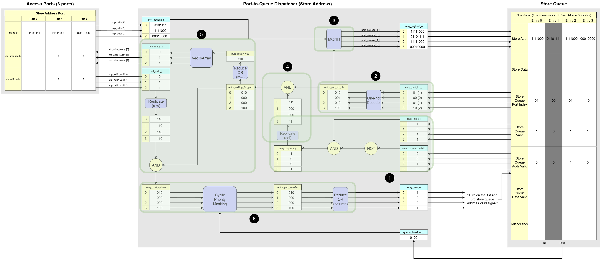

# Port-to-Queue Dispatcher

How addresses and data enter from multiple access ports to the LSQ's internal load and store queues.

## 1. Overview and Purpose  

The Port-to-Queue Dispatcher is a submodule within the Load-Store Queue (LSQ) responsible for routing incoming memory requests (addresses or data) from the dataflow circuit's access ports to the correct queue entries of the load queue and the store queue. All incoming requests are directed into either the load queue or the store queue. These queues are essential for tracking every memory request until its completion. It ensures each load queue or store queue entry gets the correct address or data from the appropriate port.  

We need a total of three **Port-to-Queue Dispatchers**—one each for the load address, store address, and store data. Why? To load, you must first supply the address where the data is stored. Likewise, a store operation needs both the value to write and the address to write it at.  

In the LSQ architecture, memory operations arrive via dedicated access ports. The system can process simultaneous payload writes to the LSQ from multiple ports in parallel. An arbitration mechanism is required, however, to handle cases where multiple queue entries compete for access to the same single port. 

## 2. Port-to-Queue Dispatcher Internal Blocks

Let's assume the following generic parameters for dimensionality:
* `N_PORTS`: The total number of ports.
* `N_ENTRIES`: The total number of entries in the queue.
* `PAYLOAD_WIDTH`: The bit-width of the payload (e.g., 8 bits).
* `PORT_IDX_WIDTH`: The bit-width required to index a port (e.g., `ceil(log2(N_PORTS))`).

**Signal Naming and Dimensionality**:  
This module is generated from a higher-level description (e.g., in Python), which results in a specific convention for signal naming in the final VHDL code. It's important to understand this convention when interpreting diagrams and signal tables.

- Generation Pattern: A signal that is conceptually an array in the source code (e.g., `port_payload_i`) is "unrolled" into multiple, distinct signals in the VHDL entity. The generated VHDL signals are indexed with a suffix, such as `port_payload_{p}_i`, where `{p}` is the port index.

- Interpreting Diagrams: If a diagram or conceptual description uses a base name without an index (e.g., `port_payload_i`), it represents a collection of signals. The actual dimension is expanded based on the context:

    - Port-related signals (like `port_payload_i`) are expanded by the number of ports (`N_PORTS`).
    - Entry-related signals (like `entry_alloc_i`) are expanded by the number of queue entries (`N_ENTRIES`).

### Port Interface Signals

These signals are used for communication between the external modules and the dispatcher's ports.
 `p=[0, N_PORTS-1]`

| Python Variable Name | VHDL Signal Name | Direction | Dimensionality | Description |
| :--- | :--- | :--- | :--- | :--- |
| **Inputs** | | | | |
| `port_payload_i` | ``port_payload_{p}_i`` | Input | `std_logic_vector(PAYLOAD_WIDTH-1:0)` | The payload (address or data) for port `p`.|
| `port_valid_i` | `port_valid_{p}_i` | Input | `std_logic` | Valid flag for port `p`. When high, it indicates that the payload on `port_payload_{p}_i` is valid. |
| **Outputs** | | | | |
| `port_ready_o` | `port_ready_{p}_o` | Output | `std_logic` | Ready flag for port `p`. This signal goes high if the queue can accept the payload from port `p` this cycle. |

### Queue Interface Signals

These signals are used for communication between the dispatcher logic and the queue's memory entries.
 `e=[0, N_ENTRIES-1]`

| Python Variable Name | VHDL Signal Name | Direction | Dimensionality | Description |
| :--- | :--- | :--- | :--- | :--- |
| **Inputs** | | | | |
| `entry_alloc_i` | `entry_alloc_{e}_i` | Input | `std_logic` | Is queue entry `e` logically allocated?|
| `entry_payload_valid_i` | `entry_payload_valid_{e}_i` | Input | `std_logic` | Indicates if the entry's payload slot `e` is already valid.  |
| `entry_port_idx_i` | `entry_port_idx_{e}_i` | Input | `std_logic_vector(PORT_IDX_WIDTH-1:0)`| Indicates to which port entry `e` is assigned. |
| `queue_head_oh_i` | `queue_head_oh_{e}_i` | Input | `std_logic_vector(N_ENTRIES-1:0)` | One-hot vector indicating the head entry in the queue. |
| **Outputs** | | | | |
| `entry_payload_o` | `entry_payload_{e}_o` | Output | `std_logic_vector(PAYLOAD_WIDTH-1:0)`| The payload to be written into queue entry `e`. |
| `entry_wen_o` | `entry_wen_{e}_o` | Output | `std_logic` | A write-enable signal for entry `e`. When high, `entry_payload_valid_{e}_i` is expected to be asserted by logic outside of this module. This logic exists outside of the dispatcher module. When the write-enable signal is on, this outside logic makes the dispatcher to consider the payload in the queue entry `e` is the valid one. |

The Port-to-Queue Dispatcher has the following responsibilities (with 3-port, 4-entry store address dispatcher example):

1. **Matching**  
      
      
    The Matching block is responsible for identifying which queue entries are actively waiting to receive an address or data payload.
    - **Input**:  
        - `entry_alloc_i`: Indicates if the entry is allocated by the group allocator.
        - `entry_payload_valid_i`: Indicates if the entry's payload slot is already valid. 
    - **Processing**: For each queue entry, this block performs the check: `entry_alloc_i AND (NOT entry_payload_valid_i)`. An entry is considered waiting only if it has been allocated (`entry_alloc_i = 1`) but its payload slot is still empty (`entry_payload_valid_i = 0`)
    - **Output**:  
        - `entry_ptq_ready`: `N_ENTRIES` bits indicating the queue entry is ready to receive address or data.

2. **Port Index Decoder**  
      
      
    When the group allocator allocates a queue entry, it also assigns the queue entry to a specific port, storing this port assignment as an integer. The Port Index Decoder decodes the port assignment for each queue entry from an integer representation to a one-hot representation.
    - **Input**:   
        - `entry_port_idx_i`: Queue entry-port assignment information
    - **Processing**:  
        - It performs a integer-to-one-hot conversion on the port index associated with each entry. For example, if there are 3 ports, an integer index of `1 (01 in binary)` would be converted to a one-hot vector of `010`.
    - **Output**:  
        - `entry_port_idx_oh`: A one-hot vector for each entry that directly corresponds to the port it is assigned to.

3. **Payload Mux**  
      
      
    This block routes the address or data payload from the appropriate input port to the correct queue entries. 
    - **Input**:  
         - `port_payload_i`: `N_PORTS` of the address or data payload from all access ports.
         - `entry_port_idx_oh`: The one-hot port assignment for each queue entry, used as the select signal.
    - **Processing**: For each queue entry, a multiplexer `Mux1H` uses the respective `entry_port_idx_oh` one-hot vector to select one payload from `port_payload_i`.
    - **Output**:  
        - `entry_payload_o`: The selected payload of each queue entry.

4. **Entry-Port Assignment Masking Logic**  
      
       

    Each queue entry which is waiting for data, can only receive data from one port. This converts entry waiting from one-bit signal to a one-hot representation of the port it is waiting for the data from.
    
    - **Input**:  
         - `entry_port_idx_oh`: A one-hot vector for each entry representing its assigned port.
         - `entry_ptq_ready`: `N_ENTRIES` bits indicating which entries are ready to receive.
    - **Processing**: Performs a bitwise AND operation between each entry's one-hot port assignment (`entry_port_idx_oh`) and its readiness status (`entry_ptq_ready`). This masks out assignments for entries that are not waiting.
    - **Output**:  
        - `entry_waiting_for_port`: A one-hot vector for each entry representing its assigned port, but zero when the queue entry is not ready.

5. **Handshake Logic**  
      
      
    This block manages the `valid/ready` handshake protocol with the external access ports. It generates the outgoing `port_ready_o` signals and produces the final entry-port assignments that have completed a successful handshake (i.e. the internal request is ready and the external port is valid).

    - **Input**:  
        - `entry_waiting_for_port`: A one-hot vector for each entry representing its assigned port, but zero when the queue entry is not ready.
        - `port_valid_i`: The incoming port valid signals from each external port.
    - **Processing**:  
        - Ready Generation: We determine if **any** queue entry is waiting for data from a specific port. If so, it asserts the `port_ready_o` signal for that port to indicate it can accept data. 
        - Handshake: It then uses the external `port_valid_i` signals to mask out entries in `entry_waiting_for_port` if the respective port is not valid. It uses `VecToArray` operations to convert `P-bit` vector into `P` 1-bit signals.
    - **Output**:
        - `port_ready_o`: The outgoing ready signal to each external port.
        - `entry_port_options`: Represents the set of handshaked entry-port assignments. This signal indicates a successful handshake and is sent to the **Arbitration Logic** to select the oldest one.

6. **Arbitration Logic**  
      
      
    The core decision making block of the dispatcher. When multiple handshaked entry-port assignments are ready to be written in the same cycle, it chooses the oldest queue entry among the valid ones for each port.
    - **Input**:  
        - `entry_port_options`: The set of all currently valid and ready entry-port assignments.
        - `queue_head_oh_i`: The queue's one-hot head vector.
    - **Processing**: It uses a `CyclicPriorityMasking` algorithm. This ensures that among all candidates for each port, the one corresponding to the oldest entry in the queue is granted for the current clock cycle.
    - **Output**: `entry_wen_o` signal, which acts as the enable for the queue entry. This signal ultimately causes the queue's `entry_payload_valid` signal to go high via logic outside of the dispatcher.

## 3. Dataflow Walkthrough

### Example of Store Address Port-to-Queue Dispatcher (3 Store Ports, 4 Store Queue Entries)

1. **Matching: Identifying which queue slots are empty**  
      
    The first job of this block is to determine which entries in the store queue are waiting for a store address.  

    Based on the example diagram:  
    - **Entry 1** is darkened to indicate that it has not been allocated by the Group Allocator. Its `Store Queue Valid` signal (equivalent to `entry_alloc_i`) is `0`.  
    - **Entries 0, 2, and 3** have been allocated, so their `entry_alloc_i` signal are `1`. However, among these, Entry 2 already has a valid address (`Store Queue Addr Valid = 1`).
    - Therefore, only `Entries 0 and 3` are actively waiting for their store address, as they are allocated but their `Store Queue Addr Valid` bit is still `0`.  
  
    This logic is captured by the expression `entry_ptq_ready = entry_alloc_i AND (NOT entry_payload_valid_i)`, which creates a list of entries that need attention from the dispatcher.

2. **Port Index Decoder: Queue entries port assignment in one-hot format**  
      
    This block's circuit is to decode an integer index assigned to each queue entry into a one-hot format.  

    Based on the example diagram:  
    - The `Store Queue` shows that `Entry 0` is assigned to `Port 1` , `Entry 1` to `Port 0`, `Entry 2` to `Port 1` and `Entry 3` to `Port 2`. 
    - The `Port Index Decoder` takes these integer indices (`0`, `1`, `2`) as input which are (`00`, `01`, `02` in binary respectively).
    - It processes them and generates a corresponding one-hot vector for each entry. Since there are three access ports, the vector are three bits wide:
        - `Entry 0 (Port 1)`: `010`
        - `Entry 1 (Port 0)`: `000`
        - `Entry 2 (Port 1)`: `010`
        - `Entry 3 (Port 2)`: `100`

    The output of this block, `N_ENTRIES` of one-hot vectors, is a crucial input for the `Payload Mux`, where it acts as the select signal to choose the data from the correct port.    

3. **Payload Mux: Routing the correct address**  
      

    Based on the example diagram:
    - The `Access Ports` table shows the current address payloads being presented by each port:
        - `Port 0`: `01101111`
        - `Port 1`: `11111000`
        - `Port 2`: `00100000`
    - The `Port Index Decoder` has already determined the port assignments for each entry
    - The `Payload Mux` uses these assignments to perform the selection:
        - `Entry 0`: `11111000` (Address from `Port 1`)
        - `Entry 1`: `01101111` (Address from `Port 0`)
        - `Entry 2`: `11111000` (Address from `Port 1`)
        - `Entry 3`: `00100000` (Address from `Port 2`)
    
    The output of this block, `entry_payload_o` is logically committed to the queue only when the `Arbitration Logic` asserts the `entry_wen_o` signal for that specific entry.

4. **Entry-Port Assignment Masking Logic**  
     

    Based on the example diagram:
    - `entry_ptq_ready`:
        - `Entry 0`: `1` (Entry 0 is waiting)    -> `111`
        - `Entry 1`: `0` (Entry 1 is not waiting)  -> `000`
        - `Entry 2`: `0` (Entry 2 is not waiting)  -> `000`
        - `Entry 3`: `1` (Entry 3 is waiting)    -> `111`
    - `entry_port_idx_oh`:
        - `Entry 0`: `010` (Port 1)
        - `Entry 1`: `000` (Port 0)
        - `Entry 2`: `010` (Port 1)
        - `Entry 3`: `100` (Port 2)
    - Bitwise AND operation
        - `Entry 0`: `111` AND `010` = `010`
        - `Entry 1`: `000` AND `000` = `000`
        - `Entry 2`: `000` AND `010` = `000`
        - `Entry 3`: `111` AND `100` = `100`
        
        > `entry_waiting_for_port`: It now only contains one-hot vectors for entries that are both allocated and waiting for a payload.

5. **Handshake Logic: Managing port readiness and masking the port assigned with invalid ports**
      
    This block is responsible for the `valid/ready` handshake protocol with the `Access Ports`. It performs two functions: providing back-pressure to the ports and identifying all currently active memory requests for the arbiter. The value of `entry_waiting_for_port` is different from the previous step for the robustness of the example.  

    Based on the example diagram:
    - **Back-pressure control**: First, the block determines which ports are `ready`.
        - From the `Entry-Port Assignment Masking Logic` block, we know that `Entry 0`, `Entry 2`, and `Entry 3` are waiting for an address from `Port 1` and `Port 2`.
        - Therefore, it asserts `port_ready_o` to `1` for both `Port 1` and `Port 2`.
        - No entry is waiting for `Port 0`, so its ready signal is `0`.
    - **Active request filtering**: The block checks which ports are handshaked. The `Access Ports` table shows `port_valid_i` is `1` for all `Port 0`, `Port 1` and `Port 2`. Since the waiting entries from `entry_waiting_for_port` (`Entry 0`, `Entry 2`, and `Entry 3`) correspond to the valid ports (`Port 1` and `Port 2`), both are considered active and are passed to the `Arbitration Logic`.
        

6. **Arbitration Logic: Selecting the oldest active entry**  
      
    This block is responsible for selecting the oldest active memory request for each port and generating the write enable signal for such requests.  

    Based on the example diagram:
    - The `Handshake Logic` has identified three active requests: one for `Entry 0` from `Port 1`, another for `Entry 2` from `Port 1`, and the other for `Entry 3` from `Port 2`.
    - The CyclicPriorityMasking algorithm operates independently on each port's request list.
        - For `Port 2`, the only active request is from `Entry 3` (`0001`, the left column of `entry_port_options`). With no other competitors for this port, `Entry 3` is selected as the oldest for `Port 2`.
        - For `Port 1`, the active requests are from `Entry 0` and `Entry 2` (`0101`, the middle column of `entry_port_options`). Since the head of the queue is at `Entry 2`, it is the oldest entry. `Entry 0` is masked out by `CyclicPriorityMasking`.
    
    As a result, the `entry_wen_o` signal is asserted for both `Entry 0` and `Entry 3`, allowing two writes to proceed in parallel in the same clock cycle.

