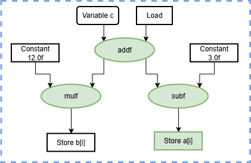
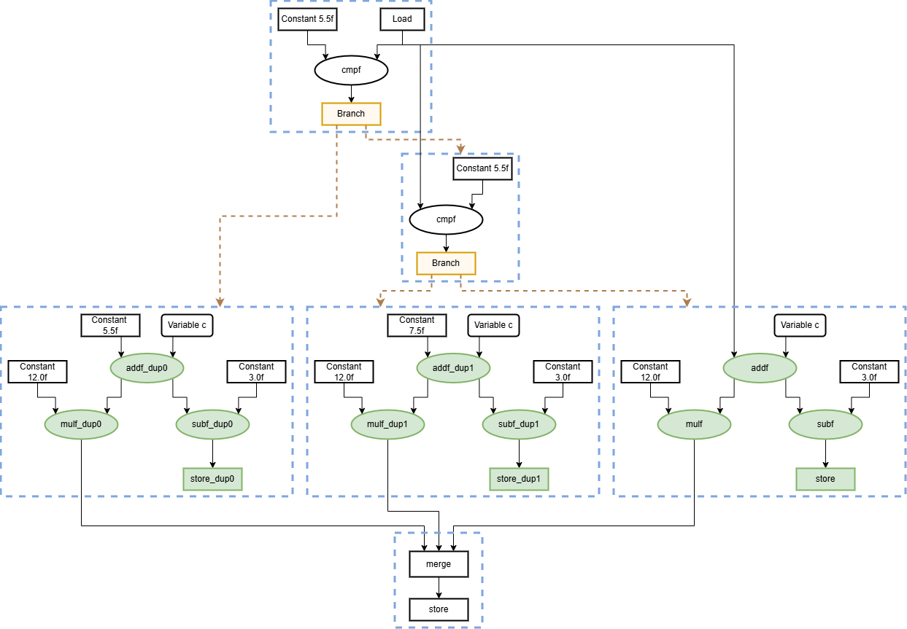

# Pipeline Duplication

## Overview
The Pipeline Duplication Pass duplicates specific program paths with hardcoded constants. By using pragmas, you can specify a variable that frequently holds a specific value (e.g., `y = 10`). The pass then generates an additional parallel path in the pipeline where that variable is treated as a constant.

This duplication alone does not alter control or program correctness, but rather converts data dependencies to control flow dependencies. For a performance boost it should be combined with eager execution (eagerlyelastic). This allows the new duplicated path to run in parallel with the original logic, hiding latency by starting downstream calculation before the actual value of the variable is computed.

## Pragma Syntax and Usage
The duplication is controlled by defining a start and one or multiple end points. The syntax is as follows:
```
#pragma DYN predict variable = y values = [3] location = start marker = 0 type = int
#pragma DYN predict variable = z location = end marker = 0
```

#### Start Pragma (`location = start`)
Place this exactly above the first operation that you wish to duplicate.
- **variable**: The variable to be replaced by a constant in the duplicated path.
- **values**: A list of predicted values (integers or floats) enclosed in `[]`. For each value in the list an additional speculative path will be created.
- **type**: The exact data type of the values in the list. Possible are `int`, `int32_t`, `int64_t`, `float`, `double`. This has to match the type of the variable that should be replaced.
- **marker**: An integer ID to group a start pragma with its corresponding end pragma(s).

#### End Pragma (`location = end`) 
Place this after the last operation you wish to duplicate.
- **variable**: The result of the final operation in the duplicated sequence.
- **marker**: To match to the corresponding start pragma's ID.


### Constraints & "Well-Defined" Paths
For the duplication to succeed, the graph (the operations that will be duplicated) between the start and end must be well-defined. The pass performs a DFS traversal from the start operation; every path encountered must eventually terminate at:
- A designated **end** pragma
- A **store** operation

If the pass encounters a branch that escapes the duplicated region without reaching one of these valid "sinks," the transformation will fail and the compiler will exit with an error.

This strict boundary is necessary because the compiler operates on an SSA (Static Single Assignment) graph. If an operation branches off from the middle of the duplicated region to an external destination, it creates an ambiguity: the external graph cannot determine which of the two duplicated pipelines it should connect to. Because SSA rules prohibit an operation from having multiple definitions, connecting to both pipelines simultaneously is impossible without breaking the dataflow validity of the program. Enforcing a well-defined boundary ensures all duplicated paths are safely encapsulated or properly merged.

### Example
In this example, we have a start marker predicting that the variable y (loaded from `a[i]`) will frequently take the values `5.5` or `7.5`. To optimize for these values, the compiler must duplicate the operations downstream from this variable. Specifically, the pass duplicates all operations starting from the addition `x = y + c` until every path terminates at either an operation with an end marker or a store operation. Here, the multiplication `z = 12.0f * x` is followed by an end marker, while the other path termiantes at the store operation `b[i] = x - 3.0f`. Because both paths are properly bounded, all intermediate operations can be safely duplicated. The operations that have to be duplicated are highlighted in green in the diagram below. The for loop is not shown for simplification.

```c++
void prediction(inout_float_t a[N], inout_float_t b[N], in_float_t c) {
  for (unsigned i = 0; i < N; ++i) {
    float y = a[i];
#pragma DYN predict variable = y values = [5.5, 7.5] location = start marker = 0 type = float
    float x = y + c;
    float z = 12.0f * x;
#pragma DYN predict variable = z location = end marker = 0
    a[i] = z;
    b[i] = x - 3.0f;
  }
}
```



The pass adds checks to see if the variable matches any of the predicted values. If it does, the program branches into a duplicated version of the code that has been optimized for those values, as seen in the following diagram.




## Pass Implementation

The transformation starts by reading the prediction markers inserted by pragmas in the C++ code, then it identifies all operations downstream a the specific predictive value with a DFS and clones them into isolated conditional blocks. Within each cloned path, the predictive value is replaced by a hardcoded constant.

### Data Structure
The pass stores all configuration details extracted from a group of prediction markers inside a single struct.

```c++
struct PipelineDuplicationPass::PredictionData {
  mlir::Operation *startOp; // Duplication begins here (including this operation)
  mlir::Value predInput;    // Value that will be replaced on duplicated paths
  std::vector<mlir::Operation *> endOps;  // all end operations
  mlir::ArrayAttr values;   // MLIR array with the constants
  std::string dataType;     // String representation of the type (e.g. "int")
};
```

### Overview
The core pass driver (`runOnOperation`) executes the transformation in four phases for each prediction marker:

#### 1. Marker Parsing & Cleanup
The pass begins by calling `readPredictMarker`, which scans the function IR for `dynamatic.prediction_marker` operations. To ensure a clean slate before modifying the Control Flow Graph (CFG), the inputs of these markers are forwarded straight to their users, and the marker operations themselves are deleted from the IR.

#### 2. CFG Splitting
To isolate the entry point of the duplication region, the basic block containing `startOp` (`targetBlock`) is split right before `startOp`. The operations following it are placed into a separate block named `originalRemainderBlock`.

#### 3. DFS & Validation
The pass then runs a Depth-First Search (DFS) via `collectOpsDFS` starting from the results of `startOp`. This tracks all operations directly impacted by the predictive value. The search stops along a path whenever it reaches a user-defined endOp or a `mlir::memref::StoreOp`. If a path hits a dead-end branch (an operation with zero results that is neither a valid terminator nor a store) before reaching an end operation, the pass fails.

To guarantee the graph is really well-defined, as the DFS does not catch everything, `validateDuplicationStructure` inspects the collected subgraph to guarantee it forms a valid, single-exit region. It ensures that no execution paths escape the termination blocks into other duplicated blocks, and verifies that all exit blocks converge back to a single external successor block.

To safely reconnect the duplicated blocks later, the pass also tracks the "outside drivers", which are the values generated inside the duplicated graph that are needed by operations outside of it. For every termination block producing these drivers, new block arguments are appended to the original block interface to serve as the new entry points for those values.

#### 4. Path Generation, Cloning, & Reconverging
The pass loops through each constant saved in the `values` array to build the duplicated paths one by one:

- Conditional Branching: In the `targetBlock`, the pass generates a comparison operation (arith::CmpIOp or arith::CmpFOp, depending on whether floats or ints are used) between the original `predictInput` and the current constant. It creates a `cf::CondBranchOp` to route execution into a newly created `trueEntryBlock` if they match, or into a `nextElseBlock` if they do not.

- Block Reconstruction: For regions that span multiple blocks, a matching set of cloned blocks is generated and placed inside the function block list. Original block arguments are duplicated onto these new structures.

- Operation Cloning: Operations are cloned into their respective new blocks using an `mlir::IRMapping`. The mapper substitutes the original `predictInput` with the literal constant, allowing the path to be optimized with a concrete value. Cloned operations are renamed with a  `_dup` suffix.

- Exiting the Path: At the end of each cloned termination block, a `cf::BranchOp` routes control flow back to the original block, passing the cloned equivalents of the outside drivers.

#### 5. Fallback Path Creation
After all constant paths are created, the final false path redirects to `lastPath`. The original operations identified by the DFS are moved completely out of the original blocks, that are terminating the duplicated region, into newly created fallback blocks. These fallback blocks run the original logic when none of the predictive constants match, jumping back to the original termination blocks with the original outside driver values.

Finally, the pass updates all downstream users of the outside drivers across the entire function scope to read from the newly introduced block arguments instead of the original operation results.


### Helper Functions

`readPredictMarker`
```c++
LogicalResult PipelineDuplicationPass::readPredictMarker(
    mlir::ModuleOp modOp, std::vector<PredictionData> &pragmaData);
```

Scans the function IR for `dynamatic.prediction_marker` operations generated by the pragmas. It maps markers with identical numerical IDs into the `PredictionData` struct. The value list is parsed with an additional function (`parseValuesList`) to match them to the correct target data type. Once all of the data has been read out, the prediction markers are erased from the module.

`parseValuesList`
```c++
FailureOr<mlir::ArrayAttr> parseValuesList(mlir::ModuleOp modOp,
    llvm::StringRef valuesStr,
    std::string &dataType);
```
A parsing helper that strips brackets and splits the comma-separated string into its values. It converts individual values into their intended types (float, double, int32_t, int64_t) and returns them inside an `mlir::ArrayAttr`.

`collectOpsDFS`
```c++
LogicalResult PipelineDuplicationPass::collectOpsDFS(
    mlir::Value currentVal,
    const std::vector<mlir::Operation *> &endOps,
    mlir::Block *currentBlock,
    llvm::DenseSet<mlir::Operation *> &visitedOps);
```

Traces the downstream data flow using a Depth-first Search. The recursion records all operations that it passes through and should be duplicated in `visitedOps`. To prevent unsafe duplication, the search stops along a path if it encounters either an `endOp` or a store operation. Values escaping this subgraph are appended to `outsideDrivers` to identify which results must be added as arguments to the next block.

`collectDependenciesUpstream`
```c++
void collectDependenciesUpstream(mlir::Operation *op, mlir::Block *targetBlock,
    llvm::DenseSet<mlir::Operation *> &visitedOps);
```
A backward-traversal helper called during the DFS phase. It walks backward through operand definition chains within a single basic block to collect all upstream calculations (like index and address arithmetic for stores) needed by a tracked operation.

`validateDuplicationStructure`
```c++
FailureOr<std::pair<llvm::DenseSet<mlir::Block *>, llvm::DenseSet<mlir::Block *>>>
  validateDuplicationStructure(
      const llvm::DenseSet<mlir::Operation *> &visitedOps,
      const std::vector<mlir::Operation *> &endOps);
```
Performs structural checks on the CFG region before duplication. It maps out involved blocks and termination blocks, verifying that there are no escaping paths and that all duplicated paths converge smoothly back into a single downstream block.
