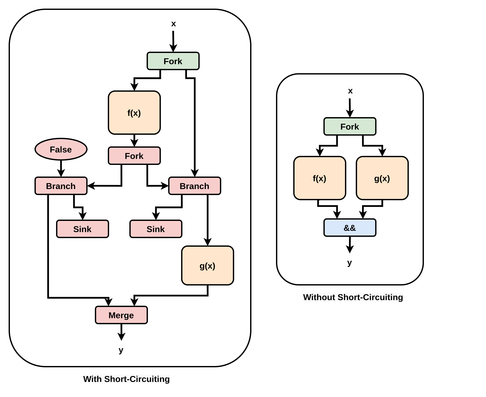

# Source Rewriter

## High-Level Overview

The source rewriter allows alterations to the source-code kernel before compilation begins.

Most of the code in the source rewriter is the use of a boilerplate framework designed for migrating codebases when an API changes, or when moving from one version of C/C++ to another.

The framework allows you to design custom source-code rewrites through the use of a declarative system. You first describe an abstract syntax tree structure to identify as the input, and then specify the new C/C++ code to use as its replacement.

As the source rewriter alters the code file in place, we work on a copy of the kernel we place in the `comp` folder. This is to make sure the original file is never altered by the source rewriter.

## LibTooling and Transformers

The source rewriter is a standalone C++ binary built using LLVM's LibTooling framework.

The core object is a `RewriteRule`, a declarative object that specifies a source-code transformation. The `RewriteRule`, along with a callback function, is then used to construct a `Transformer`. The callback function is called each time the `RewriteRule` is applied, and is given the output of the `RewriteRule` as its input. The `Transformer` therefore defines both 1) the transformation and 2) what to do when you receive the transformation's results. 

In order to use the `Transformer`, we pass it to a `MatchFinder`, which is the object that actually examines the abstract syntax tree. 

However, it is actually a `StandaloneToolExecutor` which uses the `MatchFinder`, as the `StandaloneToolExecutor` provides the functionality for rewriting an entire codebase in one go.

The source rewriter builds the `StandaloneToolExecutor` through LibTooling command-line arguments: these have two main parts: 1) a list of source files, and 2) the flags they should be compiled with, in order to obtain an abstract syntax tree to examine.

Rather than edit the files as the `RewriteRule` is triggered, we instead save all `RewriteRule` outputs in a `AtomicChanges` object. Once all ASTs have been examined, we begin editing the files. 

However, because the `Transformer` object does not cope well with cumulative edits, for each file we apply only one `AtomicChange` from the `AtomicChanges` object. This is because the `Transformer` framework examines all possible applications of a `RewriteRule` before allowing us to apply any changes, but does not support applying overlapping `AtomicChanges`.

We then re-perform the entire process, so if a file receives multiple `AtomicChanges`, no `AtomicChange` is applied based on a stale input. 

The source rewriter therefore uses a loop that executes the entire flow repeatedly until no file has changed.

## Disabling Short-Circuiting

The one rewrite currently implemented is for disabling short-circuiting on `&&` and `||`, which is part of the C specification.

If we take `y = f(x) && g(x)` as an example, we can see the circuit with and without short-circuting:

In the left circuit, `g(x)` only executes if `f(x)` is `False`, which matches the C specification. In the right circuit, `g(x)` executes regardless of the value of `f(x)`, allowing it to begin execution earlier, and also avoiding the more complex control flow of the conditional execution.

If an HLS developer does want the control-flow dependency that short-circuiting normally provides, that is easily expressed with an `if` statement instead.

However, how to disable short-circuiting is more difficult to understand: Our source rewrite to disable this feature is to convert `a && b` to `(!!(a) & !!(b))` and `a || b` to `(!!(a) | !!(b))`. 

The first conversion is from `&&` to `&` and `||` to `|`, or from the logical operator to the bitwise operator. This is because bitwise operators do not short-circuit in the C specification. 

The second conversion is introducing `!!(x)`. `!!(x)` is a commonly-used C construct for "boolean coercion", as the output of `!!(x)` can only be `0` or `1`. This avoids issues cause by the C specification considering any non-zero value to be `True`.

