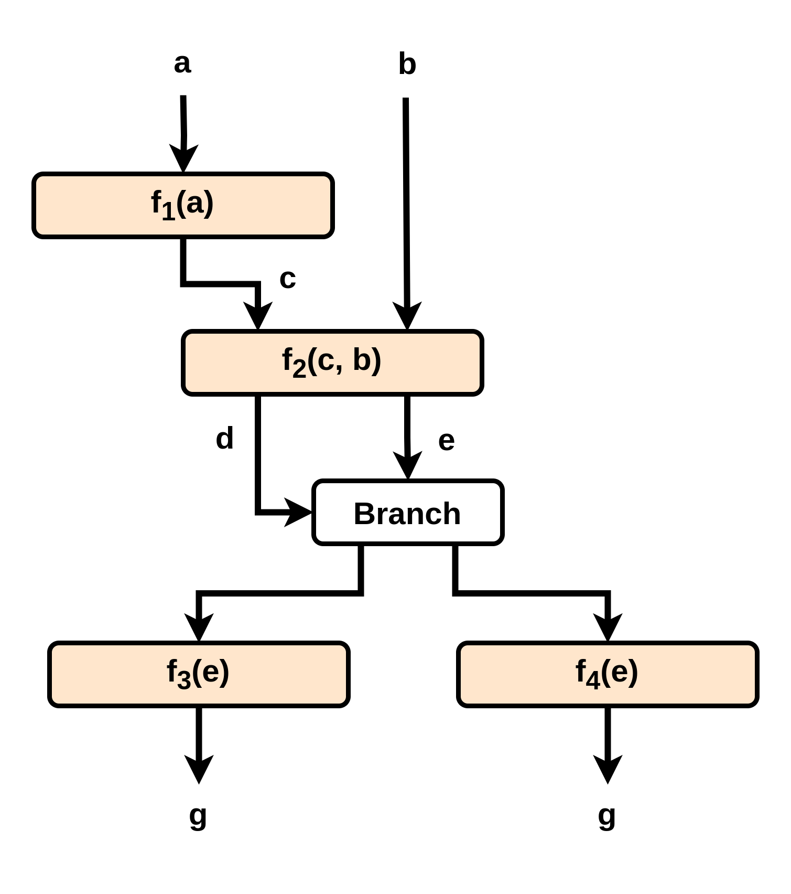
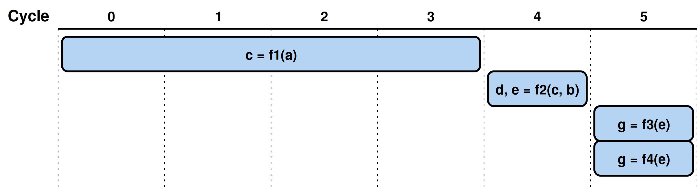
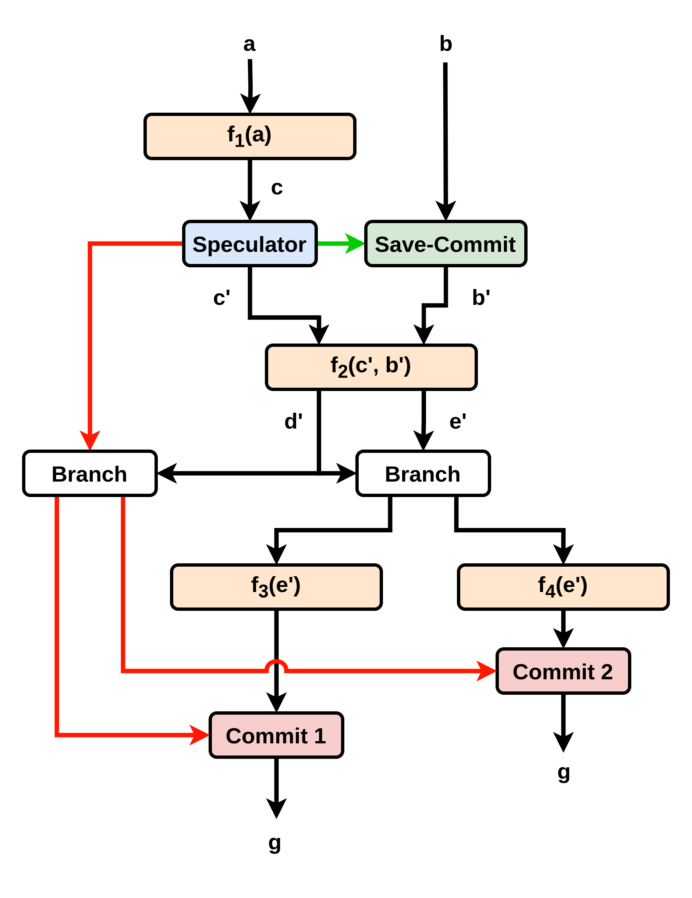
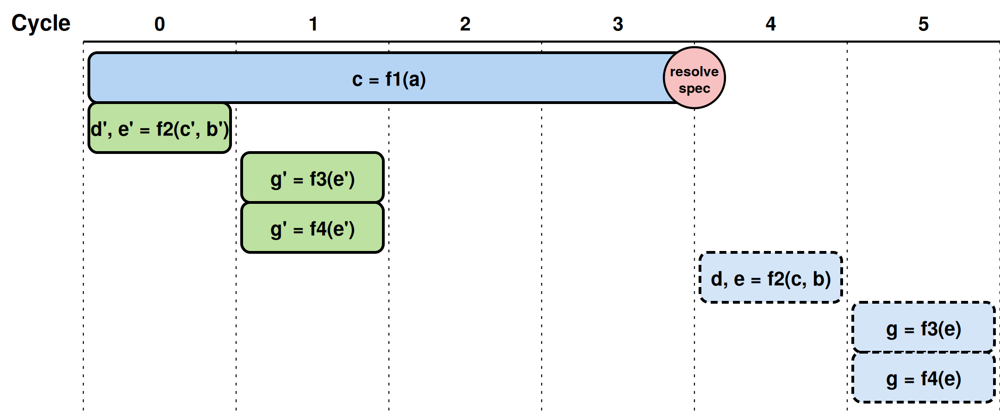
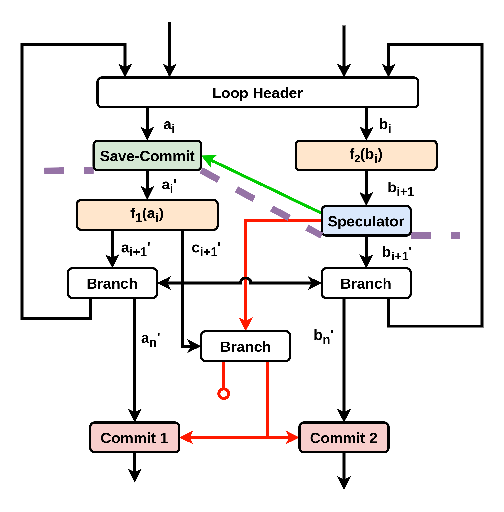
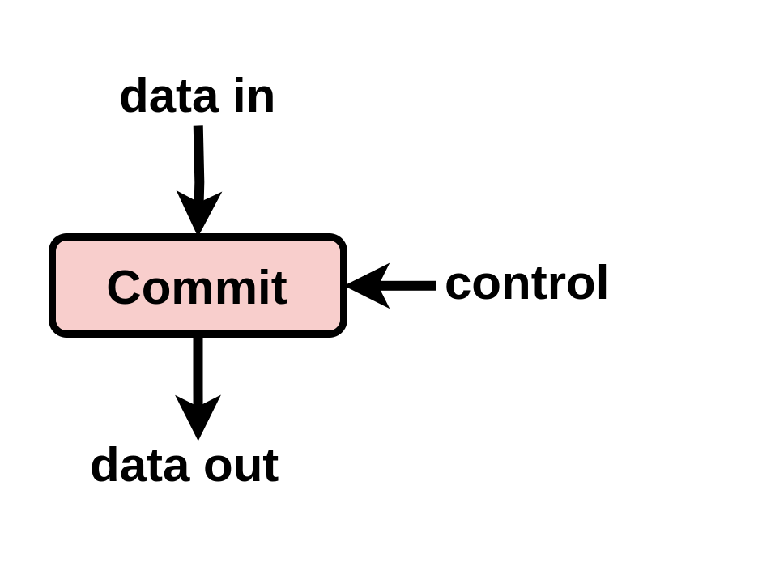
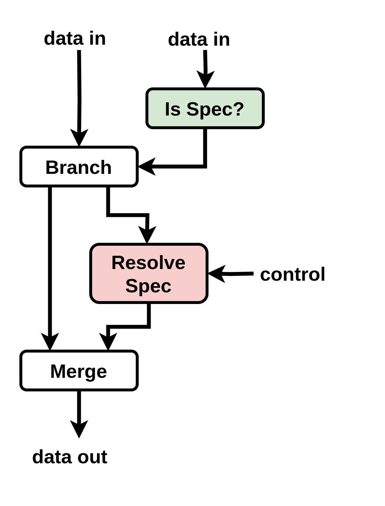
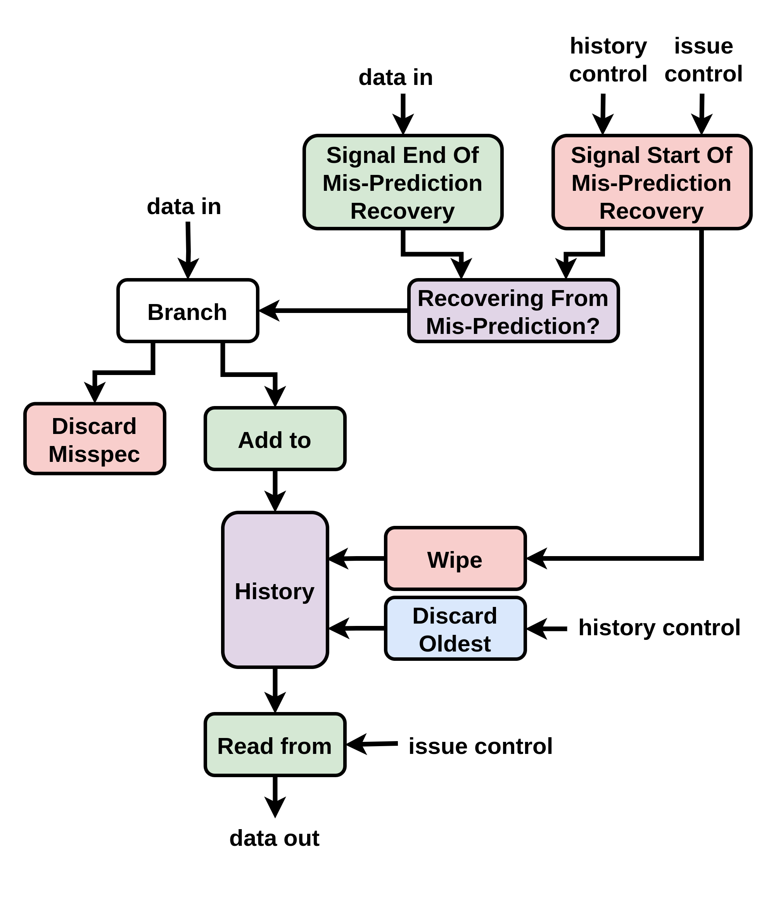
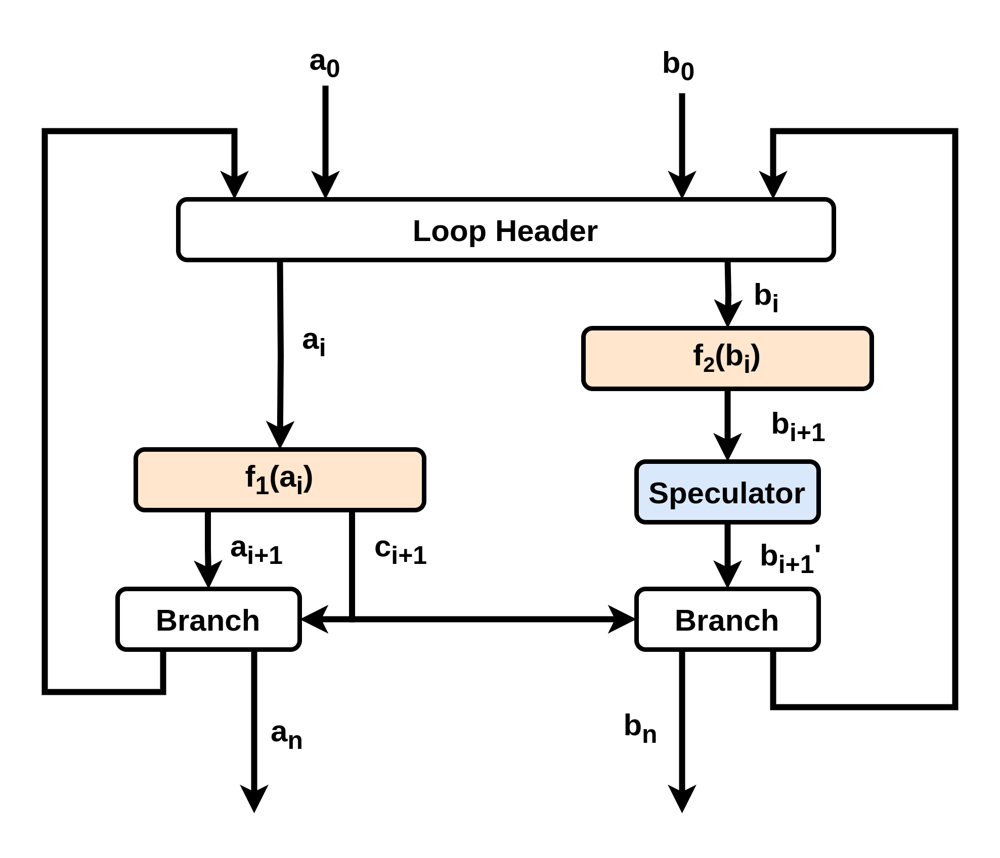

# Speculation

## High-Level Overview

Our token-prediction speculative flow allows the breaking of arbitrary data dependencies, and therefore reduction of performance bottlenecks. 

Take a snippet of python code as a simple example:

```python
c = f1(a)
d, e = f2(c, b)
if d:
  g = f3(e)
else:
  g = f4(e)
```

This example does not demonstrate an especially useful case of speculation, but it does demonstrate well the functionality of the individual speculative units and how they communicate.

For this example, the following fine-grained dataflow circuit would be produced:



And an example corresponding schedule:



With our token-prediction speculative flow, the circuit is transformed to look as follows:



Which in turn implements the following schedule instead:



`f2(c', b')` can begin in cycle 0, and perform either `f3(e')` or `f4(e')` in cycle 1. We discover if prediction was correct at the end of cycle 3. The speculator informs either `Commit 1` or `Commit 2` of this, by consuming `d'` a second time along the new red edges. The green `Save-Commit` unit acts saves `b` in its internal history. In the case that the prediction of `c` was incorrect, the `Speculator` informs the `Save-Commit` along the green edge, and the `Save-Commit` re-issues b, allowing the original schedule to run in order to recover from the mis-prediction.

### High-Level Overview: Non-Spec vs. Spec
In our token-prediction speculative approach, there are two types of values: `non-spec` and `spec`.

If a value is `non-spec`, it means no prediction was involved in the creation of this value. Since there is no prediction, that non-existant prediction was never be resolved. This means there will never be a value that arrives from the non-existant resolution to tell us what to do. 

Whenever a `non-spec` value arrives at a point where speculation is resolved, we must automatically apply the same decisions as when we resolve a prediction to have been correct.

If a value is `spec`, a prediction was involved in its generation. When it arrives at a point where speculation is resolved, we must wait to see if it resolved correctly or incorrectly before taking any action. 

We identify `non-spec` vs `spec` data via an additional bit attached to values. 

### High-Level Overview: The Speculator

The core dataflow unit of token-prediction speculative flow is the speculator. Currently, it is placed manually, based on a user-written `#pragma dyn speculate` in the input kernel source code. The speculator can be used to break data dependencies, producing a data output before receiving a data input, by generating predicted values. These values can then be used to begin computations earlier, often resulting in improved circuit performance. The speculator has an internal history of predictions made: for a maximum of N in-flight predictions, this internal history must be at least of size N. 

### High-Level Overview: The Commit Units

The second unit used in our token-prediction speculative flow is the commit unit. Outputs of the computation done with predicted inputs will eventually reach commit units, which provide a hard boundary of how far a `spec` value can travel from the speculator. 

When the true data input arrives at the speculator, the speculator communicates to these commit units if the prediction was correct or incorrect. If correct, the commit units allows the value to `pass`. If incorrect, the commit unit `kills` the value, preventing the misprediction from impacting the correctness of the circuit's execution. We use `kill` to refer to "dropping" values which are incorrect. 

From the reasoning discussed in [Non-Spec Vs. Spec](#high-level-overview-non-spec-vs-spec), a `non-spec` value is automatically `pass`-ed by the commit unit without receiving any communication from the speculator.

### High-Level Overview: The Save-Commit Units

The third unit of the approach is the save-commit units. 

The primary purpose of the save-commit units is to save values, to allow recovery from mis-prediction. When a computation begins with a predicted input, a set of save-commits save all other inputs to that computation (one save-commit per input). When mis-prediction is discovered, the computation must be re-executed. The speculator issues the real data input for the first time, and each save-commit re-issues their saved value. In order to have up to N in-flight predictions, the save-commits must be able to store N saved values.

The secondary purpose of the save-commit units is the "commit" purpose. This refers to how the save-commit updates its history of stored inputs after mis-prediction is detected. 

### High-Level Overview: How to Place Commits

Commit units are placed to limit where unresolved `spec` values can reach. In general, we place commit units to prevent `spec` values from exiting the circuit along any external connection, including being stored to memory. 

Commit units can also be placed to prevent any arbitrary computation from being performed speculatively, for any arbitrary reason. 

Additional commit units are also needed for ordering correctness, but we will discuss this later.


### High-Level Overview: The Snapshot Approach (How to Place Save-Commits)

In the "snapshot approach", we use the save-commits units to store a "snapshot" of the state of the circuit at the time the prediction occured. When prediction happens, the save-commits save their incoming values to their internal history, to allow re-issuing of that snapshot. 

If mis-prediction is detected, we `kill` all computational outputs that are generated after the snapshot was created, and roll the entire circuit state back to this point, even if computation occured below the snapshot which was not affected by the mis-prediction. For multiple in-flight predictions, the snapshot approach means that any predictions made after a mis-prediction are also considered mis-predicted. 

The input values to the save-commits are often `non-spec`. However, computational outputs generated from `non-spec` inputs are `non-spec`, and `non-spec` outputs automatically pass through commit units: they cannot be `kill`-ed. The save-commits therefore issue the snapshot as `spec` when prediction happens, to guarantee that all outputs will be `spec`, and therefore all outputs will be `kill`-able if mis-prediction is detected.

In mis-prediction recovery, the speculator issues the correct value as `non-spec`, and all save-commits re-issue their values also as `non-spec`, as no prediction was involved in the issuing of these inputs. 

This guarantees that exactly one value will be generated for each output, even is a snapshot is executed twice.

If any computation receives input only from the save-commit units, and no input from the speculator, this computation will be redundantly re-executed when mis-prediction recovery happens. The placement of the save-commit must therefore trade-off the degree of redundant execution with how many save-commits must be placed to create a full snapshot.

An example below shows a single save-commit above a computation which will never be affected by prediction:



The snapshot approach means the value issued by the save-commit is `spec`, so that the outputs are correctly `kill`-ed when mis-prediction is detected. `f1(ai)` then re-executes with the same inputs (but now `non-spec`) during mis-speculation recovery. 

You can see that the output of the save-commit must be marked as `spec` here. Otherwise, a `non-spec` `ai+1'` would pass through `Commit 1` twice if mis-prediction occurs when `ci+1'` is `false`. This means the circuit would produce two output values along this edge when there should only be one.

Another valid save-commit placement would be two save-commits on the two outputs of `f1(ai)`. This would reduce redundant re-computation, but would require another save-commit. 

## Individual Unit Behaviour

Here we discuss exactly how each unit functions, without extensive discussion of the properties required for this behaviour to result in correct execution.

An important fact (which we will justify more later) is that the save-commits use state to `kill` mis-speculated tokens, and so see no explicit `kill` values as input. Commit units are stateless, and so receive a `kill` or `pass` value along their `control` input for every `spec` input they receive.

### Individual Unit Behaviour: The Commit Unit

The commit unit has two inputs: `data in` and `control`, and one output: `data out`.



The behaviour of the commit units is different for `non-spec` vs `spec values`:



A `non-spec` value has no corresponding `control`, and so passes through the commit unit immediately.

A `spec` value must join with a `control` signal to either be `pass`-ed to the output or `kill`-ed.

### Individual Unit Behaviour: The Save-Commit Unit

The save-commit unit has three inputs: `data in`, `issue control`, and `history control`, and one output: `data out`.

A simplified version of how the save-commit works is shown below, with stateful aspects in purple, mis-prediction recovery aspects in red, and "normal operation" aspects in green:



When the save-commit is not recovering from mis-prediction:
1. `data in` is stored in the history.
2. `issue control` is a value from the speculator telling the save-commit to issue a `spec` output, since the rest of the snapshot is valid.
3. `history control` is a value from the speculator telling the save-commit to `discard` its oldest saved value, as it is no longer necessary.

When mis-prediction is discovered, the speculator informs the save-commit using both `history control` and `issue control`:
1. The save-commit re-issues its oldest saved value. 
2. The entire history is wiped.
3. Incoming `spec` data is treated as mis-predicted.
4. The arrival of `non-spec` data is treated as the end of mis-prediction recovery.

This omits some details about the order in which things happen, synchronization between the two control channels, and what happens when the speculator decides not to speculate, which we will discuss in more detail later.

We will also discuss later how we treat the arrival of `non-spec` data as a flag event, which indicates no mis-speculated values remain in the circuit.

### Individual Unit Behaviour: The Speculator


# Cut Content

The placement of the `Save-Commit` units to form the "snapshot point" must-trade off the extent of redundant computation with the number of `Save-Commit` units required to cut every path through the circuit. 

For example, we could also form the "snapshot" point using 2 `Save-Commit` units, one on each of the outputs of `f1(ai)`, reducing the number of redundant re-executions by 1. However, since speculator can have multiple in-flight predictions, `f1` must still execute many more times than in the original schedule, as each mis-speculation resets the loop iterator back to a prior value. 

This approach simplifies consideration of how to combine speculative and non-speculative values: they are never combined, because a set of values passing through the "snapshot point" must either be all speculative or all non-speculative. 


When a prediction is discovered to be correct, the speculator informs the save-commit and commit units of this, so they can take the appropriate response. 

When mis-prediction is discovered, the effects of that prediction and also all later predictions must be `kill`-ed, and the computation must be re-executed with the correct input values. The speculator informs the save-commits of the mis-prediction once, causing the computation to receive a full set of correct inputs. The speculator then sends one `kill` communication to the commit units per unresolved prediction in its history. This causes the effects of all predictions after the mis-prediction to be `kill`-ed.

However, the speculator may still also receive mis-speculated values as input which must also be `kill`-ed. Therefore after mis-prediction is discovered, the speculator `kill`-s all incoming speculative values until a non-speculative value arrives. We discuss the arrival order of mis-speculated and non-speculative values in more detail below.

### High-Level Overview: The Commit Units


Computations performed with predicted inputs may cause different paths through the circuit to execute, and so commit units are not guaranteed to receives a value each time prediction happens. Therefore, the communication network between the speculator and the commit units must mirror the network used to deliver data inputs to the commit unit.  


### High-Level Overview: The Save-Commit Units

The secondary purpose of the save-commits is the "commit" purpose. 

When a save-commit is informed a prediction was correct, it `discards` the oldest saved value, as the computation the value belongs to will not be re-executed. We use `discard` for "dropping" values which are correct but no longer needed. 

When a save-commit is informed a prediction was incorrect, it re-issues the oldest undiscarded value, to allow the re-execution of the computation with correct inputs. The save-commit also `kills` its **entire history of saved values**, as all outputs generated after the mis-prediction are considered mis-speculated.

However, the save-commit may still also receive mis-speculated values as input which must also be `kill`-ed. Therefore after mis-prediction is discovered, the save-commit `kill`-s all incoming speculative values until a non-speculative value arrives. We discuss the arrival order of mis-speculated and non-speculative values in more detail below.

### High-Level Overview: Commit vs. Save-Commit vs. Speculator Mis-Prediction Kill Behaviour

Communication between the speculator and the save-commit for mis-prediction is simpler than communication between the speculator the commit units. 

One reason for this simpler communication is that commit units may be placed on conditional paths, and so have no guarantee they will ever execute. The sequence of `kill` or `pass` values that arrive at an arbitrary commit unit could therefore take any value, and so the exact sequence must be communicated to the commit unit.

If the speculator went multiple predictions ahead and then discovers mis-prediction, the effects of the later predictions must also be `killed`. The speculator performs a round of communication with the commit units for each prediction that must be resolved. For each round of communication, the set of commit units that executed for that specific prediction will receive the communication to `kill` the next incoming value. 

The speculator and save-commits instead execute unconditionally, that is they must all execute for every round of speculation. This provides useful information about the sequences of `pass` and `kill` that should be applied at their inputs. 

A second reason for this simpler communication is that the speculator and save-commit units do not wait for `pass` values before consuming speculative values. If they did, we would be limited to 1 in-flight speculation, as the speculator and save-commits would wait for the first speculation to resolved before beginning the next round of speculation.


If the speculator went multiple predictions ahead and then discovers mis-prediction, the speculator still only communicates with the save-commit units once. 

th the save-commit and speculator receive mis-speculated values at their input.


There have been 2 previous approaches for deciding how to save non-speculative input values in order to re-execute when mis-prediction occurs. 

The original approach saved non-speculative values using 2 different types of dataflow units, and only saved non-speculative values directly before they interacted with a speculative value. This caused complications in cases where the speculative value did not impact the control flow of the circuit. 

An example of such a circuit is below:



Dynamatic does not literally use combined loop header units, however the connections between the units which make up this behaviour are not compatible with the assumptions of the original approach. 

A second approach by Haoran Zhao solved these issues by moving to 3 units for deciding how values are saved and computations re-executed. By simplifying this to the use of a single unit, we arrived at the current approach, which we call the "snapshot" approach.


This is also what allows the `Save-Commit` units to `kill` their entire input history when mis-prediction is detected. Every value generated after the prediction is considered mis-speculated, even if they were not affected by the prediction.

### High Level Overview: Re-Speculating after Mis-Prediction 

When mis-prediction occurs, the speculator and save-commits issue non-speculative values for mis-prediction recovery. 

All speculative values anywhere in the circuit are at this point considered mis-speculated, and should be killed. Fine-grained dataflow circuits do not guarantee the location or arrival time of any of these speculative values. 

However, for correct execution, we must be able to tell this set of mis-speculated values from a future round of speculation, if speculation begins again. 

Despite providing no guarantees about arrival time, with some effort we can provide guarantees about the arrival order of tokens.

Therefore, in the current implementation, we separate the two sets of values by the arrival of the non-speculative values. Values that arrived before the non-speculative data are considered mis-speculated, and and values that arrive after the non-speculative data are considered to be from a new round of speculation.

The speculator and save-commits units therefore individually exit from their mis-prediction recovery state with the arrival of a non-speculative value at their input.


## Interface

## Internal Structure


