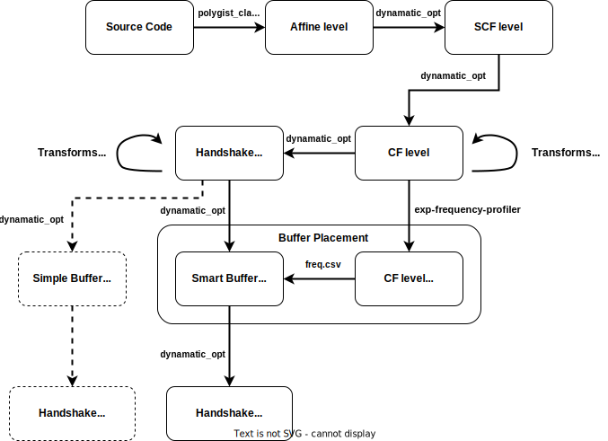

# Dynamatic's High Level Synthesis Flow
> Flow script [compile.sh](../../../tools/dynamatic/scripts/compile.sh)

## Diagram of the Overall Compilation Flow

### Stage 1: Source -> Affine level 
In this stage, we convert source code to affine level mlir dialect with `polygist` and generate the `affine.mlir` file.

### Stage 2: Affine level -> SCF level
In this stage, we do the following two steps:
- Conduct pre-processing and memory analysis with `dynamatic_opt` and generate `affine_mem.mlir`.
- Convert the affine level mlir dialect to structured control flow(scf) level mlir dialect and generate the `scf.mlir` file. 

### Stage 3: SCF level -> CF level
In this stage, we convert the scf level mlir dialect to control flow(cf) level mlir dialect and generate the `std.mlir` file.

### Stage 4: CF level transformations
In this stage we conduct the following two transformations in the cf level in order:
- Standard transformations and generate the `std_transformed.mlir` file.
- Dynamatic specific transformations and generate the `std_dyn_transformed.mlir` file.

### Stage 5: CF level -> Handshake level
In this stage we convert the cf level mlir dialect to handshake level mlir dialect and generate the `handshake.mlir` file.

### Stage 6: Handshake level transformations
In this stage, we conduct handshake dialect related transformations and generate the `handshake_transformed.mlir` file.

### Stage 7: Buffer Placement
In this stage, we conduct the buffer placement process, we have two `mutually excluseive`` options:
- `Smart buffer placement`:
  - Profiling is performed at the CF level mlir dialect (specifically `std_dyn_transformed.mlir`), and the results are exported to a `freq.csv` file.
  - This `freq.csv` file is then used in the smart buffer placement process.
- `Simple buffer placement`: (Dashed lines in the above diagram)
  - No need for profiling, we directly do buffer placement.

Results are stored in `handshake_buffered.mlir` file.

### Stage 8: Export
In this stage, we conduct handshake canonicalization and produce the final export file (`handshake_export.mlir`).

