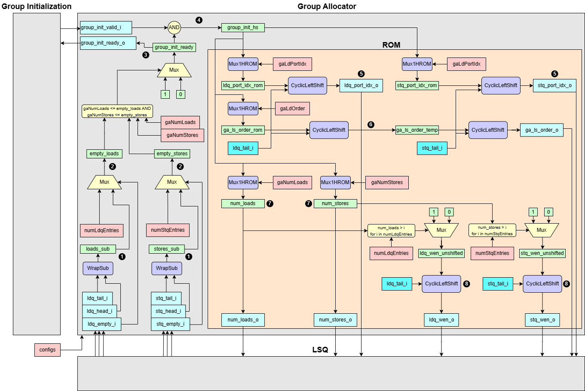

# Group Allocator

Detailed documentation for the `GroupAllocator` generator, which emits a VHDL entity and architecture to coordinate issuance of load and store groups into the LSQ. It allocates free queue entries based on group size reqirements and enforces load-store ordering policies.



## Interface Signals

| Signal Name         | type           | Description     |
| ------------------- | -------------- | --------------- |
| `group_init_valid_i`| `LogicArray`   | Group Allocator handshake valid signal|
| `group_init_ready_o`| `LogicArray`   | Group Allocator handshake ready signal |
| `ldq_tail_i`        | `LogicVec`     | Load queue tail|
| `ldq_head_i`        | `LogicVec`     | Load queue head |
| `ldq_empty_i`       | `Logic`        | (boolean) load queue empty|
| `stq_tail_i`        | `LogicVec`     | Store queue tail|
| `stq_head_i`        | `LogicVec`     | Store queue head|
| `stq_empty_i`       | `Logic`        | (boolean) store queue empty|
| `ldq_wen_o`         | `LogicArray`   | Load queue write enable|
| `num_loads_o`       | `LogicVec`     | The number of loads |
| `ldq_port_idx_o`    | `LogicVecArray`| Load queue port index |
| `stq_wen_o`         | `LogicArray`   | Store queue write enable|
| `num_stores_o`      | `LogicVec`     | The number of stores|
| `stq_port_idx_o`    | `LogicVecArray`| Store queue port index|
| `ga_ls_order_o`     | `LogicVecArray`| Group Allocator load-store order matrix |

## Operational Summary
1. **Compute the number of free entries for loads and stores**  
     ```vhdl
     loads_sub  = (ldq_head - ldq_tail) mod numLdqEntries  
     stores_sub = (stq_head - stq_tail) mod numStqEntries
     ```  

2. **Apply `empty_loads` overrides**  
If `ldq_empty_i` or `stq_empty_i` is high (the load queue or the store queue has no entries), set corresponding count to maximum (`numLdqEntries` or `numStqEntries`). Otherwise, set it as the number of free entries.

3. **Generate ready mask**  
For each group `g`, assert `group_init_ready[g] = 1` when there is enough empty space in the LSQ so that it can accomodate all loads and stores in each group.

4. **Handshake filtering**  
Compute `group_init_hs[g] = group_init_ready[g] ∧ group_init_valid_i[g]` to mask only active requests.

5. **ROM lookup and rotate: load ports and store ports**  
Using `group_init_hs` as select (choose one group), read from ROM tables (`gaLdPortIdx`, `gaStPortIdx`) via `Mux1HROM` (choose only the chosen group's loads and stores port information), producing temporary vectors `ldq_port_idx_rom` and `stq_port_idx_rom`. Apply `CyclicLeftShift` to save this information in the LSQ from its tail.

6. **Rom lookup and rotate: Load-Store order matrix**  
  Using `group_init_hs` as select (choose one group), fetch the corresponding load-store order matrix from ROM. Then, align it to the circular buffer by applying `CyclicLeftShift`:  
    - Shift each row by `ldq_tail_i`.  
    - Shift each column by `stq_tail_i`.

8. **ROM lookup: the number of loads and stores**  
Similar to (5), read `gaNumLoads` and `gaNumStores` from ROM which have information about the number of loads and stores for each group. One of groups is chosen by `group_init_hs`.

9. **ROM lookup and rotate: Write Enable Mask**  
    Read `numLdqEntries` (and `numStqEntries`) from ROM to determine the total LSQ depth.    Generate an unshifted write-enable mask of length `numLdqEntries` with the first `num_loads` bits set to ‘1’.  
    For example, if `num_loads = 3` and `numLdqEntries = 8`, then `ldq_wen_unshifted = 11100000`     Finally, align this mask to the circular buffer by applying a `CyclicLeftShift` by `ldq_tail_i`.  
    If `ldq_tail_i = 2`, the resulting vector is `ldq_wen_o = 10000011`.
