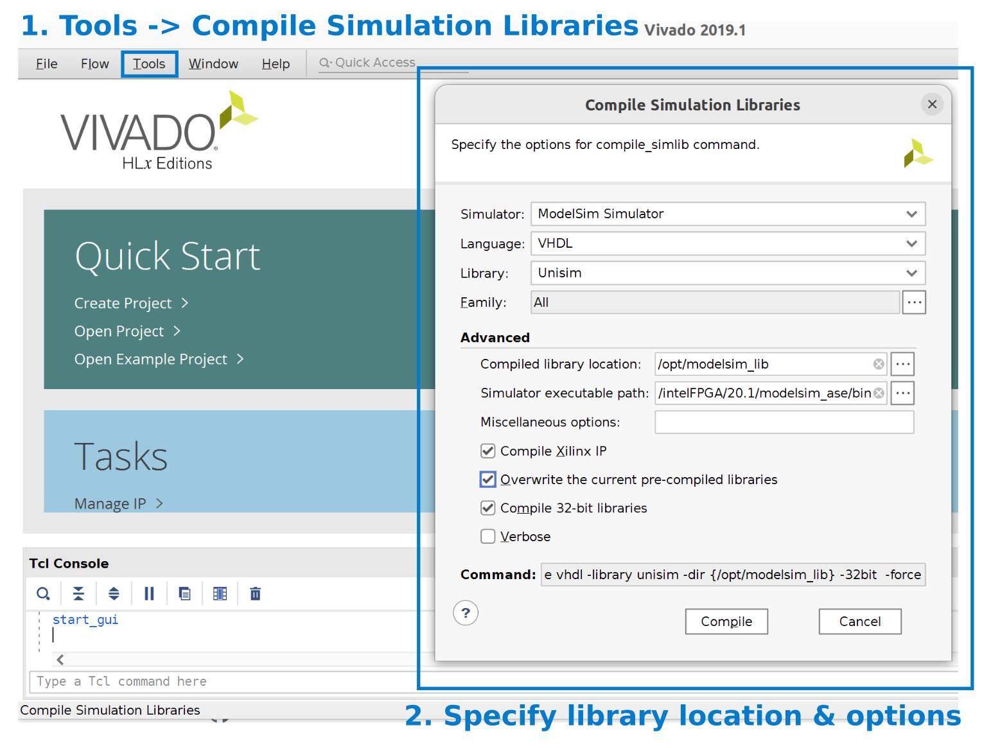

# Floating Point Units

This document explains the integration of floating-point units in Dynamatic. Dynamatic relies on external frameworks to generate efficient floating-point units. The current version of Dynamatic supports floating-point units from two generators:

- [FloPoCo](https://flopoco.org/)
- [Vivado](https://www.amd.com/en/products/software/adaptive-socs-and-fpgas/vivado.html)

## How to Specify the Unit Generator?

In order to specify which units to use, the user can use the following command when executing dynamatic:

```
set-fp-units-generator generator_name
```

For instance, here is a complete script used in Dynamatic's frontend that uses the floating-point units generated by Flopoco:

```
set-dynamatic-path .
set-fp-units-generator flopoco
set-src integration-test/fir/fir.c
compile 
write-hdl
simulate
synthesize
exit
```

Dynamatic uses flopoco by default.

### Important: Using Vivado's Floating Point Units

Vivado's floating point units are **proprietary**. Therefore, we need to compile the modelsim simulation library using Vivado, and point Dynamatic to the location of the simulation library and the installation path of Vivado.

#### Compiling Simulation Library for ModelSim

To use the floating point units provided by Vivado, we need to compile them using Vivado. In Vivado, select Tools -> Compile simulation libraries -> ModelSim simulator, and set the path to where your ModelSim is (see the screenshot below).



Please refer to [this link](https://adaptivesupport.amd.com/s/question/0D52E00007G0iKDSAZ/simulating-on-modelsim-with-vivado?language=en_US) for more information on how to compile the simulation library for ModelSim. 


Make sure that you have **compatible versions** of Vivado and ModelSim. The following link contains a list of compatible versions:
https://www.xilinx.com/support/answers/68324.html


Once the user has downloaded the Vivado IPs, the user has to update the path of these libraries for modelsim simulation by updating the path `/opt/modelsim_lib/` in this [modelsim.ini](https://github.com/EPFL-LAP/dynamatic/blob/main/tools/hls-verifier/resources/modelsim.ini).

#### Important: Extra setup for Vivado

Additionally, the user has to provide the path to the Vivado installation folder using `set-vivado-path`. Here is a complete script for Dynamatic's frontend:

```
set-dynamatic-path .
# Installation path of Vivado 
set-vivado-path /path/to/vivado/Vivado/2019.1
set-fp-units-generator flopoco
set-src integration-test/fir/fir.c
compile 
write-hdl
simulate
synthesize
exit
```

The default value for the vivado path is `/tools/Xilinx/Vivado/2019.1/`. This information is essentially to correctly integrate necessary simulation files of Vivado.


## RTL and Timing Information 

This section describes the organization of RTL modules and the delay/latency information of the floating point units inside Dynamatic.

Dynamatic wraps the floating-point IPs with handshaking logic. Currently, the IP cores are extracted and wrapped in handshake wrappers offline, and we save them in:
```
# Handshake units with flopoco IP cores:
data/vhdl/arith/flopoco/*.vhd
# Handshake units with Vivado IP cores:
data/vhdl/arith/vivado/*.vhd
```

Internally, Dynamatic uses two sets of files to track how they are generated and the delay/latency properties of them:

- Units with Flopoco IP cores: [rtl-config-vhdl-flopoco.json](https://github.com/EPFL-LAP/dynamatic/blob/main/data/rtl-config-vhdl-flopoco.json) (for RTL generation) and [components-flopoco.json](https://github.com/EPFL-LAP/dynamatic/blob/main/data/components-flopoco.json) (for retreiving the delay/latency values).
- Unist with Vivado IP cores: [rtl-config-vhdl-vivado.json](https://github.com/EPFL-LAP/dynamatic/blob/main/data/rtl-config-vhdl-vivado.json) (for RTL generation) and [components-vivado.json](https://github.com/EPFL-LAP/dynamatic/blob/main/data/components-vivado.json) (for retrieving the delay/latency values).

For more information related to timing information, please refer to [this markdown](https://github.com/EPFL-LAP/dynamatic/blob/main/docs/Specs/TimingInformation.md).


