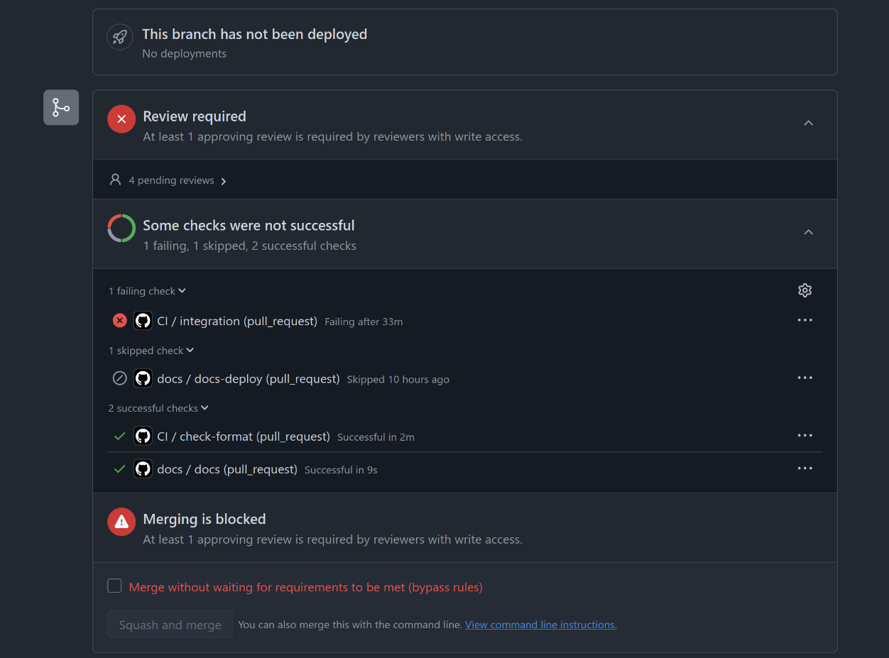
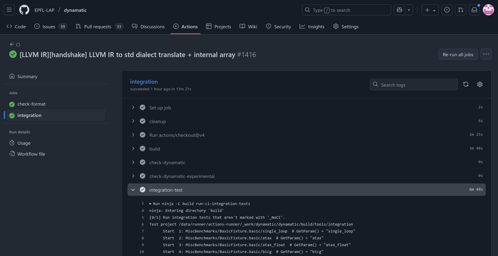
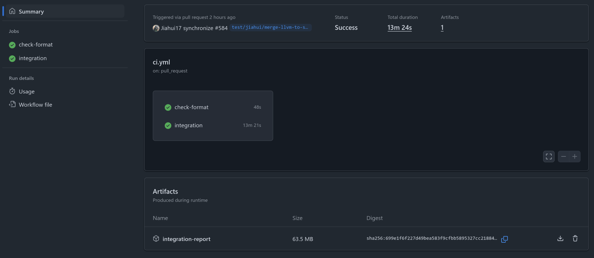
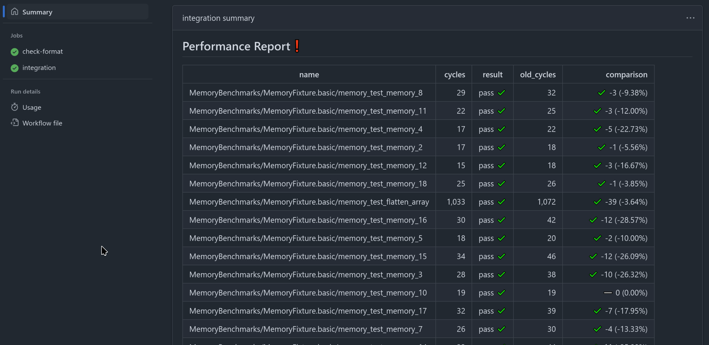

# Actions Workflow

This document describes the GitHub Actions workflow used for the purposes of CI (Continuous Integration) in Dynamatic. More details on parts of the CI can be found in the corresponding documents about [formatting checks](Formatting.md) and [integration testing](IntegrationTests.md). For more details about GitHub Actions, see [the official documentation](https://docs.github.com/en/actions). For a high-level overview of the purpose of GitHub Actions in Dynamatic, see [Introduction](Introduction.md).

## Basics

Workflows are defined using YAML files, placed in the `.github/workflows/` directory. A workflow consists of one or more jobs, and each job consists of one or more steps. 

Workflows are triggered (i.e. run), when certain changes on the repository occur. For example, a workflow can run whenever a pull request into main is opened/marked ready for reviewm, or when a push is made into a specified branch, and so on. A comprehensive list of such trigger events is available [in the official documentation](https://docs.github.com/en/actions/reference/workflows-and-actions/events-that-trigger-workflows).

Each job is executed in a separate environment, i.e. jobs do not share anything by default. They can run either on GitHub's cloud-based runners, or on user-defined self-hosted runners.
- [GitHub's runners](https://docs.github.com/en/actions/concepts/runners/github-hosted-runners) are ephemeral virtual machines, i.e. they are created only for running that specific job and deleted after the job is finished. This means that they are unsuitable for jobs that require large dependencies, since they would need to be reinstalled every time.
- [Self-hosted runners](https://docs.github.com/en/actions/concepts/runners/self-hosted-runners) can be set up by the repository administrators on any personal/school PC. Since they are regular machines by themselves, one can manage them however he or she wants. This means that dependencies do not need to be installed on every run. The downside is obviously that one needs to own a machine for this and that the contention for it is likely going to be large.

When a job is started on GitHub as part of a workflow, it will be sent to a GitHub cloud runner or picked up by a self-hosted runner, depending on what runner type was specified in the YAML description.

Steps are executed in order on a single runner, as if you were to run the commands normally via the shell on your computer. If a step fails (returns a non-zero exit code), the job will stop and fail, unless otherwise specified.

## Dynamatic's workflow structure

The main Actions workflow for building and integration is described in `.github/workflows/ci.yml`. It runs every time a pull request into main is opened, reopened, updated (i.e. new commits are pushed to it) or marked ready for review (i.e. converted from draft PR to "regular" PR). It consists of two jobs:
- `check-format`, which runs the [formatting checks](Formatting.md),
- `integration`, which runs the build process, [integration tests](IntegrationTests.md) and [MLIR unit tests](../IntroductoryMaterial/FileCheckTesting.md).

`check-format` runs on cloud runners, while `integration` runs on a self-hosted runner that is set up on a VM inside EPFL's network. This is because of the fact that `integration` requires a large number of dependencies which cannot be feasibly installed on every run on GitHub's runners. Another reason why a self-hosted runner is used is because building Dynamatic needs build artifacts to be cached, otherwise the build process would take an unacceptable amount of time because of the Polygeist build. *ccache* is used for this purpose; it caches build results outside of the workspace folder, which allows the workspace folder to be cleaned completely before every run, and avoids issues caused by any leftover state from previous runs. Of course, *ccache*'s cache is a form of state kept in between runs, but we trust that *ccache* does its job properly and gives the same results as if we were to run the entire compilation from scratch.

Simply put, the your interaction with the workflow will look as follows:

```
                      ┌───────────────┐                                
                      │output: results│                                
                      │ and artifacts │                                
                      └───────────────┘                                
                              ▲                                        
                              │                                        
┌────────────────┐            │                                        
│   create PR    │            │            ┌──────────────────────────┐
│       /        │     ┌──────┴──────┐     │use feedback from workflow│
│convert draft to├────►│workflow runs├────►│      to fix errors       │
│ready for review│     └─────────────┘     │     and other issues     │
└────────────────┘            ▲            └────────────┬─────────────┘
                              │                         │              
                              │                         ▼              
                              │             ┌───────────────────────┐  
                              └─────────────┤commit and push changes│  
                                            └───────────────────────┘  
```

## Usage

You don't have to do anything manually to make the CI run; it will run as soon as you open a PR (or do any of the other actions mentioned above). You can see the status of each job on the pull request page.



Click on any of the jobs to see more details. There, you can see the outcome of any individual step (as well as the console output).



Files generated by integration tests (Dynamatic shell output, MLIR intermediate compilation results, HDL files, simulation logs...) are archived by the CI and uploaded to GitHub as an artifact. You can navigate to the workflow summary, where you can find and download the artifact at the bottom:



A new feature is the performance report. Integration test performance (in terms of cycles during the simulation) is collected and outputted in the form of a Markdown table. It is also located in the summary tab and looks like this:



The performance report is generated by the Python script `tools/integration/generate_perf_report.py`. It works by picking up all cycle performances that were recorded during the integration test run and converting them to a user friendly tabular format. Internally, the script uses JSON representation for the performance report, which can easily be saved and parsed again. This is useful because the runner must keep track of what the performance of the main branch is, in order to compare all other branches to it. When a pull request is merged, the performance report saved on the runner is updated to match how the merged code performs. Also, the script will return a non-zero exit code if the worst performance difference compared to the previous report is worse than a given percentage. This percentage is set to 5% in the workflow (you can see the option `--limit 5` that the script is called with in `ci.yml`).

The format of the report is the following. The `cycles` column is the performance of the current branch's integration tests, while `old_cycles` is the performance that was last recorded in main. `result` is the outcome of the integration test. `comparison` is the difference `cycles - old_cycles`; positive is bad, negative is good. You can see the percent difference in the parentheses to the right. If any one test has a `comparison` percent value worse than 5%, the job will fail and you will have a red exclamation mark at the top notifying you that something is not right. Of course, you can always ignore this if you deem the performance difference to be insignificant.

## FAQ

- What OS does the self-hosted runner use?

  - Ubuntu 24.04.2 LTS.

- How do I install dependencies on the self-hosted runner?
  
  - You can't; ask someone who has access.

- What are the "defaults" that the workflow runs?
  
  - The basic integration tests run the following commands in `bin/dynamatic`:

      1. `set-dynamatic-path <DYNAMATIC_ROOT_FOLDER>`
      2. `set-src <PATH_TO_BENCHMARK>` (e.g. `integration-test/fir/fir.c`)
      3. `set-clock-period 5`
      4. `compile --buffer-algorithm fpga20`
      5. `write-hdl --hdl vhdl`
      6. `simulate`
      7. `exit`

- How do I add a certain feature in the "default" verification flow? / How do I make it run with different flags (e.g. different buffering algorithms)?

  - Add an integration test that runs whatever code you want the verification flow to run. Note that tests whose names contain the string `NoCI` will be ignored by the workflow. See [Integration](IntegrationTests.md).

- How do I run the same thing that the CI does on my machine?

  - For integration tests, use `ninja -C build run-ci-integration-tests`. For formatting checks, see [Formatting](Formatting.md).

- The CI is failing the formatting check, but it passes it on my machine, what's wrong?

  - Make sure you have the same version of clang-format and autopep8 as the ones used in the CI. You can see which versions are used in the `.github/workflows/ci.yml` files.

- Is there a possibility of leftover state from previous runs to affect my run on the self-hosted runner?

  - No. This used to be a problem, but in the current setup, the entire workspace folder is emptied before the `integration` job runs. The only thing that is shared is ccache's cache, which is located somewhere else on the runner. This is because without it, building Polygeist would take a very very long time. We trust that ccache does its job properly, but if you are certain that it is the culprit for some issue you are having, contact someone with runner access to clear the cache for you.