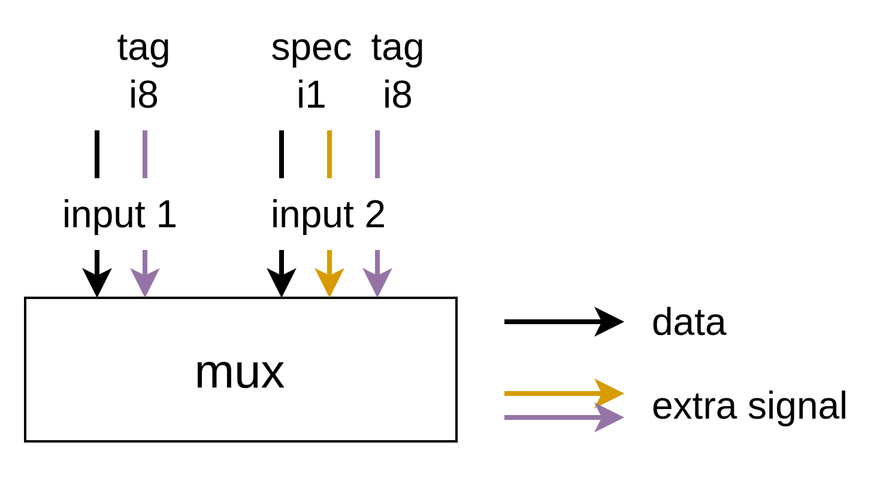
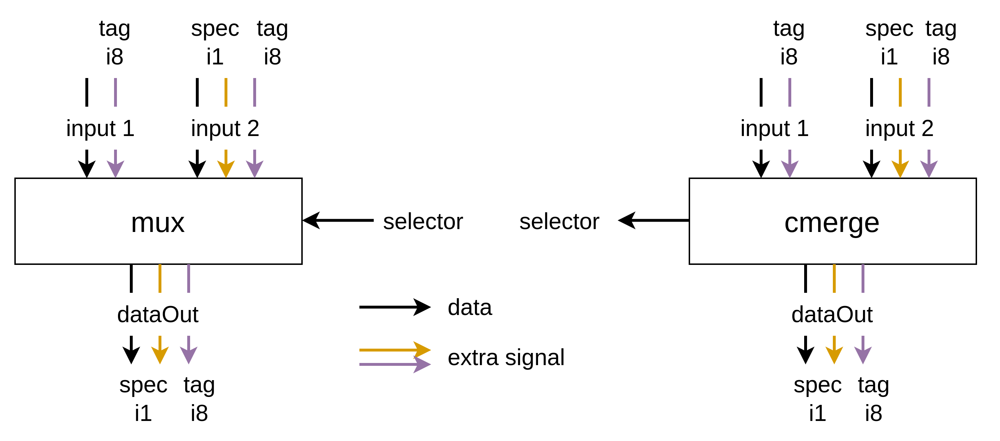
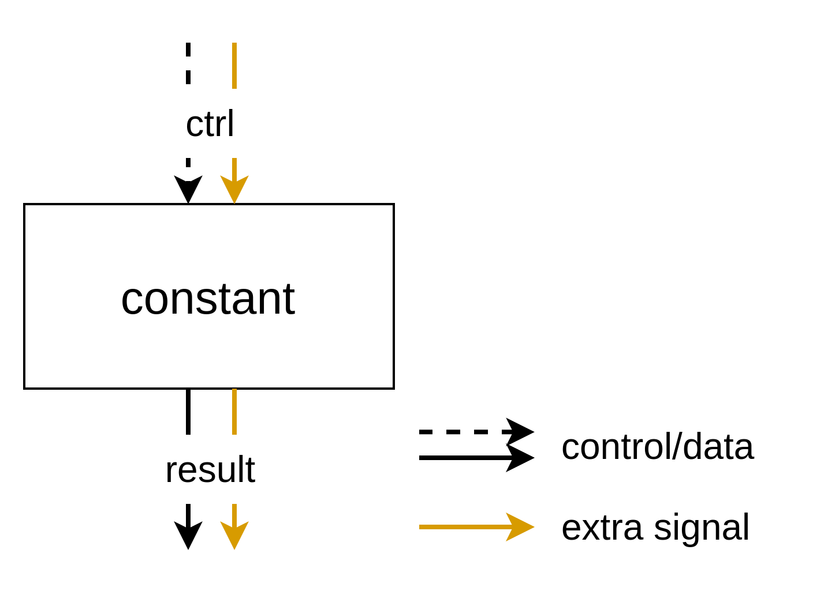

# Extra Signals for Operations

The concept of extra signals has been introduced into the Handshake TypeSystem, as detailed [here](https://github.com/EPFL-LAP/dynamatic/blob/main/docs/Specs/TypeSystem.md). This feature allows both channel types and control types to carry additional information, such as spec bits or tags. Each operation must handle the extra signals of its inputs and outputs appropriately. We use MLIR's type verification tools to enforce rules for how extra signals are passed to and from operations. Since these rules differ from operation to operation, we describe them in this document.

## Operations Within a Basic Block

Here, operations are considered within a basic block if all their operands and results are used exclusively within that block. With a few exceptions, most operations within a basic block are required to have consistent extra signals across all their inputs and outputs.

To further specify the meaning of "consistent extra signals across all their inputs and outputs", we provide an example: if one of the inputs to `addi` carries an extra signal, such as `spec: i1`, then the other input and the output must also have the same extra signal, `spec: i1`.

This constraint is designed to reduce variability in these operations, simplifying the RTL generation process.

Note that the *values* of these extra signals do not necessarily need to match; their behavior depends on the specification of the extra signal. For instance, in the `addi` example, one input’s `spec` signal might hold the value `1`, while the other input’s `spec` signal could hold `0`. The RTL implementation of `addi` must account for and handle these cases appropriately.

This constraint is enforced using the `AllTypesMatch` or `AllExtraSignalsMatch` type constraints for the operands of such operations.

This design decision was discussed in [Issue #226](https://github.com/EPFL-LAP/dynamatic/issues/226).

## MuxOp and CMergeOp

These operations may have different extra signals for each input because they typically reside at the boundary of a basic block, receiving inputs from various blocks. For instance, the extra signals on the inputs of a MuxOp might look like this:

Each input can carry a different set of extra signals. However, the *type* of any extra signal must remain consistent across all inputs. For example, if one input has `tag: i8`, no other input can have `tag: i1` or `tag: i2`. This is because when there are two input signals with the same name but different widths, they cannot both be propagated to the output with that name.

The extra signals on the data output are determined as follows:

- The data output includes an extra signal `A` if, and only if, at least one of the inputs carries the extra signal `A`.

The selector input (for Mux) or the output (for CMerge) is kept simple, meaning it does not carry any extra signals.

As a result, the complete structure of a Mux or CMerge operation appears as follows:

The data output has spec: i1 and tag: i8 because some inputs have them, and nothing else.

The specification for the output extra signals implies that if an input is selected but lacks a specific extra signal present in other inputs, the Mux or CMerge must provide the value of the missing extra signal for the output.

These rules are enforced using the following constraints:

- `MergingExtraSignals`: Ensures the validity of extra signals across inputs and the data output.
- `AllDataTypesMatchWithVariadic`: Ensures consistency of data types across inputs and the data output.
- `IsSimpleHandshake`: Ensures that the selector operand/result does not include any extra signals.

This design decision was discussed in [Issue #226](https://github.com/EPFL-LAP/dynamatic/issues/226).

For additional examples, please refer to the unit tests.

## MemPortOp (Load and Store)

The `MemPortOp` operations, such as load and store, communicate directly with a memory controller or a load-store queue (LSQ). The ports connected to these operations must be simple, meaning they should not carry any extra signals.

This design ensures that the memory controller can focus solely on managing memory access, while the responsibility for handling extra signals lies with the `MemPortOp`.

Note that these operations can also be considered to reside at the boundary of a basic block, as memory controllers are typically placed outside of any basic block.

For the load operation, the structure is as follows:

- The `addrResult` and `data` ports, used to communicate with the memory controller, must be simple.
- The `addr` and `dataResult` ports must carry the same set of extra signals.

For the store operation, the structure is:

- The `addrResult` and `dataResult` ports, which interface with the memory controller, must also be simple.
- The `addr` and `data` ports must have matching extra signals.

These constraints are enforced using:

- `AllExtraSignalsMatch`: Ensures that the extra signals match between the respective ports.
- `IsSimpleHandshake`: Ensures that the ports connected to the memory controller do not carry extra signals.
- `AllDataTypesMatch`: Ensures the data types of `addr`/`addrResult` and `data`/`dataResult` are consistent.

This design decision was discussed in the issue [#214](https://github.com/EPFL-LAP/dynamatic/issues/214).

## ConstantOp

While this operation falls under the category of "operations within a basic block," it’s worth highlighting due to the non-trivial way it handles control tokens with extra signals that trigger the emission of a constant value.

`ConstantOp` has one input (a `ControlType` to trigger the emission) and one output (a `ChannelType`). Like other operations, the extra signals of the input and output should match.

However, how are the extra signals of the input handled?

Since control tokens can now carry extra signals, it’s natural that a control token with extra signals would trigger the `ConstantOp`.

Upon review, we found it more effective to forward the extra signals from the input directly to the output token, rather than discarding them and hardcoding constant extra signal values in the operation.

As a result, `ConstantOp` is considered constant only for its data, while its extra signal values remain variable.

This design decision was discussed in [Issue #226](https://github.com/EPFL-LAP/dynamatic/issues/226) and [a conversation in Pull Request #197](https://github.com/EPFL-LAP/dynamatic/pull/197#discussion_r1885735050).

## Note

### What Does "Same" Extra Signals Mean?

Comparing extra signals across handshake types is complex. In the IR, extra signals are written in a specific order, but essentially, the extra signals of a handshake type should be treated as a set, where the order doesn’t matter. For example, `[spec: i1, tag: i8]` and `[tag: i8, spec: i1]` should be handled identically. Currently, this comparison is not strictly enforced in the codebase, but this will be addressed in the future.

### Upstream Extra Signals

At present, upstream extra signals are not well handled. For example, the constraints for `MuxOp` and `CMergeOp` do not seem to account for upstream cases. This needs to be updated in the future when the need arises.
