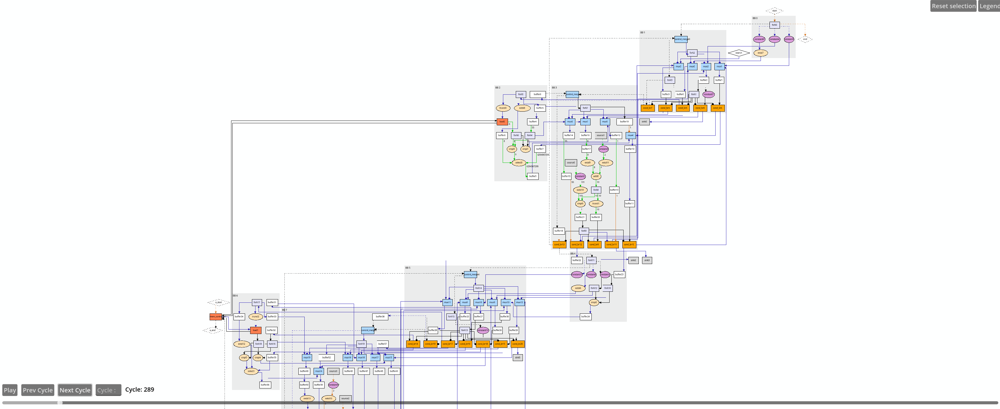

# Running an Integration Test
## 1. Binary Search  
This example describes how to use Dynamatic and become more familiarized with its HLS flow. You will see how:
- compile your C code to RTL
- simulate the resulting circuit using ModelSim
- synthesize your circuit using vivado
- visualize your circuit  

### Source Code
```c
//===- binary_search.c - Search for integer in array  -------------*- C -*-===//
//
// Implements the binary_search kernel.
//
//===----------------------------------------------------------------------===//

#include "binary_search.h"
#include "dynamatic/Integration.h"

int binary_search(in_int_t search, in_int_t a[N]) {
  int evenIdx = -1;
  int oddIdx = -1;

  for (unsigned i = 0; i < N; i += 2) {
    if (a[i] == search) {
      evenIdx = (int)i;
      break;
    }
  }

  for (unsigned i = 1; i < N; i += 2) {
    if (a[i] == search) {
      oddIdx = (int)i;
      break;
    }
  }

  int done = -1;
  if (evenIdx != -1)
    done = evenIdx;
  else if (oddIdx != -1)
    done = oddIdx;

  return done;
}

int main(void) {
  in_int_t search = 55;
  in_int_t a[N];
  for (int i = 0; i < N; i++)
    a[i] = i;
  CALL_KERNEL(binary_search, search, a);
  return 0;
}
```
This HLS code includes control flow inside loops, limiting pipelining in statically scheduled HLS due to worst-case assumptions—here, the branch is taken and the loop exits early. Dynamically scheduled HLS, like Dynamatic, adapts to runtime behavior. Let's see how the generated circuit handles control flow more flexibly.

#### Launching Dynamatic
If you haven't added Dynamatic to path, navigate to the directory where you cloned Dynamatic and run the command below:
```sh
./bin/dynamatic
```
The Dynamatic frontend would be displayed as follows
```sh
username:~/Dynamatic/dynamatic$ ./bin/dynamatic
================================================================================
============== Dynamatic | Dynamic High-Level Synthesis Compiler ===============
======================== EPFL-LAP - v2.0.0 | March 2024 ========================
================================================================================


dynamatic> 
```
#### Set the Path to the C Target C File
Use the `set-src` command to direct Dynamatic to the file you want to synthesize into RTL
```sh
dynamatic> set-src integration-test/binary_search/binary_search.c
```
#### Compile the C File to a Lower Intermediate Representation
You can choose the **buffer placement algorithm** with the `--buffer-algorithm` flag. For this example, we use `fpga20`, a throughput driven algorithm which requires Gurobi installed as describe in the [Advanced Build](../../../UserGuide/AdvancedBuild.md#1-gurobi) page. 
> [!TIP]  
> If you are not sure which options are available for the compile command, add anything after it and hit enter to see the options e.g compile --
```sh
dynamatic> compile --buffer-algorithm fpga20
[INFO] Compiled source to affine
[INFO] Ran memory analysis
[INFO] Compiled affine to scf
[INFO] Compiled scf to cf
[INFO] Applied standard transformations to cf
[INFO] Applied Dynamatic transformations to cf
[INFO] Compiled cf to handshake
[INFO] Applied transformations to handshake
[INFO] Built kernel for profiling
[INFO] Ran kernel for profiling
[INFO] Profiled cf-level
[INFO] Running smart buffer placement with CP = 4.000 and algorithm = 'fpga20'
[INFO] Placed smart buffers
[INFO] Canonicalized handshake
[INFO] Created binary_search DOT
[INFO] Converted binary_search DOT to PNG
[INFO] Created binary_search_CFG DOT
[INFO] Converted binary_search_CFG DOT to PNG
[INFO] Lowered to HW
[INFO] Compilation succeeded
```
> [!TIP]  
> Two PNG files are generated at compile time, `kernel_name.png` and `kernel_name_CFG.png`, allowing you to have a preview of your circuit and its control flow graph generated by Dynamatic as shown below.  
**Binary Search CFG**   
  
**Binary Search Dataflow Circuit**  
  
#### Generate HDL from `mlir` File
An `mlir` file is generated during the compile process.
`write-hdl` converts it into HDL code for your kernel. The default HDL is VHDL. You can choose verilog or vhdl with the `--hdl` flag
```sh
dynamatic> write-hdl --hdl vhdl
[INFO] Exported RTL (vhdl)
[INFO] HDL generation succeeded
```
#### Simulate Your Circuit
This step simulates the kernel in C and HDL (using modelsim) and compares the results for equality.
```sh
dynamatic> simulate
[INFO] Built kernel for IO gen.
[INFO] Ran kernel for IO gen.
[INFO] Launching Modelsim simulation
[INFO] Simulation succeeded
```
#### Sythesize With Vivado
This step is optional. It allows to get more timing and performance related files using vivado. You must have vivado installed.
```sh
dynamatic> synthesize
[INFO] Created synthesis scripts
[INFO] Launching Vivado synthesis
[INFO] Logic synthesis succeeded
```
> [!NOTE]
> If this step fails despite you having vivado installed and added to path, `source` the vivado/vitis `settings64.sh` in your shell and try again.  

> [!WARNING]
> Adding the sourcing of the `settings64.sh` to path may hinder future compilations as the vivado compiler varies from the regular clang compiler on your machine
#### Visualize and Simulate Your Circuit
By running the `visualize` command, the Godot GUI will be launched with your dataflow circuit open, and ready to be played with
```sh
dynamatic> visualize
[INFO] Generated channel changes
[INFO] Added positioning info. to DOT
[INFO] Launching visualizer...
```
Below is a preview of the circuit in the Godot visualizer

The circuit is too broad to capture in one image but you can move around the preview by clicking, holding, and moving your cursor around. Play with the commands to see your circuit in action.
