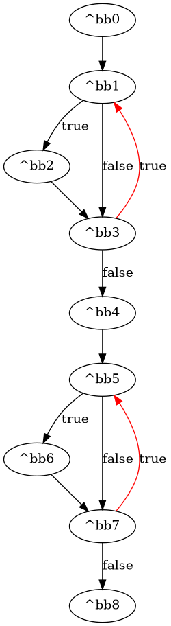
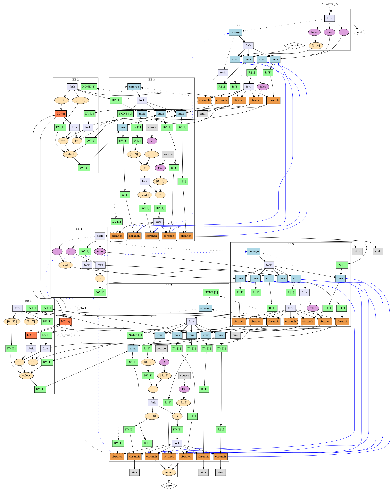
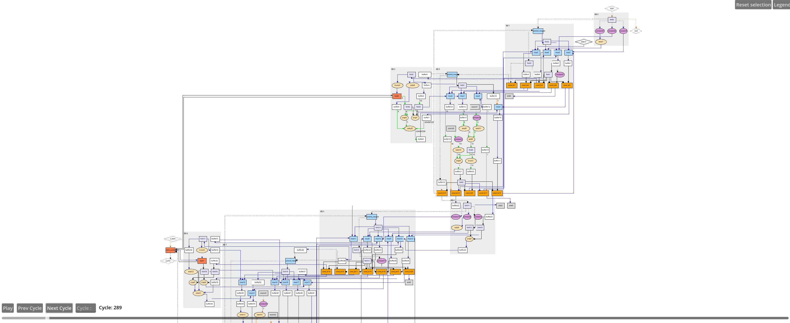

# Running an Integration Test
## Binary Search  
This tutorial is a walkthrough Dynamatic's HLS workflow from C code input to simulation and visualization of the generated RTL implementation.  

### Source Code
To present a usecase where Dynamatic outshines conventional HLS tool, we will be considering a simple binary search algorithm.
```c
//===- binary_search.c - Search for integer in array  -------------*- C -*-===//
//
// Implements the binary_search kernel.
//
//===----------------------------------------------------------------------===//

#include "binary_search.h"
#include "dynamatic/Integration.h"

int binary_search(in_int_t search, in_int_t a[N]) {
  int evenIdx = -1;
  int oddIdx = -1;

  for (unsigned i = 0; i < N; i += 2) {
    if (a[i] == search) {
      evenIdx = (int)i;
      break;
    }
  }

  for (unsigned i = 1; i < N; i += 2) {
    if (a[i] == search) {
      oddIdx = (int)i;
      break;
    }
  }

  int done = -1;
  if (evenIdx != -1)
    done = evenIdx;
  else if (oddIdx != -1)
    done = oddIdx;

  return done;
}

int main(void) {
  in_int_t search = 55;
  in_int_t a[N];
  for (int i = 0; i < N; i++)
    a[i] = i;
  CALL_KERNEL(binary_search, search, a);
  return 0;
}
```
This HLS code includes control flow inside loops, limiting pipelining in statically scheduled HLS due to worst-case assumptions—here, the branch is taken and the loop exits early. Dynamically scheduled HLS, like Dynamatic, adapts to runtime behavior. Let's see how the generated circuit handles control flow more flexibly.  

Below is are the steps for converting the `binary_search.c` file into RTL code.

#### Launching Dynamatic
If you haven't added Dynamatic to path, navigate to the directory where you cloned Dynamatic and run the command below:
```sh
./bin/dynamatic
```
The Dynamatic frontend would be displayed as follows
```sh
username:~/Dynamatic/dynamatic$ ./bin/dynamatic
================================================================================
============== Dynamatic | Dynamic High-Level Synthesis Compiler ===============
======================== EPFL-LAP - v2.0.0 | March 2024 ========================
================================================================================


dynamatic> 
```
#### Set the Path to the C Target C File
Dynamatic needs to know where your target C file is located. To provide this information, use the `set-src` command to direct Dynamatic to the file you want to synthesize into RTL
```sh
dynamatic> set-src integration-test/binary_search/binary_search.c
```
> [!NOTE]  
> The target function should have the same name as the `.c` file containing it except for the extension.

#### Compile the C File to a Lower Intermediate Representation
You can compile this code using the `compile` command.
> [!NOTE]  
> Dynamatic creates an `out` directory in the same directory as your C kernel where all output files will be stored as you run commands

The `out/comp` directory created will allow you to have a look at the control flow graph for your program as well as a visual representation of the elastic circuit generated (basic blocks, adders, multipliers, coparisons, etc.). 

If you have a MILP solver (Gurobi), you can choose the **buffer placement algorithm** (either `fpga20` or `fpl22`) with the `--buffer-algorithm` flag. If you do not have Gurobi, Dynamatic will use the simple buffer placement strategy (`on-merges`). For this example, we use `fpga20`, a throughput driven algorithm which requires Gurobi installed as describe in the [Advanced Build](../../../UserGuide/AdvancedBuild.md#1-gurobi) page. 
> [!TIP]  
> If you are not sure which options are available for any command, use the `help` command to see a list of commands and their respective options.  

Running the `compile` commands prints the following on the screen outlining the steps in the compilation process.
```sh
dynamatic> compile --buffer-algorithm fpga20
[INFO] Compiled source to affine
[INFO] Ran memory analysis
[INFO] Compiled affine to scf
[INFO] Compiled scf to cf
[INFO] Applied standard transformations to cf
[INFO] Applied Dynamatic transformations to cf
[INFO] Compiled cf to handshake
[INFO] Applied transformations to handshake
[INFO] Built kernel for profiling
[INFO] Ran kernel for profiling
[INFO] Profiled cf-level
[INFO] Running smart buffer placement with CP = 4.000 and algorithm = 'fpga20'
[INFO] Placed smart buffers
[INFO] Canonicalized handshake
[INFO] Created binary_search DOT
[INFO] Converted binary_search DOT to PNG
[INFO] Created binary_search_CFG DOT
[INFO] Converted binary_search_CFG DOT to PNG
[INFO] Lowered to HW
[INFO] Compilation succeeded
```
> [!TIP]
> Two PNG files are generated at compile time, `kernel_name.png` and `kernel_name_CFG.png`, allowing you to have a preview of your circuit and its control flow graph generated by Dynamatic as shown below. You should see a `binary_tree_CFG.png` and `binary_tree.png` file in your `comp` directory for this example.
**Binary Search CFG**   
  
**Binary Search Dataflow Circuit**  
  
Your images may look different if you used a different buffer placement algorithm.  

#### Generate RTL
You can generate RTL in VHDL or Verilog by running the `write-hdl` command. 
An `mlir` file is generated during the compile process.
`write-hdl` converts it into RTL code implementing your kernel. The default HDL is VHDL. 
> [!TIP]
> You can choose verilog with the `--hdl` flag and value `verilog`
```sh
dynamatic> write-hdl
[INFO] Exported RTL (vhdl)
[INFO] HDL generation succeeded
```
You should now see an `out/hdl` folder with all the VHDL files generated by the command. For instance, `hdl/binary_search.vhd` is the top level RTL file where all units are registered.

#### Simulate Your Circuit
Now that we have the HDL implementation of our circuit, we can verify whether it yields the same results as our C kernel using the `simulate` command.
This step runs a cosimulation of our kernel in C with clang and the VHDL (using ModelSim/Questa) and compares the results and memory states for equality. It creates an `out/sim` directory with our simulation results.
```sh
dynamatic> simulate
[INFO] Built kernel for IO gen.
[INFO] Ran kernel for IO gen.
[INFO] Launching Modelsim simulation
[INFO] Simulation succeeded
```
A successful simulation indicates that our generated RTL functions as expected. You can check the `sim/results.txt` file to verify the clock cycle count exhibited by the circuit. Also, you can use the waveform viewer in ModelSim by opening the `sim/HLS_VERIFY/vsim.wlf` file.

#### Visualize and Simulate Your Circuit
You can visualize the circuit using our interactive data flow visualizer that allows you to see the states of different edges across the different clock cycles and animate the circuit execution.
By running the `visualize` command, the Godot GUI will be launched with your dataflow circuit open, and ready to be played with. This allows you to observe the circuit intuitively as you observe throughput, stalls, and signal states.
```sh
dynamatic> visualize
[INFO] Generated channel changes
[INFO] Added positioning info. to DOT
[INFO] Launching visualizer...
```
Below is a preview of the circuit in the Godot visualizer

The circuit is too broad to capture in one image but you can move around the preview by clicking, holding, and moving your cursor around. Play with the commands to see your circuit in action.
