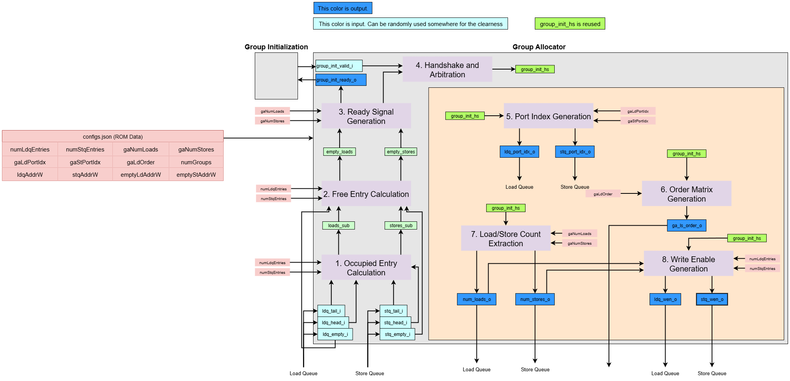
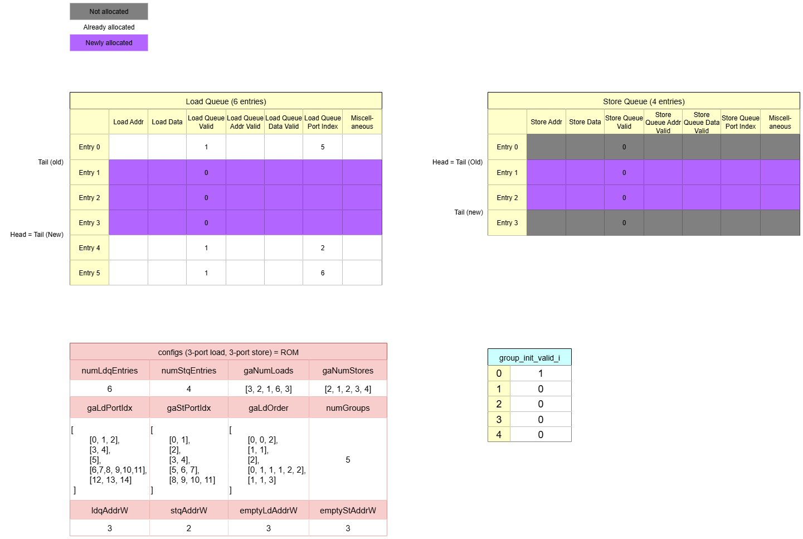
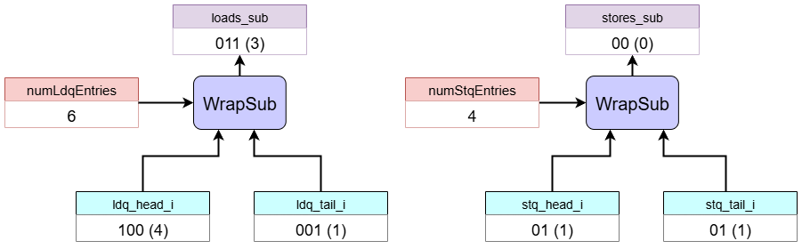
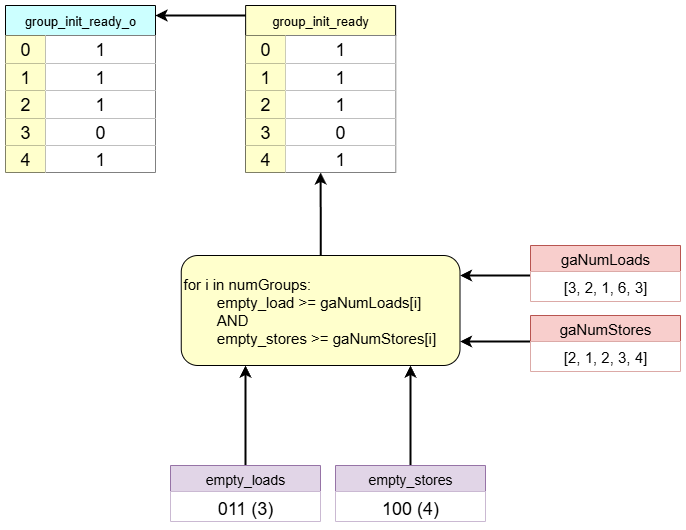
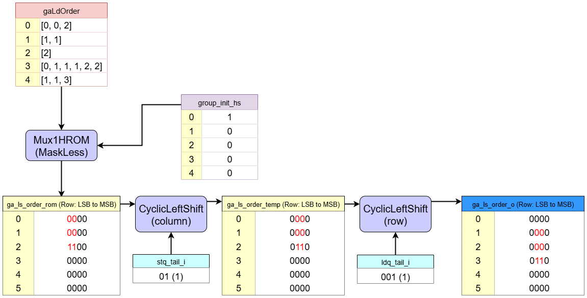

# Group Allocator

How groups are allocated to LSQ in the dataflow circuit.

## 1. Overview and Purpose  

The Group Allocator is a module that manages entry allocation for the Load-Store Queue (LSQ). It operates using a method called Group Allocation.

A group is defined as a sequence of memory accesses that cannot be interrupted by a control flow decision (for example, all memory operations within a single basic block).

Instead of allocating one LSQ entry at a time for each memory operation, the Group Allocator reserves entries for all operations belonging to a group at once. This bulk allocation occurs when an accelerator activates a specific group.

## 2. Group Allocator Internal Blocks

### Interface Signals

The constants used in the 'Dimensionality' column of the table below are derived from the generator configuration and are defined as follows:

* `N_GROUPS`: The total number of memory access groups.
* `N_LDQ_ENTRIES`: The total number of entries in the Load Queue.
* `N_STQ_ENTRIES`: The total number of entries in the Store Queue.
* `LDQ_ADDR_WIDTH`: The bit-width required to index an entry in the Load Queue.
* `STQ_ADDR_WIDTH`: The bit-width required to index an entry in the Store Queue.
* `LDP_ADDR_WIDTH`: The bit-width required to index the source/destination port for a load operation.
* `STP_ADDR_WIDTH`: The bit-width required to index the source/destination port for a store operation.

In the VHDL Signal Name column, the following placeholders are used: `{g}` for the group index, `{le}` for the Load Queue entry index, and `{se}` for the Store Queue entry index.

| Python Variable Name | VHDL Signal Name | Direction | Dimensionality | Description |
| :--- | :--- | :--- | :--- | :--- |
| **Inputs** | | | | |
| `group_init_valid_i` | `group_init_valid_{g}_i` | Input | `std_logic` | Valid signal indicating a request to allocate group `g`. |
| `ldq_tail_i` | `ldq_tail_i` | Input | `std_logic_vector(LDQ_ADDR_WIDTH-1:0)` | Current tail pointer of the Load Queue. |
| `ldq_head_i` | `ldq_head_i` | Input | `std_logic_vector(LDQ_ADDR_WIDTH-1:0)` | Current head pointer of the Load Queue. |
| `ldq_empty_i` | `ldq_empty_i` | Input | `std_logic` | A flag indicating if the Load Queue is empty. |
| `stq_tail_i` | `stq_tail_i` | Input | `std_logic_vector(STQ_ADDR_WIDTH-1:0)` | Current tail pointer of the Store Queue. |
| `stq_head_i` | `stq_head_i` | Input | `std_logic_vector(STQ_ADDR_WIDTH-1:0)` | Current head pointer of the Store Queue. |
| `stq_empty_i` | `stq_empty_i` | Input | `std_logic` | A flag indicating if the Store Queue is empty. |
| **Outputs** | | | | |
| `group_init_ready_o` | `group_init_ready_{g}_o` | Output | `std_logic` | Ready signal indicating the allocator can accept a request for group `g`. |
| `ldq_wen_o` | `ldq_wen_{le}_o` | Output | `std_logic` | Write enable signal for Load Queue entry `{le}`. |
| `num_loads_o` | `num_loads_o` | Output | `std_logic_vector(LDQ_ADDR_WIDTH-1:0)` | The number of load operations in the newly allocated group. |
| `ldq_port_idx_o` | `ldq_port_idx_{le}_o` | Output | `std_logic_vector(LDP_ADDR_WIDTH-1:0)` | The source port index for the operation to be written into Load Queue entry `{le}`. |
| `stq_wen_o` | `stq_wen_{se}_o` | Output | `std_logic` | Write enable signal for Store Queue entry `{se}`. |
| `num_stores_o` | `num_stores_o` | Output | `std_logic_vector(STQ_ADDR_WIDTH-1:0)` | The number of store operations in the newly allocated group. |
| `stq_port_idx_o` | `stq_port_idx_{se}_o` | Output | `std_logic_vector(STP_ADDR_WIDTH-1:0)` | The source port index for the operation to be written into Store Queue entry `{se}`. |
| `ga_ls_order_o` | `ga_ls_order_{le}_o` | Output | `std_logic_vector(N_STQ_ENTRIES-1:0)` | For the load in LDQ entry `{le}`, this vector indicates its order dependency relative to all STQ entries. |

The Group Allocator has the following responsibilities:

1. **Queue Space Calculator**  
This initial block calculates the number of currently free entries in both the load queue and the store queue.

    - It takes the `head` and `tail` pointers for each queue as inputs.
    - It performs a cyclic subtraction (`WrapSub`) on the pointers (`head - tail`) to determine how many slots are currently free.
    - However, it does not reflect when the queue is empty, so we need a further step. 
    - The results are stored in intermediate signals (`loads_sub`, `stores_sub`).

2. **Free Entry Calculation**  
This block determines the final number of free entries available in each queue, which is the most critical information for deciding if a new group can be allocated.

    - It uses the free entry counts from the previous block.
    - It uses a multiplexer logic: If the queue is empty (indicated by the `ldq_empty_i` or `stq_empty_i` signal), it outputs the maximum queue size. Otherwise, it outputs `loads_sub` or `stores_sub`.
    - The results are the final free-space counts (`empty_loads`, `empty_stores`).

3. **Ready Signal Generation**  
This block checks if the load queue and the store queue are ready to accept a specific group allocation request.

    - It compares the available free entries (from block 2) with the number of loads and stores required by each incoming group (`gaNumLoads`, `gaNumStores`).
    - If there is enough space in both the Load and Store queues for a given group, it generates a `ready` signal for that specific group.

4. **Handshake and Arbitration**  
This block performs the final handshake to select a single "winning" group for the current cycle.

    - It takes the `ready` signals for all groups (from block 3) and combines them with the external `group_init_valid_i` request signals.
    - If multiple groups are both valid and ready, a round-robin arbitrator selects one group to be allocated. This block outputs the one-hot signal that indicates the winning group.

5. **Port Index Generation**  
This block generates the correctly aligned port indices for the newly allocated entries.

    - It performs a **ROM lookup** using the winning group's ID to fetch the pre-compiled list of port indices (e.g., `gaLdPortIdx`).
    - It then applies a **`CyclicLeftShift`** to this list, using the queue's current `tail` pointer as the shift amount. This aligns the port indices with the correct physical entry slots in the queue.
    - The final outputs are `ldq_port_idx_o` and `stq_port_idx_o`.

6. **Order Matrix Generation**  
This block generates the correctly aligned intra-group order matrix for the new entries.

    - It performs a **ROM lookup** for the winning group to fetch its pre-compiled 2D order sub-matrix (`gaLdOrder`).
    - It then performs a 2D `CyclicLeftShift` on this sub-matrix, using both the load and store queue `tail` pointers. This correctly places the sub-matrix within the LSQ's main order matrix, defining the dependencies for the new entries relative to existing ones.
    - The final output is `ga_ls_order_o`.

7. **Load/Store Count Extraction**  
This block simply extracts the number of loads and stores for the winning group.

    - It performs a **ROM lookup** for the winning group to get its specific `numLoads` and `numStores` values.
    - These values are passed to the outputs `num_loads_o` and `num_stores_o`.

8. **Write Enable Generation**  
This final block generates the write-enable pulses that activate the newly allocated queue entries.

    - It first creates an unshifted bitmask (`ldq_wen_unshifted`) based on the load/store counts from block 7. For example, if `num_loads` is 3, the mask is `0...0111`.
    - It then applies a `CyclicLeftShift` to this mask, using the queue's `tail` pointer as the shift amount.
    - The final shifted vector is the output (`ldq_wen_o` or `stq_wen_o`), which asserts a '1' for the precise entries in the queue that are being allocated in this cycle.

## 3. Dataflow Walkthrough

This walkthrough explains the step-by-step operation of the `Group Allocator` based on the following precise initial state:
  

* **Queue State**:
    * Load Queue: `ldq_tail`=1, `ldq_head`=4, `ldq_empty_i`=0 (Not Empty)
    * Store Queue: `stq_tail`=1, `stq_head`=1, `stq_empty_i`=1 (Empty)
* **Queue Sizes**: `numLdqEntries`=6, `numStqEntries`=4
* **Group Request**: `group_init_valid_i`=`[1,0,0,0,0]` (Only Group 0 is requesting)
* **Group Configurations**:
    * `gaNumLoads` = `[3, 2, 1, 6, 3]`
    * `gaNumStores` = `[2, 1, 2, 3, 4]`

---

#### 1. Occupied Entry Calculation
  
This block calculates the number of currently free entries in each queue.

* **Load Queue**: It performs a cyclic subtraction `ldq_head`(4) - `ldq_tail`(1) = `3`. There are **3** free entries.
* **Store Queue**: It performs a cyclic subtraction `stq_head`(1) - `stq_tail`(1) = `0`. We cannot say that there are **0** free entries. 

#### 2. Free Entry Calculation
  
This block calculates the number of available empty entries.

* **Load Queue**: Since `ldq_empty_i` is `0` (false), there are **3** free entries in the load queue.
* **Store Queue**: Since `stq_empty_i` is `1` (true), it outputs the total queue size. There are **4** free entries in the Store Queue.

#### 3. Ready Signal Generation
  
This block checks if the load queue and store queue are ready to be allocated.

* **Required Space for Group 0**: `gaNumLoads[0]`=3, `gaNumStores[0]`=2.
  * **Comparison**:
      * Loads: Is free space (3) >= required space (3)? **Yes**.
      * Stores: Is free space (4) >= required space (2)? **Yes**.
      * `group_init_ready[0] = 1`
* **Required Space for Group 1**: `gaNumLoads[1]`=2, `gaNumStores[1]`=1.
  * **Comparison**:
      * Loads: Is free space (3) >= required space (2)? **Yes**.
      * Stores: Is free space (4) >= required space (1)? **Yes**.
      * `group_init_ready[1] = 1`
* **Required Space for Group 2**: `gaNumLoads[2]`=1, `gaNumStores[2]`=2.
  * **Comparison**:
      * Loads: Is free space (3) >= required space (1)? **Yes**.
      * Stores: Is free space (4) >= required space (2)? **Yes**.
      * `group_init_ready[2] = 1`
* **Required Space for Group 3**: `gaNumLoads[3]`=6, `gaNumStores[3]`=3.
  * **Comparison**:
      * Loads: Is free space (3) >= required space (6)? **No**.
      * Stores: Is free space (4) >= required space (3)? **Yes**.
      * `group_init_ready[3] = 0`
* **Required Space for Group 4**: `gaNumLoads[4]`=3, `gaNumStores[4]`=4.
  * **Comparison**:
      * Loads: Is free space (3) >= required space (3)? **Yes**.
      * Stores: Is free space (4) >= required space (4)? **Yes**.
      * `group_init_ready[4] = 1`

#### 4. Handshake and Arbitration
  
This block performs the handshake to select a "winning" group.

* The incoming request `group_init_valid_i` is `[1,0,0,0,0]`.
* The `ready` signal for Group 0 is `1`.
* The AND result is `[1,0,0,0,0]`, and since only one request is active, the arbitrator selects **Group 0** as the winner.

#### 5. Port Index Generation
  
This block generates the correctly aligned port indices for the newly allocated entries. It first looks up the data for the winning group (Group 0), pads it to the full queue length, and then performs the specified shift operation to align it with the `tail` pointer.

* **Load Port Index (`ldq_port_idx_o`):**
    1.  **ROM Lookup & Padding:** It fetches `gaLdPortIdx[0]`, which is `[0, 1, 2]`. This means that `load0_0` (Group0's 0th load), `load0_1` (Group0's 1st load), and `load0_2` (Group0's 2nd load) use `Port 0`, `Port 1`, and `Port 2` respectively. Since the load queue has 6 entries, this is padded to create the intermediate vector `ldq_port_idx_rom = [0, 1, 2, 0, 0, 0]`.
    2.  **CyclicLeftShift:** This `[0, 1, 2, 0, 0, 0]` vector is then cyclically shifted left by the `ldq_tail` value, which is `1`. This means the first element (`0`) moves to the end, and all other elements shift left, resulting in **`[0, 0, 1, 2, 0, 0]`**.
    3. **Final Matrix Output (6x4)**: This result is converted into the final 6x4 matrix (`ldpAddrW=4`), where each number represents a 2-bit port index:

      ldq_port_idx_o =
      [
        "0000", // Physical Entry 0
        "0000", // Physical Entry 1
        "0001", // Physical Entry 2
        "0010", // Physical Entry 3
        "0000", // Physical Entry 4
        "0000"  // Physical Entry 5
      ]

* **Store Port Index (`stq_port_idx_o`):**
    1.  **ROM Lookup & Padding:** It fetches `gaStPortIdx[0]`, which is `[0, 1]`. This is padded to the 4-entry store queue length to become `[0, 1, 0, 0]`.
    2.  **Cyclic Left Shift:** This `[0, 1, 0, 0]` vector is shifted left by the `stq_tail` value (`1`), resulting in **`[0, 0, 1, 0]`**.
    3. **Final Matrix Output (4x4)**: This is converted into the final 4x4 matrix:

      stq_port_idx_o =
      [
        "0000", // Physical Entry 0
        "0000", // Physical Entry 1
        "0001", // Physical Entry 2
        "0000"  // Physical Entry 3
      ]

#### 6. Order Matrix Generation
  
This block fetches the intra-group order matrix for Group 0 and aligns it.

* **ROM Lookup**: It retrieves `gaLdOrder[0]`, which is `[0, 0, 2]`. This means the following:
    * `load0_0`: There are `0` stores before `load0_0`
    * `load0_1`: There are `0` stores before `load0_1`
    * `load0_2`: There are `2` stores before `load0_2`

  For this, the order matrix becomes 

            ga_ls_order_rom
                                    SQ0 SQ1 SQ2 SQ3
            Load Queue Entry 0:    [ 0,  0,  0,  0 ]
            Load Queue Entry 1:    [ 0,  0,  0,  0 ]
            Load Queue Entry 2:    [ 1,  1,  0,  0 ]
            Load Queue Entry 3:    [ 0,  0,  0,  0 ]
            Load Queue Entry 4:    [ 0,  0,  0,  0 ]
            Load Queue Entry 5:    [ 0,  0,  0,  0 ]
            

     
* **2D Cyclic Left Shift**: This data is shifted based on `ldq_tail` (1) and `stq_tail` (1) to correctly place it within the LSQ's main order matrix.

            ga_ls_order_o
                                    SQ0 SQ1 SQ2 SQ3
            Load Queue Entry 0:    [ 0,  0,  0,  0 ]
            Load Queue Entry 1:    [ 0,  0,  0,  0 ]
            Load Queue Entry 2:    [ 0,  0,  0,  0 ]
            Load Queue Entry 3:    [ 0,  1,  1,  0 ]
            Load Queue Entry 4:    [ 0,  0,  0,  0 ]
            Load Queue Entry 5:    [ 0,  0,  0,  0 ]

#### 7. Load/Store Count Extraction
  
This block extracts the number of loads and stores for the winning group (Group 0).

* **ROM Lookup**: It retrieves `gaNumLoads[0]` (`3`) and `gaNumStores[0]` (`2`).
* The outputs `num_loads_o` and `num_stores_o` become `3` and `2`, respectively.

#### 8. Write Enable Generation
  
This final block generates the write-enable pulses that activate the newly allocated queue entries.

* **Unshifted Mask Creation**:
    * Loads: `num_loads` (`3`) creates a 6-bit unshifted mask `000111`.
    * Stores: `num_stores` (`2`) creates a 4-bit unshifted mask `0011`.
* **Cyclic Left Shift**:
    * `ldq_wen_o`: The mask `000111` is shifted by `ldq_tail` (`1`), resulting in `001110`.
    * `stq_wen_o`: The mask `0011` is shifted by `stq_tail` (`1`), resulting in `0110`.
* These final vectors assert '1' for entries 1, 2, 3 in the Load Queue and entries 1, 2 in the Store Queue, activating them for the new group.
