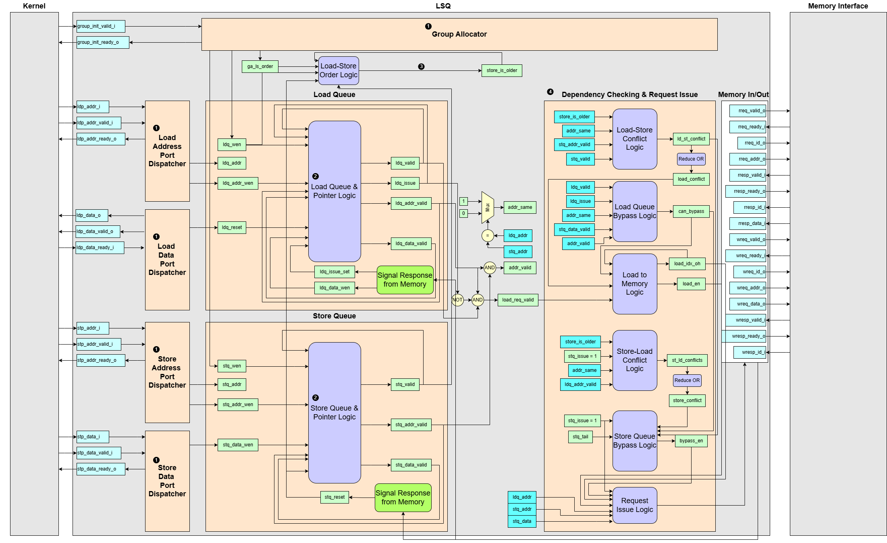
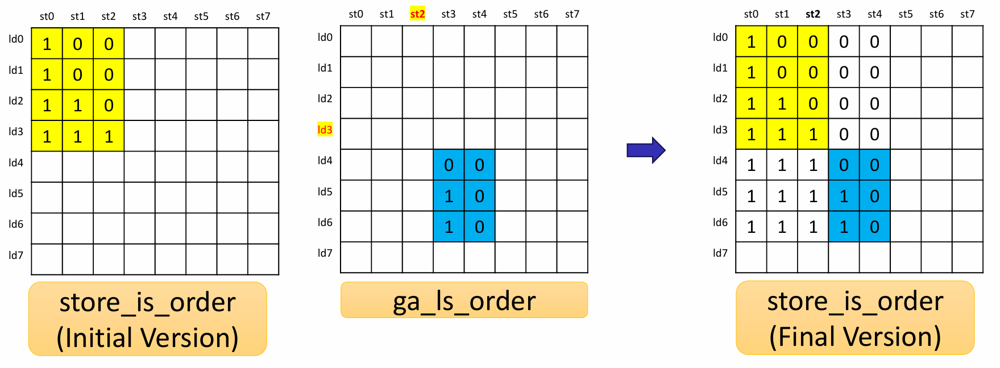
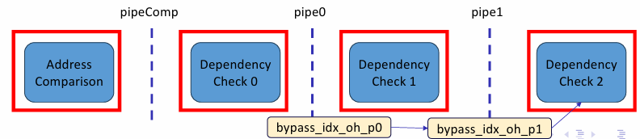

# LSQ — Interface Details

Detailed documentation for the `LSQ` generator, which emits a VHDL entity and architecture to assemble a complete Load-Store Queue. It instantiates and connects all dispatchers (Port-to-Queue and Queue-to-Port dispatchers), the group allocator, and optional pipeline logics into one cohesive RTL block.

## Interface Signals

| Signal Name          | type             | Description                           |
| -------------------- | ---------------- | ------------------------------------- |
| `group_init_valid_i` | `LogicArray`     | Group Allocator handshake valid signal|
| `group_init_ready_o` | `LogicArray`     | Group Allocator handshake ready signal |
| `ldp_addr_i`         | `LogicVecArray`  | Load port address inputs|
| `ldp_addr_valid_i`   | `LogicArray`     | Address load port handshake valid signal  |
| `ldp_addr_ready_o`   | `LogicArray`     | Address load port handshake ready signal |
| `ldp_data_o`         | `LogicVecArray`  | Load port data outputs |
| `ldp_data_valid_o`   | `LogicArray`     | Data load port handshake valid signal|
| `ldp_data_ready_i`   | `LogicArray`     | Data load port handshake ready signal|
| `stp_addr_i`         | `LogicVecArray`  | Store port address inputs|
| `stp_addr_valid_i`   | `LogicArray`     | Address store port handshake valid signal|
| `stp_addr_ready_o`   | `LogicArray`     | Address store port handshake ready signal |
| `stp_data_i`         | `LogicVecArray`  | Store port data inputs|
| `stp_data_valid_i`   | `LogicArray`     | Data store port handshake valid signal |
| `stp_data_ready_o`   | `LogicArray`     | Data store port handshake ready signal  |
| `rreq_valid_o`       | `LogicArray`     | Read request valid signal (issued to Memory Interface) |
| `rreq_ready_i`       | `LogicArray`     | Read request ready handshake from Memory Interface |
| `rreq_id_o`          | `LogicVecArray`  | Read request ID (matches up responses) |
| `rreq_addr_o`        | `LogicVecArray`  | Read request address bus |
| `rresp_valid_i`      | `LogicArray`     | Read response valid signal (from Memory Interface) |
| `rresp_ready_o`      | `LogicArray`     | Read response ready handshake back to Memory Interface |
| `rresp_id_i`         | `LogicVecArray`  | Read response ID (identifies which request this data belongs to)|
| `rresp_data_i`       | `LogicVecArray`  | Read response data bus |
| `wreq_valid_o`       | `LogicArray`     | Write request valid signal (issued to Memory Interface) |
| `wreq_ready_i`       | `LogicArray`     | Write request ready handshake from Memory Interface |
| `wreq_id_o`          | `LogicVecArray`  | Write request ID (for response matching) |
| `wreq_addr_o`        | `LogicVecArray`  | Write request address bus |
| `wreq_data_o`        | `LogicVecArray`  | Write request data bus |
| `wresp_valid_i`      | `LogicArray`     | Write response valid signal (from Memory Interface)|
| `wresp_ready_o`      | `LogicArray`     |	Write response ready handshake back to Memory Interface |
| `wresp_id_i`         | `LogicVecArray`  | Write response ID (indicates which write has completed) |

## Operational Summary

1. Instantiation of several modules
    - Group Allocator
    - Port-to-Queue Dispatcher
        - Load Address Port Dispatcher
        - Store Address Port Dispatcher
        - Store Data Port Dispatcher
    - Queue-to-Port Dispatcher
        - Load Data Port Dispatcher
        - (Optionally) Store Backward Port Dispatcher

2. Queue & Pointer Logic
    - Purpose
        To maintain a circular buffer of pending loads/stores, track which slots are occupied, and generate free-slot indices for dispatch.
    - Implementation
        - Every load/store entry is backed by a small register file (e.g. `valid`, `addr_valid`, `data_valid`, `addr`, `data`, `issue` flags)
        - Head/tail pointers are plain binary counters with wrap-around (`ldq_tail`, `stq_head`), plus one-hot conversion (`BitsToOH` and `OHToBits`) for easy indexing.

3. Full Load-Store Order Matrix `store_is_older`  

    - Combine the initial load-store order matrix `store_is_order` with the new group's load-store order matrix. 

4. Dependency Checking & Request Issue
    - Purpose
        - Enforce correct load-store ordering
        - Detect when a load can safely forward from an earlier store (bypass)
        - Load/Store within the group executes in order
    - Implementation:
        - Compute load-store conflict matrix (`ld_st_conflict`) and check if a load conflicts with any stores
        - Compute bypass possibility (`can_bypass`)
        - Form "can-load" lists (`can_load_list`)
        - Compute store-load conflict matrix (`st_ld_conflict`) and check if a store conflicts with any loads
        - Send bypassed data to load queue

5. Pipelining  

    - Purpose
        - The dependency-checking unit is the longest combinational path in the LSQ, so we split it into shorter timing-friendly segments.
    - Implementation
        - Stage 0 `pipeComp`
        - Stage 1 `pipe0`
        - Stage 2 `pipe1`

    > **Note:** Each of these stages can be independently enabled or disabled via the `pipeComp`, `pipe0`, and `pipe1` config flags—so you only pay the pipeline overhead where you need the extra timing slack.

