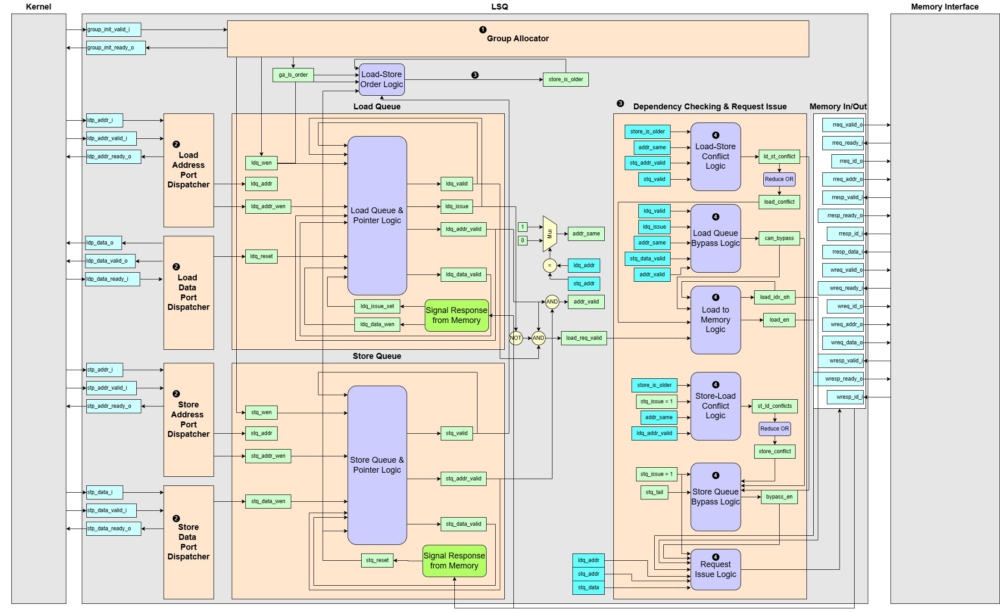

# Load-Store Queue (LSQ)

## 1. Overview and Purpose
The Load-Store Queue (LSQ) is the central memory system in a dynamically scheduled circuit. Its primary purpose is to enable high-performance memory access by allowing independent load and store operations to execute out-of-order, while strictly enforcing true data dependencies to ensure program correctness.

In many applications, memory access patterns are irregular and cannot be determined at compile time. A simple, statically-ordered memory system would be conservative, stalling frequently. The LSQ-based system presented here solves this. It tracks all memory operations, dynamically checks for hazards at runtime, and dispatches operations to memory when it is safe to execute.

This module is the top-level component that instantiates and connects the Group Allocator, all Dispatchers, and the core queue and dependency-checking logic into a single, cohesive, and configurable system.

## 2. Key Functional Blocks
The LSQ's complex behavior is managed by several specialized internal blocks, each with a distinct responsibility.

1. **Group Allocator**: Instead of one instruction at a time, the LSQ allocates memory operations in groups corresponding to basic blocks in the original program. The Group Allocator handles these block-level requests, reserving space in the queues for all loads and stores in a group at once.

2. **Load/Store Queues**: These are the circular buffers that hold the state of in-flight memory operations, including their address, data, port assignment, and status.

3. **Dispatchers**: These modules act as the address and data routers for the LSQ.

    - Port-to-Queue Dispatchers route incoming arguments (addresses and store data) from the external access ports into the correct LSQ entries.
    - Queue-to-Port Dispatchers route results (loaded data) from the LSQ entries back to the correct access ports.

4. **Dependency Checking and Request Issue**: This is the central part of the LSQ module. It continuously compares all active loads and stores to detect data hazards, identify opportunities to bypass data from a store directly to a load, and determine which operations are safe to issue to the memory interface.

## 3. Dataflow Walkthrough

1. **Allocation**  
A request to execute a new group arrives at the Group Allocator. The allocator checks for sufficient space in the Load and Store Queues. If space is available, it reserves the required number of entries and assigns them with pre-compiled information, such as the port index for each operation and their relative order.

2. **Argument Assignment**  
In parallel, the dataflow circuit sends the required arguments (addresses for loads and stores, data for stores) to the LSQ's access ports. The Dispatcher blocks catch this information and write it into the corresponding fields of the queue entries.

3. **Dependency Checking**  
As soon as an entry has its address, the dependency checking logic includes it in its analysis. It evaluates all valid operations, using their addresses and the load-store order logic to check for conflicts (e.g. a load trying to read an address before an older store has written to it) or opportunities for bypassing data.

4. **Issue, Bypass, or Wait**  
Based on the dependency check, one of three things happens:

    - Issue: If an operation has no unresolved dependencies, the request issue logic sends it to the external memory interface.
    - Bypass: If a load can be satisfied by data already present in an older store entry, the data is forwarded directly within the LSQ, and the redundant memory read is cancelled.
    - Wait: If an operation has a dependency on an older, unfinished operation, it remains in the queue until the dependency is resolved.

5. **Completion and Deallocation**  
When a load result returns from memory, it is written into its entry. The Load Data Port Dispatcher then sends the result back to the kernel. Once the transfer is complete, the entry is deallocated and its slot becomes free. Store entries are deallocated after their write to memory is complete.

## 4. Optional Pipelining
The dependency checking logic involves comparing every load against every store, making it the longest computational path and a potential performance bottleneck. To achieve higher clock frequencies, this path can be broken down into multiple pipeline stages.  
  - Stage 0 (`pipeComp`): An optional first stage that can be dedicated to performing the address comparisons between all load-store pairs.
  - Stage 1 (`pipe0`): The next stage resolves the dependency and bypass logic based on the address comparison results.
  - Stage 2 (`pipe1`): The final stage handles the priority selection and issues the chosen request to the memory interface.

## 5. Interface Signals
| Signal Name          | type             | Description                           |
| -------------------- | ---------------- | ------------------------------------- |
| `group_init_valid_i` | `LogicArray`     | Group Allocator handshake valid signal|
| `group_init_ready_o` | `LogicArray`     | Group Allocator handshake ready signal |
| `ldp_addr_i`         | `LogicVecArray`  | Load port address inputs|
| `ldp_addr_valid_i`   | `LogicArray`     | Address load port handshake valid signal  |
| `ldp_addr_ready_o`   | `LogicArray`     | Address load port handshake ready signal |
| `ldp_data_o`         | `LogicVecArray`  | Load port data outputs |
| `ldp_data_valid_o`   | `LogicArray`     | Data load port handshake valid signal|
| `ldp_data_ready_i`   | `LogicArray`     | Data load port handshake ready signal|
| `stp_addr_i`         | `LogicVecArray`  | Store port address inputs|
| `stp_addr_valid_i`   | `LogicArray`     | Address store port handshake valid signal|
| `stp_addr_ready_o`   | `LogicArray`     | Address store port handshake ready signal |
| `stp_data_i`         | `LogicVecArray`  | Store port data inputs|
| `stp_data_valid_i`   | `LogicArray`     | Data store port handshake valid signal |
| `stp_data_ready_o`   | `LogicArray`     | Data store port handshake ready signal  |
| `rreq_valid_o`       | `LogicArray`     | Read request valid signal (issued to Memory Interface) |
| `rreq_ready_i`       | `LogicArray`     | Read request ready handshake from Memory Interface |
| `rreq_id_o`          | `LogicVecArray`  | Read request ID (matches up responses) |
| `rreq_addr_o`        | `LogicVecArray`  | Read request address bus |
| `rresp_valid_i`      | `LogicArray`     | Read response valid signal (from Memory Interface) |
| `rresp_ready_o`      | `LogicArray`     | Read response ready handshake back to Memory Interface |
| `rresp_id_i`         | `LogicVecArray`  | Read response ID (identifies which request this data belongs to)|
| `rresp_data_i`       | `LogicVecArray`  | Read response data bus |
| `wreq_valid_o`       | `LogicArray`     | Write request valid signal (issued to Memory Interface) |
| `wreq_ready_i`       | `LogicArray`     | Write request ready handshake from Memory Interface |
| `wreq_id_o`          | `LogicVecArray`  | Write request ID (for response matching) |
| `wreq_addr_o`        | `LogicVecArray`  | Write request address bus |
| `wreq_data_o`        | `LogicVecArray`  | Write request data bus |
| `wresp_valid_i`      | `LogicArray`     | Write response valid signal (from Memory Interface)|
| `wresp_ready_o`      | `LogicArray`     |	Write response ready handshake back to Memory Interface |
| `wresp_id_i`         | `LogicVecArray`  | Write response ID (indicates which write has completed) |