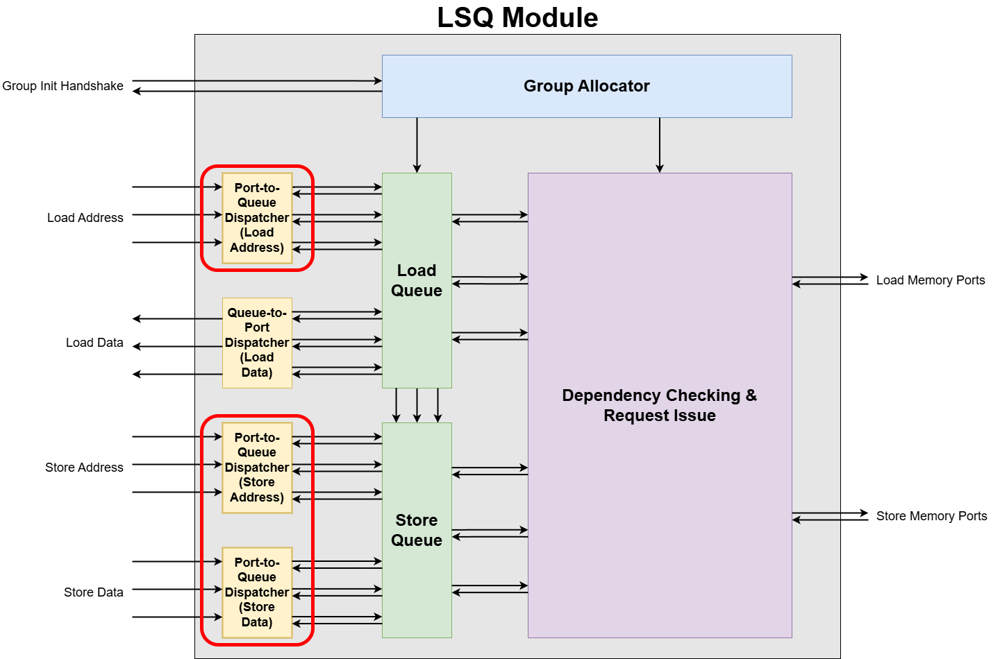

# Port-to-Queue Dispatcher

How addresses and data enter from multiple access ports to the LSQ's internal load and store queues.

## 1. Overview and Purpose  

The Port-to-Queue Dispatcher is a submodule within the Load-Store Queue (LSQ) responsible for routing incoming memory requests (addresses or data) from the dataflow circuit's access ports to the correct queue entries of the load queue and the store queue. All incoming requests are directed into either the load queue or the store queue. These queues are essential for tracking every memory request until its completion. It ensures each load queue or store queue entry gets the correct address or data from the appropriate port.  

We need a total of three **Port-to-Queue Dispatchers**—one each for the load address, store address, and store data. Why? To load, you must first supply the address where the data is stored. Likewise, a store operation needs both the value to write and the address to write it at.  

In the LSQ architecture, memory operations from the main program arrive at dedicated access ports. Because multiple ports can try to send data simultaneously, a mechanism is needed to arbitrate these requests and write them into the LSQ.

## 2. Port-to-Queue Dispatcher Internal Blocks

### Interface Signals
| Signal Name          | Description     |
| -------------------- |  --------------- |
| `port_bits_i[p]`        | _“Here is my 8-bit payload.”_ (address or data)  |
| `port_valid_i[p]`       | _“…and I really mean it.”_  High when the payload is ready.   |
| `port_ready_o[p]`       | Dispatcher replies: _“Sure, send it!”_  Goes high if the LSQ can take the request this cycle.  |
| `entry_valid_i[e]`      | Is LSQ entry **_e_** logically allocated?   |
| `entry_bits_valid_i[e]` | Has the addr/data slot already been filled? |
| `entry_port_idx_i[e]`   | Indicates to which port the entry is assigned|
| `entry_bits_o[e]`       | The data actually written into LSQ entry **_e_**. Think of it as the ink flowing into row **_e_** on the whiteboard.|
| `entry_wen_o[e]`        | A short pulse that says _“commit the write into entry **_e_** now.”_ |
| `queue_head_oh_i[e]`    | One-hot vector indicating the head entry in LSQ |

The Port-to-Queue Dispatcher has the following responsibilities:

1. **Matching**  
The Matching block is responsible for identifying which queue entries are actively waiting to receive an address or data payload.
    - **Input**: `entry_valid_i`, `entry_bits_valid_i`
    - **Processing**: For each queue entry, this block performs the check: `entry_valid_i AND (NOT entry_bits_valid_i)`. An entry is considered waiting only if it has been allocated (`entry_valid_i = 1`) by the group allocator but has not yet had its address or data payload written.
    - **Output**: A array of bits indicating the status of all queue entries.

2. **Port Index Decoder**  
For each queue entry, it is already assigned to the port by the group allocator. The Port Index Decoder block translates the port assignment for each queue entry from a binary index into a one-hot vector.
    - **Input**: `entry_port_idx_i`
    - **Processing**: It performs a binary-to-one-hot conversion on the port index associated with each entry. For example, if there are 3 ports, a binary index of `01` would be converted to a one-hot vector of `010`.
    - **Output**: A one-hot vector for each entry that directly corresponds to the port it is assigned to.

3. **Payload Mux**  
This block constitutes the main data path of the dispatcher. It ensures that each queue entry's input is connected to the correct address or data payload from the assigned access port.
    - **Input**: `port_bits_i` (address or data from all access ports), and a select one-hot select signal indicating the port index for each queue entry.
    - **Processing**: For each queue entry, this is a multiplexer that selects one port's data from the `port_bits_i` array. The selection is determined by the one-hot port index from the `Port Index Decoder`.
    - **Output**: `entry_bits_o`

4. **Handshake Logic**
This block manages the `valid/ready` handshake protocol with the external access ports.
    - **Input**: The list of waiting entries (from `Matching`), their port assignments (from `Port Index Decoder`), and the `port_valid_i` signal.
    - **Processing**: It determines if any waiting entry is requesting data from a specific port. If so, it asserts the `ready` signal for that port, indicating it is prepared to accept the payload. Furthermore, it filters all waiting requests against the incoming `port_valid_i` signals to determine the final set of active requests that are passed to the `Arbitration Logic`.

5. **Arbitration Logic**  
The core decision making block of the dispatcher. When multiple valid requests are ready to be written in the same cycle, it chooses the oldest queue entry among the valid ones.
    - **Input**: The set of all currently valid and ready requests (informed by `Handshake Logic`), and `queue_head_oh_i` to determine priority.
    - **Processing**: It uses a Cyclic Priority Masking algorithm. This ensures that among all candidates, the one corresponding to the oldest entry in the queue is granted for the current clock cycle.
    - **Output**: `entry_wen_o` signal, which acts as the enable for the queue entry. This signal finally makes the queue's `entry_bits_valid` signal high.

## 3. Dataflow Walkthrough

### Example of Store Address Port-to-Queue Dispatcher (3 Store Ports, 4 Store Queue Entries)

1. **Matching: Identifying which LSQ slots are empty**  
The first job of this block is to determine which entries in the store queue are waiting for a store address.  
Based on the example diagram:  
    - **Entry 1** is darkened to indicate that it has not been allocated by the Group Allocator. Its `Store Queue Valid` signal (equivalent to `entry_valid_i`) is `0`.  
    - **Entries 0, 2, and 3** have been allocated, so their `entry_valid_i` signal are `1`. However, among these, Entry 2 already has a valid address (`Store Queue Addr Valid = 1`).
    - Therefore, only `Entries 0 and 3` are actively waiting for their store address, as they are allocated but their `Store Queue Addr Valid` bit is still `0`.  
  
    This logic is captured by the expression `entry_request_valid = entry_valid_i AND (NOT entry_bits_valid_i)`, which creates a list of entries that need attention from the dispatcher.

2. **Port Index Decoder: Queue entries port assignment in one-hot format**
This block's circuit is to translate the binary port index assigned to each queue entry into a one-hot format.  
Based on the example diagram:  
    - The `Store Queue` shows that `Entry 0` is assigned to `Port 1` , `Entry 1` to `Port 0`, `Entry 2` to `Port 1` and `Entry 3` to `Port 2`. 
    - The `Port Index Decoder` takes these binary indices (`00`, `01`, `10`) as input.
    - It processes them and generates a corresponding one-hot vector for each entry. Since there are three access ports, the vector are three bits wide:
        - `Entry 0 (Port 1)`: `010`
        - `Entry 1 (Port 0)`: `000`
        - `Entry 2 (Port 1)`: `010`
        - `Entry 3 (Port 2)`: `100`

    The output of this block, an array of one-hot vectors, is a crucial input for the `Payload Mux`, where it acts as the select signal to choose the data from the correct port.    

3. **Payload Mux: Routing the correct address**  
The Payload Mux is the primary data path within the dispatcher. Its sole responsibility is to select the correct address from one of the many input `Access Ports` and route it to the output, `entry_bits_o`.  
Crucially, there is a separate Mux for each queue entry. The selection for each Mux is determined by the pre-assigned port index for that entry.  
Based on the example diagram:
    - The `Access Ports` table shows the current address payloads being presented by each port:
        - `Port 0`: `01101111`
        - `Port 1`: `11111000`
        - `Port 2`: `00100000`
    - The `Port Index Decoder` has already determined the port assignments for each entry
    - The `Payload Mux` uses these assignments to perform the selection:
        - `Entry 0`: `11111000` (Address from `Port 1`)
        - `Entry 1`: `01101111` (Address from `Port 0`)
        - `Entry 2`: `11111000` (Address from `Port 1`)
        - `Entry 3`: `00100000` (Address from `Port 2`)
    
    The output of this block, `entry_bits_o` is logically committed to the queue only when the `Arbitration Logic` asserts the `entry_wen_o` signal for that specific entry.

4. **Handshake Logic: Managing port readiness and filtering requests**
This block is responsible for the `valid/ready` handshake protocol with the `Access Ports`. It performs two functions: providing back-pressure to the ports and identifying all currently active memory requests for the arbiter.  
Based on the example diagram:
    - **Back-pressure control**: First, the block determines which ports are `ready`.
        - From the `Matching` and `Port Index Decoder` blocks, we know that `Entry 0` and `Entry 3` are waiting for an address from `Port 1` and `Port 2` respectively.
        - Therefore, it asserts `port_ready_o` to `1` for both `Port 1` and `Port 2`.
        - No entry is waiting for `Port 0`, so its ready signal is `0`.
    - **Active request filtering**: The block checks which ports are handshaked. The `Access Ports` table shows `port_valid_i` is `1` for both `Port 1` and `Port 2`. Since the waiting entries (`Entry 0` and `Entry 3`) correspond to the valid ports (`Port 1` and `Port 2`), both are considered active and are passed to the `Arbitration Logic`.
        

5. **Arbitration Logic: Selecting the oldest active entry**  
This block is responsible for selecting the oldest active request and generating the write enable signal for such request.  
Based on the example diagram:
    - The `Handshake Logic` has identified two active requests: one for `Entry 0` from `Port 1` and another for `Entry 3` from `Port 2`.
    - Priority is determined by the `queue_head_oh_i` signal, which points to the oldest entry in the queue. In this case, the head pointer is at `Entry 2`. This establishes a priority order of `2 -> 3 -> 0 -> 1`. 
    - The `CyclicPriorityMasking` algorithm compares the active requests (for `Entry 0` and `Entry 3`) against this priority sequence. Because `Entry 3` appears before `Entry 0` in the priority order, `Entry 3` is selected as the oldest of the arbitration.
    - As a result, the `entry_wen_o` signal is asserted only for `Entry 3`, while the signals for all other entries remain de-asserted.

