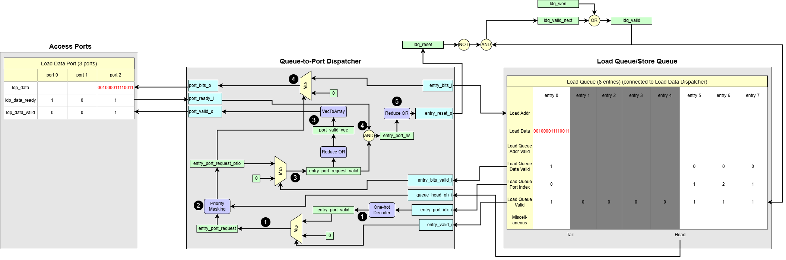

# Queue-to-Port Dispatcher

A friendly tour of how loaded data gets back to where it belongs.

## 1. Overview and Purpose
The Queue-to-Port Dispatcher is the counterpart to the Port-to-Queue Dispatcher. Its responsibility is to route results—primarily data loaded from memory—from the Load-Store Queue (LSQ) entries back to the correct access ports of the dataflow circuit.  

While the LSQ can process memory requests out-of-order, the results for a specific access port must be returned in-order to maintain the correctness of the dataflow circuit. This module ensures that this order is respected for each port.

The primary instance of this module is the **Load Data Port Dispatcher**, which sends loaded data back to the circuit. An optional second instance, the **Store Backward Port Dispatcher**, can be used to send store completion acknowledgements back to the circuit.

## 2. Key Responsibilities
The Queue-to-Port Dispatcher has the following core responsibilities:

1. **Ordered Selection**: For each access port, it continuously identifies the oldest allocated LSQ entry that is associated with it. This is crucial for returning results in the correct sequence.

2. **Data Readiness Check**: It checks if the result data for the selected oldest entry is actually valid and has been received from memory (or a bypass path).

3. **Handshaking**: It manages the valid/ready handshake to transfer the result data. It asserts a valid signal to the port only when the oldest entry has valid data ready to be consumed.

4. **Deallocation Trigger**: Once the data is successfully transferred (i.e., the handshake is complete), it generates a reset signal for the LSQ entry. This tells the main LSQ to deallocate the entry, freeing it up for a new operation.

## 3. Dataflow Walkthrough

1. **Create Entry-to-Port Linkage**  
First, the dispatcher establishes which allocated entries belong to which access ports. It decodes each entry's port index (`entry_port_idx_i`) into a one-hot vector to create the `entry_port_valid` matrix. This matrix is then filtered by the entry's allocation status (`entry_valid_i`) to produce the `entry_port_request` matrix. A `'1'` at `(row_e, column_p)` in this matrix indicates that "allocated entry `e` is designated for port `p`.

2. **Select the Oldest Entry for Each Port**  
Unlike the Port-to-Queue dispatcher, priority is established early. A `CyclicPriorityMasking` function is applied to the `entry_port_request` matrix. This operation uses the `queue_head_oh_i` pointer as a reference to find the oldest entry for each port. The output, `entry_port_request_prio`, is a new matrix where each column contains at most a single `'1'`, identifying the next-in-line entry for each port, regardless of whether its data is ready yet.

3. **Check Data Readiness and Generate Valid Signal**  
The dispatcher now checks if the selected oldest entries have valid data. The `entry_port_request_prio` matrix is filtered by the `entry_bits_valid_i` array (which signals if data has arrived from memory). The result is the `entry_port_request_valid` matrix. A column reduction (`Reduce OR`) is performed on this matrix to generate the final `port_valid_o` signal for each port. The `port_valid_o` signal is only asserted if the oldest entry for that port has valid data ready to send.

4. **Route Payload and Complete Handshake**
In parallel with the readiness check, the `entry_port_request_prio` matrix is used as the select signal for a multiplexer. This routes the data from the correct entry's `entry_bits_i` register to the corresponding `port_bits_o` output bus. The dispatcher then waits for the external port to assert `port_ready_i`. A successful handshake is recorded in the `entry_port_hs` matrix when an entry's request is valid and the corresponding port is ready.

5. **Generate Deallocation Signal**
The final step is to tell the LSQ to deallocate the entry now that its job is done. A row reduction (`Reduce OR`) is performed on the `entry_port_hs` matrix to generate the one-hot `entry_reset_o` signal. The single `'1'` in this vector serves as a reset signal for the specific LSQ entry that has just successfully completed its data transfer, freeing it for future use.

## 4. Interface Signals

| Signal Name          |  Description     |
| -------------------- | --------------- |
| `port_bits_o[p]`        | The result data (e.g. loaded from memory) sent to the access port |
| `port_valid_o[p]`       | *"Your data is ready."* Asserts high to indicate the `port_bits_o` bus has valid data. |
| `port_ready_i[p]`       | Sent from the port to acknowledge it has received the data. |
| `entry_valid_i[e]`      | Is LSQ entry `e` logically allocated?  |
| `entry_bits_valid_i[e]` | Is the result data in entry `e` valid and ready to be sent?|
| `entry_port_idx_i[e]`   | Indicates to which port entry `e` must return its result |
| `entry_bits_i[e]`       | The result data stored in entry `e`, ready to be dispatched. |
| `entry_reset_o[e]`      | A signal saying *"clear entry `e` now, its job is done."*|
| `queue_head_oh_i[e]`    | One-hot vector indicating the head entry in LSQ |
