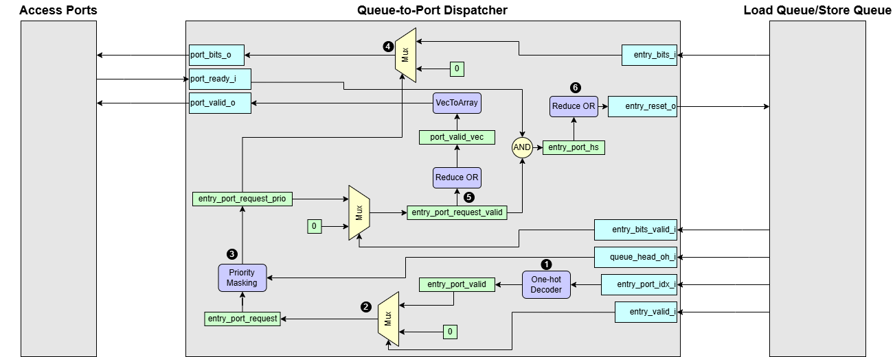

# Queue-to-Port Dispatcher

Detailed documentation for the Queue-to-Port dispatcher generator, which emits a VHDL entity and architecture to route completed payloads from LSQ entries back to the access ports.

> **Figure:** Queue-to-Port Dispatcher
## Interface Signals

| Signal Name          | type                | Description     |
| -------------------- | ------------------- | --------------- |
| `port_bits_o`        | `LogicVecArray`     | Output data bits from each LSQ entry |
| `port_valid_o`       | `LogicArray`        | Valid handshake to each port |
| `port_ready_i`       | `LogicArray`        | Ready handshake from each port |
| `entry_valid_i`      | `LogicArray`        | Indicates if a queue entry is valid  |
| `entry_bits_valid_i` | `LogicArray`        | Valid bit for the contents of a queue entry|
| `entry_port_idx_i`   | `LogicVecArray`     | Indicates to which port the entry is assigned|
| `entry_bits_i`       | `LogicVecArray`     | Input data bits which is written in the LSQ entry |
| `entry_reset_o`      | `LogicArray`        | Array of reset outputs for entries|
| `queue_head_oh_i`    | `LogicVec`          | One-hot vector indicating the head entry in LSQ |

## Operational Summary
1. **Convert entry port index to one-hot**  
    For each entry, convert `entry_port_idx_i` into one-hot expression `entry_port_valid`.
2. **Entry request generation**  
    Issue `entry_port_request = entry_port_valid WHEN entry_valid_i ELSE 0` to mark which entries are candidates.
3. **Select the oldest entry using priority masking**  
    Apply priority masking (rotated by the current queue-head one-hot pointer) to find the oldest entry. If the data in the chosen oldest entry is not valid yet, it stalls. The result should be returned in order. As a result, the oldest valid entry for each access port is searched in this unit.

4. **Multiplex Data onto Ports**  
    Use `Mux1H` to drive `port_bits_o` from the selected `entry_bits_i` per port.

5. **Valid Signaling**  
    Mask `entry_port_request_prio` by `entry_bits_valid_i` and OR-reduce each column to generate `port_valid_o`.

6. **Entry Reset**  
    AND `entry_port_request_valid` with `port_ready_i`, then OR-reduce rows to assert `entry_reset_o` for each serviced entry.
