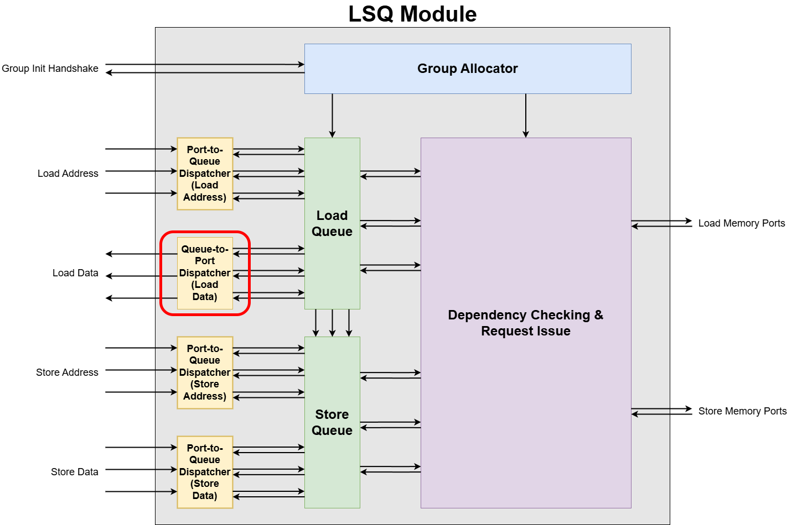
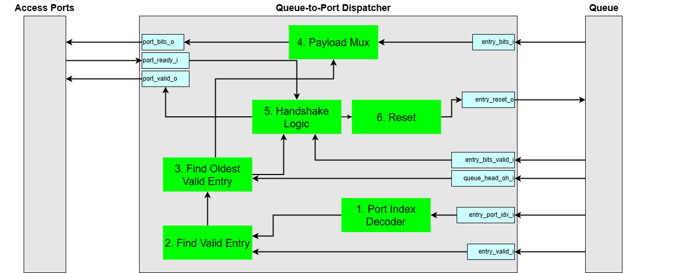
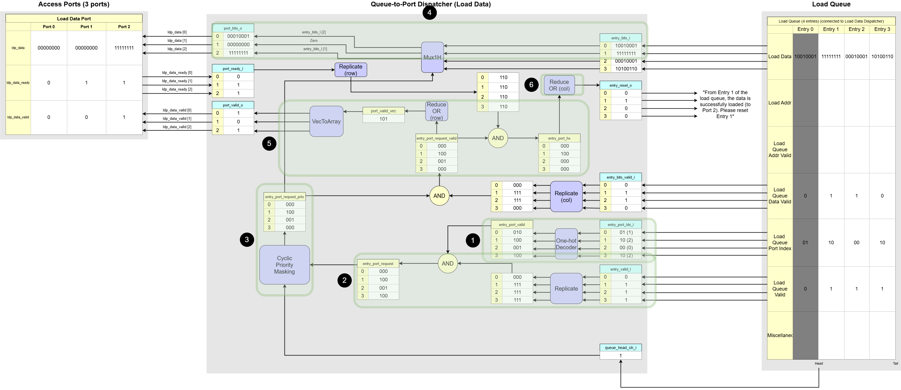

# Queue-to-Port Dispatcher

How loaded data get back to where it belongs.

## 1. Overview and Purpose

The Queue-to-Port Dispatcher is the counterpart to the Port-to-Queue Dispatcher. Its responsibility is to route payloads—primarily data loaded from memory—from the queue entries back to the correct access ports of the dataflow circuit.  

While the LSQ can process memory requests out-of-order, the results for a specific access port must be returned in-order to maintain the correctness. This module ensures that this order is respected for each port.

The primary instance of this module is the **Load Data Port Dispatcher**, which sends loaded data back to the circuit. An optional second instance, the **Store Backward Port Dispatcher**, can be used to send store completion acknowledgements back to the circuit.

## 2. Queue-to-Port Dispatcher Internal Blocks

### Interface Signals
| Signal Name          |  Description     |
| -------------------- | --------------- |
| `port_bits_o[p]`        | The result data (e.g. loaded from memory) sent to the access port |
| `port_valid_o[p]`       | *"Your data is ready."* Asserts high to indicate the `port_bits_o` bus has valid data. |
| `port_ready_i[p]`       | Sent from the port to acknowledge it has received the data. |
| `entry_valid_i[e]`      | Is the queue entry `e` logically allocated?  |
| `entry_bits_valid_i[e]` | Is the result data in entry `e` valid and ready to be sent?|
| `entry_port_idx_i[e]`   | Indicates to which port entry `e` must return its result |
| `entry_bits_i[e]`       | The result data stored in entry `e`, ready to be dispatched. |
| `entry_reset_o[e]`      | A signal saying *"clear entry `e` now, its job is done."*|
| `queue_head_oh_i[e]`    | One-hot vector indicating the head entry in the queue. |

The Queue-to-Port Dispatcher has the following core responsibilities:  

1. **Port Index Decoder**  
This block translates the binary port index assigned to each queue entry into a one-hot vector. A one-hot vector is a binary vector with only a single '1' and the rest '0's, which makes it easy for downstream logic to select the correct port.

    - **Input**: `entry_port_idx_i`
    - **Processing**: Performs a binary-to-one-hot conversion on the port index associated with each entry.
    - **Output**: A one-hot vector for each entry that directly corresponds to the port it is assigned to.

2. **Find Valid Entry**  
This block identifies which entries in the queue are currently valid (`entry_valid_i` = 1), meaning they hold data or a signal that is ready to be sent out.

    - **Input**: `entry_valid_i`
    - **Processing**: This block checks the `valid` bit of each queue entry. It combines this information with the decoded port index to form an initial array of potential requests.
    - **Output**: An array representing all allocated entries that are candidates for dispatching.

3. **Find Oldest Valid Entry**  
This is the core **Arbitration Logic** of the dispatcher. It takes all potential requests and selects a single "winner" for each port based on priority.

    - **Input**: The matrix of candidate entries (from `Find Valid Entry`) and the `queue_head_oh_i` signal.
    - **Processing**: It uses a **CyclicPriorityMasking** algorithm. This ensures that among all competing requests for a given port, the one corresponding to the oldest entry is selected.
    - **Output**: A control signal indicating the single winning entry for each port.

4. **Payload Mux**  
This block constitutes the main datapath of the dispatcher. It routes the payload from the winning queue entry to the correct output port.

    - **Input**: `entry_bits_i` (the data from all queue entries) and the winner selection signal from the `Find Oldest Valid Entry` block.
    - **Processing**: For each output port, this multiplexer uses the winner selection signal to choose the data from the single winning entry's `entry_bits_i`.
    - **Output**: `port_bits_o`.

5. **Handshake Logic**  
This block manages the final `valid/ready` handshake with the external `Access Ports`.

    - **Input**: The winner selection signal (from `Find Oldest Valid Entry`), `entry_bits_valid_i`, and `port_ready_i`.
    - **Processing**: It first confirms that the winning entry has a valid payload (`entry_bits_valid_i` = 1) before asserting the `port_valid_o` signal. It also receives the `port_ready_i` signal to know if the destination port is ready to accept the data.
    - **Output**: The `port_valid_o` signal and an internal signal indicating a successful handshake, which is passed to the `Reset` block.

6. **Reset**  
This block is responsible for clearing a queue entry after its payload has been successfully dispatched.

    - **Input**: A signal from the `Handshake Logic` indicating a successful data transfer (i.e., both `valid` and `ready` were high).
    - **Processing**: Upon detecting a successful handshake for a specific entry, it generates a single-cycle pulse.
    - **Output**: The `entry_reset_o` signal. When the queue receives this signal, it de-allocates the corresponding entry, making it available for a new operation.

## 3. Dataflow Walkthrough

0. **Initial state**:
    - Port Assignments: 
        - Entry 0 -> Port 1
        - Entry 1 -> Port 2
        - Entry 2 -> Port 0
        - Entry 3 -> Port 2
    - Queue Head: At `Entry 1`.
    - `entry_valid_i`: `[0, 1, 1, 1]` (Entries 1, 2, 3 are allocated).
    - `entry_bits_valid_i`: `[0, 1, 1, 0]` (Entries 1, 2 have valid data).
    - `port_ready_i`: `[0, 1, 1]` (Ports 1 and 2 are ready, Port 0 is not).

1. **Port Index Decoder**  
This block translates the binary port index assigned to each queue entry into a one-hot vector.  
Based on the example diagram:  
    - The `Port Index Decoder` converts these binary port indices into 3-bit one-hot vectors:
        - `Entry 0 (Port 1)`: `010`
        - `Entry 1 (Port 2)`: `100`
        - `Entry 2 (Port 0)`: `001`
        - `Entry 3 (Port 2)`: `100`
    - This result is saved in `entry_port_valid`

            entry_port_valid
                    P2 P1 P0
            E0:    [ 0, 1, 0 ]
            E1:    [ 1, 0, 0 ]
            E2:    [ 0, 0, 1 ]
            E3:    [ 1, 0, 0 ]

2. **Find Valid Entry**  
This block identifies all queue entries that are candidates for dispatching.
Based on the example diagram:  
    - The `entry_valid_i` vector is `[0, 1, 1, 1]`. Therefore, **Entries 1, 2, and 3** are the potential candidates to send their data out.
    - The logic then combines this validity information with the decoded port index for each entry (`entry_port_valid` from the `Port Index Decoder`). An entry's one-hot port information is passed through only if its corresponding `entry_valid_i` bit is `1`.
    - If an entry is not valid (like `Entry 0`), its output for this stage is zeroed out (`000`).
    - The result is the `entry_port_request` matrix, which represents the initial list of all valid requests and their target ports. This matrix is then sent to the `Find Oldest Valid Entry` block for arbitration.

            entry_port_request
                    P2 P1 P0
            E0:    [ 0, 0, 0 ]
            E1:    [ 1, 0, 0 ]
            E2:    [ 0, 0, 1 ]
            E3:    [ 1, 0, 0 ]

3. **Find Oldest Valid Entry**  
This is the core **Arbitration Logic**. It selects a single "winner" for each port from the list of valid candidates, based on priority.  
Based on the example diagram:  
    - The queue head is at `Entry 1`, establishing a priority order of `1 -> 2 -> 3 -> 0`.
    - `Port 0`: The only valid candidate is `Entry 2`. It wins the arbitration for Port 0.
    - `Port 1`: There are no valid candidates assigned to this port.
    - `Port 2`: The valid candidates are `Entry 1` and `Entry 3`. According to the priority order, `Entry 1` is the oldest and wins the arbitration for `Port 2`.
    - The output indicates that `Entry 2` won for `Port 0`, and `Entry 1` won for `Port 2`.
    - The result is `entry_port_request_prio`
    
            entry_port_request_prio
                    P2 P1 P0
            E0:    [ 0, 0, 0 ]
            E1:    [ 1, 0, 0 ]
            E2:    [ 0, 0, 1 ]
            E3:    [ 0, 0, 0 ]

4. **Payload Mux**  
This block acts as the main datapath, routing the data from the winning entries to the correct output ports.  
Based on the example diagram:
    - For **`port_bits_o[0]`**, it selects the data from the `Port 0` winner, `Entry 2`.
    - For **`port_bits_o[2]`**, it selects the data from the `Port 2` winner, `Entry 1`.
    - For `Port 1`, `0` is assigned.
    - The result is `port_bits_o`

        
            port_bits_o
            P0:    entry_bits_i [2] = 00010001
            P1:    Zero             = 00000000
            P2:    entry_bits_i [1] = 11111111

5. **Handshake Logic**  
This block manages the final stage of the dispatch handshake. It first generates the `port_valid_o` signals by checking if the winners from arbitration have valid data to send. It then confirms which of these valid requests complete a successful handshake.  
Based on the example diagram:  
    - First, the logic checks the `entry_bits_valid_i` vector, which is `[0, 1, 1, 0]`. This indicates that among the queue entries, only `Entry 1` and `Entry 2` are the only entries which is allocated by the Group Allocator.
    - For the `Port 0` winner (`Entry 2`), its `entry_bits_valid_i` is `1`. The logic asserts `port_valid_o[0]` to `1`.
    - For the `Port 2` winner (`Entry 1`), its `entry_bits_valid_i` is `1`. The logic asserts `port_valid_o[2]` to `1`.
    
        
            entry_port_request_valid                    port_valid_o
                    P2 P1 P0                              
            E0:    [ 0, 0, 0 ]                          P0:    1
            E1:    [ 1, 0, 0 ]                          P1:    0
            E2:    [ 0, 0, 1 ]                          P2:    1
            E3:    [ 0, 0, 0 ]                         

    - Next, the logic checks incoming `port_ready_i` signals from the access ports, which are `[0, 1, 1]`. This means that `Port 1` and `Port 2` are ready, but `Port 0` is not. A final handshake is successful only if the dispatcher has valid data to send `AND` the port is ready to receive. The `entry_port_hs` matrix shows this final result:

            entry_port_hs
                    P2 P1 P0
            E0:    [ 0, 0, 0 ]
            E1:    [ 1, 0, 0 ]  // Handshake succeeds (valid=1, ready=1)
            E2:    [ 0, 0, 0 ]  // Handshake fails (valid=1, ready=0)
            E3:    [ 0, 0, 0 ]

    - This means: *"Even though the queue is sending valid data to Port 0 and Port 2, only the handshake with Port 2 is successful because only Port 2 is ready to receive data."*

6. **Reset**  
This block is responsible for generating the `entry_reset_o` signal, which clears an entry in the queue after its data has been successfully dispatched. A successful dispatch requires a complete `valid/ready` handshake.   
Based on the initial state:
    - The Reset block asserts `entry_reset_o` only for the entry corresponding to the successful handshake, which is `Entry 1`. The message in the diagram confirms this: *"From Entry 1 of the load queue, the data is sent to Port 2. Please reset Entry 1"*.
