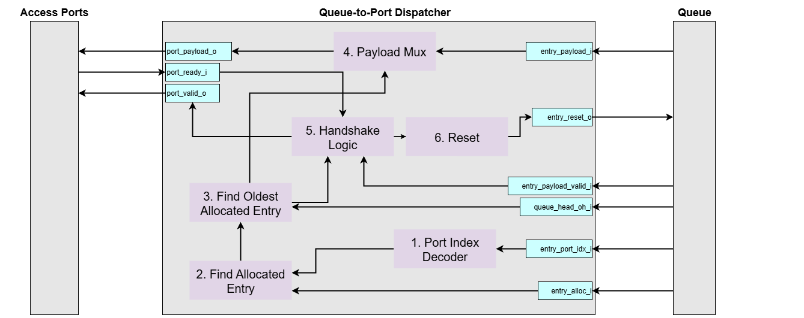
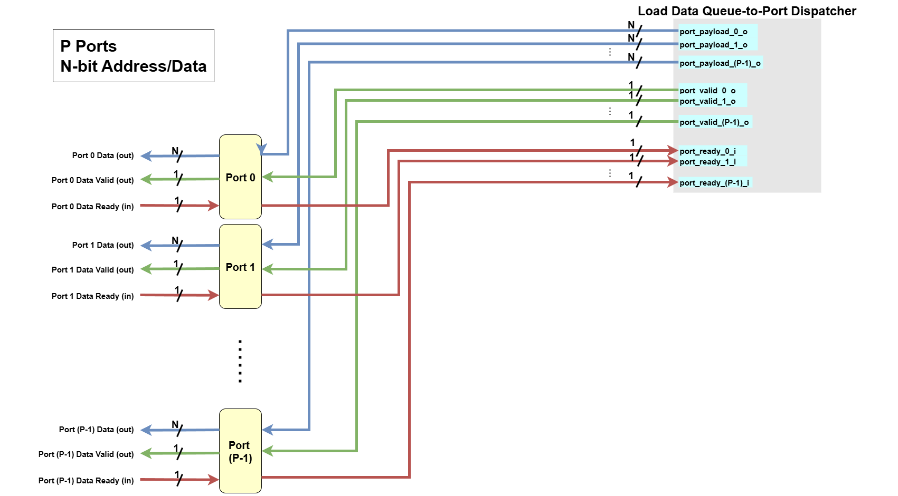
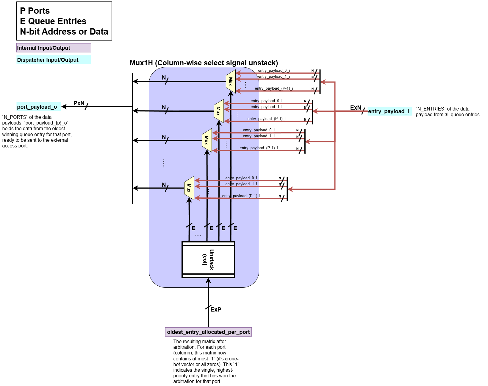
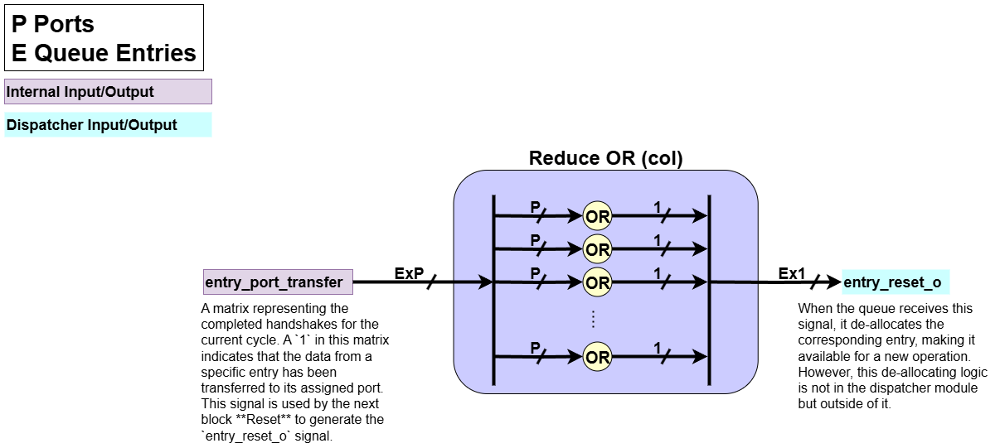
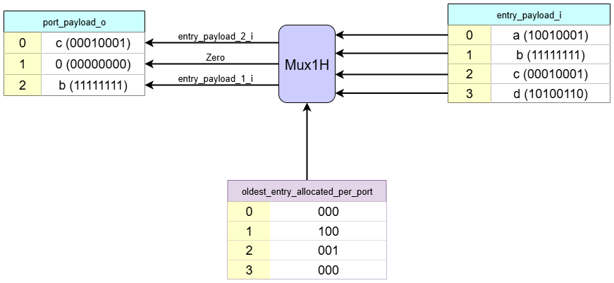

# Queue-to-Port Dispatcher

How loaded data get back to where it belongs.

## 1. Overview and Purpose

The Queue-to-Port Dispatcher is the counterpart to the Port-to-Queue Dispatcher. Its responsibility is to route payloads—primarily data loaded from memory—from the queue entries back to the correct access ports of the dataflow circuit.  

While the LSQ can process memory requests out-of-order, the results for a specific access port must be returned in-order to maintain the correctness. This module ensures that this order is respected for each port.

The primary instance of this module is the **Load Data Port Dispatcher**, which sends loaded data back to the circuit. An optional second instance, the **Store Backward Port Dispatcher**, can be used to send store completion acknowledgements back to the circuit.

## 2. Queue-to-Port Dispatcher Internal Blocks

Let's assume the following generic parameters for dimensionality:
* `N_PORTS`: The total number of ports.
* `N_ENTRIES`: The total number of entries in the queue.
* `PAYLOAD_WIDTH`: The bit-width of the payload (e.g., 8 bits).
* `PORT_IDX_WIDTH`: The bit-width required to index a port (e.g., `ceil(log2(N_PORTS))`).

### Port Interface Signals

These signals are used for communication between the external modules and the dispatcher's ports.

| Signal Name | Direction | Dimensionality | Description |
| :--- | :--- | :--- | :--- |
| **Inputs** | | | |
| `port_ready_i`   | Input     | `N_PORTS` of `std_logic`  | Array of ready flags. `port_ready_i[p]` is high when the external circuit at port `p` is ready to receive data. |
| **Outputs** | | | |
| `port_bits_o`    | Output    | `N_PORTS` of `std_logic_vector(PAYLOAD_WIDTH-1:0)` | Array of data payloads sent to the access ports.                                                 |
| `port_valid_o`   | Output    | `N_PORTS` of `std_logic`  | Array of valid flags. Asserts `port_valid_o[p]` to indicate that `port_bits_o[p]` contains valid data.     |

### Queue Interface Signals

These signals handle the interaction between the dispatcher logic and the internal queue entries.

| Signal Name | Direction | Dimensionality | Description |
| :--- | :--- | :--- | :--- |
| **Inputs** | | | |
| `entry_valid_i`      | Input     | `N_ENTRIES` of `std_logic`                       | Is queue entry `e` logically allocated?                                           |
| `entry_bits_valid_i` | Input     | `N_ENTRIES` of `std_logic`                       | Is the result data in entry `e` valid and ready to be sent?                          |
| `entry_port_idx_i`   | Input     | `N_ENTRIES` of `std_logic_vector(PORT_IDX_WIDTH-1:0)` | Indicates to which port each entry is assigned.                                   |
| `entry_bits_i`       | Input     | `N_ENTRIES` of `std_logic_vector(PAYLOAD_WIDTH-1:0)`  | The array of data stored in the queue entries.                            |
| `queue_head_oh_i`    | Input     | `std_logic_vector(N_ENTRIES-1:0)`                |  One-hot vector indicating the head entry in the queue.                  |
| **Outputs** | | | |
| `entry_reset_o`      | Output    | `N_ENTRIES` of `std_logic`                       | An array of reset signals. `entry_reset_o[e]` is asserted to deallocate entry `e` after its data has been successfully sent. |

The Queue-to-Port Dispatcher has the following core responsibilities:  

1. **Port Index Decoder**  

    When the group allocator allocates a queue entry, it also assigns the queue entry to a specific port, storing this port assignment as an integer. The Port Index Decoder decodes the port assignment for each queue entry from an integer representation to a one-hot representation.
    - **Input**:   
        - `entry_port_idx_i`: Queue entry-port assignment information
    - **Processing**:  
        - It performs a integer-to-one-hot conversion on the port index associated with each entry. For example, if there are 3 ports, an integer index of `1 (01 in binary)` would be converted to a one-hot vector of `010`.
    - **Output**:  
        - `entry_port_valid`: A one-hot vector for each entry that directly corresponds to the port it is assigned to.

2. **Find Valid Entry**  

    This block identifies which entries in the queue are currently valid (`entry_valid_i[e]` = `1`), meaning whether each entry is allocated by the group allocator or not.
    - **Input**:  
        - `entry_valid_i`: Indicates if the entry is allocated by the group allocator.
        - `entry_port_valid`: A one-hot vector for each entry that directly corresponds to the port it is assigned to.
    - **Processing**:  
        - For each queue entry `e`, this block performs the check: `entry_valid_i AND entry_port_valid`.
        - If an entry is not valid (i.e., not allocated, `entry_valid_i[e] = 0`), its port assignment is masked, resulting in a zero vector.
        - If the entry is valid (i.e., allocated, `entry_valid_i[e] = 1`), its one-hot port assignment is passed through unchanged.
    - **Output**:  
        - `entry_port_request`: The resulting matrix where a `1` at position `(e,p)` indicates that entry `e` is valid and assigned to port `p`. This matrix represents all potential candidates for sending data and is fed into the arbitration logic `CyclicPriorityMasking` to determine which entry gets to send its data first for each port.

3. **Find Oldest Valid Entry**  

    This is the core **Arbitration Logic** of the dispatcher. It takes all potential requests and selects a single "winner" for each port based on priority.
    - **Input**:  
        - `entry_port_request`: A matrix where a `1` at position (e, p) indicates that queue entry `e` is valid and assigned to port `p`. This represents the entire pool of candidates competing for access to the output ports.
        - `queue_head_oh_i`: The queue's one-hot head vector, which represents the priority (i.e., the oldest entry) for the current cycle.
    - **Processing**:
        - It uses a **CyclicPriorityMasking** algorithm, which operates on each port (column of `entry_port_request`). 
        - This ensures that among all candidates for each port, the one corresponding to the oldest entry in the queue is granted for the current clock cycle.
    - **Output**:  
        - `entry_port_request_prio`: The resulting matrix after arbitration. For each port (column), this matrix now contains at most `1` (it's a one-hot vector or all zeros). This `1` indicates the single, highest-priority entry that has won the arbitration for that port.

4. **Payload Mux**  

    For each access port, this block routes the payload from the oldest winning queue entry to the correct output port.
    - **Input**:  
        - `entry_bits_i`: An array containing the data payload from all queue entries.
        - `entry_port_request_prio`: The arbitrated selection matrix from the **Find Oldest Valid Entry** block. For each port (column), this matrix contains at most a single `1`, which identifies the oldest winning entry for that port.
    - **Processing**:  
        - For each output port `p`, a one-hot multiplexer (`Mux1H`) uses the `p`-th column of the `entry_port_request_prio` matrix as its select signal.
        - This operation selects the data payload from the single oldest entry out of the entire `entry_bits_i` array and routes it to the corresponding output port.
    - **Output**:  
        - `port_bits_o`: The array of data payloads. `port_bits_o[p]` holds the data from the oldest winning queue entry for that port, ready to be sent to the external access port.

5. **Handshake Logic**  

    This block manages the `valid/ready` handshake with the external access ports. It confirms that the winning entry's data from the cyclic priority masking is valid and that the receiving port is ready, then generates a signal indicating that it is handshaked.
    - **Input**:  
        - `port_ready_i`: The array of ready signals from the external access ports. `port_ready_i[p]` is high when port `p` can accept data.
        - `entry_bits_valid_i`: The array indicating if the data slot of each queue entry `e` is valid and ready to be sent. 
        - `entry_port_request_prio`: The arbitrated selection matrix from the **Find Oldest Valid Entry** block, indicating at most the single winning entry for each port.
    - **Processing**:  
        - **Check Winner's Data Validity**: First, the block verifies if the data in the winning entry is actually ready. It masks the `entry_port_request_prio` matrix with the `entry_bits_valid_i`. If the winning entry for a port doesn't have valid data, it is nullified for this cycle. The result is `entry_port_request_valid`.
        - **Generate `port_valid_o`**: The result of the masking from the previous step is then reduced (OR-reduction) for each port. If any entry in a column is still valid, it means a winning entry with valid data exists for that port, and the corresponding `port_valid_o` signal is asserted high.
        - **Perform Handshake**: Next, it determines if a successful handshake occurs. For each port `p`, a handshake is successful if the dispatcher has valid data to send (`port_valid_o[p]` is high) AND the external port is ready to receive it (`port_ready_i[p]` is high).
    - **Output**:  
        - `port_valid_o`: The final valid signal sent to each external access port, indicating that valid data is available on the `port_bits_o` bus.
        - `entry_port_hs`: A matrix representing the completed handshakes for the current cycle. A `1` in this matrix indicates that the data from a specific entry has been transferred to its assigned port. This signal is used by the next block **Reset** to generate the `entry_reset_o` signal.

6. **Reset**  

    This block is responsible for clearing a queue entry after its payload has been successfully dispatched.
    - **Input**:  
        - `entry_port_hs`: A matrix representing the completed handshakes for the current cycle. A `1` in this matrix indicates that the data from a specific entry has been transferred to its assigned port.
    - **Processing**:  
        - Checks each entry (row) of `entry_port_hs` whether it has `1` in a given row `e`. It means that entry `e` sent its data to some port.
        - Performs an OR operation across each row.
    - **Output**: 
        - `entry_reset_o`: When the queue receives this signal, it de-allocates the corresponding entry, making it available for a new operation.

## 3. Dataflow Walkthrough

0. **Initial state**:
    - Port Assignments: 
        - Entry 0 -> Port 1
        - Entry 1 -> Port 2
        - Entry 2 -> Port 0
        - Entry 3 -> Port 2
    - Queue Head: At `Entry 1`.
    - `entry_valid_i`: `[0, 1, 1, 1]` (Entries 1, 2, 3 are allocated).
    - `entry_bits_valid_i`: `[0, 1, 1, 0]` (Entries 1, 2 have valid data).
    - `port_ready_i`: `[0, 1, 1]` (Ports 1 and 2 are ready, Port 0 is not).

1. **Port Index Decoder**  
  
    This block translates the integer port index assigned to each queue entry into a one-hot vector.  
    Based on the example diagram:  
    - The `Port Index Decoder` converts these integer port indices into 3-bit one-hot vectors:
        - `Entry 0 (Port 1)`: `010`
        - `Entry 1 (Port 2)`: `100`
        - `Entry 2 (Port 0)`: `001`
        - `Entry 3 (Port 2)`: `100`
    - This result is saved in `entry_port_valid`

            entry_port_valid
                    P2 P1 P0
            E0:    [ 0, 1, 0 ]
            E1:    [ 1, 0, 0 ]
            E2:    [ 0, 0, 1 ]
            E3:    [ 1, 0, 0 ]

2. **Find Valid Entry**  
   
This block identifies all queue entries that are candidates for dispatching.
Based on the example diagram:  
    - The `entry_valid_i` vector is `[0, 1, 1, 1]`. Therefore, **Entries 1, 2, and 3** are the potential candidates to send their data out.
    - The logic then combines this validity information with the decoded port index for each entry (`entry_port_valid` from the `Port Index Decoder`). An entry's one-hot port information is passed through only if its corresponding `entry_valid_i` bit is `1`.
    - If an entry is not valid (like `Entry 0`), its output for this stage is zeroed out (`000`).
    - The result is the `entry_port_request` matrix, which represents the initial list of all allocated queue entries and their target ports. This matrix is then sent to the `Find Oldest Valid Entry` block for arbitration.

3. **Find Oldest Valid Entry**  
   
This is the core **Arbitration Logic**. It selects a single "winner" for each port from the list of valid candidates, based on priority.  
Based on the example diagram:  
    - The queue head is at `Entry 1`, establishing a priority order of `1 -> 2 -> 3 -> 0`.
    - `Port 0`: The only valid candidate is `Entry 2`. It wins the arbitration for Port 0.
    - `Port 1`: There are no valid candidates assigned to this port.
    - `Port 2`: The valid candidates are `Entry 1` and `Entry 3`. According to the priority order, `Entry 1` is the oldest and wins the arbitration for `Port 2`.
    - The output indicates that `Entry 2` won for `Port 0`, and `Entry 1` won for `Port 2`.
    - The result is `entry_port_request_prio`

4. **Payload Mux**  
  
This block routes the data from the winning entries to the correct output ports.  
Based on the example diagram:
    - For **`port_bits_o[0]`**, it selects the data from the `Port 0` winner, `Entry 2`.
    - For **`port_bits_o[2]`**, it selects the data from the `Port 2` winner, `Entry 1`.
    - For `Port 1`, `0` is assigned.
    - The result is `port_bits_o`

        
            port_bits_o
            P0:    entry_bits_i [2] = 00010001
            P1:    Zero             = 00000000
            P2:    entry_bits_i [1] = 11111111

5. **Handshake Logic**  
  
This block manages the final stage of the dispatch handshake. It first generates the `port_valid_o` signals by checking if the winners from arbitration have valid data to send. It then confirms which of these can complete a successful handshake.  
Based on the example diagram:  
    - First, the logic checks the `entry_bits_valid_i` vector, which is `[0, 1, 1, 0]`. This indicates that among the winning queue entries, data is valid and ready to be sent from `Entry 1` and `Entry 2`.
    - For the `Port 0` winner (`Entry 2`), its `entry_bits_valid_i` is `1`. The logic asserts `port_valid_o[0]` to `1`.
    - For the `Port 2` winner (`Entry 1`), its `entry_bits_valid_i` is `1`. The logic asserts `port_valid_o[2]` to `1`.
    - Next, the logic checks incoming `port_ready_i` signals from the access ports, which are `[0, 1, 1]`. This means that `Port 1` and `Port 2` are ready, but `Port 0` is not. A final handshake is successful only if the dispatcher has valid data to send `AND` the port is ready to receive. The `entry_port_hs` matrix shows this final result:

            entry_port_hs
                    P2 P1 P0
            E0:    [ 0, 0, 0 ]`
            E1:    [ 1, 0, 0 ]  // Handshake succeeds (valid=1, ready=1)
            E2:    [ 0, 0, 0 ]  // Handshake fails (valid=1, ready=0)
            E3:    [ 0, 0, 0 ]

    - This means: *"Even though the queue is sending valid data to Port 0 and Port 2, only the handshake with Port 2 is successful because only Port 2 is ready to receive data."*

6. **Reset**  
  
This block is responsible for generating the `entry_reset_o` signal, which clears an entry in the queue after its data has been successfully dispatched. A successful dispatch requires a complete `valid/ready` handshake.   
Based on the initial state:
    - The Reset block asserts `entry_reset_o` only for the entry corresponding to the successful handshake, which is `Entry 1`. The message in the diagram confirms this: *"From Entry 1 of the load queue, the data is sent to Port 2. Please reset Entry 1"*.
