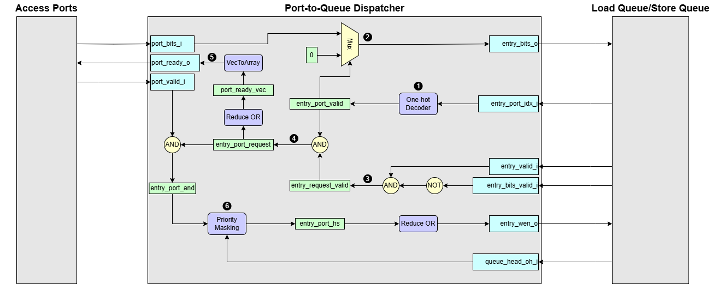

# Port-to-Queue Dispatcher

A friendly tour of how addresses and data enter the Load-Store Queue

---

## 1. Where the Dispatcher Fits in the Big Picture

Each memory access port fires requests as soon as the scheduler says it may. Those requests must land in the LSQ, a circular buffer that tracks every in-flight memory operation so we can later resolve hazards, reorder, and finally retire.  
We need a total of three **Port-to-Queue Dispatchers**—one each for the load address, store address, and store data. Why? To load, you must first supply the address where the data is stored. Likewise, a store operation needs both the value to write and the address to write it at.

**Problem:** Multiple ports can talk at once, while **only one LSQ entry may be written per cycle**.  
We therefore need a traffic cop that

1. **Selects** which request to accept this cycle, respecting the order it enters the LSQ. Selects the oldest entry among the valid one.
2. **Writes** the selected payload into the correct LSQ entry.  
3. **Back-pressures** the port when the queue is full or the entry it wants is still busy.

That traffic cop is the **Port-to-Queue Dispatcher**.

---

## 2. Dataflow Walkthrough

1. **Convert entry port index to one-hot**   
Each LSQ entry already stores the port index it ultimately belongs to. The dispatcher converts those indices into a one-hot matrix `entry_port_valid` so it can see, column-wise, which entries are waiting for which port.  

2. **Multiplex payload**  
Address or data to be dispatched from the port to the queue comes from `port_bits_i`. Guided by `entry_port_valid`, the dispatcher holds each port's payload until the write-enable signal `entry_wen_o` is high.

3. **Choose entry with valid requests**   
Next, an LSQ entry only needs attention if it is valid **and** its addr/data slot is still empty. That gating yields `entry_request_valid`.  

4. **Filter out ports with invalid entry**  
From the above `entry_request_valid`, discard LSQ entries that cannot accept the current port ID. Among the surviving candidates, pick those port ID matches `entry_port_valid`.

5. **Port handshake ready signal**   
If **any** entry in column **_p_** is requesting service, port **_p_** gets `ready = 1`, completing the valid-ready handshake. 

6. **Enable the oldest entry using priority masking**  
Even when an LSQ entry is ready, the originating port might not assert valid (`port_valid_i`). We therefore filter the candidate set with `port_valid_i` before the priority masking. This leaves the final candidate set.
Finally, we rotate the request matrix by the queue-head pointer and grant the oldest remaining entry via priority masking, setting `entry_wen_o=1` for such slot.
 

---

## 3. Interface Signals

| Signal Name          | Description     |
| -------------------- |  --------------- |
| `port_bits_i[p]`        | _“Here is my 16-bit payload.”_ (address or data)  |
| `port_valid_i[p]`       | _“…and I really mean it.”_  High when the payload is ready.   |
| `port_ready_o[p]`       | Dispatcher replies: _“Sure, send it!”_  Goes high if the LSQ can take the request this cycle.  |
| `entry_valid_i[e]`      | Is LSQ entry **_e_** logically allocated?   |
| `entry_bits_valid_i[e]` | Has the addr/data slot already been filled? |
| `entry_port_idx_i[e]`   | Indicates to which port the entry is assigned|
| `entry_bits_o[e]`       | The data actually written into LSQ entry **_e_**. Think of it as the ink flowing into row **_e_** on the whiteboard.|
| `entry_wen_o[e]`        | A short pulse that says _“commit the write into entry **_e_** now.”_ |
| `queue_head_oh_i[e]`    | One-hot vector indicating the head entry in LSQ |
