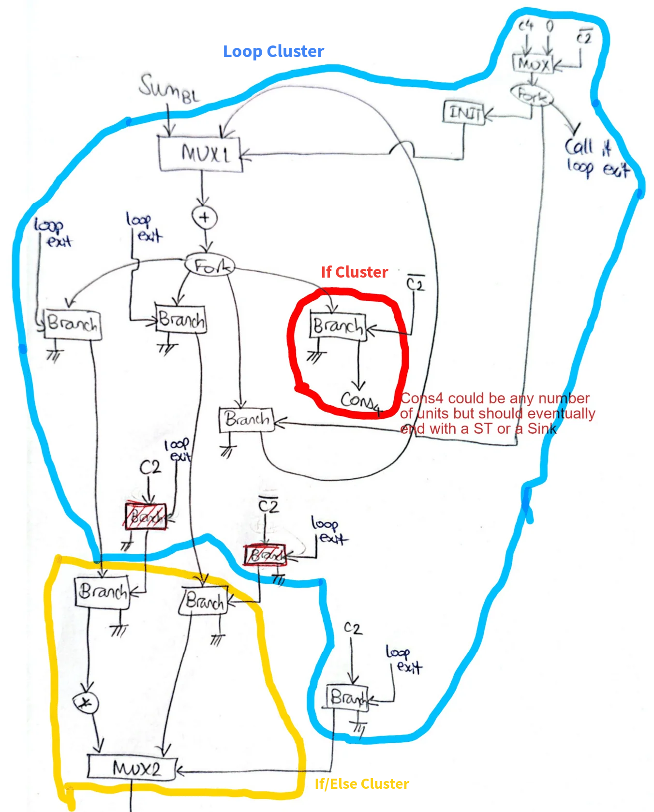
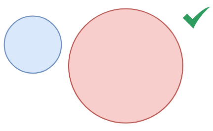
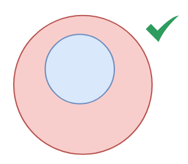
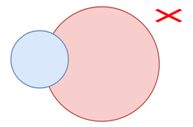
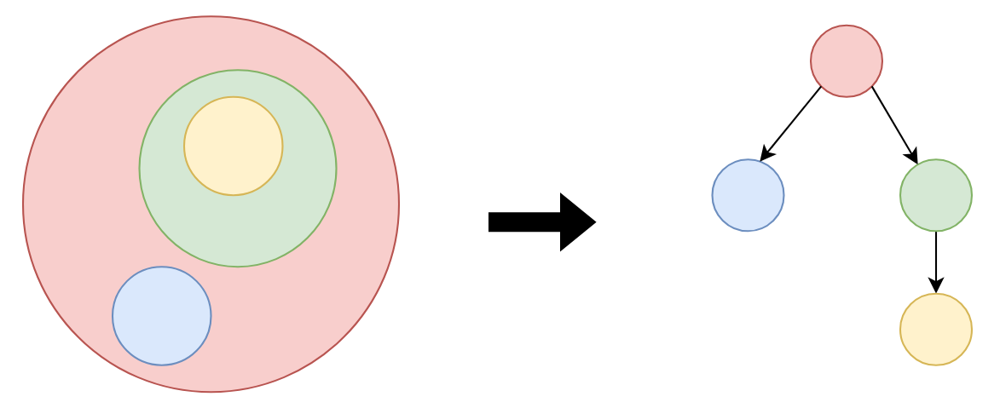

# Clustering Algorithm

## What is a Cluster and Why We Need Clustering

### **What is a Cluster?**
A **cluster** in the context of dataflow circuits with control flow is a **group of interconnected components**, including **BRANCHes**, **MUXes**, and any components enclosed between them, that are **logically grouped into a single new node**. This new node has the key property that **its input and output channels have matching token counts**, just like ordinary dataflow nodes.

Clusters are created differently for:
- **Noncyclic control flow (e.g., if-then-else)**: The cluster starts at the input of one or more **BRANCHes** and ends at the output of one or more **MUXes** that are driven by the **same condition**.
- **Cyclic control flow (e.g., loops)**: The cluster starts at a **MUX** handling a loop’s backward edge and ends at a **BRANCH** whose condition matches that of the loop’s **INIT** component.
- **If-only control flow (e.g., simple conditional execution without a MUX)**: The cluster starts at a **BRANCH** and ends at a **sink or store**, effectively capturing conditional execution that does not rejoin the main flow via a MUX.

> The clustering method described here **is exactly** the one introduced by Elakhras *et al.* in their paper on out-of-order-execution, published in ASPLOS 2024. The full paper is available at [https://dl.acm.org/doi/10.1145/3626202.3637556](https://dl.acm.org/doi/10.1145/3626202.3637556).

### **Why Do We Need Clustering?**
Clustering is necessary to **prevent alignment count mismatches**, which occur when different edges in a dataflow circuit carry **different numbers of tokens** due to control flow elements like BRANCHes and MUXes. These mismatches can cause:
- **Deadlocks** during execution.
- **Incorrect placement** of synchronization components (e.g., TAGGERs and ALIGNERs).

By **hiding control-flow-heavy parts** of the circuit inside a cluster and only exposing the matching-token input/output edges of that cluster, we ensure:
- Safe and correct placement of alignment components.
- The control flow appears **"flattened" or "neutralized"**, making the circuit behave as if it had no control flow from the algorithm's perspective.

## Step-by-Step Logic of Cluster Creation

### 1. **Identify MUXes and Their Conditions**

The first step in the process involves identifying all **MUXes** in the **handshake function** and determining the conditions that control them. For each MUX operation, the function:
- Identifies the condition feeding the MUX.
- Groups MUXes controlled by the same condition into the same cluster.

- **Loop vs If/Else**: If the MUX is fed by an **INIT**, the cluster corresponds to a loop; else, the cluster corresponds to an if/else or if block.
- **Negated Conditions**: If the condition is negated (e.g., `NOT c1`), the muxes controlled by both the original and negated conditions are grouped into the same cluster.

### 2. **Identify Conditional Brancheses and Their Conditions**

After identifying the MUXes, the next step is to analyze **Conditional Branches**:
- If there is a corresponding MUX for a branch, the branch is added to an **If/Else** or **Loop** cluster.
- If no corresponding MUX exists, the branch is added to an **If-only** cluster, which includes BRANCHes leading directly to sinks or stores.

### 3. **Create Clusters for Each Condition**

Once MUXes and BRANCHes are identified:
- A **cluster** is created for each condition shared by the operations (MUXes and BRANCHes).
- A cluster consists of:
  - **Inputs**: Operands (data) entering the cluster, excluding conditions.
  - **Outputs**: Results exiting the cluster (e.g., branch outputs or MUX outputs).
  - **Internal Operations**: Operations within the cluster, bounded by the MUXes and BRANCHes.

Clusters are categorized as:
- **Loop Clusters**: Formed when MUX operations are followed by BRANCHes, representing loop constructs.
- **If/Else Clusters**: Formed when BRANCH operations and operations are followed by MUXes.
- **If-only Clusters**: Formed when a branch does not have a corresponding MUX operation.

### 4. **Create the Global Cluster**

The **global cluster** represents the entire function:
- **Inputs**: The last function argument (used as the starting point).
- **Outputs**: The operands of the **EndOp**, which signal the function’s completion.
- **Internal Operations**: All operations excluding memory operations and the **EndOp**.

The global cluster captures the complete graph of operations, covering all control flow regions.

### Special Considerations

- **Memory Operations**: Memory-related operations (e.g., **MemoryControllerOp**, **LSQOp**) are excluded from the clusters. These are not part of the control flow analysis as they deal with memory management.

### Example

## Cluster Verification

### Relationship Between Clusters
Two clusters can either be **disjoint** or one can **entirely contain the other**.
1. **Disjoint Clusters**:
   - Two clusters are **disjoint** if they do not share any operations. There is no overlap between their `internalOps`.

  
   
2. **Nested Clusters**:
   - Two clusters are **properly nested** if one cluster is completely contained within the other.
     - **Cluster A in Cluster B**: All operations of Cluster A must be contained within Cluster B.

  

3. **Invalid Overlap**:
   - If two clusters share operations but are not fully contained within each other (i.e., partial overlap), the configuration is invalid and results in failure.

   

### Nested Control Flow Structures

When reasoning about the boundaries of clusters, we must ensure that nested control flow structures do not violate any relationship. The following possible nestings exist:

1. **Loop inside a loop**: Each loop has a unique loop exit function, and no two loops can calculate the same exit condition.
2. **If-then-else inside an if-then-else**: Since an if-then-else structure does not enclose the condition, two if-then-else clusters cannot share a condition.
3. **Loop inside an if-then-else**: Since the loop condition is internal to the loop, an if-then-else cluster cannot share a condition with a loop.
4. **If-then-else inside a loop**: The if-then-else does not enclose the condition, so it will not share a condition with the loop structure.

## Cluster Hierarchy Building

The **Cluster Hierarchy Building** process organizes clusters into a nested structure based on their relationships. It identifies which clusters are nested inside others and builds a hierarchy where smaller (inner) clusters are placed inside larger (outer) ones. This hierarchy helps visualize the control flow structure and the relationships between different clusters.

1. **Sorting Clusters by Size**:
   - The clusters are sorted based on the number of operations they contain. Smaller clusters (those with fewer operations) are processed first to ensure that any **child clusters** are considered before their **parent clusters**.

2. **Identifying Nested Relationships**:
   - After sorting, each cluster is checked to see if it is completely **contained within** another cluster. 
   - If a cluster is fully enclosed by another, the first cluster is considered a **child**, and the second becomes its **parent**. Else, the clusters must be completely disjint.

