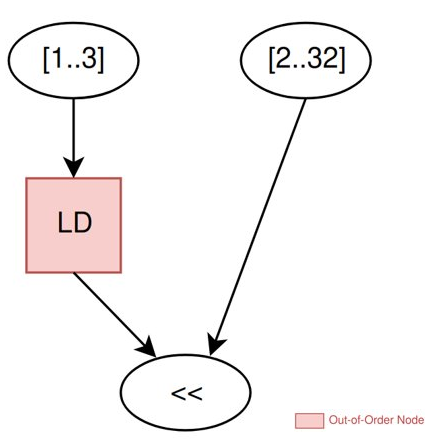
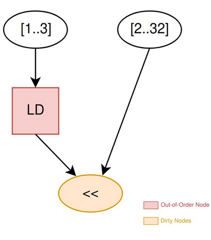
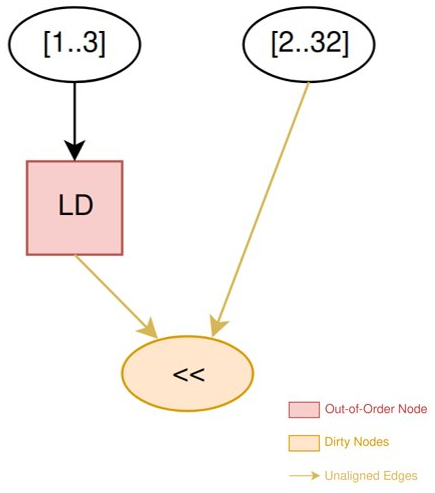
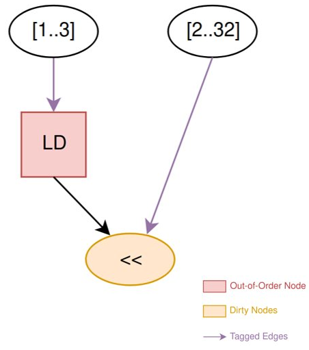
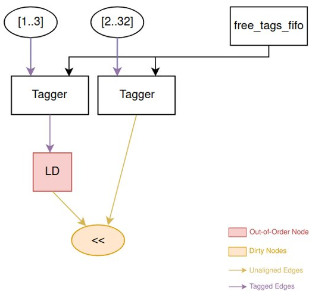
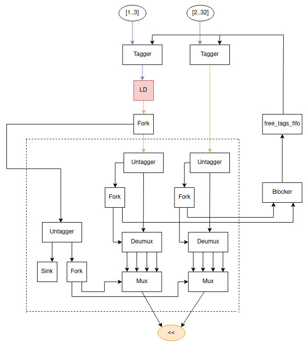
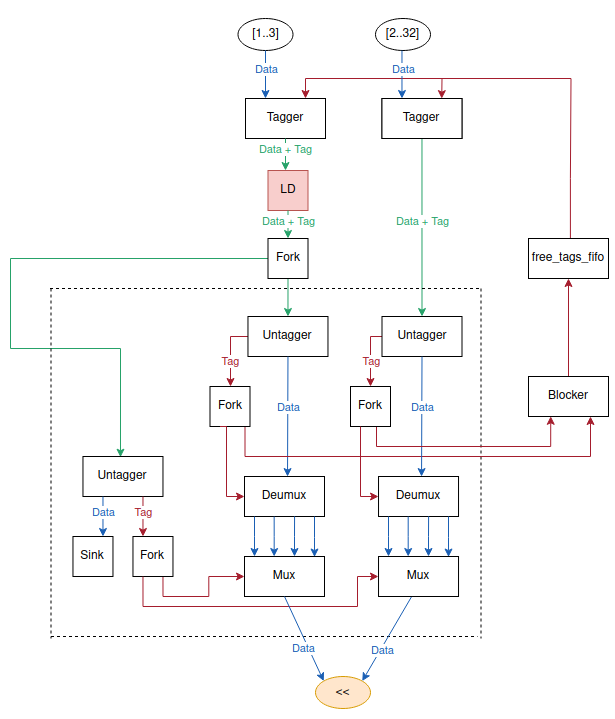

# Out-of-Order Execution Implementation

## Step 1: Create and Connect the Operations
Out-of-Order Execution Algorithm :

1. Identify dirty nodes

2. Identify unaligned edges

3.  Identify tagged edges

4.  Add taggers

5. Add aligner + untaggers

**Example:**

Code: **[2..32] << a[0]**

Out-of-Order Node: LD

### 1.1. Identify Dirty Nodes
Identify all the nodes reachable from the out-of-order node.

### 1.2. Identify Unaligned Edges
Identify all the edges that can have tokens with different orders (edges between dirty and non-dirty node).

### 1.3. Identify Tagged Edges
Identify all the edges that should receive tagged tokens.

These are the:

&nbsp;&nbsp; *unaligned edges + input edges of the out-of-order node – output edge of the out-of-order node*

### 1.4. Add Taggers
For each tagged edge, add a tagger.

### 1.5. Add Aligner + Untaggers
Align the unaligned edges.

Aligner Order (select):

- Free Aligner: out-of-order node order

- Controlled Aligner: program order

## Step 2: Adding Channel Types
Traverse the tagged region to add the tag as an extra signal to the channels.

