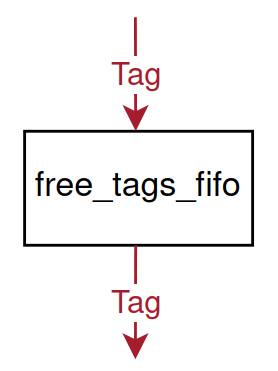
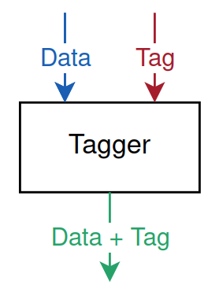
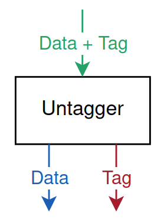
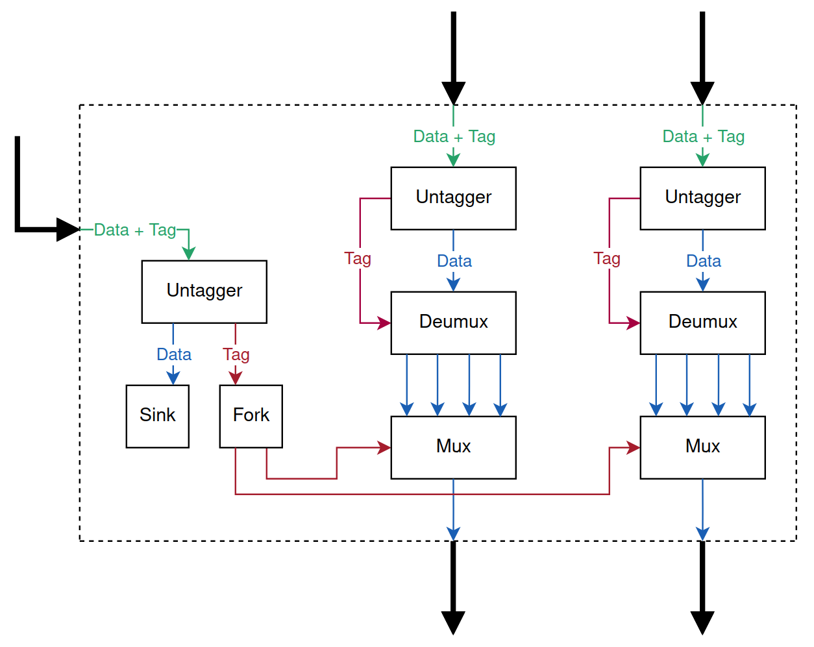

# Out-of-Order Execution Operations
The out-of-order execution algorithm requires 4 operations:

- FreeTagsFifo
- Tagger
- Untagger
- Aligner

## FreeTagsFifo
A `FreeTagsFifo` represents a FIFO queue that supplies tags ready for reuse.

## Tagger
A `Tagger` attaches extra tag bits to the data payload.

## Untagger
An `Untagger` extracts the extra tag bits previously attached to a data payload by the tagger.

## Aligner
An `Aligner` synchronizes and matches tagged tokens from multiple inputs, passing them to the output once identical tags are found.

