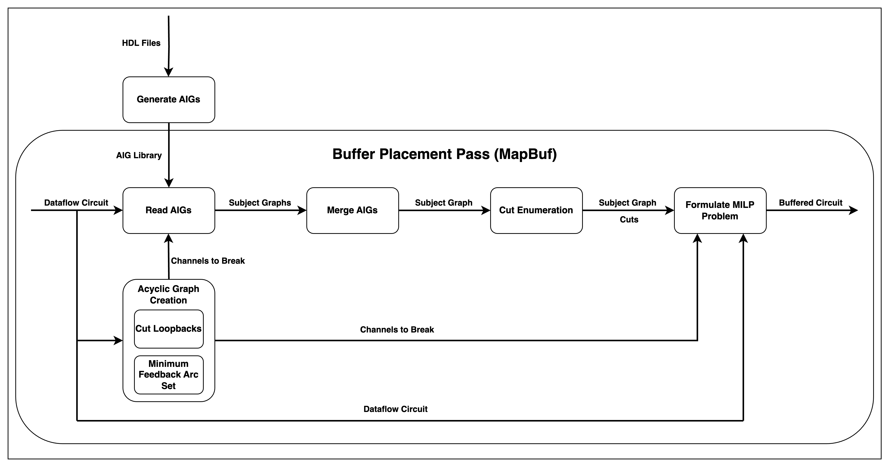

# MapBuf

## Overview
This file provides describes the MapBuf buffer placement algorithm. The algorithm is detailed in the paper [MapBuf: Simultaneous Technology Mapping and Buffer Insertion for HLS Performance Optimization](https://ieeexplore.ieee.org/document/10323639). 

The document provides:
- Required compilation flags for running MapBuf
- Overview of the MILP constraint functions 
- Delay characterization and propagation for carry-chains
- Results

## File Structure
All MapBuf documentation is located under [/docs/Specs/Buffering/MapBuf/](https://github.com/EPFL-LAP/dynamatic/tree/main/docs/Specs/Buffering/MapBuf), while the implementation files are found in the [/experimental/lib/Support/](https://github.com/EPFL-LAP/dynamatic/tree/main/experimental/lib/Support) directory.

1) [BlifReader.cpp](https://github.com/EPFL-LAP/dynamatic/blob/main/experimental/lib/Support/BlifReader.cpp): Handles parsing and processing of BLIF files to convert them into internal data structures.
2) [CutlessMapping.cpp](https://github.com/EPFL-LAP/dynamatic/blob/main/experimental/lib/Support/CutlessMapping.cpp): Implements cut generation algorithm for technology mapping.
3) [SubjectGraph.cpp](https://github.com/EPFL-LAP/dynamatic/blob/main/experimental/lib/Support/SubjectGraph.cpp): Implements the core hardware-specific Subject Graph classes.

## Running MapBuf
To run MapBuf, BLIF files must first be generated. These can be created using the provided [BLIF generation script](https://github.com/EPFL-LAP/dynamatic/blob/main/tools/blif-generator/blif_generator.py) or obtained from the [dataflow-aig-library](https://github.com/ETHZ-DYNAMO/dataflow-aig-library) submodule.

### Compile Options 

MapBuf requires several new command-line flags to be configured for proper operation:

- --blif-files: Specifies the directory path containing BLIF files used for technology mapping
- --lut-delay: Sets the average delay in nanoseconds for Look-Up Tables (LUTs) in the target FPGA
- --lut-size: Defines the maximum number of inputs supported by LUTs in the target FPGA
- --acyclic-type: Selects the method for converting cyclic dataflow graphs into acyclic graphs, which is required for AIG generation:
  - false: Uses the Cut Loopbacks method to remove backedges
  - true: Uses the Minimum Feedback Arc Set (MFAS) method, which cuts the minimum number of edges to create an acyclic graph (requires Gurobi solver)

MapBuf currently requires Load-Store Queues (LSQs) to be disabled during compilation. This can be achieved by adding the --disable-lsq flag to the compilation command.

## MILP Constraints
This section provides a mapping between the implementation functions and the MILP constraints specified in the MapBuf paper:

- addBlackboxConstraints(): Implements delay propagation constraints for carry-chain modules (Section VI-B)
- addClockPeriodConstraintsNodes(): Matches the Gurobi variables of AIG nodes with channel variables. Implements Clock Period Constraints (Equations 1-2 in the paper)
- addDelayAndCutConflictConstraints(): This function adds 3 different constraints. 
  - Channel Constraints and Delay Propagation Constraints (Equations 3 and 5) merged into a single constraint.
  - Cut Selection Conflicts (Equation 6) that prevents insertion of a buffer on a channel covered by a cut.
- addCutSelectionConstraints(): Implements Cut Selection Constraints (Equation 4) ensuring exactly one cut is selected per node.

## Delay Characterization of Carry-Chains
Arithmetic modules such as adders, subtractors, and comparators are implemented using carry-chains rather than LUTs. This difference requires specialized delay propagation constraints in MapBuf. The delay propagation constraints for these modules are added in the addBlackboxConstraints() function.

The delay values for carry-chains are stored in two maps within MAPBUFBuffers.cpp:

ADD_SUB_DELAYS: Contains delay values for addition and subtraction modules.
COMPARATOR_DELAYS: Contains delay values for comparator module.

Importantly, the delay values specified in these maps are different than what is specified in rtl-config-verilog.json file, used by FPL22 algorithm. The reason for this difference is how delay values are extracted. The delay extraction method used for FPL22 characterizes adder/comparator modules by synthesizing the complete handshake module and measuring the delay from input to output. This method includes delays from wiring delays at the module's input/output ports.

In contrast, MapBuf only extracts the carry-chain delays of these msodules. Therefore, the delay values used in MapBuf represent only the delay from carry-chains, avoiding double-counting of wiring delays that are accounted for elsewhere.

## Acylic Graph Creation
By definition, Subject Graphs are Directed Acyclic Graphs (DAG). Therefore, in order to generate AIG of the dataflow circuit, the cycles of the graph must be broken. This is achieved by placing buffers on the chosen edges, which cuts combinational paths that create cycles. These edges are cut by placing buffers both in the Subject Graph representation and by adding corresponding constraints to the original buffer placement MILP formulation, ensuring that cycles are eliminated in both the Subject Graph used for technology mapping and the Dataflow Graph. There are two distinct methods available for selecting which edges should be cut by buffer insertion.

### Cut Loopbacks Method
The first method is Cut Loopbacks Method. This is the simplest approach that identifies backedges of the Dataflow Graph. No additional MILP formulation is required for this method, as the backedges are directly identified by calling the ```isBackedge()``` function on dataflow channels. However, this is not the most optimized method to produce a DAG, since the method do not consider the global structure of the graph. When a backedge is detected, the algorithm immediately marks it for buffer insertion without analyzing whether cutting a different, strategically chosen edge might eliminate multiple cycles simultaneously. This can result in substantial over-buffering, increasing area of the generated circuit.

### Minimum Feedback Arc Set Method
The second method is the Minimum Feedback Arc Set (MFAS) Method. This approach formulates the cycle-breaking problem as an MILP problem to find the smallest set of edges whose removal makes the graph acyclic. The formulized MILP enforces a sequential ordering of the nodes of the Dataflow Graph, since a graph is acyclic if and only if a sequential ordering of the nodes can be found. 

The MILP formulation introduces integer variables representing the topological ordering of nodes and binary variables indicating whether each edge should be cut. Constraints ensure that if an edge is not cut, it must respect the topological ordering, while cut edges are free from this constraint. The objective function minimizes the total number of edges to be cut, subject to the constraint that the a valid sequential ordering can be found. This approach guarantees finding the true minimum feedback arc set, ensuring that the fewest possible buffers are inserted while completely eliminating all cycles.

## Flow of the Algorithm


## Benchmark Performance Results

| Benchmark       | Cycles  | Clock Period (ns)| LUT  | Register | Execution Time (ns)|
|----------------|---------|---------------|------|----------|----------------|
| **CNN**        | 970662  | 3.945         | 2449 | 1724     | 3829261.59     |
| **FIR**        | 1011    | 3.842         | 343  | 350      | 3884.262       |
| **Gaussian**   | 20360   | 3.764         | 1027 | 1001     | 76635.04       |
| **GCD**        | 139     | 4.089         | 1723 | 1471     | 568.371        |
| **insertion_sort** | 962 | 4.976         | 1330 | 1214     | 4786.912       |
| **kernel_2mm** | 16003   | 3.842         | 2209 | 2106     | 61483.526      |
| **matrix**     | 33647   | 3.920         | 826  | 758      | 131896.24      |
| **stencil_2d** | 543     | 3.548         | 909  | 899      | 1926.564       |