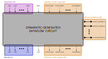

# Circuit & Memory Interface

> [!NOTE]
> This is a proposed design change; it is not implemented yet.

The interface of Dynamatic-generated circuits has so far never been properly formalized; it is unclear what guarantees our circuits provide to the outside world, or even what the semantics of their top-level IO are. This design proposal aims to clarify these concerns and lay out clear invariants that all Dynamatic circuits must honor to allow their use as part of larger arbitrary circuits and the composition of multiple Dynamatic circuits together. This specification introduces the proposed interfaces by looking at our circuits at different levels of granularity.

1. [Circuit interface](#circuit-interface) | Describes the semantics of our circuit's top-level IO.
2. [Memory interface](#memory-interface) | Explains how we can implement standardized memory interfaces (e.g., AXI) from our ad-hoc ones.
3. [Internal implementation example](#internal-implementation) | Example of how we may implement the circuits' semantics internally.

## Circuit interface

In this section, we look at the proposed interface for Dynamatic circuits. The figure below shows the composition of their top-level IO.

The inputs of a Dynamatic circuit are made up its [arguments](#arguments--results), a [`start`](#start--end) signal, and of [memory control inputs](#memory-controls). Conversely, the outputs of a Dynamatic circuit are made up of its [results](#arguments--results), an [`end`](#start--end) signal, and of [memory control outputs](#memory-controls). Finally, a Dynamatic circuits may have a list of [ad-hoc memory interfaces](#ad-hoc-memory-interfaces), each made up of an arbitrary (and potentially differerent) bundle of signals. For design sanity, these memory interfaces should still be elastic even though their exact composition is up to the implementor.

> [!IMPORTANT]
> We define a *circuit execution* as a single token (in the dataflow sense) being consumed on each of the circuit's inputs, and a single token eventually being transmitted on each of the circuit's outputs. After all output tokens have been transmitted---which necessarily happens *after* all inputs tokens have been consumed---we consider the execution to be *completed*. Dynamatic circuits may support streaming---i.e., concurrent executions on multiple sets of input tokens. In this case, Dynamatic circuits produce the set of output tokens associated to each execution in the order in which it consumed the sets of input tokens.
>
> Dynamatic circuits guarantee that, after consuming a single token on each of their input ports, they will *eventually* produce a single token on each of their output ports; *circuit executions are guaranteed to complete*. However, they offer no guarantee on input consumption order across different input ports or output production order across different output ports.

### `start` & `end`

`start` (displayed top-center in the figure) is a control-only input (downstream *valid* wire and uptream *ready* wire) that indicates to the Dynamatic circuit that it can start executing one time. Conversely, `end` (displayed bottom-center in the figure) is a control-only output that indicates that the Dynamatic circuit will eventually complete one execution.

### Arguments & Results

A Dynamatic circuit may have 0 or more arguments ($N$ arguments displayed top-left in the figure) which are full dataflow inputs (downstream *data* bus and *valid* wire and uptream *ready* wire). Conversely, a Dynamatic circuit may have 0 or more results ($L$ results displayed bottom-left in the figure) which are full dataflow outputs. Note that the number of arguments and results may be different, and that the data-bus width of each argument input and result output may be different.

### Memory controls

A Dynamatic circuit may interact with 0 or more distinct memory regions. Interactions with each memory region is controlled independently by a pair of control-only ports, a `mem_start` input ($M$ memory control inputs displayed top-right in the figure) and `mem_end` output ($M$ memory control outputs displayed bottom-right in the figure). The `mem_start` input indicates to the Dynamatic circuit that it may start to make accesses to that memory region in the current circuit execution. Conversely, the `mem_end` output indicates that the Dynamatic circuit will not make any more accesses to the memory region in the current circuit execution.

> [!NOTE]
> The number of distinct memory regions that a Dynamatic circuit instantiates is not a direct function of the source code from which it was synthesized. The compiler is free to make optimizations or transformations as required. For convenience, Dynamatic still offers the option of simply assigning a distinct memory region to each array-typed argument in the source code.

### Ad-hoc memory interfaces

A Dynamatic circuit connects to memory regions through ad-hoc memory interfaces ($M$ memory interfaces displayed right in the figure). These bidirectional ports may be different between memory regions; they carry the load/store requests back and forth between the Dynamatic circuit and the external memory region. Implementors are free to choose the exact signal bundles making up each memory interface.

> [!IMPORTANT]
> While the specification imposes no restriction on these memory interfaces, it is good practice to always use some kind of *elastic* (e.g., latency-insensitive) interface to guaranteee compatibility with standardized latency-insensitive protocols such as AXI. Note that our current ad-hoc memory interfaces are *not* elastic, which should be fixed in the future.

## Memory interface

While the [ad-hoc memory interfaces](#ad-hoc-memory-interfaces) described above are very flexible by nature, users of Dynamatic circuits are likely to want to connect them to their design using standard memory interfaces and talk to them through standard communication protocols. To fulfill this requirement, Dynamatic should also be able to emit wrappers around its "core dataflow circuits" that simply convert every of its ad-hoc memory interface to a standard interface (such as AXI). The figure below shows how such a wrapper would look like.

The wrapper has exactly the same `start`, `end`, arguments, results, and memory control signals as the Dynamatic circuit it wraps. However, the Dynamatic circuit's ad-hoc memory interfaces (double-sided arrows on the right of the inner box on the figure) get converted on-the-fly to standard memory interfaces (AXI displayed right in the figure). As a sanity check on any ad-hoc interface, it should always be possible and often easy to make load/store requests coming through them compliant with standard communication protocols.

## Internal implementation

This section hints at how one might implement the proposed interface in Dynamatic circuits. The goal is not to be extremely formal but rather to

1. show that the proposed interface is sane and
2. give a sense of how every port of the interface connects to the circuit's architecture.

The figure below shows a possible internal implementation for Dynamatic circuits (note that the wrapper previously discussed is not shown in this picture). The rest of this section examines specific aspects of this rough schematic to give an intuition of how everything fits together.

### `start` to `end` path

Recall the meaning of the `start` and `end` signals. `start` indicates that the circuit can start executing one time, while `end` indicates that the circuit will eventually complete one execution. Assuming a well-formed circuit that does not deadlock if all its inputs are provided, it follows that if the circuit starts an execution, it will eventually complete it. Therefore, `start` directly feeds into `end`.

### Arguments to results path

The circuit's arguments directly feed into the "internal circuit logic" block which eventually produces the circuit's results. This block simply encapsulates the circuit-specific DFG (data-flow graph). In particular, it includes the circuit's control network which is triggered by the "control synchronizer" shown below the `start` input. This synchronizer, in the simplest case, exists to ensure that only one set of input tokens is "circulating" inside the circuit logic at any given time. The synchronizer determines when the circuit starts an execution by looking at both the `start` input (indicating that we should at some point start executing with new inputs) and at the "exit block reached" signal coming from the circuit (indicating that a potential previous execution of the circuit has completed).

### Memory path

The schematic only shows the internal connectivity for a single memory region (`mem2`) for readability purposes. The connectivity for other memory regions may be assumed to be identical.

Internally, memory accesses for each memory region are issued by the internal circuit logic to an internal memory controller (e.g, LSQ), which then forwards these requests to an external memory through its associated ad-hoc memory interface; all of these communication channels are handshaked. The "memory synchronizer" shown below the `mem2_start` input informs the memory controller of when it is allowed to make memory requests through its interface. It makes that determination using a combination of the `start` input (indicating that the circuit should execute), the `mem2_start` input (indicating that accesses to the specific memory region are allowed), and of the memory controller's own termination signal (indicating that any potential previous execution of the circuit will no longer make accesses to the region). The latter also feeds `mem2_end`.
