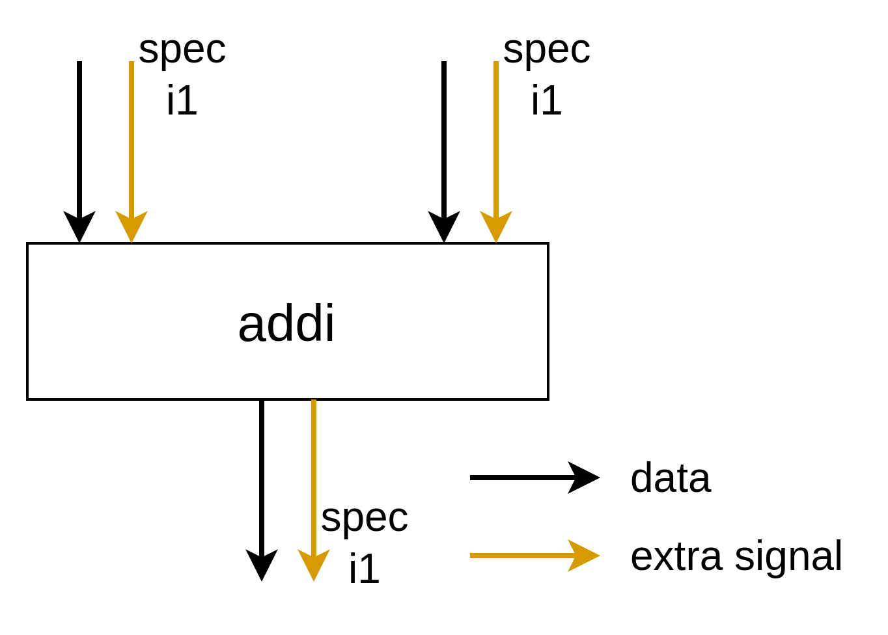
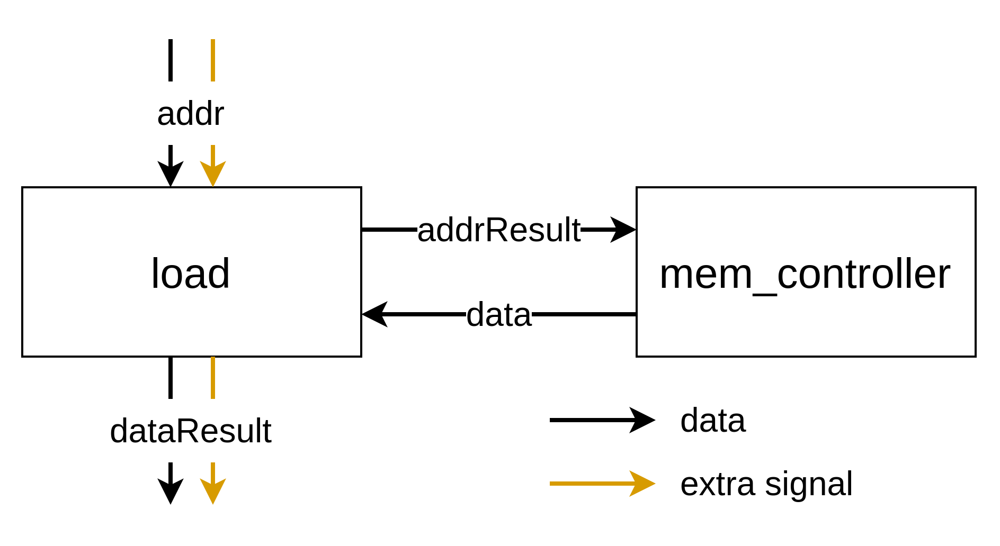

# Extra Signals Type Verification

The concept of extra signals has been introduced into the Handshake TypeSystem, as detailed [here](https://github.com/EPFL-LAP/dynamatic/blob/main/docs/Specs/TypeSystem.md). This feature allows both channel types and control types to carry additional information, such as spec bits or tags. Each operation must handle the extra signals of its inputs and outputs appropriately. To ensure this, we leverage MLIR's type verification tools, enforcing rules for how extra signals are passed to and from operations. Rather than thinking of the type verification as fundamental, rigid limits on how extra signals may exist in the circuit, these rules are used to catch unintended consequences of algorithms or optimizations. The specifics of how each unit is verified come from how the unit is generated: if unit generation would fail, verification should also.

This document is structured as follows:

1. We first provide a visual overview of how these rules apply to each operation.
2. We then explore the codebase—focusing on TableGen files—to see how these rules are implemented in practice.

## 1. Operation-Specific Rules

Since these rules differ from operation to operation, we describe them in this document.

### Default

Most operations are expected to have consistent extra signals across all their inputs and outputs.

To further specify the meaning of "consistent extra signals across all their inputs and outputs", we provide an example: if one of the inputs to `addi` carries an extra signal, such as `spec: i1`, then the other input and the output must also have the same extra signal, `spec: i1`.

This is enforced for the following reasons:
- To reduce variability in these operations, simplifying RTL generation.
- To impose a built-in constraint: we aim to enforce the `AllTypesMatch` trait (discussed later) as much as possible. This special built-in trait simplifies the IR format under the [declarative assembly format](https://mlir.llvm.org/docs/DefiningDialects/Operations/#declarative-assembly-format) and [enables a simpler builder](https://mlir.llvm.org/docs/DefiningDialects/Operations/#builder-methods).

Note that the *values* of these extra signals do not necessarily need to match; their behavior depends on the specification of the extra signal. For instance, in the `addi` example, one input’s `spec` signal might hold the value `1`, while the other input’s `spec` signal could hold `0`. The RTL implementation of `addi` must account for and handle these cases appropriately.

This design decision was discussed in [Issue #226](https://github.com/EPFL-LAP/dynamatic/issues/226).

### MemPortOp (Load and Store)

The `MemPortOp` operations, such as load and store, communicate directly with a memory controller or a load-store queue (LSQ). The ports connected to these operations must be simple, meaning they should not carry any extra signals.

This design ensures that the memory controller can focus solely on managing memory access, while the responsibility for handling extra signals lies with the `MemPortOp`.

For the load operation, the structure is as follows:

- The `addrResult` and `data` ports, used to communicate with the memory controller, must be simple.
- The `addr` and `dataResult` ports must carry the same set of extra signals.

For the store operation, the structure is:

- The `addrResult` and `dataResult` ports, which interface with the memory controller, must also be simple.
- The `addr` and `data` ports must have matching extra signals.

This design decision was discussed in the issue [#214](https://github.com/EPFL-LAP/dynamatic/issues/214).

### ConstantOp

While this operation falls under the default category, it’s worth highlighting due to the non-trivial way it handles control tokens with extra signals that trigger the emission of a constant value.

`ConstantOp` has one input (a `ControlType` to trigger the emission) and one output (a `ChannelType`). Like other operations, the extra signals of the input and output should match.

To ensure consistency for succeeding operations, `ConstantOp` must generate an output with extra signals. For example, if an adder expects a `spec` tag, the preceding `ConstantOp` must provide one.

However, since control tokens can now carry extra signals, a control token with extra signals may trigger `ConstantOp` (e.g., in some cases, a token from the basic block's control network is used).

Therefore, we decided to forward the extra signals from the control input directly to the output token, rather than discarding them and hardcoding constant extra signal values in `ConstantOp`.

In other words, `ConstantOp `does not generate extra signals itself—this responsibility typically falls to a dedicated `SourceOp`, which supplies the control token for the succeeding `ConstantOp`. The values of these extra signals depend on the specific signals being propagated and are not discussed here.

This design decision was discussed in [Issue #226](https://github.com/EPFL-LAP/dynamatic/issues/226) and [a conversation in Pull Request #197](https://github.com/EPFL-LAP/dynamatic/pull/197#discussion_r1885735050).

## 2. Exploring the Implementation

Next, we’ll take a closer look at how these rules are implemented. We’ll begin by introducing some fundamental concepts.

### Operations

**Operations** in the Handshake IR (such as `MergeOp` or `ConstantOp`) are defined declaratively in TableGen files (`HandshakeOps.td` or `HandshakeArithOps.td`).

Each operation has **arguments**, which are categorized into operands, attributes, and properties. We discuss only **operands** here. Operands represent the inputs to the RTL here. For example, `ConditionalBranchOp` has two operands: one for the condition and one for the data.

https://github.com/EPFL-LAP/dynamatic/blob/32df72b2255767c843ec4f251508b5a6179901b1/include/dynamatic/Dialect/Handshake/HandshakeOps.td#L457-L458

Some operands are **variadic**, meaning they can have a variable number of inputs. For example, the data operand of `MuxOp` is variadic.

https://github.com/EPFL-LAP/dynamatic/blob/32df72b2255767c843ec4f251508b5a6179901b1/include/dynamatic/Dialect/Handshake/HandshakeOps.td#L362-L363

More on operation arguments: https://mlir.llvm.org/docs/DefiningDialects/Operations/#operation-arguments

Each operation also has **results**, which represent the outputs of the RTL here. For instance, `ConditionalBranchOp` has two results, corresponding to the "true" and "false" branches.

https://github.com/EPFL-LAP/dynamatic/blob/32df72b2255767c843ec4f251508b5a6179901b1/include/dynamatic/Dialect/Handshake/HandshakeOps.td#L459-L460

Just like operands, some results are variadic (e.g., outputs of `ForkOp`).

More on operation results: https://mlir.llvm.org/docs/DefiningDialects/Operations/#operation-results

### Types

You may notice that operands and results are often denoted by types like `HandshakeType` or `ChannelType`. In Handshake IR, types specify the kind of RTL port.
The base class of all types in the Handshake dialect is the **`HandshakeType`** class.

Most variables in the IR are either `ChannelType` or `ControlType`.

- **`ChannelType`** – Represents a data port with **data + valid + ready** signals.
- **`ControlType`** – Represents a control port with **valid + ready** signals.

These types are defined in `HandshakeTypes.td`.

The actual operands have concrete **instances** of these types. For example, an operand of `AddIOp` (integer addition) has a `ChannelType`, meaning its actual type will be:

- `!handshake.channel<i32>` (for 32-bit integers)
- `!handshake.channel<i8>` (for 8-bit integers)

Since `ChannelType` allows different data types, multiple type instances are possible.

Some `HandshakeType` instances may include **extra signals** beyond `(data +) valid + ready`. For example:

- `!handshake.channel<i32, [spec: i1]>`
- `!handshake.control<[spec: i1, tag: i8]>`

### Traits

**Traits** are constraints applied to operations. They serve various purposes, but here we discuss their use for type validation.

For example, In `CompareOp`, the **lhs/rhs operands** must have the same type instance (e.g., `!handshake.channel<i32>`). However, simply specifying `ChannelType` for each is not enough—without additional constraints, the operation could exist with mismatched types, like:

- `lhs: !handshake.channel<i8>`
- `rhs: !handshake.channel<i32>`

To enforce type consistency, we apply the **`AllTypesMatch`** trait:

https://github.com/EPFL-LAP/dynamatic/blob/32df72b2255767c843ec4f251508b5a6179901b1/include/dynamatic/Dialect/Handshake/HandshakeArithOps.td#L67-L69

This ensures that both elements share the exact same type instance.

MLIR provides `AllTypesMatch`, but we've introduced similar traits:

- **`AllDataTypesMatch`** – Ignores differences in extra signals.
- **`AllExtraSignalsMatch`** – Ensures the extra signals match, ignoring the data type (if exists).

Traits are sometimes called **multi-entity constraints** because they enforce relationships across multiple operands or results.

In contrast, types (or type constraints) are called **single-entity constraints** as they enforce properties on individual elements.

It's worth noting that we sometimes use traits even in single-entity cases for consistency. For example, `IsSimpleHandshake` ensures the type doesn't include any extra signals, while `IsIntChannel` ensures the channel's data type is `IntegerType`.

More on constraints: https://mlir.llvm.org/docs/DefiningDialects/Operations/#constraints

### Applying Traits to Operations

Now, let's see how traits are applied to different operations to enforce extra signal consistency.

#### Operations Within a Basic Block

Most operations use the `AllTypesMatch` trait to ensure that extra signals remain consistent across all inputs and outputs. However, when operands and results have different data types—such as the condition (`i1`) and data input (variable type) in `ConditionalBranchOp`—the `AllExtraSignalsMatch` trait is applied instead.

#### MuxOp and CMergeOp

The following constraints ensure proper handling of extra signals:

- `MergingExtraSignals` – Validates extra signal consistency across the data inputs and data output.
- `AllDataTypesMatchWithVariadic` – Ensures uniform data types across the data inputs and variadic data output.

Additionally, the `selector` port is of type `SimpleChannel`, as it does not carry extra signals.

#### MemPortOp (Load and Store)

The following constraints are enforced:

- `AllExtraSignalsMatch` – Ensures extra signals match across corresponding ports.
- `IsSimpleHandshake` – Ensures that ports connected to the memory controller do not carry extra signals.
- `AllDataTypesMatch` – Maintains consistency between `addr`/`addrResult` and `data`/`dataResult` data types.

### More Information

The MLIR documentation can be complex, but it covers the key concepts well. You can check out the following links for more details:

https://mlir.llvm.org/docs/DefiningDialects/Operations

https://mlir.llvm.org/docs/DefiningDialects/AttributesAndTypes

## Note

### What Does "Same" Extra Signals Mean?

Comparing extra signals across handshake types is complex. In the IR, extra signals are written in a specific order, but essentially, the extra signals of a handshake type should be treated as a set, where the order doesn’t matter. For example, `[spec: i1, tag: i8]` and `[tag: i8, spec: i1]` should be handled identically. Currently, this comparison is not strictly enforced in the codebase, but this will be addressed in the future.

### Upstream Extra Signals

At present, upstream extra signals are not well handled. For example, the constraints for `MuxOp` and `CMergeOp` do not seem to account for upstream cases. This needs to be updated in the future when the need arises.
