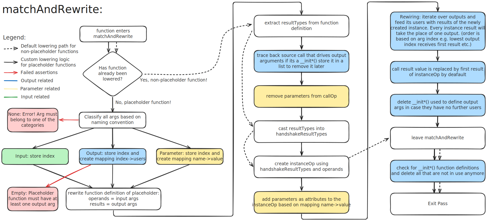

# Instantiation of MLIR Operations at C-Level

This document explains how to use placeholder functions in C to instantiate an MLIR operation within the Handshake dialect.

The following figure shows the current flow:


A placeholder function named in the format `__name_component` can be used to instantiate a specific MLIR operation at the C level. At the MLIR level, these functions are initially represented as an empty `func:callOp`. The `callOp` remains unchanged until the transformation pass from cf to handshake, where it is turned into a `handshake:InstanceOp`. These instances then continue through the processing flow.


The key step for this feature is the CfToHandshake lowering process. Dynamatic uses the `callOp`'s operands to determine inputs, outputs, and parameters of the `handshake:InstanceOp`. The following figure gives a quick overview of this process:


The rest of this document goes into details of this procedure.

---

## 1. Overview of Placeholder Functions

Placeholder functions can be declared at the C/C++ source level by using a double underscore `__` prefix. These functions act as placeholders and should not have a definition, which ensures they are treated as external functions during lowering.

Argument variables are rewired inside of CfToHandshake based on their naming. In particular, arguments with the prefixes `input_`, `output_`, and `parameter_` correspond to the inputs, outputs, and parameters of the InstanceOp. 


Example:
```c
void __new_component(int input_a, int output_b, int output_c, int parameter_bitw);
```
```MLIR
%output_c = __new_component %input_a, %output_b, {bitw = %paramter_bitw}
```

---

## 2. Variable Handling and Requirements

Variables passed as arguments to placeholder functions must follow these rules:

- **Naming Convention:**  
  Inside the placeholder function definition, all arguments must have names that begin with `input_`, `output_`, or `parameter_`. If there is any argument that does not follow any of these conventions, the code will throw an error. When defining the variables that will be passed into the placeholder function, any name can be chosen. For example:
    ```c
  //function definition using naming convention
  int __placeholder(int input_a, int output_b);
  int __init();

  int main(){
    ....
    //arbitrary names for variables
    int x;
    int y = __init();
    __placeholder(x, y);
    ....
  }
  ```

  The MLIR operation `__placeholder` would receive as input x and as output y.

- **Undefined Output Arguments:**  
  Output arguments must be initialized using special `__init*()` functions. For example:

  ```c
  void __placeholder(int input_a, int output_b);
  int __init1();

  int main(){
    ....
    // undefined output variable Var1 initialized using __init1()
    int Var1 = __init1();
    __placeholder(.. , Var1);
  }
  ```

  Note that `__init1()` follows the same style as placeholder functions (i.e., prefixed with `__` and left undefined), but is treated as a special case by the compiler. Each `__init*` function must return the correct type to match its associated output (e.g., `output_b` is an `int`, so `__init1()` must return `int`). If another output like `output_c` has type `float`, you must define a new `__init2()` that returns `float`.
  ```c
  void __placeholder(int input_a, int output_b, float output_c);
  int __init1(); // used for int outputs
  float __init2(); // used for float outputs
  ```

  All `__init*()` functions must have unique names, but any name is valid as long as it starts with `"__init"`.

- **At Least One Output Required:**  
  This is important since it's expected that the return value of the MLIR op CallOp is replaced by a data result of InstanceOp. Therefore, InstanceOp should have at least one output.

- **Inputs Must Not Be Initialized with `__init*()`:**  
  These functions are exclusively used for **outputs** that are passed to placeholder functions. Inputs should be defined as usual and treated by the compiler in the standard way. If outputs variable are initialized with `__init*()` but are not an argument of the placeholder function, the produced IR will be invalid. Therefore, initialization via `__init*()` is permitted only for variables that are passed as output arguments to the placeholder, any other use is disallowed and triggers an assertion when exiting the pass.

- **Parameters Must Be Constant:**  
  Parameter arguments must be assigned constant values (e.g., `int bitw = 31;`). This is necessary because parameters are converted into attributes on the `handshake.instance`. If a parameter is not a constant, an assertion will fail during the conversion process. The following is a correct example:
  
  ```c
    //function definition using naming convention
    int __placeholder(int input_a, int output_b, int parameter_bitw);
    int __init();
  
    int main(){
      ....
      //arbitrary names for variables
      int x;
      int y = __init();
      int z = 31;
      __placeholder(x, y, z);
      ....
    }
  ```
  In this case, the variable `z` has a constant value.
  
---

## 3. Important Assumptions

- **Correct usage of `__init*()`:**
  `__init*()` functions should only initialize output arguments of the placeholder functions. If a variable defined by __init*() is not used by any placeholder, neither the variable nor its function definition is removed. This would leave an invalid IR, which is why we have an assertion in place that verifies this is not the case.

- **At Least One Output:**  
  Placeholder functions must include at least one `output_` argument.

- **Acyclic Data Dependencies:**  
  There must be **no cyclic data dependencies** involving the outputs of placeholder functions used as inputs of the same placeholder function. This is due to limitations in the current rewiring logic. Cycles (e.g., output values used to compute their own input) could lead to invalid SSA or deadlock in the handshake IR.

- **SSA domination:** 
  Each argument passed to the placeholder must be defined before its first use (i.e., it must dominate the call).


---

## 4. Additional Notes

- Constants used to define parameters (e.g., `bitw = 31`) are not removed by the conversion pass. Instead, the **users** of those constants (i.e., placeholder call arguments) are removed. If the constants end up unused, they will be automatically cleaned up during the handshake canonicalization pass.

- For placeholder functions, the call's return value is always replaced by the first result of the newly created `handshake.instance`. We assume that placeholder functions always contain at least one output argument, which ensures that the first result is of a dataflow type. This is necessary to maintain consistency with the pre-transformation call, which also returned a dataflow value.

### Why Parameter Constants Are Not Deleted Manually:

During the conversion, parameter values are extracted from `arith.constant` operations and embedded directly as attributes on the `handshake.instance`. These constants originate from the **pre-transformation graph** (i.e., before the function is rewritten).

Attempting to delete them inside of `matchAndRewrite` fails because MLIR's conversion framework has already **replaced or removed** them with handshake constantOp. For example, you might hit errors like: "operation was already replaced".

To avoid this, we do not erase the parameter constants manually. Any unused constants are cleaned up automatically by later passes, and importantly, they **do not appear in the final `handshake_export` IR**.

---

## 5. Pass Logic and `matchAndRewrite` Behavior

- Functions named `__init*()` are treated as **legal** and excluded from conversion. This allows them to remain temporarily in the IR until they're explicitly removed later.

- All other placeholder functions (those using the `__placeholder` pattern) enter `matchAndRewrite`.

### Inside `matchAndRewrite`:



- Functions are first **differentiated** from normal function calls. Non-placeholder calls are lowered using the standard logic (dashed arrows).

- For placeholder functions, arguments are **classified by naming convention** by checking ``handshake.arg_name``:
  - Arguments starting with `input_` are treated as inputs.
  - `output_` arguments are used to construct result types and for the rewiring of the instance results.
  - `parameter_` arguments must be constants and are converted to attributes on the `handshake:instanceOp`.
  - If an argument does not follow the expected naming convention, an assertion will fail, informing the user that one of the arguments is incorrectly named.
  - Additionally, after classification, the code verifies that the ``output_`` list is **not empty**, since at least one output argument is required. If no outputs are found, a second assertion will fail.

- **Mappings are built**:
  - For each output argument, the index is stored together with a list of users that consume that output inside a dictionary (`OutputConnections:` indices → list of users). This dictionary will later be used for rewiring. 
  - Similarly, for each parameter, we store its name and value in a dictionary (``parameterMap``: names → constant values), for attribute conversion.

- The placeholder function’s **signature is rewritten** to match the actual inputs and outputs post-conversion. This ensures the IR is valid and passes MLIR verification. If the function definition doesn't correctly reflect the new instance format, MLIR verification fails and emits an error.

- The ``resultTypes`` are extracted from the rewritten function signature. After that, they are cast into `HandshakeResultTypes`. The ``Operands`` list is cleaned up by removing outputs and parameters. Then, it consists of only inputs.

- A **`handshake.instance` is created** using the `HandshakeResultTypes` and cleaned ``Operands`` list.

- **Mappings are used to:**
  - Attach parameters as named attributes to the instance using `parameterMap`.
  - Rewire all output users to use the corresponding instance results using `OutputConnections`. The rewiring logic iterates over the ``InstanceOpOutputIndices`` list in order and replaces each output index with the corresponding result from the instance operation. This means that the **position** of each output index in the list determines which instance result it maps to. For example, if the output indices are ``(1, 3, 4, 7)``, then the rewiring will map them as follows: ``(1, 3, 4, 7) → (%4#0, %4#1, %4#2, %4#3)``

---

## 6. Final Cleanup

- Any `__init*()` calls used to initialize output variables are **removed during the `matchAndRewrite` conversion step**, once their results have been replaced by the corresponding `handshake.instance` outputs.

- After the full conversion is complete, if a `__init*()` **function definition** has no remaining users, it is deleted as part of a **post-pass cleanup** step. If a `__init*()` **function definition** still has users an assertion will be triggered.

### Important Note:
In case a variable was initialized using `__init*()` but wasn't passed to placeholder function, that `call @ __init*()` will still be present in the IR and therefore will not allow for the deletion of `__init*()`'s function definition. This will cause an **invalid IR.** Hence why we assume correct usage of `__init*()` in [3. Important-Assumptions](#3-important-assumptions).

---

## 7. Data Dependency Assumption

This rewiring logic assumes that placeholder function calls are used in **acyclic dataflow contexts**. Specifically:

- No value returned by a placeholder is **fed back** (directly or indirectly) as an input to the same instance.
- All users of a placeholder output are **dominated by its definition** and reside in the same or nested blocks.

This assumption is important because rewiring outputs from an `InstanceOp` directly into operands that are evaluated **before** the instance could lead to **cyclic data dependencies** or violations of **SSA dominance** in the IR.

> Currently, **loop-carried dependencies** (e.g., in `for`/`while` loops) are not handled explicitly. This logic must be revisited if support for loop-aware rewrites or control-flow merges is added.

---

## 8. Example

Consider the Example below, where we use a placeholder function that produces two outputs that are then used for simple operations:

#### Example Code
```c
//placeholder with two outputs
void __placeholder(int input_a, int output_b, int output_c, int parameter_BITWIDTH);
int __init1();

int hw_inst() {
  int bitw = 31;
  int a = 11;
  int b = __init1();
  int c = __init1();
  __placeholder(a, b, c, bitw);
  // using inputs and outputs for computation
  int result = a - b + c;
  return result;
}
```
Next, take a look at the pre- and post-transformation IR. We see that the calls to `@__init*()` disappear, the instance now correctly reflects the expected behaviour, and all outputs have been rewired. Additionally, the parameter becomes an attribute of the newly created instance.

#### Pre-Transformation IR
```mlir
module {
  func.func @hw_inst() -> i32 {
    %c31_i32 = arith.constant {handshake.name = "constant0"} 31 : i32
    %c11_i32 = arith.constant {handshake.name = "constant1"} 11 : i32
    %0 = call @__init1() {handshake.name = "call0"} : () -> i32
    %1 = call @__init1() {handshake.name = "call1"} : () -> i32
    call @__placeholder(%c11_i32, %0, %1, %c31_i32) {handshake.name = "call2"} : (i32, i32, i32, i32) -> ()
    %2 = arith.subi %c11_i32, %0 {handshake.name = "subi0"} : i32
    %3 = arith.addi %2, %1 {handshake.name = "addi0"} : i32
    return {handshake.name = "return0"} %3 : i32
  }
  func.func private @__init1() -> i32
  func.func private @__placeholder(i32 {handshake.arg_name = "input_a"}, i32 {handshake.arg_name = "output_b"}, i32 {handshake.arg_name = "output_c"}, i32 {handshake.arg_name = "parameter_BITWIDTH"})
}
```
Notice that ``%0`` and ``%1`` are the output variables. They are initialized using ``__init1()``, passed to the ``__placeholder()`` call, and later used in the computation.

#### Post-Transformation IR
```mlir
module {
  handshake.func @hw_inst(%arg0: !handshake.control<>, ...) -> (!handshake.channel<i32>, !handshake.control<>) attributes {argNames = ["start"], resNames = ["out0", "end"]} {
    %0 = source {handshake.bb = 0 : ui32, handshake.name = "source0"} : <>
    %1 = constant %0 {handshake.bb = 0 : ui32, handshake.name = "constant0", value = 31 : i32} : <>, <i32>
    %2 = source {handshake.bb = 0 : ui32, handshake.name = "source1"} : <>
    %3 = constant %2 {handshake.bb = 0 : ui32, handshake.name = "constant1", value = 11 : i32} : <>, <i32>
    %4:3 = instance @__placeholder(%3, %arg0) {BITWIDTH = 31 : i32, handshake.bb = 0 : ui32, handshake.name = "call2"} : (!handshake.channel<i32>, !handshake.control<>) -> (!handshake.channel<i32>, !handshake.channel<i32>, !handshake.control<>)
    %5 = subi %3, %4#0 {handshake.bb = 0 : ui32, handshake.name = "subi0"} : <i32>
    %6 = addi %5, %4#1 {handshake.bb = 0 : ui32, handshake.name = "addi0"} : <i32>
    end {handshake.bb = 0 : ui32, handshake.name = "end0"} %6, %arg0 : <i32>, <>
  }
  handshake.func private @__placeholder(!handshake.channel<i32>, !handshake.control<>, ...) -> (!handshake.channel<i32>, !handshake.channel<i32>, !handshake.control<>) attributes {argNames = ["input_a", "start"], resNames = ["out0", "out1", "end"]}
}
```
The ``@__placeholder instance`` now produces three results: two data outputs (``%4#0``, ``%4#1``) and one control signal. The computation that previously used ``%0`` and ``%1`` has been rewired to use these instance results. All ``__init1() ``calls and their function signature have been removed from the IR.

> Note: The constant value used for the parameter (``BITWIDTH = 31``) remains in the IR for now but will be eliminated during the final export pass, as it is embedded into the instance as an attribute.

---

## 9. Related References

This implementation and design were informed by discussions and iterations captured in the following GitHub entries:

- [Issue #321: Incomplete Generation of MLIR OP at C-Level](https://github.com/EPFL-LAP/dynamatic/issues/321)  
  Documents early investigation into missing MLIR operations for multi-output functions.

- [PR #384: Add Argument Classification Based on Naming Convention in CfToHandshake](https://github.com/EPFL-LAP/dynamatic/pull/384)  
  Introduces the initial support for placeholder function classification and output rewiring.

- [PR #467: Complete Support for Multi-Output MLIR Operations](https://github.com/EPFL-LAP/dynamatic/pull/467)  
  Refines the lowering logic, finalizes `__init*()` and parameter handling, and forms the basis of this documentation.
