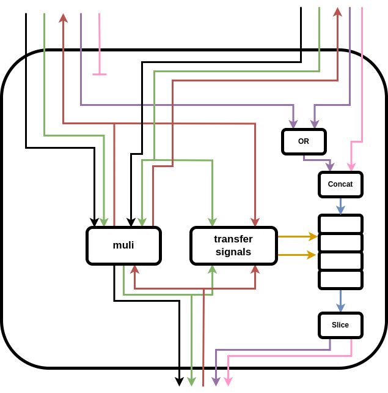
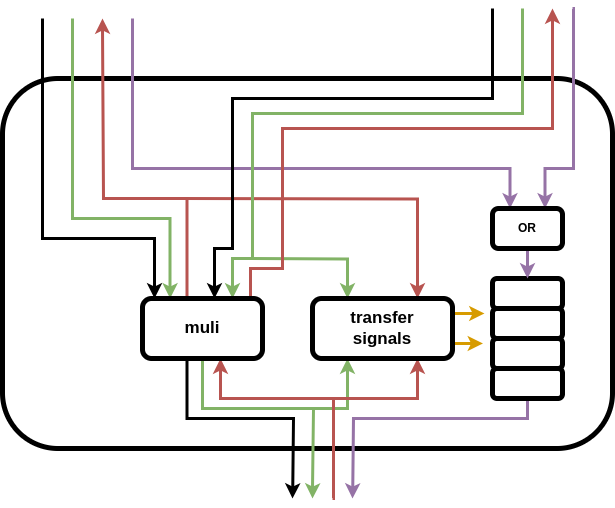

# Signal Manager

The signal manager wraps each unit (e.g., `addi`, `buffer`, etc.) and forwards extra signals.

Signal managers are implemented within the framework of the Python-based, generation-oriented beta backend for VHDL. The implementation files can be found under `experimental/tools/unit-generators/vhdl/generators/support/signal_manager`. Custom signal managers specific to individual units can also be implemented in their respective unit files.

## Design Principles

When existing signal managers don't fit your needs, we encourage you to create a new one using small, concrete helper functions. These functions are designed to work like Lego bricks, allowing you to easily assemble a custom signal manager tailored to your case.

Rather than extending the few existing signal managers, we recommend somewhat *reinventing* new ones. Extending the current signal managers can lead to highly parameterized, monolithic designs that are difficult to modify and understand. In contrast, this approach promotes modularity and simplicity, improving clarity and maintainability. While reinventing may seem repetitive, the small helper functions can take care of the tedious parts, keeping the implementation concrete and manageable.


## Handling Different Extra Signals

The following illustration (by @murphe67) shows how the `muli` signal manager handles both `spec` and `tag`. The forwarding behavior **differs** between them: `spec` ORs two signals, while `tag` selects one and discards the other.

Although you can introduce as many signal managers as needed, since they all use common helper functions, you can define the forwarding semantics in **a single place** (`generate_forwarding_expression_for_signal` in `signal_manager/utils/forwarding.py`). This ensures consistency and reuse across all instances.



## Examples

Below are some examples of signal managers. These can serve as references for understanding signal managers or for creating your own.

### `cond_br`

The `cond_br` unit uses the `default` signal manager, which is provided in `signal_manager/default.py`.

```vhdl
library ieee;
use ieee.std_logic_1164.all;
use ieee.numeric_std.all;
use work.types.all;

-- Entity of signal manager
entity handshake_cond_br_2 is
  port(
    clk : in std_logic;
    rst : in std_logic;
    data : in std_logic_vector(32 - 1 downto 0);
    data_valid : in std_logic;
    data_ready : out std_logic;
    data_spec : in std_logic_vector(1 - 1 downto 0);
    condition : in std_logic_vector(1 - 1 downto 0);
    condition_valid : in std_logic;
    condition_ready : out std_logic;
    condition_spec : in std_logic_vector(1 - 1 downto 0);
    trueOut : out std_logic_vector(32 - 1 downto 0);
    trueOut_valid : out std_logic;
    trueOut_ready : in std_logic;
    trueOut_spec : out std_logic_vector(1 - 1 downto 0);
    falseOut : out std_logic_vector(32 - 1 downto 0);
    falseOut_valid : out std_logic;
    falseOut_ready : in std_logic;
    falseOut_spec : out std_logic_vector(1 - 1 downto 0)
  );
end entity;

-- Architecture of signal manager (normal)
architecture arch of handshake_cond_br_2 is
begin
  -- Forward extra signals to output ports
  trueOut_spec <= data_spec or condition_spec;
  falseOut_spec <= data_spec or condition_spec;

  inner : entity work.handshake_cond_br_2_inner(arch)
    port map(
      clk => clk,
      rst => rst,
      data => data,
      data_valid => data_valid,
      data_ready => data_ready,
      condition => condition,
      condition_valid => condition_valid,
      condition_ready => condition_ready,
      trueOut => trueOut,
      trueOut_valid => trueOut_valid,
      trueOut_ready => trueOut_ready,
      falseOut => falseOut,
      falseOut_valid => falseOut_valid,
      falseOut_ready => falseOut_ready
    );
end architecture;
```

### `muli`

The `muli` unit uses the `buffered` signal manager, located in `signal_manager/buffered.py`. While it maintains the default signal forwarding, like the `default` signal manager, it also handles data path latency by introducing an internal FIFO.


```vhdl
library ieee;
use ieee.std_logic_1164.all;
use ieee.numeric_std.all;
use work.types.all;

-- Entity of signal manager
entity handshake_muli_0 is
  port(
    clk : in std_logic;
    rst : in std_logic;
    lhs : in std_logic_vector(32 - 1 downto 0);
    lhs_valid : in std_logic;
    lhs_ready : out std_logic;
    lhs_spec : in std_logic_vector(1 - 1 downto 0);
    rhs : in std_logic_vector(32 - 1 downto 0);
    rhs_valid : in std_logic;
    rhs_ready : out std_logic;
    rhs_spec : in std_logic_vector(1 - 1 downto 0);
    result : out std_logic_vector(32 - 1 downto 0);
    result_valid : out std_logic;
    result_ready : in std_logic;
    result_spec : out std_logic_vector(1 - 1 downto 0)
  );
end entity;

-- Architecture of signal manager (buffered)
architecture arch of handshake_muli_0 is
  signal buff_in, buff_out : std_logic_vector(1 - 1 downto 0);
  signal transfer_in, transfer_out : std_logic;
begin
  -- Transfer signal assignments
  transfer_in <= lhs_valid and lhs_ready;
  transfer_out <= result_valid and result_ready;

  -- Concat/split extra signals for buffer input/output
  buff_in(0 downto 0) <= lhs_spec or rhs_spec;
  result_spec <= buff_out(0 downto 0);

  inner : entity work.handshake_muli_0_inner(arch)
    port map(
      clk => clk,
      rst => rst,
      lhs => lhs,
      lhs_valid => lhs_valid,
      lhs_ready => lhs_ready,
      rhs => rhs,
      rhs_valid => rhs_valid,
      rhs_ready => rhs_ready,
      result => result,
      result_valid => result_valid,
      result_ready => result_ready
    );

  -- Generate ofifo to store extra signals
  -- num_slots = 4, bitwidth = 1
  buff : entity work.handshake_muli_0_buff(arch)
    port map(
      clk => clk,
      rst => rst,
      ins => buff_in,
      ins_valid => transfer_in,
      ins_ready => open,
      outs => buff_out,
      outs_valid => open,
      outs_ready => transfer_out
    );
end architecture;
```

The illustration of this circuit (by @murphe67) looks like this:



### `merge`

The `merge` unit uses the `concat` signal manager, found in `signal_manager/concat.py`, to concatenate extra signals with the data signal. This behavior is not possible with the default signal forwarding.

```vhdl
library ieee;
use ieee.std_logic_1164.all;
use ieee.numeric_std.all;
use work.types.all;

-- Entity of signal manager
entity merge_0 is
  port(
    clk : in std_logic;
    rst : in std_logic;
    ins : in data_array(2 - 1 downto 0)(32 - 1 downto 0);
    ins_valid : in std_logic_vector(2 - 1 downto 0);
    ins_ready : out std_logic_vector(2 - 1 downto 0);
    ins_0_spec : in std_logic_vector(1 - 1 downto 0);
    ins_0_tag0 : in std_logic_vector(8 - 1 downto 0);
    ins_1_spec : in std_logic_vector(1 - 1 downto 0);
    ins_1_tag0 : in std_logic_vector(8 - 1 downto 0);
    outs : out std_logic_vector(32 - 1 downto 0);
    outs_valid : out std_logic;
    outs_ready : in std_logic;
    outs_spec : out std_logic_vector(1 - 1 downto 0);
    outs_tag0 : out std_logic_vector(8 - 1 downto 0)
  );
end entity;

-- Architecture of signal manager (concat)
architecture arch of merge_0 is
  signal ins_concat : data_array(1 downto 0)(40 downto 0);
  signal ins_concat_valid : std_logic_vector(1 downto 0);
  signal ins_concat_ready : std_logic_vector(1 downto 0);
  signal outs_concat : std_logic_vector(40 downto 0);
  signal outs_concat_valid : std_logic;
  signal outs_concat_ready : std_logic;
begin
  -- Concate/slice data and extra signals
  ins_concat(0)(32 - 1 downto 0) <= ins(0);
  ins_concat(0)(32 downto 32) <= ins_0_spec;
  ins_concat(0)(40 downto 33) <= ins_0_tag0;
  ins_concat(1)(32 - 1 downto 0) <= ins(1);
  ins_concat(1)(32 downto 32) <= ins_1_spec;
  ins_concat(1)(40 downto 33) <= ins_1_tag0;
  ins_concat_valid <= ins_valid;
  ins_ready <= ins_concat_ready;
  outs <= outs_concat(32 - 1 downto 0);
  outs_spec <= outs_concat(32 downto 32);
  outs_tag0 <= outs_concat(40 downto 33);
  outs_valid <= outs_concat_valid;
  outs_concat_ready <= outs_ready;

  inner : entity work.merge_0_inner(arch)
    port map(
      clk => clk,
      rst => rst,
      ins => ins_concat,
      ins_valid => ins_concat_valid,
      ins_ready => ins_concat_ready,
      outs => outs_concat,
      outs_valid => outs_concat_valid,
      outs_ready => outs_concat_ready
    );
end architecture;
```

## `select` (custom signal manager)

```vhdl
library ieee;
use ieee.std_logic_1164.all;
use ieee.numeric_std.all;
use work.types.all;

-- Entity of signal manager
entity select_0 is
  port(
    clk : in std_logic;
    rst : in std_logic;
    condition : in std_logic_vector(1 - 1 downto 0);
    condition_valid : in std_logic;
    condition_ready : out std_logic;
    condition_spec : in std_logic_vector(1 - 1 downto 0);
    trueValue : in std_logic_vector(32 - 1 downto 0);
    trueValue_valid : in std_logic;
    trueValue_ready : out std_logic;
    trueValue_spec : in std_logic_vector(1 - 1 downto 0);
    falseValue : in std_logic_vector(32 - 1 downto 0);
    falseValue_valid : in std_logic;
    falseValue_ready : out std_logic;
    falseValue_spec : in std_logic_vector(1 - 1 downto 0);
    result : out std_logic_vector(32 - 1 downto 0);
    result_valid : out std_logic;
    result_ready : in std_logic;
    result_spec : out std_logic_vector(1 - 1 downto 0)
  );
end entity;

-- Architecture of selector signal manager
architecture arch of select_0 is
  signal trueValue_inner : std_logic_vector(32 downto 0);
  signal trueValue_inner_valid : std_logic;
  signal trueValue_inner_ready : std_logic;
  signal falseValue_inner : std_logic_vector(32 downto 0);
  signal falseValue_inner_valid : std_logic;
  signal falseValue_inner_ready : std_logic;
  signal result_inner_concat : std_logic_vector(32 downto 0);
  signal result_inner_concat_valid : std_logic;
  signal result_inner_concat_ready : std_logic;
  signal result_inner : std_logic_vector(31 downto 0);
  signal result_inner_valid : std_logic;
  signal result_inner_ready : std_logic;
  signal result_inner_spec : std_logic_vector(0 downto 0);
begin
  -- Concatenate extra signals
  trueValue_inner(32 - 1 downto 0) <= trueValue;
  trueValue_inner(32 downto 32) <= trueValue_spec;
  trueValue_inner_valid <= trueValue_valid;
  trueValue_ready <= trueValue_inner_ready;
  falseValue_inner(32 - 1 downto 0) <= falseValue;
  falseValue_inner(32 downto 32) <= falseValue_spec;
  falseValue_inner_valid <= falseValue_valid;
  falseValue_ready <= falseValue_inner_ready;
  result_inner <= result_inner_concat(32 - 1 downto 0);
  result_inner_spec <= result_inner_concat(32 downto 32);
  result_inner_valid <= result_inner_concat_valid;
  result_inner_concat_ready <= result_inner_ready;

  -- Forwarding logic
  result_spec <= condition_spec or result_inner_spec;

  result <= result_inner;
  result_valid <= result_inner_valid;
  result_inner_ready <= result_ready;

  inner : entity work.select_0_inner(arch)
    port map(
      clk => clk,
      rst => rst,
      condition => condition,
      condition_valid => condition_valid,
      condition_ready => condition_ready,
      trueValue => trueValue_inner,
      trueValue_valid => trueValue_inner_valid,
      trueValue_ready => trueValue_inner_ready,
      falseValue => falseValue_inner,
      falseValue_valid => falseValue_inner_valid,
      falseValue_ready => falseValue_inner_ready,
      result => result_inner_concat,
      result_ready => result_inner_concat_ready,
      result_valid => result_inner_concat_valid
    );
end architecture;
```


### `spec_commit`

The `spec_save_commit` unit is used for speculation. It uses the `spec_units` signal manager, located in `signal_manager/spec_units.py`.

When `spec_save_commit` handles both `spec: i1` and `tag0: i8`, it concatenates `tag0` to the data while propagating `spec` to the inner unit. Additionally, it doesn't concatenate the control signal, as it doesn't carry any extra signals.


```vhdl
library ieee;
use ieee.std_logic_1164.all;
use ieee.numeric_std.all;
use work.types.all;

-- Entity of signal manager
entity spec_save_commit0 is
  port(
    clk : in std_logic;
    rst : in std_logic;
    ins : in std_logic_vector(32 - 1 downto 0);
    ins_valid : in std_logic;
    ins_ready : out std_logic;
    ins_spec : in std_logic_vector(1 - 1 downto 0);
    ins_tag0 : in std_logic_vector(8 - 1 downto 0);
    ctrl : in std_logic_vector(3 - 1 downto 0);
    ctrl_valid : in std_logic;
    ctrl_ready : out std_logic;
    outs : out std_logic_vector(32 - 1 downto 0);
    outs_valid : out std_logic;
    outs_ready : in std_logic;
    outs_spec : out std_logic_vector(1 - 1 downto 0);
    outs_tag0 : out std_logic_vector(8 - 1 downto 0)
  );
end entity;

-- Architecture of signal manager (spec_units)
architecture arch of spec_save_commit0 is
  signal ins_concat : std_logic_vector(39 downto 0);
  signal ins_concat_valid : std_logic;
  signal ins_concat_ready : std_logic;
  signal ins_concat_spec : std_logic_vector(0 downto 0);
  signal outs_concat : std_logic_vector(39 downto 0);
  signal outs_concat_valid : std_logic;
  signal outs_concat_ready : std_logic;
  signal outs_concat_spec : std_logic_vector(0 downto 0);
begin
  -- Concat/slice data and extra signals
  ins_concat(32 - 1 downto 0) <= ins;
  ins_concat(39 downto 32) <= ins_tag0;
  ins_concat_valid <= ins_valid;
  ins_ready <= ins_concat_ready;
  ins_concat_spec <= ins_spec;
  outs <= outs_concat(32 - 1 downto 0);
  outs_tag0 <= outs_concat(39 downto 32);
  outs_valid <= outs_concat_valid;
  outs_concat_ready <= outs_ready;
  outs_spec <= outs_concat_spec;

  inner : entity work.spec_save_commit0_inner(arch)
    port map(
      clk => clk,
      rst => rst,
      ins => ins_concat,
      ins_valid => ins_concat_valid,
      ins_ready => ins_concat_ready,
      ins_spec => ins_concat_spec,
      outs => outs_concat,
      outs_valid => outs_concat_valid,
      outs_ready => outs_concat_ready,
      outs_spec => outs_concat_spec,
      ctrl => ctrl,
      ctrl_valid => ctrl_valid,
      ctrl_ready => ctrl_ready
    );
end architecture;
```
