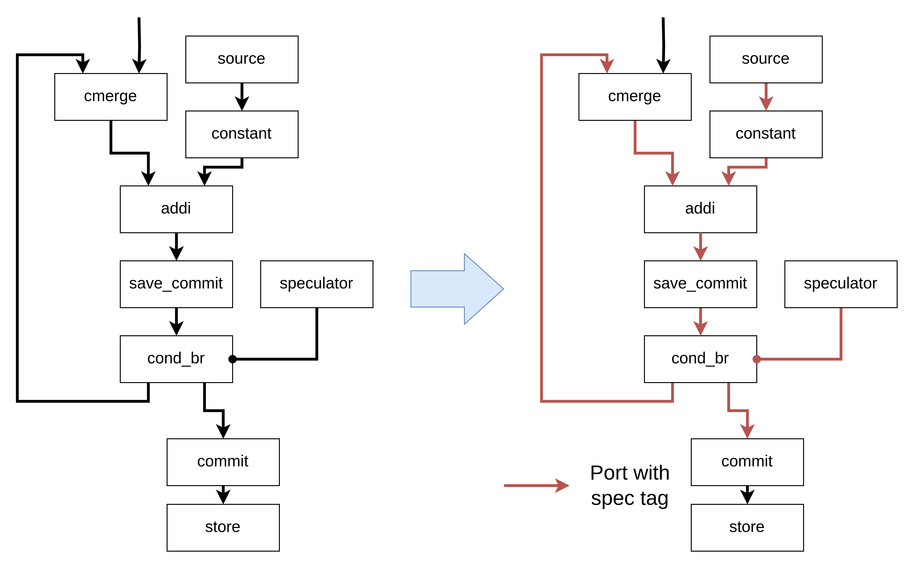
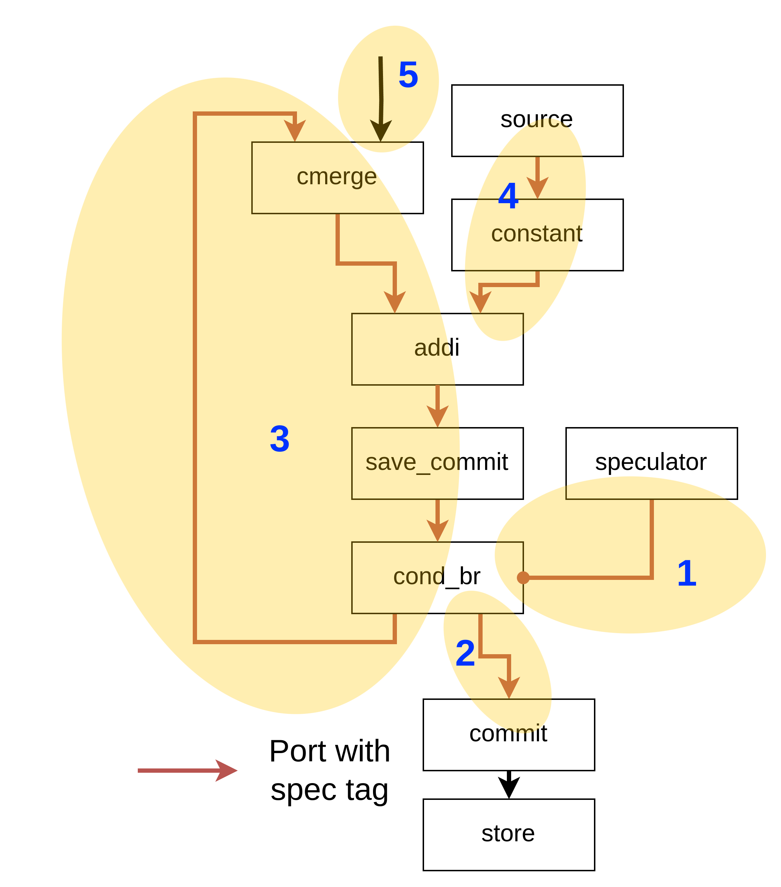

# Adding Spec Tags to Speculative Region

The **spec tag**, required for speculation, is added as an **extra signal** to operand/result types (e.g., `ChannelType` or `ControlType`).

[Type verification](https://github.com/EPFL-LAP/dynamatic/blob/main/docs/ExtraSignalsTypeVerification.md) ensures that circuits include extra signals like the spec tag, but it does not automatically update or infer them. Therefore, we need an explicit algorithm to do it.

This document outlines the algorithm for adding spec tags to operand/result types within a speculative region.

## Implementation

The algorithm uses **depth-first search (DFS)** starting from the speculator, adding spec tags to each traversed operand. It performs both **upstream and downstream traversal**.

Consider the following example (omitting the input to the speculator for simplicity):

The algorithm follows these steps:

1. **Start DFS from the speculator**, first reaching `cond_br`.

2. **Downstream traversal** **stops** **at the** **commit unit**.

3. Another downstream traversal reaches `cmerge`, `addi`, `save_commit`, and eventually `cond_br` again. Since `cond_br` is already visited, **traversal stops there**.

4. **Upstream traversal** is applied from `addi` to `constant` and `source`, ensuring that spec tags are added to these operands, as `addi` enforces [consistent extra signals across all their inputs and outputs](https://github.com/EPFL-LAP/dynamatic/blob/main/docs/ExtraSignalsTypeVerification.md#operations-within-a-basic-block).

5. **Upstream traversal is skipped for `cmerge` and `mux`**, since some of their operands originate outside the speculative region. All internal edges are covered by downstream traversal.

## Special Cases

The following edges are skipped:

- Edges inside the commit and save-commit control networks
- Edges leading to memory controllers

When the traversal reaches the relevant units (e.g., `save_commit`, `commit`, `speculating_branch`, or `load`), it doesn't proceed to these edges but continues with the rest of the traversal.