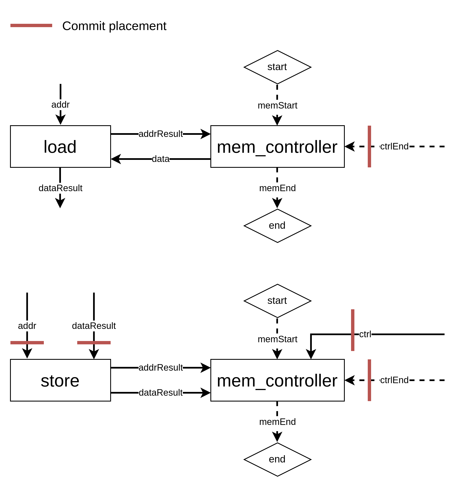

# Commit Unit Placement Algorithm

The placement of commit units is determined by a Depth-First Search (DFS) starting from the Speculator. When the traversal reaches specific operations, it **stops the traversal** and **places a commit unit** in front of these operations:

- StoreOp
- EndOp
- MemoryControllerOp

Note that commit units are **not** placed for LoadOp.

## Commit Units for MemoryControllerOp

MemoryControllerOp is a bit complex, as we want to place commit units for some operands but not for others. Here's how we place them:

When a memory controller communicates with a LoadOp, five ports of the memory controller are used:

- Two ports for receiving the address from the LoadOp and sending data to the LoadOp
- `memStart`/`memEnd` ports, which communicate with external components to signal the start and end of memory region access (see [here](https://github.com/EPFL-LAP/dynamatic/blob/dev/shundroid/doc-small-update/docs/Specs/CircuitInterface.md#memory-controls))
- The `ctrlEnd` port, which receives signals from the control network, indicating that no more requests are incoming.

When the memory controller communicates with a StoreOp, six ports are involved:

- Two ports for receiving the address and data from the StoreOp
- `memStart`/`memEnd` (as with LoadOp)
- `ctrlEnd` port (as with LoadOp)
- `ctrl` port, which tracks the number of store operations

Commit units are **placed on the `ctrlEnd` and `ctrl` ports** because these ports cause side effects.

Commit units are **not** placed for the two ports communicating with the LoadOp or StoreOp, nor for the two external ports. For the LoadOp, the communication should happen even if the signal is speculative. For the StoreOp, commit units are already placed in front of the StoreOp, making them redundant here.

## How to Place Commit Units for MemoryControllerOp

Our algorithm is designed so that when it visits a `MemoryControllerOp`, it should place a commit unit. Specifically, at a `LoadOp`, we skip traversing the results connected to the memory controller.

How does this ensure correct placement?

- Ports connected to a `LoadOp` are not traversed due to the skip mentioned above.
- Ports connected to a `StoreOp` are also not traversed because the traversal stops at the `StoreOp`.
- External ports are never traversed.
- The `ctrl` and `ctrlEnd` ports are traversed if they originate from the speculative region and require a commit unit.

## Future Work

This document does not account for cases where Load and Store accesses are mixed in a single memory controller, or where a Load-Store Queue (LSQ) is used. These scenarios are left for future work.
