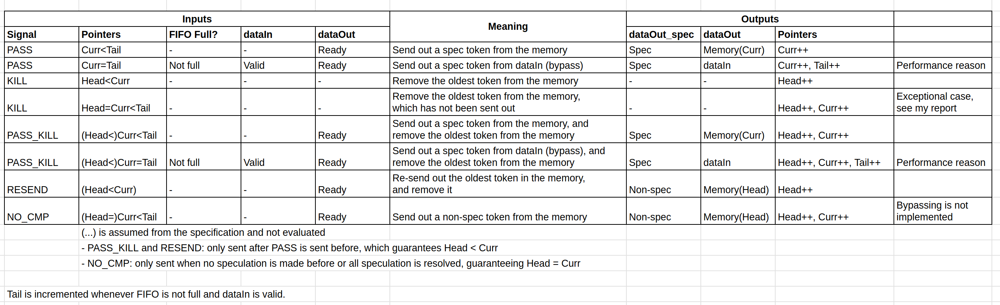

# Save Commit Behavior

The table below illustrates the behavior of the save-commit unit, which is not included in my final report:

Also see Section 6.3 of my report for the explanation of the save-commit unit's design.
