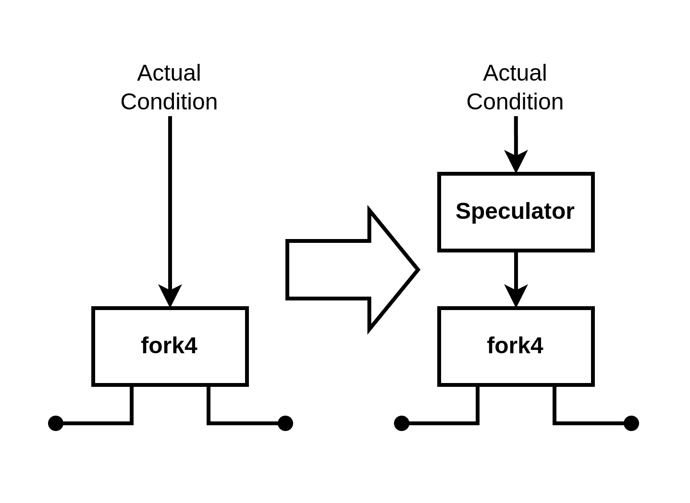
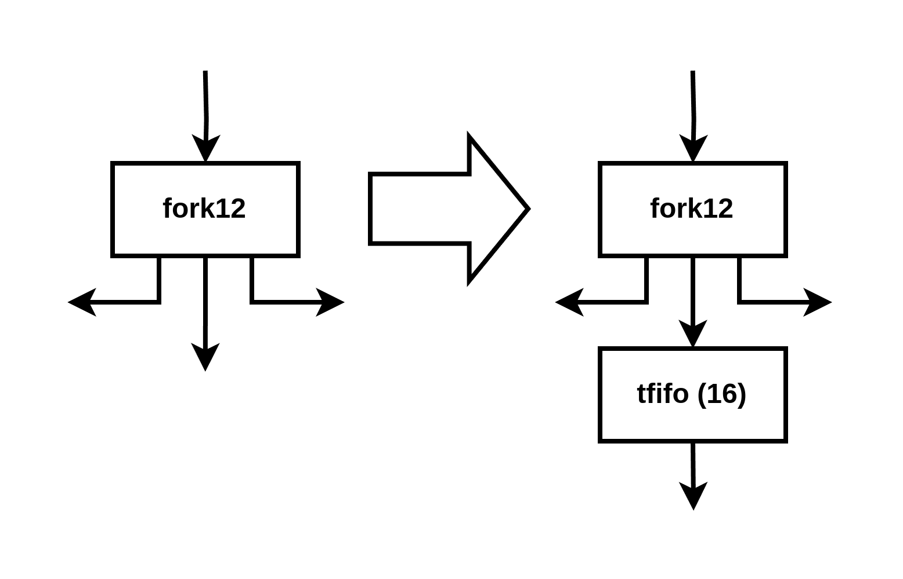

Speculation Integration Tests

The speculation integration tests originate from Haoran's master's thesis.

Unlike other integration tests, these require manual modifications to the programs and IR to ensure speculation is effective.

This document explains how to run the speculation integration tests and details the necessary manual modifications.

## Running the Tests

There are **seven** speculation integration tests in the `integration-test` folder:

- `single_loop`
- `loop_path`
- `subdiag`
- `subdiag_fast`
- `fixed`
- `sparse`
- `if_convert` (data speculation)

The `newton` benchmark from Haoran's thesis is **excluded** because it contains branches within the loop, where the current speculation approach is ineffective.

Since these tests require manual modifications and a custom compilation flow, we have provided a ready-to-run script. You can execute the speculation integration tests (covering compilation, HDL generation, and simulation) with a single command:

**Requirement:** Python **3.12** or later is needed to run the script.

```
$ python3 tools/integration/run_spec_integration.py single_loop
```

## Custom Compilation Flow

The full details of the custom compilation flow can be found in the Python script:
 `tools/integration/run_spec_integration.py`.
 Below is a summary of its characteristics:

- Compilation starts from the `cf` dialect since modifications to the CFG are required under the current frontend (this will be resolved by #311).
- The speculation pass (`HandshakeSpeculation`) runs **after** the buffer placement pass.
- A **custom buffer placement pass** follows the speculation pass, just before the `HandshakeToHW` pass, ensuring that required buffers for speculation are placed.
- We use a **Python-based, generation-oriented beta backend**, which supports the signal manager.

Each integration test folder contains an input `cf` file named `cf.mlir` (e.g., `subdiag/cf.mlir`).

Even though the compilation flow starts from the `cf` dialect, the **original C program is still required** for simulation to generate the reference result.
Maintaining consistency between the C program and the `cf` IR file is essential—**don’t forget!**

## CFG Modification

Manual modifications to the **CFG** generated by the frontend are required because:

1. Speculation only supports **single-basic-block loops**.
2. The current frontend produces **redundant/unexpected CFGs** (Issue #311).

Ideally, #311 will eliminate **all** of the need for these modifications, but some of them are a bit extreme to reduce the number of basic blocks:

- **Convert `while` loops to `do-while` loops** if the loop is guaranteed to execute at least once. This reduces the basic block handling the initial condition.

  **Before:**

  ```c
  while (cond) {
    // Executed at least once
  }
  ```

  **After:**

  ```c
  do {
    // Executed at least once
  } while (cond);
  ```

- **Merge the tail break statement**, even in `for` loops.

  **Before:**

  ```c
  for (int i = 0; i < N; i++) {
    // Body
    if (cond) break;
  }
  ```

  **After:**

  ```c
  int i = 0;
  bool break_flag = false;
  do {
    // Body
    i++;
    break_flag = cond;
  } while (i < N && !break_flag);
  ```

These transformations may not be generally supported, but they help meet the requirements for speculation.

## Speculator Placement

The location of the **speculator** must be manually specified using a `spec.json` file in each integration test folder.

A typical `spec.json` file looks like this:

```json
{
  "speculator": {
    "operation-name": "fork4",
    "operand-idx": 0
  }
}
```

In this example, the speculator is placed on operand #0 of the `fork4` operation. Visually, it looks like this:



## Buffer Placement

Speculation requires additional buffers to improve initiation interval (II) and prevent deadlocks.
Some of these buffers are not placed by the conventional buffering pass since they depend on conditions from the previous iteration.

To handle this, buffers must be manually specified using the existing `HandshakePlaceBuffersCustomPass`.
 This pass takes the following arguments:

- `pred`: **Previous** operation name
- `outid`: Result ID
- `slots`: Buffer size
- `type`: `"oehb"` or `"tehb"`

**Note:** The way buffer positions are specified is opposite to the speculation pass (buffers are placed on **results**, while speculators are placed on **operands**).

The buffer configuration is defined in `buffer.json` under each integration test folder, for example:

```json
[
  {
    "pred": "fork12",
    "outid": 1,
    "slots": 16,
    "type": "tehb"
  },
  {
    "pred": "speculator0",
    "outid": 0,
    "slots": 16,
    "type": "tehb"
  },
  ...
]
```

Multiple buffers can be placed, and the custom buffer placement pass is invoked multiple times.

For the first item in the example above, the buffer placement looks like this:



### Note: Opinion on Placement Specification

In my opinion, buffer positions should be specified by **operand** rather than **result**.
Operands are always unique, even without materialization, whereas results are not.
