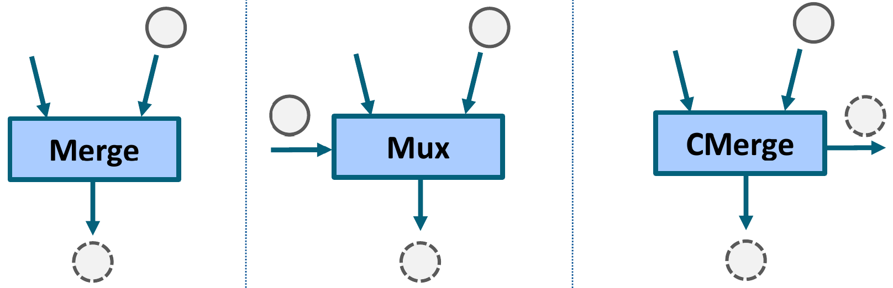

# Simplifying Merge-Like Operations

The first chapter of this tutorial describes what transformation we are going to implement in our dataflow circuits, which, in Dynamatic, are modeled using the *Handshake* MLIR dialect.

## Merge-like dataflow components

There are three dataflow components which fall under the category of "merge-like" components.
- The *merge* is a nondeterministic component which propagates a token received on any of its $N$ inputs to its single output.
- The *control merge* (or *cmerge*) behaves like the *merge* with the addition of a second output that indicates which of the inputs was selected (via the input's index, from $0$ to $N-1$).
- The *mux* is a deterministic version of the *merge* that propogates to its single output the input token selected by a control input (via the input's index, from $0$ to $N-1$).

Merge-like components are generally found at the beginning of basic blocks and serve the purpose of *merging* the data and control flow coming from diverging paths in the input code (e.g., after an if/else statement).


_Image from **Lana Josipović, Andrea Guerrieri, and Paolo Ienne. Dynamatic: From C/C++ to Dynamically-Scheduled Circuits. Invited tutorial. In Proceedings of the 28th ACM/SIGDA International Symposium on Field Programmable Gate Arrays, Seaside, Calif., February 2020**_

## Merge-like operations

These three dataflow components map one-to-one to identically-named MLIR [operations](../MLIRPrimer.md#operations) that are part of the *Handshake* dialect.
- The *merge* operation (`circt::handshake::MergeOp`, declared [here](https://github.com/EPFL-LAP/circt/blob/fe07e66b4c89433f9edc55bab141515d1c4d612c/include/circt/Dialect/Handshake/HandshakeOps.td#L338-L359)) which accepts a strictly positive number of operands (all with the same type) and returns a single result of the same type. Below is the syntax for a *merge* with two `i32` operands.
  ```mlir
  %input0 = [...] : i32
  %input1 = [...] : i32
  %mergeResult = merge %input0, %input1 : i32
  ```
- The *mux* operation (`circt::handshake::MuxOp`, declared [here](https://github.com/EPFL-LAP/circt/blob/fe07e66b4c89433f9edc55bab141515d1c4d612c/include/circt/Dialect/Handshake/HandshakeOps.td#L361-L391)) which accepts an integer-like *select operand* (acting as the selector for which input token to propogate to the output) and a strictly positive number of *data operands* (all with the same type). It returns a single result of the same type as the *data operands*. Below is the syntax for a *mux* with two `i32` operands.
  ```mlir
  %sel = [...] : index
  %input0 = [...] : i32
  %input1 = [...] : i32
  %muxResult = mux %sel [%input0, %input1] : index, i32
  ```
- The *control merge* operation (`circt::handshake::ControlMergeOp`, declared [here](https://github.com/EPFL-LAP/circt/blob/fe07e66b4c89433f9edc55bab141515d1c4d612c/include/circt/Dialect/Handshake/HandshakeOps.td#L393-L427)) which accepts a strictly positive number of operands (all with the same type) and returns a *data result* of the same type, as well as an integer-like *index result*. Below is the syntax for a *control merge* with two `i32` operands.
  ```mlir
  %input0 = [...] : i32
  %input1 = [...] : i32
  %cmergeResult, %cmergeIndex = control_merge %input0, %input1 : i32, index
  ```

## Simplifying merge-like operations

Generally speaking, we always strive to make dataflow circuits faster (in runtime) and smaller (in area). We are thus going to implement a circuit transformation pass that will remove some useless dataflow components (that would otherwise increase circuit delay and area) and downgrade others to simpler equivalent components (that take up less area). The particular transformation we will implement in this tutorial is going to operate on merge-like operations in the *Handshake*-level IR. It is made up of two separate optimizations that we describe below.

### Erasing single-input *merges*

*Merge* operations non-deterministically forward one of their valid input tokens to their single output. It is easy to see that a *merge* with a single input is behaviorally equivalent to a wire, since a valid input token will always be forwarded to the output. Such *merges* can safely be deleted without affecting circuit functionality.

Consider the following trivial example of a *Handshake* function that simply returns its `%start` input.
```mlir
handshake.func @eraseSingleInputMerge(%start: none) -> none {
  %mergeStart = merge %start : none
  %returnVal = return %mergeStart : none
  end %returnVal : none
}
``` 
The first operation inside the function is a merge with a single input. As discussed above, it can be erased to simplify the circuit. Our pass should transform the above IR into the following.
```mlir
handshake.func @eraseSingleInputMerge(%start: none) -> none {
  %returnVal = return %start : none
  end %returnVal : none
}
``` 
Notice that the circuit had to be "re-wired" so that `return` now takes as input the single operand to the now deleted `merge` instead of its result.

You may wonder how our dataflow circuits could ever end up with such useless components within them, and, consequently, why we would ever need to implement such an optimization for something that should never have been there in the first place. It is in fact not an indication of bad design that operations which can be optimized away are *temporarily* present in the IR. These may be remnants of prior transformation passes that operated on a different aspect of the IR and whose behavior resulted in a *merge* losing some of its inputs as a side-effect. In this particular case, it is our lowering pass from *std*-level to *Handshake*-level that adds single input *merges* to the IR in specific situations for the sake of having all basic blocks live-ins go through merge-like operations before "entering" a block. Generally speaking, it should be the job of a compiler's [canonicalization infrastructure](https://mlir.llvm.org/docs/Canonicalization/) to optimize the IR in such a way, but for the sake of this tutorial we will implement the merge erasure logic as part of our transformation pass.  

### Downgrading index-less *control merges*

In addition to behaving like a *merge*, *control merges* also output the index of the input token that was non-deterministically chosen. If this output (the second result of the `control_merge` MLIR operation) is unused in the circuit, then a *control merge* is semantically equivalent to a *merge*, and can safely be *downgraded* to one, gaining some area in the process. Going forward, we will refer to such *control merges* as being "index-less".

Consider the following trivial example of a *Handshake* function that non-deterministicaly picks and returns one of its two first inputs.
```mlir
handshake.func @downgradeIndexLessControlMerge(%arg0: i32, %arg1: i32, %start: none) -> i32 {
  %cmergeRes, %cmergeIdx = control_merge %arg0, %arg1 : i32, index
  %returnVal = return %cmergeRes : i32
  end %returnVal : i32
}
```
The `control_merge`'s index result (`%cmergeIdx`) is unused in the IR. As discussed above, the operation can safely be downgraded to a `merge`. Our pass should transform the above IR into the following.
```mlir
handshake.func @downgradeIndexLessControlMerge(%arg0: i32, %arg1: i32, %start: none) -> i32 {
  %mergeRes = merge %arg0, %arg1 : i32, index
  %returnVal = return %mergeRes : i32
  end %returnVal : i32
}
```

## Conclusion

In this chapter, we described the circuit optimizations we would like to achieve in our MLIR transformation pass. In summary, we want to (1) erase `merge` operation with a single operand and (2) downgrade index-less `control_merge` operations to simpler `merge` operations. In the [next chapter](2.WritingASimplePass.md) we will go through the process of writing, building, and running this pass in Dynamatic.
