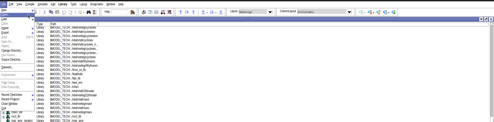
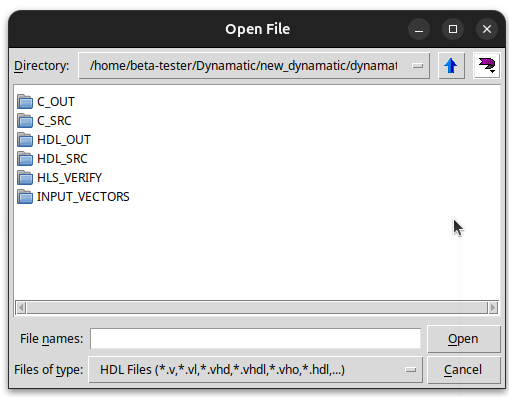
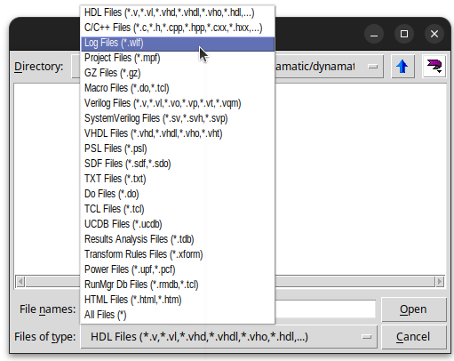
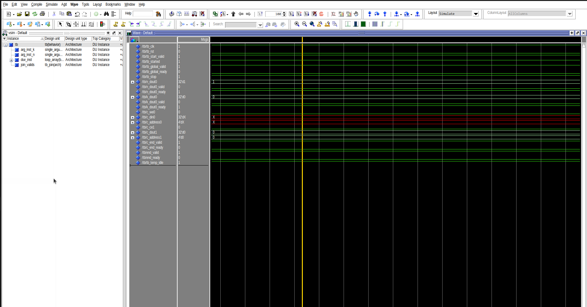

# Verifying the Generated Design  
Circuits generated by Dynamatic are tested against the original C implementation to ascertain their correctness using the `simulate` command. To gain a good understanding of the quality of the generated circuits, users can explore the files generated by this command and/or use the interactive dataflow circuit visualizer to have a more visual assessment of their circuit.  

This document focuses on the content of the `out/sim` directory and helps the user understand the relevance of this content in assessing their circuits.

## C-RTL Cosimulation  
   
Dynamatic has a cosimulation framework that allows the user to write a testbench in C code (the `main` function). To take advantage of this, you must ensure that you:   
- Include the `dynamatic/Integration.h` header
- Create a main function where your test inputs will be instantiated
- Make a function call to the function under test in the main function using the following syntax: `CALL_KERNEL(<func_name>, <arg1>, <arg2>, ..., <argN>);` . The values of the arguments passed to the function (i.e., `<arg1>, <arg2>, ..., <argN>`) will be used internally by our cosimulation framework as test stimuli.  

The `simulate` command runs a co-simulation of the program in C and the HDL implementation generated by Dynamatic on the same inputs.  

### Cosimulation Results And Directories
The `HLS_VERIFY/` directory and `report.txt` file are the most interesting outputs of the cosimulation.  

### `HLS_VERIFY/` 
Contains  
1. The results of the waveform transitions that occured during the simulation, stored in a log file, `vsim.wlf`, which can be opened in ModelSim/Questa as shown below:
    - Open ModelSim/Questa
    - Click on the `File` tab at the top left of your window and select `Open...`
       
    - Navigate to the `out/sim/HLS_VERIFY` directory in the same directory as your C kernel  
     
    - Change the `Files of type:` option to `Log Files(*.wlf)` and select `vsim.wlf`
      
    - Play around with the waveform in ModelSim  
      

> [!TIP]  
> The `vsim.wlf` file is also used by the interactive visualizer uses to animate the circuit using the Godot game engine.  

2. ModelSim information 
    - default settings 
    - library information to configure the simulator
3. A script to compile and run the HDL simulation.
4. A transcript of all commands run during the simulation. 
5. Testbench information 
    - optimization data
    - temporary compilation data
    - temporary message logs
    - library metadata
    - library hierarchy and elaboration logic  
    - dependency listing

### `report.txt`  
The report file gives information on the HDL simulation in ModelSim/Questa as well as some runtime and clock cycle information. If simulation fails, this file will also contain error logs to help the user understand the cause of failure. 

### Other Cosimulation Directories
The following directories contain information used to run the simuation:  
#### 1. C_SRC  
Contains a copy of the C source file under test as well as any included header files. These will be used to compile and run the C program using a regular C compiler.

#### 2. HDL_SRC  
Contains a clone of the HDL directory created by the `write-hdl` command plus the addition of a testbench file that passes the inputs from the `main` function.  

#### 3. INPUT_VECTORS  
Contains a list of `.dat` files for each input declared in the `main` function. These are passed to the C and HDL files during the co-simulation. 

#### 4. C_OUT  
Contains the results of compiling and running the C program stored as `.dat` files for every output.

#### 5. HDL_OUT  
Contains the results of running the HDL simulation of the program in ModelSim/Questa stored as `.dat` files for every output. 

Dynamatic compares the files in `C_OUT` and `HDL_OUT` to determine whether the HDL code generated does what the C program was intended to do.