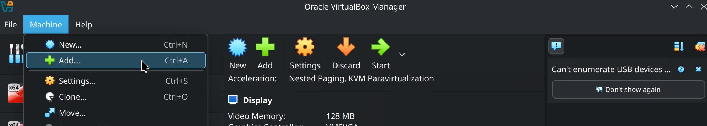

# VM Setup Instructions

We provide a virtual machine (VM) which contains a pre-built/ready-to-use version of our entire toolchain. It is very easy to set up on your machine using VirtualBox. You can download the VM image [here](https://drive.google.com/file/d/1s86dzU8jbSSdh13DctS922OKoACgvVD5/view?usp=drive_link). The Dynamatic virtual machine is compatible with VirtualBox 5.2 or higher.

This VM was originally set-up for the [*Dynamatic Reloaded tutorial* given at the FPGA'24 conference](https://www.isfpga.org/past/fpga2024/workshops-tutorials/#t7) in Monterey, California. You can use it to simply follow the tutorial (available in the [repository's documentation](Tutorials/Introduction/Introduction.md)) or as a starting point to use/modify Dynamatic in general.

## Running the VM

Once you have downloaded the .zip archive from the link above, you can extract it and inside you will see two files The .vbox file contains all the settings required to run the VM, while the .vdi file contains the virtual hard drive. To load the VM, open VirtualBox and click on *Machine - Add*, then select the file *DynamaticVM.vbox* when prompted. 

Then, you can run it by either clicking *Start* or simply double-clicking the virtual machine in the sidebar.

## Inside the VM

If everything went well, after launching the image you should see Ubuntu's splash screen and be dropped into the desktop directly. Below are some important things about the guest OS running on the VM.

- The VM runs Ubuntu 20.04 LTS. Any kind of "system/program error" reported by Ubuntu can safely be dismissed or ignored.
- The user on the VM is called *dynamatic*. **The password is also dynamatic**.
- On the left bar you have icons corresponding to a file explorer, a terminal, a web browser (Firefox).
  - There are a couple default Ubuntu settings you may want to modify for your convenience. You can open Ubuntu settings by clicking the three icons at the top right of the Ubuntu desktop and then selecting **Settings**.
  - You can change the default display resolution (1920x1080) by clicking on the **Displays** tab on the left, then selecting another resolution in the **Resolution** dropdown menu.
  - You can change the default keyboard layout (English US) by clicking on the **Keyboard** tab on the left. Next, click on the + button under **Input Sources**, then, in the pop-menu that appears, click on the three vertical dots icon, scroll down the list, and click **Other**. Find your keyboard layout in the list and double-click it to add it to the list of input sources. Finally, drag your newly added keyboard layout above **English (US)** to start using it.
- When running commands for Dynamatic from the terminal, make sure you first `cd` to the `dynamatic` subfolder.
  - Since the user is also called *dynamatic*, `pwd` should display `/home/dynamatic/dynamatic` when you are in the correct folder.