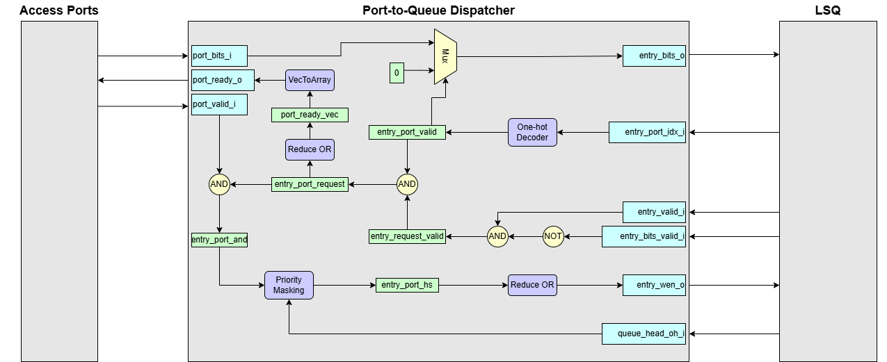
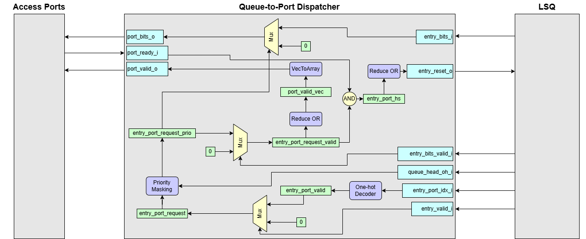
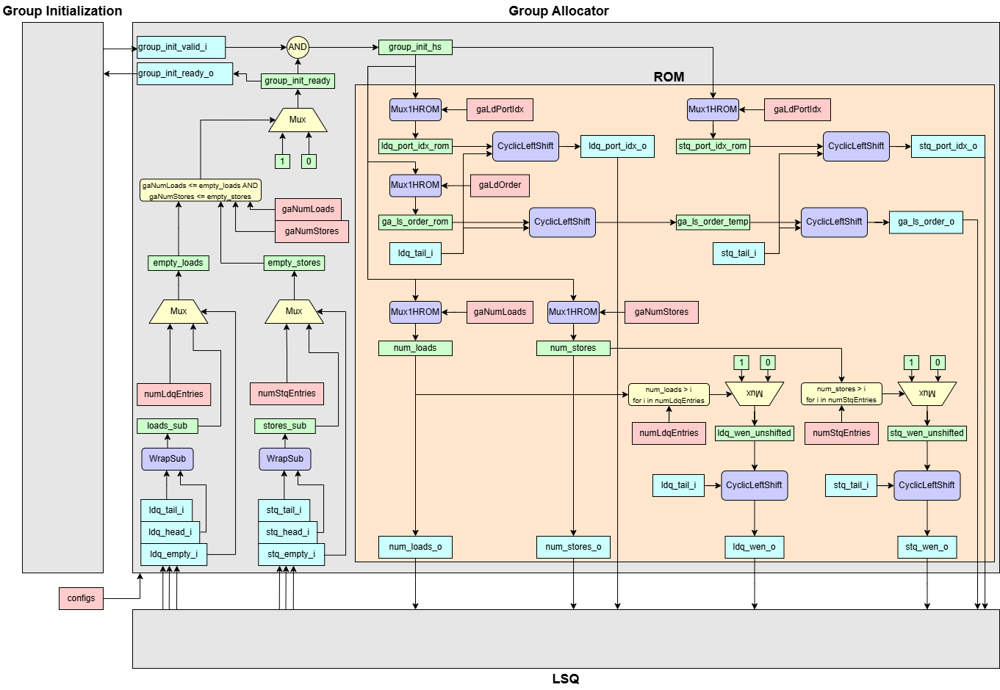
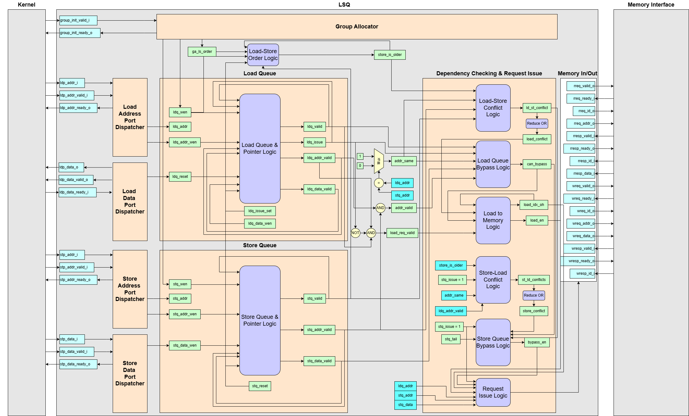
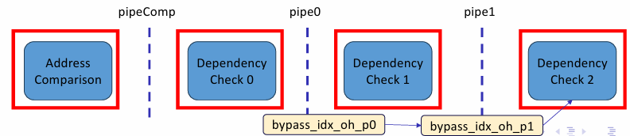

# `vhdlgen.generators` — Folder Overview

This folder contains **all code‑generation helpers** responsible for emitting
parameterised VHDL RTL used by the Load/Store Queue (LSQ) for the spatial computing and
its supporting structures.


## Quick Map

| Module               | Role in the pipeline                                    | 
| ------               | --------------------                                    |
| `dispatchers.py`     | Generates Port-to-Queue/Queue-To-Port Dispatchers | 
| `group_allocator.py` | Generates Group Allocator | 
| `lsq.py`             | Top‑level generator that produces the **complete LSQ RTL** and plugs in dispatchers + allocator |

## Port-to-Queue Dispatcher — Interface Details



### Interface Signals

| Signal Name          | type                | Description     |
| -------------------- | ------------------- | --------------- |
| `port_bits_i`        | `LogicVecArray`     | Input data or address bits from each port|
| `port_valid_i`       | `LogicArray`        | Valid signal for each input port (Valid data/address) |
| `port_ready_o`       | `LogicArray`        | Ready signal indicating LSQ is ready to receive data/address |
| `entry_valid_i`      | `LogicArray`        | Indicates if a queue entry is valid  |
| `entry_bits_valid_i` | `LogicArray`        | Valid bit for the contents of a queue entry|
| `entry_port_idx_i`   | `LogicVecArray`     | Indicates to which port the entry is assigned|
| `entry_bits_o`       | `LogicVecArray`     | Output bits written to the entry   |
| `entry_wen_o`        | `LogicArray`        | Write enable for each entry   |
| `queue_head_oh_i`    | `LogicVec`          | One-hot vector indicating the head entry in LSQ |

### Operational Summary
1. Identify Valid Entries
    
    Collect all LSQ entries where `entry_valid_i == 1` and `entry_bits_valid_i == 0`–i.e. those prepared to receive an incoming data/address.

2. Identify Valid Ports

    Among those LSQ entries, keep only the ones whose `entry_port_idx_i` matches an input port where `port_valid_i == 1`.
    
3. Select Oldest Entry

    Apply priority masking (rotated by the current queue-head one-hot pointer) to find the oldest waiting entry.

4. Write Enable

    Assert the `entry_wen_o` only for the selected oldest entry.


## Queue-to-Port Dispatcher — Interface Details



### Interface Signals

| Signal Name          | type                | Description     |
| -------------------- | ------------------- | --------------- |
| `port_bits_i`        | `LogicVecArray`     | Input data or address bits from each port|
| `port_valid_i`       | `LogicArray`        | Valid signal for each input port (Valid data/address) |
| `port_ready_o`       | `LogicArray`        | Ready signal indicating LSQ is ready to receive data/address |
| `entry_valid_i`      | `LogicArray`        | Indicates if a queue entry is valid  |
| `entry_bits_valid_i` | `LogicArray`        | Valid bit for the contents of a queue entry|
| `entry_port_idx_i`   | `LogicVecArray`     | Indicates to which port the entry is assigned|
| `entry_bits_o`       | `LogicVecArray`     | Output bits written to the entry   |
| `entry_wen_o`        | `LogicArray`        | Write enable for each entry   |
| `queue_head_oh_i`    | `LogicVec`          | One-hot vector indicating the head entry in LSQ |

### Operational Summary
1. Identify Valid Entries
    
    For each LSQ entry, check if it is valid (`entry_valid_i == 1`) and decode `entry_port_idx_i` into one-hot vector.

2. Select Oldest Entry

    Apply priority masking (rotated by the current queue-head one-hot pointer) to find the oldest entry. If the data in the chosen oldest entry is not valid yet, it stalls. The result should be returned in order. As a result, the oldest valid entry for each access port is searched in this unit.

3. Entry Reset

    Assert the `entry_reset_o` only for the selected oldest entry.

## Group Allocator — Interface Details



### Interface Signals

| Signal Name         | type           | Description     |
| ------------------- | -------------- | --------------- |
| `group_init_valid_i`| `LogicArray`   | Group Allocator handshake valid signal|
| `group_init_ready_o`| `LogicArray`   | Group Allocator handshake ready signal |
| `ldq_tail_i`        | `LogicVec`     | Load queue tail|
| `ldq_head_i`        | `LogicVec`     | Load queue head |
| `ldq_empty_i`       | `Logic`        | (boolean) load queue empty|
| `stq_tail_i`        | `LogicVec`     | Store queue tail|
| `stq_head_i`        | `LogicVec`     | Store queue head|
| `stq_empty_i`       | `Logic`        | (boolean) store queue empty|
| `ldq_wen_o`         | `LogicArray`   | Load queue write enable|
| `num_loads_o`       | `LogicVec`     | The number of loads |
| `ldq_port_idx_o`    | `LogicVecArray`| Load queue port index |
| `stq_wen_o`         | `LogicArray`   | Store queue write enable|
| `num_stores_o`      | `LogicVec`     | The number of stores|
| `stq_port_idx_o`    | `LogicVecArray`| Store queue port index|
| `ga_ls_order_o`     | `LogicVecArray`| Group Allocator load-store order matrix |

### Operational Summary

1. Check available entries in LSQ
   - Compute the number of free entries for loads and stores:  
     ```vhdl
     loads_sub  = (ldq_head - ldq_tail) mod numLdqEntries  
     stores_sub = (stq_head - stq_tail) mod numStqEntries
     ```  
   - If the queue is empty, treat the free-count as the maximum value.  
   - Assert `group_init_ready[i]` when  
     `loads_sub  >= configs.gaNumLoads[i]` **and**  
     `stores_sub >= configs.gaNumStores[i]`.

2. Load group configuration from ROM
   - Read the ROM tables to obtain:  
     - Load-port index mapping (`configs.gaLdPortIdx`)  
     - Store-port index mapping (`configs.gaStPortIdx`)  
     - Load-store order matrix (`configs.gaLdOrder`)  
     - Number of loads/stores (`configs.gaNumLoads`, `configs.gaNumStores`) 
   - Shift (rotate) these vectors by the queue tail pointer to align them with physical entries.


## LSQ — Interface Details



### Interface Signals

| Signal Name          | type             | Description                           |
| -------------------- | ---------------- | ------------------------------------- |
| `group_init_valid_i` | `LogicArray`     | Group Allocator handshake valid signal|
| `group_init_ready_o` | `LogicArray`     | Group Allocator handshake ready signal |
| `ldp_addr_i`         | `LogicVecArray`  | Load port address inputs|
| `ldp_addr_valid_i`   | `LogicArray`     | Address load port handshake valid signal  |
| `ldp_addr_ready_o`   | `LogicArray`     | Address load port handshake ready signal |
| `ldp_data_o`         | `LogicVecArray`  | Load port data outputs |
| `ldp_data_valid_o`   | `LogicArray`     | Data load port handshake valid signal|
| `ldp_data_ready_i`   | `LogicArray`     | Data load port handshake ready signal|
| `stp_addr_i`         | `LogicVecArray`  | Store port address inputs|
| `stp_addr_valid_i`   | `LogicArray`     | Address store port handshake valid signal|
| `stp_addr_ready_o`   | `LogicArray`     | Address store port handshake ready signal |
| `stp_data_i`         | `LogicVecArray`  | Store port data inputs|
| `stp_data_valid_i`   | `LogicArray`     | Data store port handshake valid signal |
| `stp_data_ready_o`   | `LogicArray`     | Data store port handshake ready signal  |
| `rreq_valid_o`       | `LogicArray`     | Read request valid signal (issued to Memory Interface) |
| `rreq_ready_i`       | `LogicArray`     | Read request ready handshake from Memory Interface |
| `rreq_id_o`          | `LogicVecArray`  | Read request ID (matches up responses) |
| `rreq_addr_o`        | `LogicVecArray`  | Read request address bus |
| `rresp_valid_i`      | `LogicArray`     | Read response valid signal (from Memory Interface) |
| `rresp_ready_o`      | `LogicArray`     | Read response ready handshake back to Memory Interface |
| `rresp_id_i`         | `LogicVecArray`  | Read response ID (identifies which request this data belongs to)|
| `rresp_data_i`       | `LogicVecArray`  | Read response data bus |
| `wreq_valid_o`       | `LogicArray`     | Write request valid signal (issued to Memory Interface) |
| `wreq_ready_i`       | `LogicArray`     | Write request ready handshake from Memory Interface |
| `wreq_id_o`          | `LogicVecArray`  | Write request ID (for response matching) |
| `wreq_addr_o`        | `LogicVecArray`  | Write request address bus |
| `wreq_data_o`        | `LogicVecArray`  | Write request data bus |
| `wresp_valid_i`      | `LogicArray`     | Write response valid signal (from Memory Interface)|
| `wresp_ready_o`      | `LogicArray`     |	Write response ready handshake back to Memory Interface |
| `wresp_id_i`         | `LogicVecArray`  | Write response ID (indicates which write has completed) |

### Operational Summary

1. Instantiation of several modules
    - Group Allocator
    - Port-to-Queue Dispatcher
        - Load Address Port Dispatcher
        - Store Address Port Dispatcher
        - Store Data Port Dispatcher
    - Queue-to-Port Dispatcher
        - Load Data Port Dispatcher
        - (Optionally) Store Backward Port Dispatcher

2. Queue & Pointer Logic
    - Purpose
        To maintain a circular buffer of pending loads/stores, track which slots are occupied, and generate free-slot indices for dispatch.
    - Implementation
        - Every load/store entry is backed by a small register file (e.g. `valid`, `addr_valid`, `data_valid`, `addr`, `data`, `issue` flags)
        - Head/tail pointers are plain binary counters with wrap-around (`ldq_tail`, `stq_head`), plus one-hot conversion (`BitsToOH` and `OHToBits`) for easy indexing.

3. Dependency Checking & Request Issue
    - Purpose
        - Enforce correct load-store ordering
        - Detect when a load can safely forward from an earlier store (bypass)
        - Load/Store within the group executes in order
    - Implementation:
        - Compute load-store conflict matrix (`ld_st_conflict`) and check if a load conflicts with any stores
        - Compute bypass possibility (`can_bypass`)
        - Form "can-load" lists (`can_load_list`)
        - Compute store-load conflict matrix (`st_ld_conflict`) and check if a store conflicts with any loads
        - Send bypassed data to load queue

4. Pipelining

    - Purpose
        - The dependency-checking unit is the longest combinational path in the LSQ, so we split it into shorter timing-friendly segments.
    - Implementation
        - Stage 0 `pipeComp`
        - Stage 1 `pipe0`
        - Stage 2 `pipe1`

    > **Note:** Each of these stages can be independently enabled or disabled via the `pipeComp`, `pipe0`, and `pipe1` config flags—so you only pay the pipeline overhead where you need the extra timing slack.

